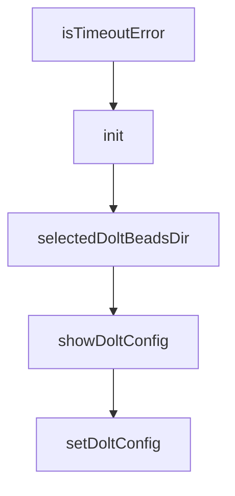

# Chapter 5: Agent Integration and AGENTS.md Patterns

Welcome to **Chapter 5: Agent Integration and AGENTS.md Patterns**. In this part of **Beads Tutorial: Git-Backed Task Graph Memory for Coding Agents**, you will build an intuitive mental model first, then move into concrete implementation details and practical production tradeoffs.


This chapter explains how to standardize Beads usage in coding-agent instructions.

## Learning Goals

- declare Beads expectations in AGENTS.md
- define when agents must read/write Beads tasks
- align task updates with PR and CI workflows
- prevent drift between work and planning state

## Integration Strategy

- include explicit `bd` command expectations
- require status updates on major execution transitions
- pair task state with PR references where possible

## Source References

- [Beads README AGENTS.md Tip](https://github.com/steveyegge/beads/blob/main/README.md)
- [AGENTS.md Tutorial](../agents-md-tutorial/)

## Summary

You now have an integration baseline for predictable agent behavior with Beads.

Next: [Chapter 6: Multi-Branch Collaboration and Protected Flows](06-multi-branch-collaboration-and-protected-flows.md)

## Source Code Walkthrough

### `cmd/bd/dolt.go`

The `isTimeoutError` function in [`cmd/bd/dolt.go`](https://github.com/steveyegge/beads/blob/HEAD/cmd/bd/dolt.go) handles a key part of this chapter's functionality:

```go
				fmt.Fprintf(os.Stderr, "  FAIL: %s: %v\n", name, err)
				failures++
				if isTimeoutError(err) {
					consecutiveTimeouts++
				}
			} else {
				fmt.Printf("  Dropped: %s\n", name)
				dropped++
				failures = 0
				consecutiveTimeouts = 0
			}

			// Rate limiting: pause between batches to let the server breathe
			if (i+1)%batchSize == 0 && i+1 < len(stale) {
				fmt.Printf("  [%d/%d] pausing %s...\n", i+1, len(stale), batchPause)
				time.Sleep(batchPause)
			}
		}
		fmt.Printf("\nDropped %d/%d stale databases.\n", dropped, len(stale))
	},
}

// confirmOverwrite prompts the user to confirm overwriting an existing remote.
// Returns true if the user confirms. Returns true without prompting if stdin is
// not a terminal (non-interactive/CI contexts).
func confirmOverwrite(surface, name, existingURL, newURL string) bool {
	if !term.IsTerminal(int(os.Stdin.Fd())) {
		return true
	}
	fmt.Printf("  Remote %q already exists on %s: %s\n", name, surface, existingURL)
	fmt.Printf("  Overwrite with: %s\n", newURL)
	fmt.Print("  Overwrite? (y/N): ")
```

This function is important because it defines how Beads Tutorial: Git-Backed Task Graph Memory for Coding Agents implements the patterns covered in this chapter.

### `cmd/bd/dolt.go`

The `init` function in [`cmd/bd/dolt.go`](https://github.com/steveyegge/beads/blob/HEAD/cmd/bd/dolt.go) handles a key part of this chapter's functionality:

```go
// separate commit histories with no common merge base (e.g., two agents
// bootstrapping from scratch and pushing to the same remote, or a local
// database being re-initialized while the remote retains the old history).
func isDivergedHistoryErr(err error) bool {
	if err == nil {
		return false
	}
	msg := strings.ToLower(err.Error())
	return strings.Contains(msg, "no common ancestor") ||
		strings.Contains(msg, "can't find common ancestor") ||
		strings.Contains(msg, "cannot find common ancestor")
}

// printDivergedHistoryGuidance prints recovery guidance when push/pull fails
// due to diverged local and remote histories.
func printDivergedHistoryGuidance(operation string) {
	fmt.Fprintln(os.Stderr, "")
	fmt.Fprintln(os.Stderr, "Local and remote Dolt histories have diverged.")
	fmt.Fprintln(os.Stderr, "This means the local database and the remote have independent commit")
	fmt.Fprintln(os.Stderr, "histories with no common merge base.")
	fmt.Fprintln(os.Stderr, "")
	fmt.Fprintln(os.Stderr, "Recovery options:")
	fmt.Fprintln(os.Stderr, "")
	fmt.Fprintln(os.Stderr, "  1. Keep remote, discard local (recommended if remote is authoritative):")
	fmt.Fprintln(os.Stderr, "       bd bootstrap              # re-clone from remote")
	fmt.Fprintln(os.Stderr, "")
	fmt.Fprintln(os.Stderr, "  2. Keep local, overwrite remote (if local is authoritative):")
	fmt.Fprintln(os.Stderr, "       bd dolt push --force       # force-push local history to remote")
	fmt.Fprintln(os.Stderr, "")
	fmt.Fprintln(os.Stderr, "  3. Manual recovery (re-initialize local database):")
	fmt.Fprintln(os.Stderr, "       rm -rf .beads/dolt         # delete local Dolt database")
	fmt.Fprintln(os.Stderr, "       bd bootstrap              # re-clone from remote")
```

This function is important because it defines how Beads Tutorial: Git-Backed Task Graph Memory for Coding Agents implements the patterns covered in this chapter.

### `cmd/bd/dolt.go`

The `selectedDoltBeadsDir` function in [`cmd/bd/dolt.go`](https://github.com/steveyegge/beads/blob/HEAD/cmd/bd/dolt.go) handles a key part of this chapter's functionality:

```go
			os.Exit(1)
		}
		beadsDir := selectedDoltBeadsDir()
		if beadsDir == "" {
			fmt.Fprintf(os.Stderr, "Error: not in a beads repository (no .beads directory found)\n")
			os.Exit(1)
		}
		serverDir := doltserver.ResolveServerDir(beadsDir)

		state, err := doltserver.Start(serverDir)
		if err != nil {
			if strings.Contains(err.Error(), "already running") {
				fmt.Println(err)
				return
			}
			fmt.Fprintf(os.Stderr, "Error: %v\n", err)
			os.Exit(1)
		}

		fmt.Printf("Dolt server started (PID %d, port %d)\n", state.PID, state.Port)
		fmt.Printf("  Data: %s\n", state.DataDir)
		fmt.Printf("  Logs: %s\n", doltserver.LogPath(serverDir))
		if doltserver.IsSharedServerMode() {
			fmt.Println("  Mode: shared server")
		}
	},
}

var doltStopCmd = &cobra.Command{
	Use:   "stop",
	Short: "Stop the Dolt SQL server for this project",
	Long: `Stop the dolt sql-server managed by beads for the current project.
```

This function is important because it defines how Beads Tutorial: Git-Backed Task Graph Memory for Coding Agents implements the patterns covered in this chapter.

### `cmd/bd/dolt.go`

The `showDoltConfig` function in [`cmd/bd/dolt.go`](https://github.com/steveyegge/beads/blob/HEAD/cmd/bd/dolt.go) handles a key part of this chapter's functionality:

```go
			os.Exit(1)
		}
		showDoltConfig(true)
	},
}

var doltSetCmd = &cobra.Command{
	Use:   "set <key> <value>",
	Short: "Set a Dolt configuration value",
	Long: `Set a Dolt configuration value in metadata.json.

Keys:
  database  Database name (default: issue prefix or "beads")
  host      Server host (default: 127.0.0.1)
  port      Server port (auto-detected; override with bd dolt set port <N>)
  user      MySQL user (default: root)
  data-dir  Custom dolt data directory (absolute path; default: .beads/dolt)

Use --update-config to also write to config.yaml for team-wide defaults.

Examples:
  bd dolt set database myproject
  bd dolt set host 192.168.1.100
  bd dolt set port 3307 --update-config
  bd dolt set data-dir /home/user/.beads-dolt/myproject`,
	Args: cobra.ExactArgs(2),
	Run: func(cmd *cobra.Command, args []string) {
		if isEmbeddedMode() {
			fmt.Fprintln(os.Stderr, "Error: 'bd dolt set' is not supported in embedded mode (no Dolt server)")
			os.Exit(1)
		}
		key := args[0]
```

This function is important because it defines how Beads Tutorial: Git-Backed Task Graph Memory for Coding Agents implements the patterns covered in this chapter.


## How These Components Connect


