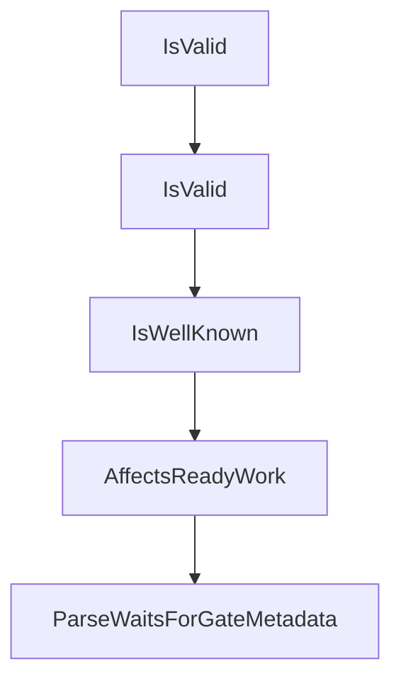

# Chapter 5: Agent Integration and AGENTS.md Patterns

Welcome to **Chapter 5: Agent Integration and AGENTS.md Patterns**. In this part of **Beads Tutorial: Git-Backed Task Graph Memory for Coding Agents**, you will build an intuitive mental model first, then move into concrete implementation details and practical production tradeoffs.


This chapter explains how to standardize Beads usage in coding-agent instructions.

## Learning Goals

- declare Beads expectations in AGENTS.md
- define when agents must read/write Beads tasks
- align task updates with PR and CI workflows
- prevent drift between work and planning state

## Integration Strategy

- include explicit `bd` command expectations
- require status updates on major execution transitions
- pair task state with PR references where possible

## Source References

- [Beads README AGENTS.md Tip](https://github.com/steveyegge/beads/blob/main/README.md)
- [AGENTS.md Tutorial](../agents-md-tutorial/)

## Summary

You now have an integration baseline for predictable agent behavior with Beads.

Next: [Chapter 6: Multi-Branch Collaboration and Protected Flows](06-multi-branch-collaboration-and-protected-flows.md)

## Depth Expansion Playbook

## Source Code Walkthrough

### `internal/types/types.go`

The `IsValid` function in [`internal/types/types.go`](https://github.com/steveyegge/beads/blob/HEAD/internal/types/types.go) handles a key part of this chapter's functionality:

```go
		return fmt.Errorf("priority must be between 0 and 4 (got %d)", i.Priority)
	}
	if !i.Status.IsValidWithCustom(customStatuses) {
		return fmt.Errorf("invalid status: %s", i.Status)
	}
	if !i.IssueType.IsValidWithCustom(customTypes) {
		return fmt.Errorf("invalid issue type: %s", i.IssueType)
	}
	if i.EstimatedMinutes != nil && *i.EstimatedMinutes < 0 {
		return fmt.Errorf("estimated_minutes cannot be negative")
	}
	// Enforce closed_at invariant: closed_at should be set if and only if status is closed
	if i.Status == StatusClosed && i.ClosedAt == nil {
		return fmt.Errorf("closed issues must have closed_at timestamp")
	}
	if i.Status != StatusClosed && i.ClosedAt != nil {
		return fmt.Errorf("non-closed issues cannot have closed_at timestamp")
	}
	// Validate metadata is well-formed JSON if set (GH#1406)
	if len(i.Metadata) > 0 {
		if !json.Valid(i.Metadata) {
			return fmt.Errorf("metadata must be valid JSON")
		}
	}
	// Ephemeral and NoHistory are mutually exclusive (GH#2619)
	if i.Ephemeral && i.NoHistory {
		return fmt.Errorf("ephemeral and no_history are mutually exclusive")
	}
	return nil
}

// ValidateForImport validates the issue for multi-repo import (federation trust model).
```

This function is important because it defines how Beads Tutorial: Git-Backed Task Graph Memory for Coding Agents implements the patterns covered in this chapter.

### `internal/types/types.go`

The `IsValid` function in [`internal/types/types.go`](https://github.com/steveyegge/beads/blob/HEAD/internal/types/types.go) handles a key part of this chapter's functionality:

```go
		return fmt.Errorf("priority must be between 0 and 4 (got %d)", i.Priority)
	}
	if !i.Status.IsValidWithCustom(customStatuses) {
		return fmt.Errorf("invalid status: %s", i.Status)
	}
	if !i.IssueType.IsValidWithCustom(customTypes) {
		return fmt.Errorf("invalid issue type: %s", i.IssueType)
	}
	if i.EstimatedMinutes != nil && *i.EstimatedMinutes < 0 {
		return fmt.Errorf("estimated_minutes cannot be negative")
	}
	// Enforce closed_at invariant: closed_at should be set if and only if status is closed
	if i.Status == StatusClosed && i.ClosedAt == nil {
		return fmt.Errorf("closed issues must have closed_at timestamp")
	}
	if i.Status != StatusClosed && i.ClosedAt != nil {
		return fmt.Errorf("non-closed issues cannot have closed_at timestamp")
	}
	// Validate metadata is well-formed JSON if set (GH#1406)
	if len(i.Metadata) > 0 {
		if !json.Valid(i.Metadata) {
			return fmt.Errorf("metadata must be valid JSON")
		}
	}
	// Ephemeral and NoHistory are mutually exclusive (GH#2619)
	if i.Ephemeral && i.NoHistory {
		return fmt.Errorf("ephemeral and no_history are mutually exclusive")
	}
	return nil
}

// ValidateForImport validates the issue for multi-repo import (federation trust model).
```

This function is important because it defines how Beads Tutorial: Git-Backed Task Graph Memory for Coding Agents implements the patterns covered in this chapter.

### `internal/types/types.go`

The `IsWellKnown` function in [`internal/types/types.go`](https://github.com/steveyegge/beads/blob/HEAD/internal/types/types.go) handles a key part of this chapter's functionality:

```go
// IsValid checks if the dependency type value is valid.
// Accepts any non-empty string up to 50 characters.
// Use IsWellKnown() to check if it's a built-in type.
func (d DependencyType) IsValid() bool {
	return len(d) > 0 && len(d) <= 50
}

// IsWellKnown checks if the dependency type is a well-known constant.
// Returns false for custom/user-defined types (which are still valid).
func (d DependencyType) IsWellKnown() bool {
	switch d {
	case DepBlocks, DepParentChild, DepConditionalBlocks, DepWaitsFor, DepRelated, DepDiscoveredFrom,
		DepRepliesTo, DepRelatesTo, DepDuplicates, DepSupersedes,
		DepAuthoredBy, DepAssignedTo, DepApprovedBy, DepAttests, DepTracks,
		DepUntil, DepCausedBy, DepValidates, DepDelegatedFrom:
		return true
	}
	return false
}

// AffectsReadyWork returns true if this dependency type blocks work.
// Only blocking types affect the ready work calculation.
func (d DependencyType) AffectsReadyWork() bool {
	return d == DepBlocks || d == DepParentChild || d == DepConditionalBlocks || d == DepWaitsFor
}

// WaitsForMeta holds metadata for waits-for dependencies (fanout gates).
// Stored as JSON in the Dependency.Metadata field.
type WaitsForMeta struct {
	// Gate type: "all-children" (wait for all), "any-children" (wait for first)
	Gate string `json:"gate"`
	// SpawnerID identifies which step/issue spawns the children to wait for.
```

This function is important because it defines how Beads Tutorial: Git-Backed Task Graph Memory for Coding Agents implements the patterns covered in this chapter.

### `internal/types/types.go`

The `AffectsReadyWork` function in [`internal/types/types.go`](https://github.com/steveyegge/beads/blob/HEAD/internal/types/types.go) handles a key part of this chapter's functionality:

```go
}

// AffectsReadyWork returns true if this dependency type blocks work.
// Only blocking types affect the ready work calculation.
func (d DependencyType) AffectsReadyWork() bool {
	return d == DepBlocks || d == DepParentChild || d == DepConditionalBlocks || d == DepWaitsFor
}

// WaitsForMeta holds metadata for waits-for dependencies (fanout gates).
// Stored as JSON in the Dependency.Metadata field.
type WaitsForMeta struct {
	// Gate type: "all-children" (wait for all), "any-children" (wait for first)
	Gate string `json:"gate"`
	// SpawnerID identifies which step/issue spawns the children to wait for.
	// If empty, waits for all direct children of the depends_on_id issue.
	SpawnerID string `json:"spawner_id,omitempty"`
}

// WaitsForGate constants
const (
	WaitsForAllChildren = "all-children" // Wait for all dynamic children to complete
	WaitsForAnyChildren = "any-children" // Proceed when first child completes (future)
)

// ParseWaitsForGateMetadata extracts the waits-for gate type from dependency metadata.
// Note: spawner identity comes from dependencies.depends_on_id in storage/query paths;
// metadata.spawner_id is parsed for compatibility/future explicit targeting.
// Returns WaitsForAllChildren on empty/invalid metadata for backward compatibility.
func ParseWaitsForGateMetadata(metadata string) string {
	if strings.TrimSpace(metadata) == "" {
		return WaitsForAllChildren
	}
```

This function is important because it defines how Beads Tutorial: Git-Backed Task Graph Memory for Coding Agents implements the patterns covered in this chapter.


## How These Components Connect


