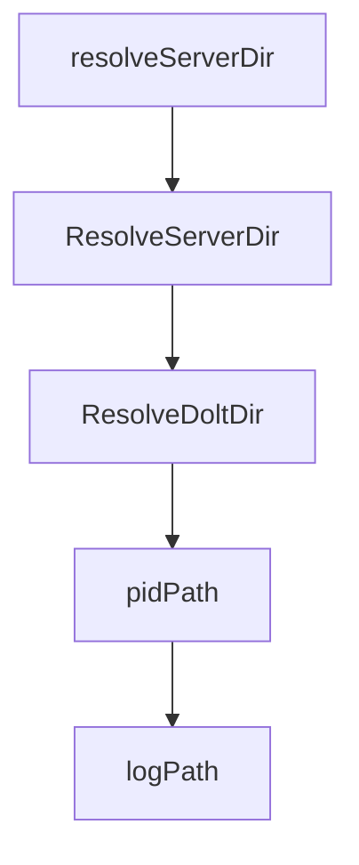

# Chapter 6: Multi-Branch Collaboration and Protected Flows

Welcome to **Chapter 6: Multi-Branch Collaboration and Protected Flows**. In this part of **Beads Tutorial: Git-Backed Task Graph Memory for Coding Agents**, you will build an intuitive mental model first, then move into concrete implementation details and practical production tradeoffs.


This chapter covers contributor/maintainer collaboration and protected branch operations.

## Learning Goals

- use contributor mode in forked workflows
- operate maintainers' protected branch settings safely
- avoid merge-state corruption in multi-branch coordination
- preserve planning continuity across branches

## Collaboration Controls

- contributor mode for planning separation
- maintainer role detection and explicit overrides
- protected branch sync patterns for safer integration

## Source References

- [Beads README Contributor vs Maintainer](https://github.com/steveyegge/beads/blob/main/README.md)
- [Protected Branches Guide](https://github.com/steveyegge/beads/blob/main/docs/PROTECTED_BRANCHES.md)

## Summary

You now have safer collaboration patterns for branch-heavy Beads workflows.

Next: [Chapter 7: Troubleshooting and Operations](07-troubleshooting-and-operations.md)

## Depth Expansion Playbook

## Source Code Walkthrough

### `internal/doltserver/doltserver.go`

The `resolveServerDir` function in [`internal/doltserver/doltserver.go`](https://github.com/steveyegge/beads/blob/HEAD/internal/doltserver/doltserver.go) handles a key part of this chapter's functionality:

```go
}

// resolveServerDir returns the canonical server directory for dolt state files.
// In shared server mode, returns ~/.beads/shared-server/ instead of the
// project's .beads/ directory.
func resolveServerDir(beadsDir string) string {
	if IsSharedServerMode() {
		dir, err := SharedServerDir()
		if err != nil {
			fmt.Fprintf(os.Stderr, "Warning: shared server directory unavailable, using per-project mode: %v\n", err)
			return beadsDir
		}
		return dir
	}
	return beadsDir
}

// ResolveServerDir is the exported version of resolveServerDir.
// CLI commands use this to resolve the server directory before calling
// Start, Stop, or IsRunning.
func ResolveServerDir(beadsDir string) string {
	return resolveServerDir(beadsDir)
}

// ResolveDoltDir returns the dolt data directory for the given beadsDir.
// It checks the BEADS_DOLT_DATA_DIR env var and metadata.json for a custom
// dolt_data_dir, falling back to the default .beads/dolt/ path.
//
// Note: we check for metadata.json existence before calling configfile.Load
// to avoid triggering the config.json → metadata.json migration side effect,
// which would create files in the .beads/ directory unexpectedly.
func ResolveDoltDir(beadsDir string) string {
```

This function is important because it defines how Beads Tutorial: Git-Backed Task Graph Memory for Coding Agents implements the patterns covered in this chapter.

### `internal/doltserver/doltserver.go`

The `ResolveServerDir` function in [`internal/doltserver/doltserver.go`](https://github.com/steveyegge/beads/blob/HEAD/internal/doltserver/doltserver.go) handles a key part of this chapter's functionality:

```go
}

// ResolveServerDir is the exported version of resolveServerDir.
// CLI commands use this to resolve the server directory before calling
// Start, Stop, or IsRunning.
func ResolveServerDir(beadsDir string) string {
	return resolveServerDir(beadsDir)
}

// ResolveDoltDir returns the dolt data directory for the given beadsDir.
// It checks the BEADS_DOLT_DATA_DIR env var and metadata.json for a custom
// dolt_data_dir, falling back to the default .beads/dolt/ path.
//
// Note: we check for metadata.json existence before calling configfile.Load
// to avoid triggering the config.json → metadata.json migration side effect,
// which would create files in the .beads/ directory unexpectedly.
func ResolveDoltDir(beadsDir string) string {
	// Shared server mode: use centralized dolt data directory
	if IsSharedServerMode() {
		dir, err := SharedDoltDir()
		if err != nil {
			fmt.Fprintf(os.Stderr, "Warning: shared dolt directory unavailable, using per-project mode: %v\n", err)
		} else {
			return dir
		}
	}

	// Check env var first (highest priority)
	if d := os.Getenv("BEADS_DOLT_DATA_DIR"); d != "" {
		if filepath.IsAbs(d) {
			return d
		}
```

This function is important because it defines how Beads Tutorial: Git-Backed Task Graph Memory for Coding Agents implements the patterns covered in this chapter.

### `internal/doltserver/doltserver.go`

The `ResolveDoltDir` function in [`internal/doltserver/doltserver.go`](https://github.com/steveyegge/beads/blob/HEAD/internal/doltserver/doltserver.go) handles a key part of this chapter's functionality:

```go
}

// ResolveDoltDir returns the dolt data directory for the given beadsDir.
// It checks the BEADS_DOLT_DATA_DIR env var and metadata.json for a custom
// dolt_data_dir, falling back to the default .beads/dolt/ path.
//
// Note: we check for metadata.json existence before calling configfile.Load
// to avoid triggering the config.json → metadata.json migration side effect,
// which would create files in the .beads/ directory unexpectedly.
func ResolveDoltDir(beadsDir string) string {
	// Shared server mode: use centralized dolt data directory
	if IsSharedServerMode() {
		dir, err := SharedDoltDir()
		if err != nil {
			fmt.Fprintf(os.Stderr, "Warning: shared dolt directory unavailable, using per-project mode: %v\n", err)
		} else {
			return dir
		}
	}

	// Check env var first (highest priority)
	if d := os.Getenv("BEADS_DOLT_DATA_DIR"); d != "" {
		if filepath.IsAbs(d) {
			return d
		}
		return filepath.Join(beadsDir, d)
	}
	// Only load config if metadata.json exists (avoids legacy migration side effect)
	metadataPath := filepath.Join(beadsDir, "metadata.json")
	if _, err := os.Stat(metadataPath); err == nil {
		if cfg, err := configfile.Load(beadsDir); err == nil && cfg != nil {
			return cfg.DatabasePath(beadsDir)
```

This function is important because it defines how Beads Tutorial: Git-Backed Task Graph Memory for Coding Agents implements the patterns covered in this chapter.

### `internal/doltserver/doltserver.go`

The `pidPath` function in [`internal/doltserver/doltserver.go`](https://github.com/steveyegge/beads/blob/HEAD/internal/doltserver/doltserver.go) handles a key part of this chapter's functionality:

```go

// file paths within .beads/
func pidPath(beadsDir string) string  { return filepath.Join(beadsDir, "dolt-server.pid") }
func logPath(beadsDir string) string  { return filepath.Join(beadsDir, "dolt-server.log") }
func lockPath(beadsDir string) string { return filepath.Join(beadsDir, "dolt-server.lock") }
func portPath(beadsDir string) string { return filepath.Join(beadsDir, "dolt-server.port") }

// MaxDoltServers is the hard ceiling on concurrent dolt sql-server processes.
// Allows up to 3 (e.g., multiple projects).
func maxDoltServers() int {
	return 3
}

// allocateEphemeralPort asks the OS for a free TCP port on host.
// It binds to port 0, reads the assigned port, and closes the listener.
// The caller should pass the returned port to dolt sql-server promptly
// to minimize the TOCTOU window.
func allocateEphemeralPort(host string) (int, error) {
	ln, err := net.Listen("tcp", net.JoinHostPort(host, "0"))
	if err != nil {
		return 0, fmt.Errorf("allocating ephemeral port: %w", err)
	}
	port := ln.Addr().(*net.TCPAddr).Port
	_ = ln.Close()
	return port, nil
}

// isPortAvailable checks if a TCP port is available for binding.
func isPortAvailable(host string, port int) bool {
	addr := net.JoinHostPort(host, strconv.Itoa(port))
	ln, err := net.Listen("tcp", addr)
	if err != nil {
```

This function is important because it defines how Beads Tutorial: Git-Backed Task Graph Memory for Coding Agents implements the patterns covered in this chapter.


## How These Components Connect


