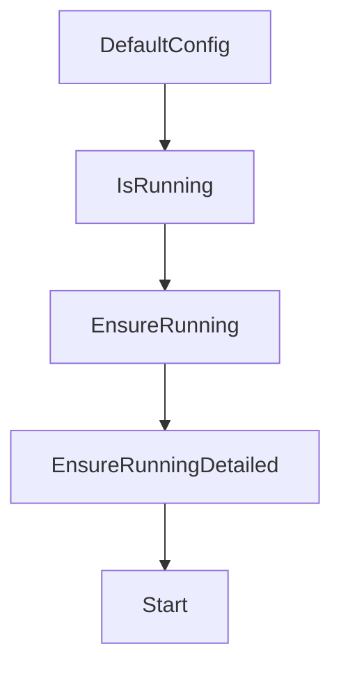

# Chapter 7: Troubleshooting and Operations

Welcome to **Chapter 7: Troubleshooting and Operations**. In this part of **Beads Tutorial: Git-Backed Task Graph Memory for Coding Agents**, you will build an intuitive mental model first, then move into concrete implementation details and practical production tradeoffs.


This chapter provides operational debugging patterns for Beads runtime issues.

## Learning Goals

- diagnose install and config failures
- recover from branch/state synchronization issues
- validate environment assumptions quickly
- build reliable runbooks for team operations

## Troubleshooting Priorities

- installation and path checks first
- repository role and branch mode verification
- command-level diagnostics before data surgery

## Source References

- [Beads Troubleshooting Guide](https://github.com/steveyegge/beads/blob/main/docs/TROUBLESHOOTING.md)
- [Beads FAQ](https://github.com/steveyegge/beads/blob/main/docs/FAQ.md)

## Summary

You now have an operations runbook baseline for Beads troubleshooting.

Next: [Chapter 8: Contribution Workflow and Ecosystem Extensions](08-contribution-workflow-and-ecosystem-extensions.md)

## Source Code Walkthrough

### `internal/doltserver/doltserver.go`

The `DefaultConfig` function in [`internal/doltserver/doltserver.go`](https://github.com/steveyegge/beads/blob/HEAD/internal/doltserver/doltserver.go) handles a key part of this chapter's functionality:

```go
}

// DefaultConfig returns config with sensible defaults.
// Priority: env var > port file > config.yaml / global config > metadata.json.
// Returns port 0 when no source provides a port, meaning Start() should
// allocate an ephemeral port from the OS.
//
// The port file (dolt-server.port) is written by Start() with the actual port
// the server is listening on. Consulting it here ensures that commands
// connecting to an already-running server use the correct port.
func DefaultConfig(beadsDir string) *Config {
	// In shared mode, use the shared server directory for port resolution
	if IsSharedServerMode() {
		if sharedDir, err := SharedServerDir(); err == nil {
			beadsDir = sharedDir
		}
	}

	cfg := &Config{
		BeadsDir: beadsDir,
		Host:     "127.0.0.1",
		Mode:     ResolveServerMode(beadsDir),
	}

	// Check env var override first (used by tests and manual overrides)
	if p := os.Getenv("BEADS_DOLT_SERVER_PORT"); p != "" {
		if port, err := strconv.Atoi(p); err == nil {
			cfg.Port = port
			return cfg
		}
	}

```

This function is important because it defines how Beads Tutorial: Git-Backed Task Graph Memory for Coding Agents implements the patterns covered in this chapter.

### `internal/doltserver/doltserver.go`

The `IsRunning` function in [`internal/doltserver/doltserver.go`](https://github.com/steveyegge/beads/blob/HEAD/internal/doltserver/doltserver.go) handles a key part of this chapter's functionality:

```go
// ResolveServerDir is the exported version of resolveServerDir.
// CLI commands use this to resolve the server directory before calling
// Start, Stop, or IsRunning.
func ResolveServerDir(beadsDir string) string {
	return resolveServerDir(beadsDir)
}

// ResolveDoltDir returns the dolt data directory for the given beadsDir.
// It checks the BEADS_DOLT_DATA_DIR env var and metadata.json for a custom
// dolt_data_dir, falling back to the default .beads/dolt/ path.
//
// Note: we check for metadata.json existence before calling configfile.Load
// to avoid triggering the config.json → metadata.json migration side effect,
// which would create files in the .beads/ directory unexpectedly.
func ResolveDoltDir(beadsDir string) string {
	// Shared server mode: use centralized dolt data directory
	if IsSharedServerMode() {
		dir, err := SharedDoltDir()
		if err != nil {
			fmt.Fprintf(os.Stderr, "Warning: shared dolt directory unavailable, using per-project mode: %v\n", err)
		} else {
			return dir
		}
	}

	// Check env var first (highest priority)
	if d := os.Getenv("BEADS_DOLT_DATA_DIR"); d != "" {
		if filepath.IsAbs(d) {
			return d
		}
		return filepath.Join(beadsDir, d)
	}
```

This function is important because it defines how Beads Tutorial: Git-Backed Task Graph Memory for Coding Agents implements the patterns covered in this chapter.

### `internal/doltserver/doltserver.go`

The `EnsureRunning` function in [`internal/doltserver/doltserver.go`](https://github.com/steveyegge/beads/blob/HEAD/internal/doltserver/doltserver.go) handles a key part of this chapter's functionality:

```go
		// Server is running but we can't determine its port (port file
		// missing, no explicit config). Stop the orphan so that callers
		// (EnsureRunning) trigger a fresh Start() with a new port file.
		fmt.Fprintf(os.Stderr, "Dolt server (PID %d) running but port unknown; stopping for restart\n", pid)
		if err := gracefulStop(pid, 5*time.Second); err != nil {
			// Best-effort kill
			if proc, findErr := os.FindProcess(pid); findErr == nil {
				_ = proc.Kill()
			}
		}
		_ = os.Remove(pidPath(beadsDir))
		return &State{Running: false}, nil
	}
	return &State{
		Running: true,
		PID:     pid,
		Port:    port,
		DataDir: ResolveDoltDir(beadsDir),
	}, nil
}

// EnsureRunning starts the server if it is not already running.
// This is the main auto-start entry point. Thread-safe via file lock.
// Returns the port the server is listening on.
//
// When metadata.json specifies an explicit dolt_server_port (indicating an
// external/shared server, e.g. managed by systemd), EnsureRunning will NOT
// start a new server. The external server's lifecycle is not bd's
// responsibility — starting a per-project server would conflict with (or
// kill) the shared server. See GH#2554.
func EnsureRunning(beadsDir string) (int, error) {
	port, _, err := EnsureRunningDetailed(beadsDir)
```

This function is important because it defines how Beads Tutorial: Git-Backed Task Graph Memory for Coding Agents implements the patterns covered in this chapter.

### `internal/doltserver/doltserver.go`

The `EnsureRunningDetailed` function in [`internal/doltserver/doltserver.go`](https://github.com/steveyegge/beads/blob/HEAD/internal/doltserver/doltserver.go) handles a key part of this chapter's functionality:

```go
// kill) the shared server. See GH#2554.
func EnsureRunning(beadsDir string) (int, error) {
	port, _, err := EnsureRunningDetailed(beadsDir)
	return port, err
}

// EnsureRunningDetailed is like EnsureRunning but also reports whether a new
// server was started (startedByUs=true) vs. an already-running server was
// adopted (startedByUs=false). Callers that need to clean up auto-started
// servers (e.g. test teardown) should use this variant.
func EnsureRunningDetailed(beadsDir string) (port int, startedByUs bool, err error) {
	serverDir := resolveServerDir(beadsDir)

	// Inform when an orchestrator is also running on this machine
	if IsSharedServerMode() && os.Getenv("GT_ROOT") != "" {
		fmt.Fprintf(os.Stderr, "Info: Orchestrator detected (GT_ROOT set). Shared server uses port %d to avoid conflict.\n", DefaultSharedServerPort)
	}

	state, err := IsRunning(serverDir)
	if err != nil {
		return 0, false, err
	}
	if state.Running {
		_ = EnsurePortFile(serverDir, state.Port)
		return state.Port, false, nil
	}

	// If the server mode is External (explicit port in metadata.json,
	// shared server mode, etc.), do not start a per-project server —
	// it would conflict with the external one.
	mode := ResolveServerMode(beadsDir)
	if mode == ServerModeExternal {
```

This function is important because it defines how Beads Tutorial: Git-Backed Task Graph Memory for Coding Agents implements the patterns covered in this chapter.


## How These Components Connect


