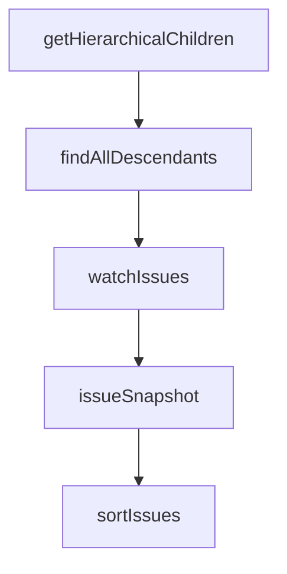

# Chapter 8: Contribution Workflow and Ecosystem Extensions

Welcome to **Chapter 8: Contribution Workflow and Ecosystem Extensions**. In this part of **Beads Tutorial: Git-Backed Task Graph Memory for Coding Agents**, you will build an intuitive mental model first, then move into concrete implementation details and practical production tradeoffs.


This chapter covers contributing to Beads and extending ecosystem integrations.

## Learning Goals

- follow Beads contribution and security expectations
- add integrations without breaking core invariants
- evaluate community tools for operational fit
- contribute docs/examples that improve agent adoption

## Extension Surfaces

- community UIs and editor integrations
- MCP and agent workflow adapters
- docs and example improvements for onboarding

## Source References

- [Beads Contributing Guide](https://github.com/steveyegge/beads/blob/main/CONTRIBUTING.md)
- [Beads Security Policy](https://github.com/steveyegge/beads/blob/main/SECURITY.md)
- [Community Tools](https://github.com/steveyegge/beads/blob/main/docs/COMMUNITY_TOOLS.md)

## Summary

You now have a full Beads path from baseline usage to ecosystem contribution.

Next tutorial: [AutoAgent Tutorial](../autoagent-tutorial/)

## Depth Expansion Playbook

## Source Code Walkthrough

### `cmd/bd/list.go`

The `getHierarchicalChildren` function in [`cmd/bd/list.go`](https://github.com/steveyegge/beads/blob/HEAD/cmd/bd/list.go) handles a key part of this chapter's functionality:

```go
}

// getHierarchicalChildren handles the --tree --parent combination logic
func getHierarchicalChildren(ctx context.Context, store storage.DoltStorage, dbPath string, parentID string) ([]*types.Issue, error) {
	// First verify that the parent issue exists
	var parentIssue *types.Issue
	err := withStorage(ctx, store, dbPath, func(s storage.DoltStorage) error {
		var err error
		parentIssue, err = s.GetIssue(ctx, parentID)
		return err
	})
	if err != nil {
		return nil, fmt.Errorf("error checking parent issue: %v", err)
	}
	if parentIssue == nil {
		return nil, fmt.Errorf("parent issue '%s' not found", parentID)
	}

	// Use recursive search to find all descendants using the same logic as --parent filter
	// This works around issues with GetDependencyTree not finding all dependents properly
	allDescendants := make(map[string]*types.Issue)

	// Always include the parent
	allDescendants[parentID] = parentIssue

	// Recursively find all descendants
	err = findAllDescendants(ctx, store, dbPath, parentID, allDescendants, 0, 10) // max depth 10
	if err != nil {
		return nil, fmt.Errorf("error finding descendants: %v", err)
	}

	// Convert map to slice for display
```

This function is important because it defines how Beads Tutorial: Git-Backed Task Graph Memory for Coding Agents implements the patterns covered in this chapter.

### `cmd/bd/list.go`

The `findAllDescendants` function in [`cmd/bd/list.go`](https://github.com/steveyegge/beads/blob/HEAD/cmd/bd/list.go) handles a key part of this chapter's functionality:

```go

	// Recursively find all descendants
	err = findAllDescendants(ctx, store, dbPath, parentID, allDescendants, 0, 10) // max depth 10
	if err != nil {
		return nil, fmt.Errorf("error finding descendants: %v", err)
	}

	// Convert map to slice for display
	treeIssues := make([]*types.Issue, 0, len(allDescendants))
	for _, issue := range allDescendants {
		treeIssues = append(treeIssues, issue)
	}

	return treeIssues, nil
}

// findAllDescendants recursively finds all descendants using parent filtering
func findAllDescendants(ctx context.Context, store storage.DoltStorage, dbPath string, parentID string, result map[string]*types.Issue, currentDepth, maxDepth int) error {
	if currentDepth >= maxDepth {
		return nil // Prevent infinite recursion
	}

	// Get direct children using the same filter logic as regular --parent
	var children []*types.Issue
	err := withStorage(ctx, store, dbPath, func(s storage.DoltStorage) error {
		filter := types.IssueFilter{
			ParentID: &parentID,
		}
		var err error
		children, err = s.SearchIssues(ctx, "", filter)
		return err
	})
```

This function is important because it defines how Beads Tutorial: Git-Backed Task Graph Memory for Coding Agents implements the patterns covered in this chapter.

### `cmd/bd/list.go`

The `watchIssues` function in [`cmd/bd/list.go`](https://github.com/steveyegge/beads/blob/HEAD/cmd/bd/list.go) handles a key part of this chapter's functionality:

```go
}

// watchIssues polls for changes and re-displays (GH#654)
// Uses polling instead of fsnotify because Dolt stores data in a server-side
// database, not files — file watchers never fire.
func watchIssues(ctx context.Context, store storage.DoltStorage, filter types.IssueFilter, sortBy string, reverse bool) {
	// Initial display
	issues, err := store.SearchIssues(ctx, "", filter)
	if err != nil {
		fmt.Fprintf(os.Stderr, "Error querying issues: %v\n", err)
		return
	}
	sortIssues(issues, sortBy, reverse)
	displayPrettyList(issues, true)
	lastSnapshot := issueSnapshot(issues)

	fmt.Fprintf(os.Stderr, "\nWatching for changes... (Press Ctrl+C to exit)\n")

	// Handle Ctrl+C — deferred Stop prevents signal handler leak
	sigChan := make(chan os.Signal, 1)
	signal.Notify(sigChan, os.Interrupt, syscall.SIGTERM)
	defer signal.Stop(sigChan)

	pollInterval := 2 * time.Second
	ticker := time.NewTicker(pollInterval)
	defer ticker.Stop()

	for {
		select {
		case <-sigChan:
			fmt.Fprintf(os.Stderr, "\nStopped watching.\n")
			return
```

This function is important because it defines how Beads Tutorial: Git-Backed Task Graph Memory for Coding Agents implements the patterns covered in this chapter.

### `cmd/bd/list.go`

The `issueSnapshot` function in [`cmd/bd/list.go`](https://github.com/steveyegge/beads/blob/HEAD/cmd/bd/list.go) handles a key part of this chapter's functionality:

```go
	sortIssues(issues, sortBy, reverse)
	displayPrettyList(issues, true)
	lastSnapshot := issueSnapshot(issues)

	fmt.Fprintf(os.Stderr, "\nWatching for changes... (Press Ctrl+C to exit)\n")

	// Handle Ctrl+C — deferred Stop prevents signal handler leak
	sigChan := make(chan os.Signal, 1)
	signal.Notify(sigChan, os.Interrupt, syscall.SIGTERM)
	defer signal.Stop(sigChan)

	pollInterval := 2 * time.Second
	ticker := time.NewTicker(pollInterval)
	defer ticker.Stop()

	for {
		select {
		case <-sigChan:
			fmt.Fprintf(os.Stderr, "\nStopped watching.\n")
			return
		case <-ticker.C:
			issues, err := store.SearchIssues(ctx, "", filter)
			if err != nil {
				fmt.Fprintf(os.Stderr, "Error refreshing issues: %v\n", err)
				continue
			}
			sortIssues(issues, sortBy, reverse)
			snap := issueSnapshot(issues)
			if snap != lastSnapshot {
				lastSnapshot = snap
				displayPrettyList(issues, true)
				fmt.Fprintf(os.Stderr, "\nWatching for changes... (Press Ctrl+C to exit)\n")
```

This function is important because it defines how Beads Tutorial: Git-Backed Task Graph Memory for Coding Agents implements the patterns covered in this chapter.


## How These Components Connect


