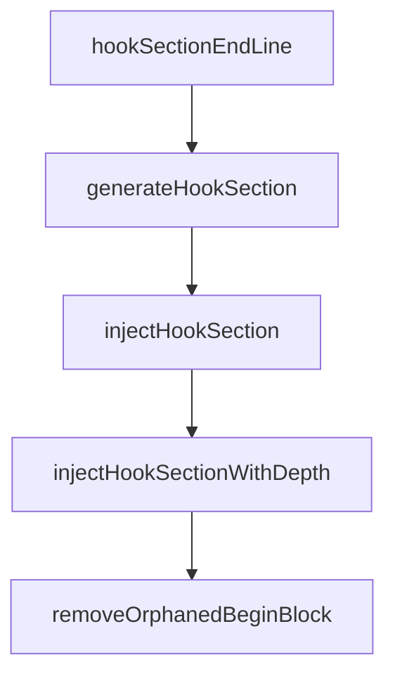

# Chapter 8: Contribution Workflow and Ecosystem Extensions

Welcome to **Chapter 8: Contribution Workflow and Ecosystem Extensions**. In this part of **Beads Tutorial: Git-Backed Task Graph Memory for Coding Agents**, you will build an intuitive mental model first, then move into concrete implementation details and practical production tradeoffs.


This chapter covers contributing to Beads and extending ecosystem integrations.

## Learning Goals

- follow Beads contribution and security expectations
- add integrations without breaking core invariants
- evaluate community tools for operational fit
- contribute docs/examples that improve agent adoption

## Extension Surfaces

- community UIs and editor integrations
- MCP and agent workflow adapters
- docs and example improvements for onboarding

## Source References

- [Beads Contributing Guide](https://github.com/steveyegge/beads/blob/main/CONTRIBUTING.md)
- [Beads Security Policy](https://github.com/steveyegge/beads/blob/main/SECURITY.md)
- [Community Tools](https://github.com/steveyegge/beads/blob/main/docs/COMMUNITY_TOOLS.md)

## Summary

You now have a full Beads path from baseline usage to ecosystem contribution.

Next tutorial: [AutoAgent Tutorial](../autoagent-tutorial/)

## Source Code Walkthrough

### `cmd/bd/hooks.go`

The `hookSectionEndLine` function in [`cmd/bd/hooks.go`](https://github.com/steveyegge/beads/blob/HEAD/cmd/bd/hooks.go) handles a key part of this chapter's functionality:

```go
}

// hookSectionEndLine returns the full end marker line with the current version.
func hookSectionEndLine() string {
	return fmt.Sprintf("%s v%s ---", hookSectionEndPrefix, Version)
}

// hookTimeoutSeconds is the maximum time a beads hook is allowed to run before
// being killed and allowing the git operation to proceed.  A bounded timeout
// prevents `bd hooks run` from hanging `git push` indefinitely (GH#2453).
// The default is 300 seconds (5 minutes) to accommodate chained hooks — e.g.
// pre-commit framework pipelines that run linters, type-checkers, and builds
// inside `bd hooks run` via the `.old` hook chain (GH#2732).
// The value can be overridden via the BEADS_HOOK_TIMEOUT environment variable.
const hookTimeoutSeconds = 300

// generateHookSection returns the marked section content for a given hook name.
// The section is self-contained: it checks for bd availability, runs the hook
// via 'bd hooks run', and propagates exit codes — without preventing any user
// content after the section from executing on success.
//
// Resilience (GH#2453, GH#2449):
//   - A configurable timeout prevents hooks from hanging git operations.
//   - If the beads database is not initialized (exit code 3), the hook exits
//     successfully with a warning so that git operations are not blocked.
func generateHookSection(hookName string) string {
	return hookSectionBeginLine() + "\n" +
		"# This section is managed by beads. Do not remove these markers.\n" +
		"if command -v bd >/dev/null 2>&1; then\n" +
		"  export BD_GIT_HOOK=1\n" +
		"  _bd_timeout=${BEADS_HOOK_TIMEOUT:-" + fmt.Sprintf("%d", hookTimeoutSeconds) + "}\n" +
		"  if command -v timeout >/dev/null 2>&1; then\n" +
```

This function is important because it defines how Beads Tutorial: Git-Backed Task Graph Memory for Coding Agents implements the patterns covered in this chapter.

### `cmd/bd/hooks.go`

The `generateHookSection` function in [`cmd/bd/hooks.go`](https://github.com/steveyegge/beads/blob/HEAD/cmd/bd/hooks.go) handles a key part of this chapter's functionality:

```go

// managedHookNames lists the git hooks managed by beads.
// Hook content is generated dynamically by generateHookSection().
var managedHookNames = []string{"pre-commit", "post-merge", "pre-push", "post-checkout", "prepare-commit-msg"}

const hookVersionPrefix = "# bd-hooks-version: "
const shimVersionPrefix = "# bd-shim "

// inlineHookMarker identifies inline hooks created by bd init (GH#1120)
// These hooks have the logic embedded directly rather than using shims
const inlineHookMarker = "# bd (beads)"

// Section markers for git hooks (GH#1380) — consistent with AGENTS.md pattern.
// Only content between markers is managed by beads; user content outside is preserved.
const hookSectionBeginPrefix = "# --- BEGIN BEADS INTEGRATION"
const hookSectionEndPrefix = "# --- END BEADS INTEGRATION"

// hookSectionBeginLine returns the full begin marker line with the current version.
func hookSectionBeginLine() string {
	return fmt.Sprintf("%s v%s ---", hookSectionBeginPrefix, Version)
}

// hookSectionEndLine returns the full end marker line with the current version.
func hookSectionEndLine() string {
	return fmt.Sprintf("%s v%s ---", hookSectionEndPrefix, Version)
}

// hookTimeoutSeconds is the maximum time a beads hook is allowed to run before
// being killed and allowing the git operation to proceed.  A bounded timeout
// prevents `bd hooks run` from hanging `git push` indefinitely (GH#2453).
// The default is 300 seconds (5 minutes) to accommodate chained hooks — e.g.
// pre-commit framework pipelines that run linters, type-checkers, and builds
```

This function is important because it defines how Beads Tutorial: Git-Backed Task Graph Memory for Coding Agents implements the patterns covered in this chapter.

### `cmd/bd/hooks.go`

The `injectHookSection` function in [`cmd/bd/hooks.go`](https://github.com/steveyegge/beads/blob/HEAD/cmd/bd/hooks.go) handles a key part of this chapter's functionality:

```go
}

// injectHookSection merges the beads section into existing hook file content.
// If section markers are found, only the content between them is replaced.
// If broken markers exist (orphaned BEGIN, reversed order), the stale markers
// are removed before injecting the new section.
// If no markers are found, the section is appended.
func injectHookSection(existing, section string) string {
	return injectHookSectionWithDepth(existing, section, 0)
}

// maxInjectDepth guards against infinite recursion when cleaning broken markers.
const maxInjectDepth = 5

func injectHookSectionWithDepth(existing, section string, depth int) string {
	if depth > maxInjectDepth {
		// Safety: too many recursive cleanups — append as fallback
		result := existing
		if !strings.HasSuffix(result, "\n") {
			result += "\n"
		}
		return result + "\n" + section
	}

	beginIdx := strings.Index(existing, hookSectionBeginPrefix)
	endIdx := strings.Index(existing, hookSectionEndPrefix)

	if beginIdx != -1 && endIdx != -1 && beginIdx < endIdx {
		// Case 1: valid BEGIN...END pair — replace between markers
		lineStart := strings.LastIndex(existing[:beginIdx], "\n")
		if lineStart == -1 {
			lineStart = 0
```

This function is important because it defines how Beads Tutorial: Git-Backed Task Graph Memory for Coding Agents implements the patterns covered in this chapter.

### `cmd/bd/hooks.go`

The `injectHookSectionWithDepth` function in [`cmd/bd/hooks.go`](https://github.com/steveyegge/beads/blob/HEAD/cmd/bd/hooks.go) handles a key part of this chapter's functionality:

```go
// If no markers are found, the section is appended.
func injectHookSection(existing, section string) string {
	return injectHookSectionWithDepth(existing, section, 0)
}

// maxInjectDepth guards against infinite recursion when cleaning broken markers.
const maxInjectDepth = 5

func injectHookSectionWithDepth(existing, section string, depth int) string {
	if depth > maxInjectDepth {
		// Safety: too many recursive cleanups — append as fallback
		result := existing
		if !strings.HasSuffix(result, "\n") {
			result += "\n"
		}
		return result + "\n" + section
	}

	beginIdx := strings.Index(existing, hookSectionBeginPrefix)
	endIdx := strings.Index(existing, hookSectionEndPrefix)

	if beginIdx != -1 && endIdx != -1 && beginIdx < endIdx {
		// Case 1: valid BEGIN...END pair — replace between markers
		lineStart := strings.LastIndex(existing[:beginIdx], "\n")
		if lineStart == -1 {
			lineStart = 0
		} else {
			lineStart++ // skip the newline itself
		}

		// Find end of the end-marker line (including trailing newline)
		endOfEndMarker := endIdx + len(hookSectionEndPrefix)
```

This function is important because it defines how Beads Tutorial: Git-Backed Task Graph Memory for Coding Agents implements the patterns covered in this chapter.


## How These Components Connect


