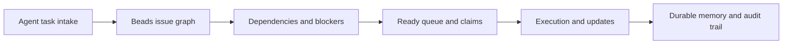

# Beads Tutorial: Git-Backed Task Graph Memory for Coding Agents

> Learn how to use `steveyegge/beads` to give coding agents durable, dependency-aware task memory with structured issue graphs instead of ad-hoc markdown plans.

## Why This Track Matters

Beads gives coding agents a structured, persistent memory layer for long-horizon work, reducing context loss and coordination issues across branches and collaborators.

This track focuses on:

- installing and initializing `bd` in real projects
- modeling task dependencies and readiness flows
- integrating Beads with AGENTS.md and agent workflows
- operating Beads safely in contributor and maintainer modes

## Current Snapshot (auto-updated)

- repository: [`steveyegge/beads`](https://github.com/steveyegge/beads)
- stars: about **16.0k**
- latest release: [`v0.49.6`](https://github.com/steveyegge/beads/releases/tag/v0.49.6)
- recent activity: updates on **February 12, 2026**
- project positioning: distributed, git-backed graph issue tracker for coding agents

## Mental Model

## Chapter Guide

| Chapter | Key Question | Outcome |
|:--------|:-------------|:--------|
| [01 - Getting Started](01-getting-started.md) | How do I install and initialize Beads in a project? | Working baseline |
| [02 - Architecture and Data Model](02-architecture-and-data-model.md) | How does Beads structure memory and task graphs? | Strong architecture model |
| [03 - Core Workflow Commands](03-core-workflow-commands.md) | How do I run day-to-day task operations effectively? | Better operator throughput |
| [04 - Dependency Graph and Hierarchy Patterns](04-dependency-graph-and-hierarchy-patterns.md) | How do I model blockers, epics, and sub-tasks cleanly? | Reliable planning structure |
| [05 - Agent Integration and AGENTS.md Patterns](05-agent-integration-and-agents-md-patterns.md) | How do coding agents adopt Beads consistently? | Better agent behavior |
| [06 - Multi-Branch Collaboration and Protected Flows](06-multi-branch-collaboration-and-protected-flows.md) | How do teams avoid conflicts across branches and roles? | Safer collaboration |
| [07 - Troubleshooting and Operations](07-troubleshooting-and-operations.md) | How do I recover from common setup/runtime issues? | Operator confidence |
| [08 - Contribution Workflow and Ecosystem Extensions](08-contribution-workflow-and-ecosystem-extensions.md) | How do I contribute and extend Beads responsibly? | Contributor readiness |

## What You Will Learn

- how to replace markdown TODO drift with graph-backed task memory
- how to drive ready/blocked workflows through structured dependencies
- how to integrate Beads into coding-agent instruction contracts
- how to operate and extend Beads in team environments

## Source References

- [Beads Repository](https://github.com/steveyegge/beads)
- [Beads README](https://github.com/steveyegge/beads/blob/main/README.md)
- [Agent Workflow Instructions](https://github.com/steveyegge/beads/blob/main/AGENT_INSTRUCTIONS.md)
- [Installing Guide](https://github.com/steveyegge/beads/blob/main/docs/INSTALLING.md)
- [FAQ](https://github.com/steveyegge/beads/blob/main/docs/FAQ.md)

## Related Tutorials

- [AGENTS.md Tutorial](../agents-md-tutorial/)
- [Codex CLI Tutorial](../codex-cli-tutorial/)
- [Claude Code Tutorial](../claude-code-tutorial/)
- [Mini-SWE-Agent Tutorial](../mini-swe-agent-tutorial/)

---

Start with [Chapter 1: Getting Started](01-getting-started.md).

## Navigation & Backlinks

- [Start Here: Chapter 1: Getting Started](01-getting-started.md)
- [Back to Main Catalog](../../README.md#-tutorial-catalog)
- [Browse A-Z Tutorial Directory](../../discoverability/tutorial-directory.md)
- [Search by Intent](../../discoverability/query-hub.md)
- [Explore Category Hubs](../../README.md#category-hubs)

## Full Chapter Map

1. [Chapter 1: Getting Started](01-getting-started.md)
2. [Chapter 2: Architecture and Data Model](02-architecture-and-data-model.md)
3. [Chapter 3: Core Workflow Commands](03-core-workflow-commands.md)
4. [Chapter 4: Dependency Graph and Hierarchy Patterns](04-dependency-graph-and-hierarchy-patterns.md)
5. [Chapter 5: Agent Integration and AGENTS.md Patterns](05-agent-integration-and-agents-md-patterns.md)
6. [Chapter 6: Multi-Branch Collaboration and Protected Flows](06-multi-branch-collaboration-and-protected-flows.md)
7. [Chapter 7: Troubleshooting and Operations](07-troubleshooting-and-operations.md)
8. [Chapter 8: Contribution Workflow and Ecosystem Extensions](08-contribution-workflow-and-ecosystem-extensions.md)

*Generated by [AI Codebase Knowledge Builder](https://github.com/The-Pocket/Tutorial-Codebase-Knowledge)*
