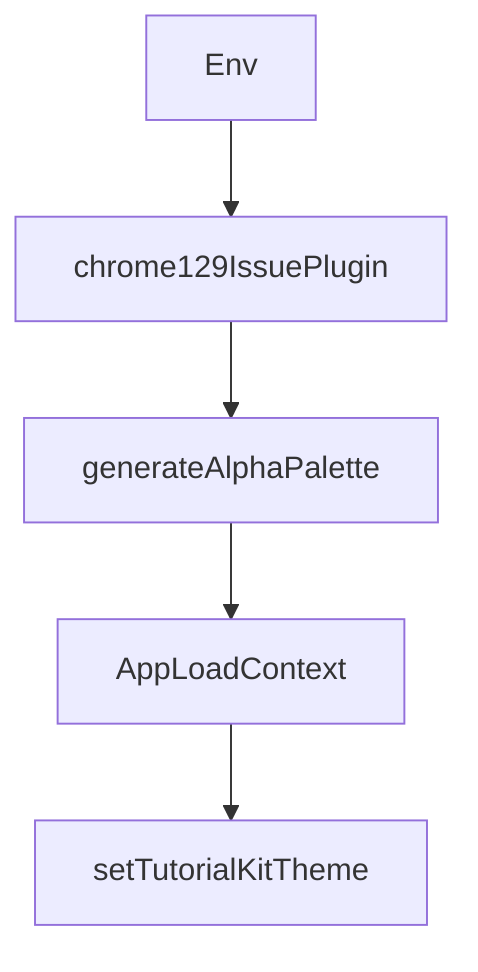

# Chapter 1: Getting Started

Welcome to **Chapter 1: Getting Started**. In this part of **bolt.diy Tutorial: Build and Operate an Open Source AI App Builder**, you will build an intuitive mental model first, then move into concrete implementation details and practical production tradeoffs.


This chapter establishes a reproducible bolt.diy development baseline with two supported paths:

- local Node.js + pnpm development
- containerized development with Docker Compose

The goal is not just "it runs on my machine", but a setup your team can reuse consistently.

## What You Will Build

By the end of this chapter, you will have:

1. a working bolt.diy instance
2. at least one configured model provider
3. a validated prompt -> diff -> command loop
4. a short runbook for first-day failures

## Source-Aligned Prerequisites

From upstream project docs and package metadata:

- Git
- Node.js (project uses modern toolchain; use latest LTS for stability)
- `pnpm` (project package manager is pinned in source)
- Docker + Docker Compose (optional but recommended)

## Setup Path A: Local Development (Fastest Iteration)

```bash
git clone https://github.com/stackblitz-labs/bolt.diy.git
cd bolt.diy
npm install -g pnpm
pnpm install
cp .env.example .env.local
cp .env.example .env
pnpm run dev
```

### Why both `.env.local` and `.env`?

- `.env.local` is typically used for local app/runtime settings
- `.env` is also used by some Docker and tooling flows for variable substitution
- keeping them synchronized avoids confusing startup differences

## Setup Path B: Docker Development (Closer to Team Runtime)

```bash
git clone https://github.com/stackblitz-labs/bolt.diy.git
cd bolt.diy
cp .env.example .env.local
cp .env.local .env
npm run dockerbuild
docker compose --profile development up
```

Use this when your team wants:

- clean environment parity
- fewer local dependency issues
- easier onboarding for contributors

## Provider Bootstrapping

bolt.diy supports many providers (OpenAI, Anthropic, Gemini, OpenRouter, Bedrock, local providers, and others). Start with one high-quality provider before adding fallbacks.

### Baseline `.env.local` pattern

```bash
# Example, only set what you actually use
OPENAI_API_KEY=...
ANTHROPIC_API_KEY=...
OPENROUTER_API_KEY=...

# Local provider example
OLLAMA_BASE_URL=http://127.0.0.1:11434
```

### UI-based configuration path

You can also configure provider keys in the app settings interface. For production, prefer environment variables managed by your secret system.

## First Task: Safe Validation Loop

Use a bounded prompt that exercises full workflow without high blast radius:

```text
Create a small utility function in a new file under src/utils,
add one usage example, run the project validation command,
and summarize the changed files and command results.
```

Acceptance criteria:

- generated changes are visible in diff view
- only expected files are touched
- validation command runs successfully
- result summary maps actions to outcomes

## Day-1 Verification Checklist

| Area | Check | Pass Signal |
|:-----|:------|:------------|
| Runtime | app starts without startup error loops | UI loads and remains responsive |
| Provider | model call succeeds | first prompt returns structured output |
| Workspace edits | patch is reviewable | diff panel shows deterministic changes |
| Command execution | shell command runs and returns output | output is attached in task flow |
| Recovery | rollback path works | reject/undo flow returns to known state |

## Common Startup Failures and Fixes

### 1) `pnpm` or dependency mismatch

- Confirm `pnpm` is installed and available in shell path
- Reinstall dependencies:

```bash
rm -rf node_modules
pnpm install
```

### 2) Provider auth failures

- Validate API key names match expected environment variable names
- Ensure no hidden whitespace/newlines in copied secrets
- Test one provider first; add more after first success

### 3) Docker variable mismatch

- Ensure `.env` exists and matches intended values
- restart compose after env changes:

```bash
docker compose --profile development down
docker compose --profile development up --build
```

### 4) "Works locally but not in container"

- compare effective env values in both runtimes
- pin one known-good model/provider combination for baseline

## Team Onboarding Runbook (Recommended)

Document this in your internal wiki:

1. required tools and versions
2. required env var names (not secret values)
3. default provider and fallback provider
4. first-task validation prompt
5. who owns support for setup breakages

This reduces setup-related drift across contributors.

## Chapter Summary

You now have a reliable bolt.diy baseline with:

- repeatable setup steps
- initial provider configuration
- first safe prompt-to-change validation
- clear recovery path for common failures

Next: [Chapter 2: Architecture Overview](02-architecture-overview.md)

## Depth Expansion Playbook

## Source Code Walkthrough

### `worker-configuration.d.ts`

The `Env` interface in [`worker-configuration.d.ts`](https://github.com/stackblitz-labs/bolt.diy/blob/HEAD/worker-configuration.d.ts) handles a key part of this chapter's functionality:

```ts
interface Env {
  RUNNING_IN_DOCKER: Settings;
  DEFAULT_NUM_CTX: Settings;
  ANTHROPIC_API_KEY: string;
  OPENAI_API_KEY: string;
  GROQ_API_KEY: string;
  HuggingFace_API_KEY: string;
  OPEN_ROUTER_API_KEY: string;
  OLLAMA_API_BASE_URL: string;
  OPENAI_LIKE_API_KEY: string;
  OPENAI_LIKE_API_BASE_URL: string;
  OPENAI_LIKE_API_MODELS: string;
  TOGETHER_API_KEY: string;
  TOGETHER_API_BASE_URL: string;
  DEEPSEEK_API_KEY: string;
  LMSTUDIO_API_BASE_URL: string;
  GOOGLE_GENERATIVE_AI_API_KEY: string;
  MISTRAL_API_KEY: string;
  XAI_API_KEY: string;
  PERPLEXITY_API_KEY: string;
  AWS_BEDROCK_CONFIG: string;
}

```

This interface is important because it defines how bolt.diy Tutorial: Build and Operate an Open Source AI App Builder implements the patterns covered in this chapter.

### `vite.config.ts`

The `chrome129IssuePlugin` function in [`vite.config.ts`](https://github.com/stackblitz-labs/bolt.diy/blob/HEAD/vite.config.ts) handles a key part of this chapter's functionality:

```ts
      UnoCSS(),
      tsconfigPaths(),
      chrome129IssuePlugin(),
      config.mode === 'production' && optimizeCssModules({ apply: 'build' }),
    ],
    envPrefix: [
      'VITE_',
      'OPENAI_LIKE_API_BASE_URL',
      'OPENAI_LIKE_API_MODELS',
      'OLLAMA_API_BASE_URL',
      'LMSTUDIO_API_BASE_URL',
      'TOGETHER_API_BASE_URL',
    ],
    css: {
      preprocessorOptions: {
        scss: {
          api: 'modern-compiler',
        },
      },
    },
    test: {
      exclude: [
        '**/node_modules/**',
        '**/dist/**',
        '**/cypress/**',
        '**/.{idea,git,cache,output,temp}/**',
        '**/{karma,rollup,webpack,vite,vitest,jest,ava,babel,nyc,cypress,tsup,build}.config.*',
        '**/tests/preview/**', // Exclude preview tests that require Playwright
      ],
    },
  };
});
```

This function is important because it defines how bolt.diy Tutorial: Build and Operate an Open Source AI App Builder implements the patterns covered in this chapter.

### `uno.config.ts`

The `generateAlphaPalette` function in [`uno.config.ts`](https://github.com/stackblitz-labs/bolt.diy/blob/HEAD/uno.config.ts) handles a key part of this chapter's functionality:

```ts
  ...BASE_COLORS,
  alpha: {
    white: generateAlphaPalette(BASE_COLORS.white),
    gray: generateAlphaPalette(BASE_COLORS.gray[900]),
    red: generateAlphaPalette(BASE_COLORS.red[500]),
    accent: generateAlphaPalette(BASE_COLORS.accent[500]),
  },
};

export default defineConfig({
  safelist: [...Object.keys(customIconCollection[collectionName] || {}).map((x) => `i-bolt:${x}`)],
  shortcuts: {
    'bolt-ease-cubic-bezier': 'ease-[cubic-bezier(0.4,0,0.2,1)]',
    'transition-theme': 'transition-[background-color,border-color,color] duration-150 bolt-ease-cubic-bezier',
    kdb: 'bg-bolt-elements-code-background text-bolt-elements-code-text py-1 px-1.5 rounded-md',
    'max-w-chat': 'max-w-[var(--chat-max-width)]',
  },
  rules: [
    /**
     * This shorthand doesn't exist in Tailwind and we overwrite it to avoid
     * any conflicts with minified CSS classes.
     */
    ['b', {}],
  ],
  theme: {
    colors: {
      ...COLOR_PRIMITIVES,
      bolt: {
        elements: {
          borderColor: 'var(--bolt-elements-borderColor)',
          borderColorActive: 'var(--bolt-elements-borderColorActive)',
          background: {
```

This function is important because it defines how bolt.diy Tutorial: Build and Operate an Open Source AI App Builder implements the patterns covered in this chapter.

### `load-context.ts`

The `AppLoadContext` interface in [`load-context.ts`](https://github.com/stackblitz-labs/bolt.diy/blob/HEAD/load-context.ts) handles a key part of this chapter's functionality:

```ts

declare module '@remix-run/cloudflare' {
  interface AppLoadContext {
    cloudflare: Cloudflare;
  }
}

```

This interface is important because it defines how bolt.diy Tutorial: Build and Operate an Open Source AI App Builder implements the patterns covered in this chapter.


## How These Components Connect


