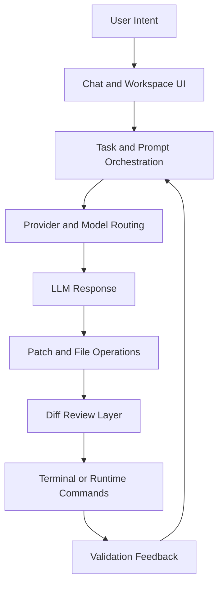

# Chapter 2: Architecture Overview

Welcome to **Chapter 2: Architecture Overview**. In this part of **bolt.diy Tutorial: Build and Operate an Open Source AI App Builder**, you will build an intuitive mental model first, then move into concrete implementation details and practical production tradeoffs.

This chapter maps how bolt.diy turns user intent into model calls, file edits, runtime checks, and deployment-ready artifacts.

## Why Architecture Matters Here

In app-builder agents, quality problems are usually architecture problems in disguise:

- unclear state boundaries cause non-deterministic behavior
- weak tool contracts create brittle provider switching
- missing diff controls increase unsafe changes

Understanding these boundaries lets you debug and extend bolt.diy confidently.

## High-Level Runtime Map

## Source-Level Layout (Top-Level)

From repository structure, these folders matter most:

- `app/` - application core (routes, components, runtime flow)
- `app/lib/` - core logic (provider modules, orchestration helpers)
- `functions/` - serverless/runtime function support
- `scripts/` - utility and operational scripts
- `docs/` - project documentation source
- `electron/` - desktop distribution path

## Key Responsibilities by Area

| Area | Primary Role | Typical Changes |
|:-----|:-------------|:----------------|
| UI and routes | user task flow and state presentation | chat UX, settings UX, workflow affordances |
| provider layer | model selection and request execution | add provider, adjust fallback, tune defaults |
| workspace mutation | apply and track generated edits | patch logic, conflict behavior, guardrails |
| runtime commands | verify generated code behavior | command policy, output parsing, retries |
| packaging/deploy | publish runtime artifacts | Docker, static hosting, desktop packaging |

## Request Lifecycle (Practical View)

1. User submits a prompt with scope and desired outcome.
2. Orchestration builds provider request context.
3. Selected model returns content/tool-call style output.
4. Proposed edits are transformed into concrete file operations.
5. Diff review step exposes changes before acceptance.
6. Validation commands run (lint/test/build/smoke).
7. Result feeds next iteration or completes task.

## Architecture Tradeoffs You Should Expect

### Flexibility vs consistency

Supporting many providers is a major strength, but each provider behaves differently. A routing policy layer is required to keep output quality predictable.

### Velocity vs safety

Fast generation loops increase delivery speed, but unsafe acceptance patterns can produce subtle regressions. Diff review and explicit approvals are mandatory controls.

### Rich tooling vs operational complexity

MCP, terminal execution, browser-like workflows, and deployment hooks increase power and blast radius simultaneously.

## Extension Points for Contributors

### Add a provider

- implement provider contract in provider module path
- map auth + model discovery
- add tests and fallback behavior
- verify compatibility with existing prompt orchestration

### Add workflow tooling

- define input/output schemas
- declare mutating vs read-only semantics
- include timeout/retry behavior
- log structured execution events

### Improve UI operations

- expose clearer approval context for risky actions
- improve diff readability for large patches
- show validation evidence before accepting final output

## Architecture Risks to Watch

| Risk | What It Looks Like | Mitigation |
|:-----|:-------------------|:-----------|
| provider drift | inconsistent answers across providers | pin defaults and explicit fallback chain |
| hidden side effects | unexpected file or command behavior | stricter approval gating and audit logging |
| context bloat | irrelevant files degrade output quality | enforce scoped prompts and smaller tasks |
| runtime skew | local and deployed behavior diverge | container parity and smoke tests per target |

## Debugging by Layer

When tasks fail, debug from outer to inner layers:

1. UI state and prompt construction
2. provider routing and auth
3. patch generation and file mutation
4. runtime validation commands
5. deployment-specific runtime assumptions

This order reduces time spent chasing downstream symptoms.

## Chapter Summary

You now have a working architecture map of bolt.diy:

- core runtime layers
- extension boundaries
- key tradeoffs and failure modes
- practical debugging sequence

Next: [Chapter 3: Providers and Model Routing](03-providers-and-routing.md)

## Depth Expansion Playbook

<!-- depth-expansion-v2 -->

This chapter is expanded to v1-style depth for production-grade learning and implementation quality.

### Strategic Context

- tutorial: **bolt.diy Tutorial: Build and Operate an Open Source AI App Builder**
- tutorial slug: **bolt-diy-tutorial**
- chapter focus: **Chapter 2: Architecture Overview**
- system context: **Bolt Diy Tutorial**
- objective: move from surface-level usage to repeatable engineering operation

### Architecture Decomposition

1. Define the runtime boundary for `Chapter 2: Architecture Overview`.
2. Separate control-plane decisions from data-plane execution.
3. Capture input contracts, transformation points, and output contracts.
4. Trace state transitions across request lifecycle stages.
5. Identify extension hooks and policy interception points.
6. Map ownership boundaries for team and automation workflows.
7. Specify rollback and recovery paths for unsafe changes.
8. Track observability signals for correctness, latency, and cost.

### Operator Decision Matrix

| Decision Area | Low-Risk Path | High-Control Path | Tradeoff |
|:--------------|:--------------|:------------------|:---------|
| Runtime mode | managed defaults | explicit policy config | speed vs control |
| State handling | local ephemeral | durable persisted state | simplicity vs auditability |
| Tool integration | direct API use | mediated adapter layer | velocity vs governance |
| Rollout method | manual change | staged + canary rollout | effort vs safety |
| Incident response | best effort logs | runbooks + SLO alerts | cost vs reliability |

### Failure Modes and Countermeasures

| Failure Mode | Early Signal | Root Cause Pattern | Countermeasure |
|:-------------|:-------------|:-------------------|:---------------|
| stale context | inconsistent outputs | missing refresh window | enforce context TTL and refresh hooks |
| policy drift | unexpected execution | ad hoc overrides | centralize policy profiles |
| auth mismatch | 401/403 bursts | credential sprawl | rotation schedule + scope minimization |
| schema breakage | parser/validation errors | unmanaged upstream changes | contract tests per release |
| retry storms | queue congestion | no backoff controls | jittered backoff + circuit breakers |
| silent regressions | quality drop without alerts | weak baseline metrics | eval harness with thresholds |

### Implementation Runbook

1. Establish a reproducible baseline environment.
2. Capture chapter-specific success criteria before changes.
3. Implement minimal viable path with explicit interfaces.
4. Add observability before expanding feature scope.
5. Run deterministic tests for happy-path behavior.
6. Inject failure scenarios for negative-path validation.
7. Compare output quality against baseline snapshots.
8. Promote through staged environments with rollback gates.
9. Record operational lessons in release notes.

### Quality Gate Checklist

- [ ] chapter-level assumptions are explicit and testable
- [ ] API/tool boundaries are documented with input/output examples
- [ ] failure handling includes retry, timeout, and fallback policy
- [ ] security controls include auth scopes and secret rotation plans
- [ ] observability includes logs, metrics, traces, and alert thresholds
- [ ] deployment guidance includes canary and rollback paths
- [ ] docs include links to upstream sources and related tracks
- [ ] post-release verification confirms expected behavior under load

### Source Alignment

- [bolt.diy README](https://github.com/stackblitz-labs/bolt.diy/blob/main/README.md)
- [bolt.diy docs index](https://github.com/stackblitz-labs/bolt.diy/blob/main/docs/docs/index.md)
- [bolt.diy Releases](https://github.com/stackblitz-labs/bolt.diy/releases)

### Cross-Tutorial Connection Map

- [Dyad Tutorial](../dyad-tutorial/)
- [Cline Tutorial](../cline-tutorial/)
- [Roo Code Tutorial](../roo-code-tutorial/)
- [Vercel AI SDK Tutorial](../vercel-ai-tutorial/)
- [OpenHands Tutorial](../openhands-tutorial/)
- [Chapter 1: Getting Started](01-getting-started.md)

### Advanced Practice Exercises

1. Build a minimal end-to-end implementation for `Chapter 2: Architecture Overview`.
2. Add instrumentation and measure baseline latency and error rate.
3. Introduce one controlled failure and confirm graceful recovery.
4. Add policy constraints and verify they are enforced consistently.
5. Run a staged rollout and document rollback decision criteria.

### Review Questions

1. Which execution boundary matters most for this chapter and why?
2. What signal detects regressions earliest in your environment?
3. What tradeoff did you make between delivery speed and governance?
4. How would you recover from the highest-impact failure mode?
5. What must be automated before scaling to team-wide adoption?

### Scenario Playbook 1: Chapter 2: Architecture Overview

- tutorial context: **bolt.diy Tutorial: Build and Operate an Open Source AI App Builder**
- trigger condition: incoming request volume spikes after release
- initial hypothesis: identify the smallest reproducible failure boundary
- immediate action: protect user-facing stability before optimization work
- engineering control: introduce adaptive concurrency limits and queue bounds
- verification target: latency p95 and p99 stay within defined SLO windows
- rollback trigger: pre-defined quality gate fails for two consecutive checks
- communication step: publish incident status with owner and ETA
- learning capture: add postmortem and convert findings into automated tests

### Scenario Playbook 2: Chapter 2: Architecture Overview

- tutorial context: **bolt.diy Tutorial: Build and Operate an Open Source AI App Builder**
- trigger condition: tool dependency latency increases under concurrency
- initial hypothesis: identify the smallest reproducible failure boundary
- immediate action: protect user-facing stability before optimization work
- engineering control: enable staged retries with jitter and circuit breaker fallback
- verification target: error budget burn rate remains below escalation threshold
- rollback trigger: pre-defined quality gate fails for two consecutive checks
- communication step: publish incident status with owner and ETA
- learning capture: add postmortem and convert findings into automated tests

### Scenario Playbook 3: Chapter 2: Architecture Overview

- tutorial context: **bolt.diy Tutorial: Build and Operate an Open Source AI App Builder**
- trigger condition: schema updates introduce incompatible payloads
- initial hypothesis: identify the smallest reproducible failure boundary
- immediate action: protect user-facing stability before optimization work
- engineering control: pin schema versions and add compatibility shims
- verification target: throughput remains stable under target concurrency
- rollback trigger: pre-defined quality gate fails for two consecutive checks
- communication step: publish incident status with owner and ETA
- learning capture: add postmortem and convert findings into automated tests

### Scenario Playbook 4: Chapter 2: Architecture Overview

- tutorial context: **bolt.diy Tutorial: Build and Operate an Open Source AI App Builder**
- trigger condition: environment parity drifts between staging and production
- initial hypothesis: identify the smallest reproducible failure boundary
- immediate action: protect user-facing stability before optimization work
- engineering control: restore environment parity via immutable config promotion
- verification target: retry volume stays bounded without feedback loops
- rollback trigger: pre-defined quality gate fails for two consecutive checks
- communication step: publish incident status with owner and ETA
- learning capture: add postmortem and convert findings into automated tests

### Scenario Playbook 5: Chapter 2: Architecture Overview

- tutorial context: **bolt.diy Tutorial: Build and Operate an Open Source AI App Builder**
- trigger condition: access policy changes reduce successful execution rates
- initial hypothesis: identify the smallest reproducible failure boundary
- immediate action: protect user-facing stability before optimization work
- engineering control: re-scope credentials and rotate leaked or stale keys
- verification target: data integrity checks pass across write/read cycles
- rollback trigger: pre-defined quality gate fails for two consecutive checks
- communication step: publish incident status with owner and ETA
- learning capture: add postmortem and convert findings into automated tests

### Scenario Playbook 6: Chapter 2: Architecture Overview

- tutorial context: **bolt.diy Tutorial: Build and Operate an Open Source AI App Builder**
- trigger condition: background jobs accumulate and exceed processing windows
- initial hypothesis: identify the smallest reproducible failure boundary
- immediate action: protect user-facing stability before optimization work
- engineering control: activate degradation mode to preserve core user paths
- verification target: audit logs capture all control-plane mutations
- rollback trigger: pre-defined quality gate fails for two consecutive checks
- communication step: publish incident status with owner and ETA
- learning capture: add postmortem and convert findings into automated tests

### Scenario Playbook 7: Chapter 2: Architecture Overview

- tutorial context: **bolt.diy Tutorial: Build and Operate an Open Source AI App Builder**
- trigger condition: incoming request volume spikes after release
- initial hypothesis: identify the smallest reproducible failure boundary
- immediate action: protect user-facing stability before optimization work
- engineering control: introduce adaptive concurrency limits and queue bounds
- verification target: latency p95 and p99 stay within defined SLO windows
- rollback trigger: pre-defined quality gate fails for two consecutive checks
- communication step: publish incident status with owner and ETA
- learning capture: add postmortem and convert findings into automated tests

### Scenario Playbook 8: Chapter 2: Architecture Overview

- tutorial context: **bolt.diy Tutorial: Build and Operate an Open Source AI App Builder**
- trigger condition: tool dependency latency increases under concurrency
- initial hypothesis: identify the smallest reproducible failure boundary
- immediate action: protect user-facing stability before optimization work
- engineering control: enable staged retries with jitter and circuit breaker fallback
- verification target: error budget burn rate remains below escalation threshold
- rollback trigger: pre-defined quality gate fails for two consecutive checks
- communication step: publish incident status with owner and ETA
- learning capture: add postmortem and convert findings into automated tests

### Scenario Playbook 9: Chapter 2: Architecture Overview

- tutorial context: **bolt.diy Tutorial: Build and Operate an Open Source AI App Builder**
- trigger condition: schema updates introduce incompatible payloads
- initial hypothesis: identify the smallest reproducible failure boundary
- immediate action: protect user-facing stability before optimization work
- engineering control: pin schema versions and add compatibility shims
- verification target: throughput remains stable under target concurrency
- rollback trigger: pre-defined quality gate fails for two consecutive checks
- communication step: publish incident status with owner and ETA
- learning capture: add postmortem and convert findings into automated tests

### Scenario Playbook 10: Chapter 2: Architecture Overview

- tutorial context: **bolt.diy Tutorial: Build and Operate an Open Source AI App Builder**
- trigger condition: environment parity drifts between staging and production
- initial hypothesis: identify the smallest reproducible failure boundary
- immediate action: protect user-facing stability before optimization work
- engineering control: restore environment parity via immutable config promotion
- verification target: retry volume stays bounded without feedback loops
- rollback trigger: pre-defined quality gate fails for two consecutive checks
- communication step: publish incident status with owner and ETA
- learning capture: add postmortem and convert findings into automated tests

### Scenario Playbook 11: Chapter 2: Architecture Overview

- tutorial context: **bolt.diy Tutorial: Build and Operate an Open Source AI App Builder**
- trigger condition: access policy changes reduce successful execution rates
- initial hypothesis: identify the smallest reproducible failure boundary
- immediate action: protect user-facing stability before optimization work
- engineering control: re-scope credentials and rotate leaked or stale keys
- verification target: data integrity checks pass across write/read cycles
- rollback trigger: pre-defined quality gate fails for two consecutive checks
- communication step: publish incident status with owner and ETA
- learning capture: add postmortem and convert findings into automated tests

### Scenario Playbook 12: Chapter 2: Architecture Overview

- tutorial context: **bolt.diy Tutorial: Build and Operate an Open Source AI App Builder**
- trigger condition: background jobs accumulate and exceed processing windows
- initial hypothesis: identify the smallest reproducible failure boundary
- immediate action: protect user-facing stability before optimization work
- engineering control: activate degradation mode to preserve core user paths
- verification target: audit logs capture all control-plane mutations
- rollback trigger: pre-defined quality gate fails for two consecutive checks
- communication step: publish incident status with owner and ETA
- learning capture: add postmortem and convert findings into automated tests

### Scenario Playbook 13: Chapter 2: Architecture Overview

- tutorial context: **bolt.diy Tutorial: Build and Operate an Open Source AI App Builder**
- trigger condition: incoming request volume spikes after release
- initial hypothesis: identify the smallest reproducible failure boundary
- immediate action: protect user-facing stability before optimization work
- engineering control: introduce adaptive concurrency limits and queue bounds
- verification target: latency p95 and p99 stay within defined SLO windows
- rollback trigger: pre-defined quality gate fails for two consecutive checks
- communication step: publish incident status with owner and ETA
- learning capture: add postmortem and convert findings into automated tests

### Scenario Playbook 14: Chapter 2: Architecture Overview

- tutorial context: **bolt.diy Tutorial: Build and Operate an Open Source AI App Builder**
- trigger condition: tool dependency latency increases under concurrency
- initial hypothesis: identify the smallest reproducible failure boundary
- immediate action: protect user-facing stability before optimization work
- engineering control: enable staged retries with jitter and circuit breaker fallback
- verification target: error budget burn rate remains below escalation threshold
- rollback trigger: pre-defined quality gate fails for two consecutive checks
- communication step: publish incident status with owner and ETA
- learning capture: add postmortem and convert findings into automated tests

### Scenario Playbook 15: Chapter 2: Architecture Overview

- tutorial context: **bolt.diy Tutorial: Build and Operate an Open Source AI App Builder**
- trigger condition: schema updates introduce incompatible payloads
- initial hypothesis: identify the smallest reproducible failure boundary
- immediate action: protect user-facing stability before optimization work
- engineering control: pin schema versions and add compatibility shims
- verification target: throughput remains stable under target concurrency
- rollback trigger: pre-defined quality gate fails for two consecutive checks
- communication step: publish incident status with owner and ETA
- learning capture: add postmortem and convert findings into automated tests

### Scenario Playbook 16: Chapter 2: Architecture Overview

- tutorial context: **bolt.diy Tutorial: Build and Operate an Open Source AI App Builder**
- trigger condition: environment parity drifts between staging and production
- initial hypothesis: identify the smallest reproducible failure boundary
- immediate action: protect user-facing stability before optimization work
- engineering control: restore environment parity via immutable config promotion
- verification target: retry volume stays bounded without feedback loops
- rollback trigger: pre-defined quality gate fails for two consecutive checks
- communication step: publish incident status with owner and ETA
- learning capture: add postmortem and convert findings into automated tests

### Scenario Playbook 17: Chapter 2: Architecture Overview

- tutorial context: **bolt.diy Tutorial: Build and Operate an Open Source AI App Builder**
- trigger condition: access policy changes reduce successful execution rates
- initial hypothesis: identify the smallest reproducible failure boundary
- immediate action: protect user-facing stability before optimization work
- engineering control: re-scope credentials and rotate leaked or stale keys
- verification target: data integrity checks pass across write/read cycles
- rollback trigger: pre-defined quality gate fails for two consecutive checks
- communication step: publish incident status with owner and ETA
- learning capture: add postmortem and convert findings into automated tests

### Scenario Playbook 18: Chapter 2: Architecture Overview

- tutorial context: **bolt.diy Tutorial: Build and Operate an Open Source AI App Builder**
- trigger condition: background jobs accumulate and exceed processing windows
- initial hypothesis: identify the smallest reproducible failure boundary
- immediate action: protect user-facing stability before optimization work
- engineering control: activate degradation mode to preserve core user paths
- verification target: audit logs capture all control-plane mutations
- rollback trigger: pre-defined quality gate fails for two consecutive checks
- communication step: publish incident status with owner and ETA
- learning capture: add postmortem and convert findings into automated tests

### Scenario Playbook 19: Chapter 2: Architecture Overview

- tutorial context: **bolt.diy Tutorial: Build and Operate an Open Source AI App Builder**
- trigger condition: incoming request volume spikes after release
- initial hypothesis: identify the smallest reproducible failure boundary
- immediate action: protect user-facing stability before optimization work
- engineering control: introduce adaptive concurrency limits and queue bounds
- verification target: latency p95 and p99 stay within defined SLO windows
- rollback trigger: pre-defined quality gate fails for two consecutive checks
- communication step: publish incident status with owner and ETA
- learning capture: add postmortem and convert findings into automated tests

### Scenario Playbook 20: Chapter 2: Architecture Overview

- tutorial context: **bolt.diy Tutorial: Build and Operate an Open Source AI App Builder**
- trigger condition: tool dependency latency increases under concurrency
- initial hypothesis: identify the smallest reproducible failure boundary
- immediate action: protect user-facing stability before optimization work
- engineering control: enable staged retries with jitter and circuit breaker fallback
- verification target: error budget burn rate remains below escalation threshold
- rollback trigger: pre-defined quality gate fails for two consecutive checks
- communication step: publish incident status with owner and ETA
- learning capture: add postmortem and convert findings into automated tests

### Scenario Playbook 21: Chapter 2: Architecture Overview

- tutorial context: **bolt.diy Tutorial: Build and Operate an Open Source AI App Builder**
- trigger condition: schema updates introduce incompatible payloads
- initial hypothesis: identify the smallest reproducible failure boundary
- immediate action: protect user-facing stability before optimization work
- engineering control: pin schema versions and add compatibility shims
- verification target: throughput remains stable under target concurrency
- rollback trigger: pre-defined quality gate fails for two consecutive checks
- communication step: publish incident status with owner and ETA
- learning capture: add postmortem and convert findings into automated tests

### Scenario Playbook 22: Chapter 2: Architecture Overview

- tutorial context: **bolt.diy Tutorial: Build and Operate an Open Source AI App Builder**
- trigger condition: environment parity drifts between staging and production
- initial hypothesis: identify the smallest reproducible failure boundary
- immediate action: protect user-facing stability before optimization work
- engineering control: restore environment parity via immutable config promotion
- verification target: retry volume stays bounded without feedback loops
- rollback trigger: pre-defined quality gate fails for two consecutive checks
- communication step: publish incident status with owner and ETA
- learning capture: add postmortem and convert findings into automated tests

### Scenario Playbook 23: Chapter 2: Architecture Overview

- tutorial context: **bolt.diy Tutorial: Build and Operate an Open Source AI App Builder**
- trigger condition: access policy changes reduce successful execution rates
- initial hypothesis: identify the smallest reproducible failure boundary
- immediate action: protect user-facing stability before optimization work
- engineering control: re-scope credentials and rotate leaked or stale keys
- verification target: data integrity checks pass across write/read cycles
- rollback trigger: pre-defined quality gate fails for two consecutive checks
- communication step: publish incident status with owner and ETA
- learning capture: add postmortem and convert findings into automated tests

### Scenario Playbook 24: Chapter 2: Architecture Overview

- tutorial context: **bolt.diy Tutorial: Build and Operate an Open Source AI App Builder**
- trigger condition: background jobs accumulate and exceed processing windows
- initial hypothesis: identify the smallest reproducible failure boundary
- immediate action: protect user-facing stability before optimization work
- engineering control: activate degradation mode to preserve core user paths
- verification target: audit logs capture all control-plane mutations
- rollback trigger: pre-defined quality gate fails for two consecutive checks
- communication step: publish incident status with owner and ETA
- learning capture: add postmortem and convert findings into automated tests

### Scenario Playbook 25: Chapter 2: Architecture Overview

- tutorial context: **bolt.diy Tutorial: Build and Operate an Open Source AI App Builder**
- trigger condition: incoming request volume spikes after release
- initial hypothesis: identify the smallest reproducible failure boundary
- immediate action: protect user-facing stability before optimization work
- engineering control: introduce adaptive concurrency limits and queue bounds
- verification target: latency p95 and p99 stay within defined SLO windows
- rollback trigger: pre-defined quality gate fails for two consecutive checks
- communication step: publish incident status with owner and ETA
- learning capture: add postmortem and convert findings into automated tests

### Scenario Playbook 26: Chapter 2: Architecture Overview

- tutorial context: **bolt.diy Tutorial: Build and Operate an Open Source AI App Builder**
- trigger condition: tool dependency latency increases under concurrency
- initial hypothesis: identify the smallest reproducible failure boundary
- immediate action: protect user-facing stability before optimization work
- engineering control: enable staged retries with jitter and circuit breaker fallback
- verification target: error budget burn rate remains below escalation threshold
- rollback trigger: pre-defined quality gate fails for two consecutive checks
- communication step: publish incident status with owner and ETA
- learning capture: add postmortem and convert findings into automated tests

### Scenario Playbook 27: Chapter 2: Architecture Overview

- tutorial context: **bolt.diy Tutorial: Build and Operate an Open Source AI App Builder**
- trigger condition: schema updates introduce incompatible payloads
- initial hypothesis: identify the smallest reproducible failure boundary
- immediate action: protect user-facing stability before optimization work
- engineering control: pin schema versions and add compatibility shims
- verification target: throughput remains stable under target concurrency
- rollback trigger: pre-defined quality gate fails for two consecutive checks
- communication step: publish incident status with owner and ETA
- learning capture: add postmortem and convert findings into automated tests

### Scenario Playbook 28: Chapter 2: Architecture Overview

- tutorial context: **bolt.diy Tutorial: Build and Operate an Open Source AI App Builder**
- trigger condition: environment parity drifts between staging and production
- initial hypothesis: identify the smallest reproducible failure boundary
- immediate action: protect user-facing stability before optimization work
- engineering control: restore environment parity via immutable config promotion
- verification target: retry volume stays bounded without feedback loops
- rollback trigger: pre-defined quality gate fails for two consecutive checks
- communication step: publish incident status with owner and ETA
- learning capture: add postmortem and convert findings into automated tests

### Scenario Playbook 29: Chapter 2: Architecture Overview

- tutorial context: **bolt.diy Tutorial: Build and Operate an Open Source AI App Builder**
- trigger condition: access policy changes reduce successful execution rates
- initial hypothesis: identify the smallest reproducible failure boundary
- immediate action: protect user-facing stability before optimization work
- engineering control: re-scope credentials and rotate leaked or stale keys
- verification target: data integrity checks pass across write/read cycles
- rollback trigger: pre-defined quality gate fails for two consecutive checks
- communication step: publish incident status with owner and ETA
- learning capture: add postmortem and convert findings into automated tests

## What Problem Does This Solve?

Most teams struggle here because the hard part is not writing more code, but deciding clear boundaries for `ORCH`, `ROUTE`, `EDIT` so behavior stays predictable as complexity grows.

In practical terms, this chapter helps you avoid three common failures:

- coupling core logic too tightly to one implementation path
- missing the handoff boundaries between setup, execution, and validation
- shipping changes without clear rollback or observability strategy

After working through this chapter, you should be able to reason about `Chapter 2: Architecture Overview` as an operating subsystem inside **bolt.diy Tutorial: Build and Operate an Open Source AI App Builder**, with explicit contracts for inputs, state transitions, and outputs.

Use the implementation notes around `DIFF`, `FEEDBACK`, `flowchart` as your checklist when adapting these patterns to your own repository.

## How it Works Under the Hood

Under the hood, `Chapter 2: Architecture Overview` usually follows a repeatable control path:

1. **Context bootstrap**: initialize runtime config and prerequisites for `ORCH`.
2. **Input normalization**: shape incoming data so `ROUTE` receives stable contracts.
3. **Core execution**: run the main logic branch and propagate intermediate state through `EDIT`.
4. **Policy and safety checks**: enforce limits, auth scopes, and failure boundaries.
5. **Output composition**: return canonical result payloads for downstream consumers.
6. **Operational telemetry**: emit logs/metrics needed for debugging and performance tuning.

When debugging, walk this sequence in order and confirm each stage has explicit success/failure conditions.

## Source Walkthrough

Use the following upstream sources to verify implementation details while reading this chapter:

- [bolt.diy README](https://github.com/stackblitz-labs/bolt.diy/blob/main/README.md)
  Why it matters: authoritative reference on `bolt.diy README` (github.com).
- [bolt.diy docs index](https://github.com/stackblitz-labs/bolt.diy/blob/main/docs/docs/index.md)
  Why it matters: authoritative reference on `bolt.diy docs index` (github.com).
- [bolt.diy Releases](https://github.com/stackblitz-labs/bolt.diy/releases)
  Why it matters: authoritative reference on `bolt.diy Releases` (github.com).

Suggested trace strategy:
- search upstream code for `ORCH` and `ROUTE` to map concrete implementation paths
- compare docs claims against actual runtime/config code before reusing patterns in production

## Chapter Connections

- [Tutorial Index](index.md)
- [Previous Chapter: Chapter 1: Getting Started](01-getting-started.md)
- [Next Chapter: Chapter 3: Providers and Model Routing](03-providers-and-routing.md)
- [Main Catalog](../../README.md#-tutorial-catalog)
- [A-Z Tutorial Directory](../../discoverability/tutorial-directory.md)
