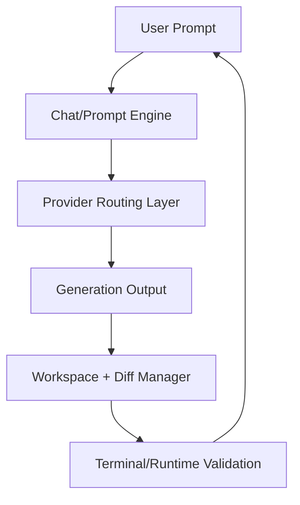

# Chapter 2: Architecture Overview

bolt.diy combines chat orchestration, workspace mutation, and runtime verification in one interface.

## High-Level Architecture

## Core Subsystems

| Subsystem | Responsibility |
|:----------|:---------------|
| Prompt engine | transforms intent into model-ready instructions |
| Provider layer | selects model/provider and handles credentials |
| Workspace manager | applies file edits and maintains visible diffs |
| Runtime tools | executes commands and captures output |
| Deployment/export | packages and publishes generated artifacts |

## Architectural Tradeoffs

- high flexibility across providers increases configuration complexity
- rapid generation loops require strict diff review discipline
- desktop + web support broadens adoption but increases release surface

## First Files to Inspect

- `app/` for routing and UI flow
- provider/config modules for model selection behavior
- diff/workspace handling modules for patch safety
- deployment scripts and Docker assets for runtime packaging

## Summary

You now understand where bolt.diy coordinates prompts, edits, and validation.

Next: [Chapter 3: Providers and Model Routing](03-providers-and-routing.md)
