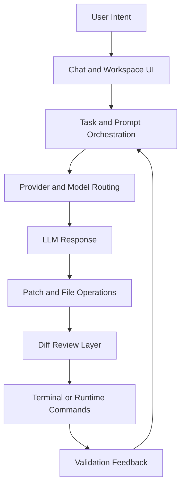

# Chapter 2: Architecture Overview

This chapter maps how bolt.diy turns user intent into model calls, file edits, runtime checks, and deployment-ready artifacts.

## Why Architecture Matters Here

In app-builder agents, quality problems are usually architecture problems in disguise:

- unclear state boundaries cause non-deterministic behavior
- weak tool contracts create brittle provider switching
- missing diff controls increase unsafe changes

Understanding these boundaries lets you debug and extend bolt.diy confidently.

## High-Level Runtime Map

## Source-Level Layout (Top-Level)

From repository structure, these folders matter most:

- `app/` - application core (routes, components, runtime flow)
- `app/lib/` - core logic (provider modules, orchestration helpers)
- `functions/` - serverless/runtime function support
- `scripts/` - utility and operational scripts
- `docs/` - project documentation source
- `electron/` - desktop distribution path

## Key Responsibilities by Area

| Area | Primary Role | Typical Changes |
|:-----|:-------------|:----------------|
| UI and routes | user task flow and state presentation | chat UX, settings UX, workflow affordances |
| provider layer | model selection and request execution | add provider, adjust fallback, tune defaults |
| workspace mutation | apply and track generated edits | patch logic, conflict behavior, guardrails |
| runtime commands | verify generated code behavior | command policy, output parsing, retries |
| packaging/deploy | publish runtime artifacts | Docker, static hosting, desktop packaging |

## Request Lifecycle (Practical View)

1. User submits a prompt with scope and desired outcome.
2. Orchestration builds provider request context.
3. Selected model returns content/tool-call style output.
4. Proposed edits are transformed into concrete file operations.
5. Diff review step exposes changes before acceptance.
6. Validation commands run (lint/test/build/smoke).
7. Result feeds next iteration or completes task.

## Architecture Tradeoffs You Should Expect

### Flexibility vs consistency

Supporting many providers is a major strength, but each provider behaves differently. A routing policy layer is required to keep output quality predictable.

### Velocity vs safety

Fast generation loops increase delivery speed, but unsafe acceptance patterns can produce subtle regressions. Diff review and explicit approvals are mandatory controls.

### Rich tooling vs operational complexity

MCP, terminal execution, browser-like workflows, and deployment hooks increase power and blast radius simultaneously.

## Extension Points for Contributors

### Add a provider

- implement provider contract in provider module path
- map auth + model discovery
- add tests and fallback behavior
- verify compatibility with existing prompt orchestration

### Add workflow tooling

- define input/output schemas
- declare mutating vs read-only semantics
- include timeout/retry behavior
- log structured execution events

### Improve UI operations

- expose clearer approval context for risky actions
- improve diff readability for large patches
- show validation evidence before accepting final output

## Architecture Risks to Watch

| Risk | What It Looks Like | Mitigation |
|:-----|:-------------------|:-----------|
| provider drift | inconsistent answers across providers | pin defaults and explicit fallback chain |
| hidden side effects | unexpected file or command behavior | stricter approval gating and audit logging |
| context bloat | irrelevant files degrade output quality | enforce scoped prompts and smaller tasks |
| runtime skew | local and deployed behavior diverge | container parity and smoke tests per target |

## Debugging by Layer

When tasks fail, debug from outer to inner layers:

1. UI state and prompt construction
2. provider routing and auth
3. patch generation and file mutation
4. runtime validation commands
5. deployment-specific runtime assumptions

This order reduces time spent chasing downstream symptoms.

## Chapter Summary

You now have a working architecture map of bolt.diy:

- core runtime layers
- extension boundaries
- key tradeoffs and failure modes
- practical debugging sequence

Next: [Chapter 3: Providers and Model Routing](03-providers-and-routing.md)
