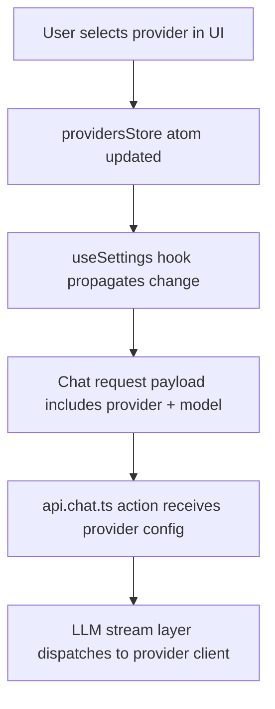

# Chapter 3: Providers and Model Routing

Welcome to **Chapter 3: Providers and Model Routing**. In this part of **bolt.diy Tutorial: Build and Operate an Open Source AI App Builder**, you will build an intuitive mental model first, then move into concrete implementation details and practical production tradeoffs.


bolt.diy's biggest advantage is provider flexibility. This chapter shows how to turn that flexibility into a controlled routing policy.

## Current Provider Surface

Upstream project docs describe support for many cloud and local providers, including OpenAI, Anthropic, Gemini, OpenRouter, Bedrock, local engines (for example Ollama/LM Studio), and more.

That breadth is useful only if you define:

- a primary provider strategy
- a fallback chain
- task-class routing rules
- cost and latency boundaries

## Routing as Policy, Not Preference

Avoid ad-hoc switching from UI alone. Use a policy table.

| Task Class | Primary | Fallback 1 | Fallback 2 | Notes |
|:-----------|:--------|:-----------|:-----------|:------|
| small scaffolding | low-latency model | medium model | local model | optimize for speed |
| architecture decisions | high-reasoning model | second high-reasoning model | medium model | quality over speed |
| privacy-sensitive tasks | local/self-hosted model | private gateway model | none | avoid external egress when required |
| high-volume batch edits | cost-efficient model | mid-cost model | local model | enforce spend caps |

## Minimum Routing Configuration

At a minimum, define these values per environment:

- default provider/model
- allowed provider list
- forbidden provider list (if compliance requires)
- fallback order
- timeout and retry limits
- budget cap per task/session

## Credential Management Baseline

### Development

- allow UI-assisted key setup for quick experimentation
- keep local secrets out of Git
- avoid sharing personal API keys across team accounts

### Staging/Production

- inject provider credentials from secret manager
- rotate keys on a fixed schedule
- separate read-only and privileged environment credentials

## Common Routing Failure Modes

### 1) Inconsistent results across providers

Different providers may follow tool and formatting instructions differently.

Mitigation:

- enforce stricter prompt contracts
- normalize output expectations in orchestration layer
- route sensitive tasks to stable high-performing defaults

### 2) Hidden cost spikes

Switching to stronger models without guardrails can silently increase spend.

Mitigation:

- per-task budget cap
- visible usage accounting per session
- periodic usage review by task type

### 3) Broken fallback logic

Fallback can fail if secondary provider config is incomplete.

Mitigation:

- scheduled fallback health checks
- failover drills in non-production environment
- keep a tested emergency fallback profile

## Recommended Team Profiles

| Profile | Purpose | Default Settings |
|:--------|:--------|:-----------------|
| `dev-fast` | everyday iteration | low-latency model + cheap fallback |
| `review-safe` | risky or wide-scope refactors | stronger reasoning model + strict approvals |
| `private-mode` | sensitive code/data | local/self-hosted providers only |
| `batch-cost` | repetitive bulk work | cost-optimized model + hard caps |

## Example Environment Strategy

```bash
# Example names only; use your real variables and secret manager
PRIMARY_PROVIDER=openrouter
PRIMARY_MODEL=...
FALLBACK_PROVIDER=anthropic
FALLBACK_MODEL=...
TERTIARY_PROVIDER=ollama
TERTIARY_MODEL=...
TASK_BUDGET_USD=3.00
```

Use this as conceptual structure, not a hard-coded upstream contract.

## Routing Readiness Checklist

- default and fallback providers are documented
- each provider path is smoke-tested weekly
- budget limits are visible to operators
- error categories are captured in logs
- incident runbook includes provider outage steps

## Chapter Summary

You now have a provider-routing governance model that covers:

- task-class model selection
- fallback resilience
- spend controls
- credential and compliance boundaries

Next: [Chapter 4: Prompt-to-App Workflow](04-prompt-to-app-workflow.md)

## Source Code Walkthrough

### `app/lib/stores/settings.ts`

The provider configuration store in [`app/lib/stores/settings.ts`](https://github.com/stackblitz-labs/bolt.diy/blob/HEAD/app/lib/stores/settings.ts) is central to this chapter — it holds the active provider/model selection and persists user routing preferences across sessions.

The store is built on `nanostores` and exposes atoms like `providersStore` that the UI and LLM routing layer both read. When a user selects a provider in the settings panel, the atom updates and the next chat request automatically picks up the new provider config. This is the primary place to trace if you want to understand how provider selection flows from UI to request.

### `app/lib/hooks/useSettings.ts`

The `useSettings` hook in [`app/lib/hooks/useSettings.ts`](https://github.com/stackblitz-labs/bolt.diy/blob/HEAD/app/lib/hooks/useSettings.ts) is what React components use to read and mutate provider state. It wraps the nanostores atoms with React subscriptions, ensuring components re-render when provider or model selection changes.

For routing policy work, this hook is the integration point: you can extend it to enforce allowed-provider constraints or inject environment-driven defaults before the value reaches UI components.

### `app/routes/api.chat.ts`

The `action` export in [`app/routes/api.chat.ts`](https://github.com/stackblitz-labs/bolt.diy/blob/HEAD/app/routes/api.chat.ts) is the server-side entry point where provider selection from the client is consumed. The provider and model identifiers travel from the React store through the chat request payload to this route, which then delegates to the appropriate provider client.

Tracing from this file through the LLM stream layer shows exactly where fallback logic would need to be inserted to implement a multi-provider fallback chain.

## How These Components Connect


