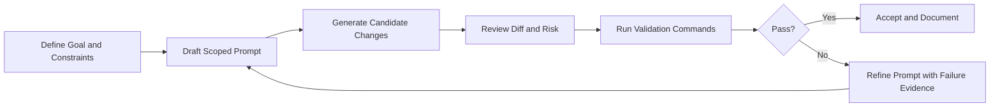

# Chapter 4: Prompt-to-App Workflow

This chapter explains how to transform natural-language intent into deterministic, reviewable product changes.

## The Core Principle

A high-quality bolt.diy workflow is not "prompt and pray". It is a controlled loop:

1. define target outcome
2. constrain scope
3. generate minimal patch
4. validate with commands
5. iterate using evidence

## Workflow Diagram



## Prompt Contract Template

Use this structure for most tasks:

```text
Goal:
Scope (allowed files/directories):
Non-goals (must not change):
Expected behavior:
Validation command(s):
Definition of done:
```

This simple template dramatically reduces drift.

## Good vs Bad Prompt Example

### Weak prompt

```text
Improve auth flow.
```

Problems:

- no scope
- no expected behavior
- no validation command

### Strong prompt

```text
Refactor token refresh handling in src/auth/session.ts only.
Do not modify routing or UI components.
Maintain current public API.
Run npm test -- auth-session.
Return changed files and test result summary.
```

Benefits:

- bounded file surface
- explicit constraints
- deterministic acceptance criteria

## Iteration Strategy for Large Features

For multi-step work, break into milestones:

1. scaffold interfaces only
2. implement one subsystem
3. run targeted tests
4. integrate cross-module wiring
5. run broader validation

Never request architecture redesign and production bugfix in the same first prompt.

## Evidence-Driven Correction Loop

When output is wrong, avoid vague feedback like "still broken".

Provide:

- failing command output
- exact expected behavior
- explicit file/function targets
- what should remain unchanged

This creates focused rework rather than broad retries.

## Acceptance Gates

| Gate | Question |
|:-----|:---------|
| scope gate | Did changes stay inside allowed files? |
| behavior gate | Does output satisfy stated goal? |
| safety gate | Any hidden config/auth/security impact? |
| validation gate | Did specified commands pass? |
| clarity gate | Is summary sufficient for reviewer handoff? |

## Team Prompt Standards

If multiple engineers share bolt.diy, standardize:

- one prompt template
- one summary format
- one minimal evidence format (command + result)
- one escalation path for risky changes

Consistency matters more than perfect wording.

## Common Failure Patterns

### Pattern: Over-scoped edits

Symptom: unrelated files modified.

Fix: tighten scope and explicitly forbid unrelated directories.

### Pattern: Repeated patch churn

Symptom: same issue reappears across iterations.

Fix: include exact failing evidence and force minimal patch objective.

### Pattern: Noisy summaries

Symptom: hard to review what changed.

Fix: require per-file summary plus pass/fail results.

## Chapter Summary

You now have a deterministic prompt-to-app method:

- explicit prompt contracts
- milestone-based iteration
- evidence-driven correction
- consistent acceptance gates

Next: [Chapter 5: Files, Diff, and Locking](05-files-diff-locking.md)
