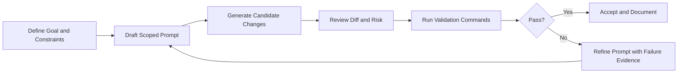

# Chapter 4: Prompt-to-App Workflow

Welcome to **Chapter 4: Prompt-to-App Workflow**. In this part of **bolt.diy Tutorial: Build and Operate an Open Source AI App Builder**, you will build an intuitive mental model first, then move into concrete implementation details and practical production tradeoffs.


This chapter explains how to transform natural-language intent into deterministic, reviewable product changes.

## The Core Principle

A high-quality bolt.diy workflow is not "prompt and pray". It is a controlled loop:

1. define target outcome
2. constrain scope
3. generate minimal patch
4. validate with commands
5. iterate using evidence

## Workflow Diagram



## Prompt Contract Template

Use this structure for most tasks:

```text
Goal:
Scope (allowed files/directories):
Non-goals (must not change):
Expected behavior:
Validation command(s):
Definition of done:
```

This simple template dramatically reduces drift.

## Good vs Bad Prompt Example

### Weak prompt

```text
Improve auth flow.
```

Problems:

- no scope
- no expected behavior
- no validation command

### Strong prompt

```text
Refactor token refresh handling in src/auth/session.ts only.
Do not modify routing or UI components.
Maintain current public API.
Run npm test -- auth-session.
Return changed files and test result summary.
```

Benefits:

- bounded file surface
- explicit constraints
- deterministic acceptance criteria

## Iteration Strategy for Large Features

For multi-step work, break into milestones:

1. scaffold interfaces only
2. implement one subsystem
3. run targeted tests
4. integrate cross-module wiring
5. run broader validation

Never request architecture redesign and production bugfix in the same first prompt.

## Evidence-Driven Correction Loop

When output is wrong, avoid vague feedback like "still broken".

Provide:

- failing command output
- exact expected behavior
- explicit file/function targets
- what should remain unchanged

This creates focused rework rather than broad retries.

## Acceptance Gates

| Gate | Question |
|:-----|:---------|
| scope gate | Did changes stay inside allowed files? |
| behavior gate | Does output satisfy stated goal? |
| safety gate | Any hidden config/auth/security impact? |
| validation gate | Did specified commands pass? |
| clarity gate | Is summary sufficient for reviewer handoff? |

## Team Prompt Standards

If multiple engineers share bolt.diy, standardize:

- one prompt template
- one summary format
- one minimal evidence format (command + result)
- one escalation path for risky changes

Consistency matters more than perfect wording.

## Common Failure Patterns

### Pattern: Over-scoped edits

Symptom: unrelated files modified.

Fix: tighten scope and explicitly forbid unrelated directories.

### Pattern: Repeated patch churn

Symptom: same issue reappears across iterations.

Fix: include exact failing evidence and force minimal patch objective.

### Pattern: Noisy summaries

Symptom: hard to review what changed.

Fix: require per-file summary plus pass/fail results.

## Chapter Summary

You now have a deterministic prompt-to-app method:

- explicit prompt contracts
- milestone-based iteration
- evidence-driven correction
- consistent acceptance gates

Next: [Chapter 5: Files, Diff, and Locking](05-files-diff-locking.md)

## Depth Expansion Playbook

<!-- depth-expansion-v2 -->

This chapter is expanded to v1-style depth for production-grade learning and implementation quality.

### Strategic Context

- tutorial: **bolt.diy Tutorial: Build and Operate an Open Source AI App Builder**
- tutorial slug: **bolt-diy-tutorial**
- chapter focus: **Chapter 4: Prompt-to-App Workflow**
- system context: **Bolt Diy Tutorial**
- objective: move from surface-level usage to repeatable engineering operation

### Architecture Decomposition

1. Define the runtime boundary for `Chapter 4: Prompt-to-App Workflow`.
2. Separate control-plane decisions from data-plane execution.
3. Capture input contracts, transformation points, and output contracts.
4. Trace state transitions across request lifecycle stages.
5. Identify extension hooks and policy interception points.
6. Map ownership boundaries for team and automation workflows.
7. Specify rollback and recovery paths for unsafe changes.
8. Track observability signals for correctness, latency, and cost.

### Operator Decision Matrix

| Decision Area | Low-Risk Path | High-Control Path | Tradeoff |
|:--------------|:--------------|:------------------|:---------|
| Runtime mode | managed defaults | explicit policy config | speed vs control |
| State handling | local ephemeral | durable persisted state | simplicity vs auditability |
| Tool integration | direct API use | mediated adapter layer | velocity vs governance |
| Rollout method | manual change | staged + canary rollout | effort vs safety |
| Incident response | best effort logs | runbooks + SLO alerts | cost vs reliability |

### Failure Modes and Countermeasures

| Failure Mode | Early Signal | Root Cause Pattern | Countermeasure |
|:-------------|:-------------|:-------------------|:---------------|
| stale context | inconsistent outputs | missing refresh window | enforce context TTL and refresh hooks |
| policy drift | unexpected execution | ad hoc overrides | centralize policy profiles |
| auth mismatch | 401/403 bursts | credential sprawl | rotation schedule + scope minimization |
| schema breakage | parser/validation errors | unmanaged upstream changes | contract tests per release |
| retry storms | queue congestion | no backoff controls | jittered backoff + circuit breakers |
| silent regressions | quality drop without alerts | weak baseline metrics | eval harness with thresholds |

### Implementation Runbook

1. Establish a reproducible baseline environment.
2. Capture chapter-specific success criteria before changes.
3. Implement minimal viable path with explicit interfaces.
4. Add observability before expanding feature scope.
5. Run deterministic tests for happy-path behavior.
6. Inject failure scenarios for negative-path validation.
7. Compare output quality against baseline snapshots.
8. Promote through staged environments with rollback gates.
9. Record operational lessons in release notes.

### Quality Gate Checklist

- [ ] chapter-level assumptions are explicit and testable
- [ ] API/tool boundaries are documented with input/output examples
- [ ] failure handling includes retry, timeout, and fallback policy
- [ ] security controls include auth scopes and secret rotation plans
- [ ] observability includes logs, metrics, traces, and alert thresholds
- [ ] deployment guidance includes canary and rollback paths
- [ ] docs include links to upstream sources and related tracks
- [ ] post-release verification confirms expected behavior under load

### Source Alignment

- [bolt.diy README](https://github.com/stackblitz-labs/bolt.diy/blob/main/README.md)
- [bolt.diy docs index](https://github.com/stackblitz-labs/bolt.diy/blob/main/docs/docs/index.md)
- [bolt.diy Releases](https://github.com/stackblitz-labs/bolt.diy/releases)

### Cross-Tutorial Connection Map

- [Dyad Tutorial](../dyad-tutorial/)
- [Cline Tutorial](../cline-tutorial/)
- [Roo Code Tutorial](../roo-code-tutorial/)
- [Vercel AI SDK Tutorial](../vercel-ai-tutorial/)
- [OpenHands Tutorial](../openhands-tutorial/)
- [Chapter 1: Getting Started](01-getting-started.md)

### Advanced Practice Exercises

1. Build a minimal end-to-end implementation for `Chapter 4: Prompt-to-App Workflow`.
2. Add instrumentation and measure baseline latency and error rate.
3. Introduce one controlled failure and confirm graceful recovery.
4. Add policy constraints and verify they are enforced consistently.
5. Run a staged rollout and document rollback decision criteria.

### Review Questions

1. Which execution boundary matters most for this chapter and why?
2. What signal detects regressions earliest in your environment?
3. What tradeoff did you make between delivery speed and governance?
4. How would you recover from the highest-impact failure mode?
5. What must be automated before scaling to team-wide adoption?

### Scenario Playbook 1: Chapter 4: Prompt-to-App Workflow

- tutorial context: **bolt.diy Tutorial: Build and Operate an Open Source AI App Builder**
- trigger condition: incoming request volume spikes after release
- initial hypothesis: identify the smallest reproducible failure boundary
- immediate action: protect user-facing stability before optimization work
- engineering control: introduce adaptive concurrency limits and queue bounds
- verification target: latency p95 and p99 stay within defined SLO windows
- rollback trigger: pre-defined quality gate fails for two consecutive checks
- communication step: publish incident status with owner and ETA
- learning capture: add postmortem and convert findings into automated tests

### Scenario Playbook 2: Chapter 4: Prompt-to-App Workflow

- tutorial context: **bolt.diy Tutorial: Build and Operate an Open Source AI App Builder**
- trigger condition: tool dependency latency increases under concurrency
- initial hypothesis: identify the smallest reproducible failure boundary
- immediate action: protect user-facing stability before optimization work
- engineering control: enable staged retries with jitter and circuit breaker fallback
- verification target: error budget burn rate remains below escalation threshold
- rollback trigger: pre-defined quality gate fails for two consecutive checks
- communication step: publish incident status with owner and ETA
- learning capture: add postmortem and convert findings into automated tests

### Scenario Playbook 3: Chapter 4: Prompt-to-App Workflow

- tutorial context: **bolt.diy Tutorial: Build and Operate an Open Source AI App Builder**
- trigger condition: schema updates introduce incompatible payloads
- initial hypothesis: identify the smallest reproducible failure boundary
- immediate action: protect user-facing stability before optimization work
- engineering control: pin schema versions and add compatibility shims
- verification target: throughput remains stable under target concurrency
- rollback trigger: pre-defined quality gate fails for two consecutive checks
- communication step: publish incident status with owner and ETA
- learning capture: add postmortem and convert findings into automated tests

### Scenario Playbook 4: Chapter 4: Prompt-to-App Workflow

- tutorial context: **bolt.diy Tutorial: Build and Operate an Open Source AI App Builder**
- trigger condition: environment parity drifts between staging and production
- initial hypothesis: identify the smallest reproducible failure boundary
- immediate action: protect user-facing stability before optimization work
- engineering control: restore environment parity via immutable config promotion
- verification target: retry volume stays bounded without feedback loops
- rollback trigger: pre-defined quality gate fails for two consecutive checks
- communication step: publish incident status with owner and ETA
- learning capture: add postmortem and convert findings into automated tests

### Scenario Playbook 5: Chapter 4: Prompt-to-App Workflow

- tutorial context: **bolt.diy Tutorial: Build and Operate an Open Source AI App Builder**
- trigger condition: access policy changes reduce successful execution rates
- initial hypothesis: identify the smallest reproducible failure boundary
- immediate action: protect user-facing stability before optimization work
- engineering control: re-scope credentials and rotate leaked or stale keys
- verification target: data integrity checks pass across write/read cycles
- rollback trigger: pre-defined quality gate fails for two consecutive checks
- communication step: publish incident status with owner and ETA
- learning capture: add postmortem and convert findings into automated tests

### Scenario Playbook 6: Chapter 4: Prompt-to-App Workflow

- tutorial context: **bolt.diy Tutorial: Build and Operate an Open Source AI App Builder**
- trigger condition: background jobs accumulate and exceed processing windows
- initial hypothesis: identify the smallest reproducible failure boundary
- immediate action: protect user-facing stability before optimization work
- engineering control: activate degradation mode to preserve core user paths
- verification target: audit logs capture all control-plane mutations
- rollback trigger: pre-defined quality gate fails for two consecutive checks
- communication step: publish incident status with owner and ETA
- learning capture: add postmortem and convert findings into automated tests

### Scenario Playbook 7: Chapter 4: Prompt-to-App Workflow

- tutorial context: **bolt.diy Tutorial: Build and Operate an Open Source AI App Builder**
- trigger condition: incoming request volume spikes after release
- initial hypothesis: identify the smallest reproducible failure boundary
- immediate action: protect user-facing stability before optimization work
- engineering control: introduce adaptive concurrency limits and queue bounds
- verification target: latency p95 and p99 stay within defined SLO windows
- rollback trigger: pre-defined quality gate fails for two consecutive checks
- communication step: publish incident status with owner and ETA
- learning capture: add postmortem and convert findings into automated tests

### Scenario Playbook 8: Chapter 4: Prompt-to-App Workflow

- tutorial context: **bolt.diy Tutorial: Build and Operate an Open Source AI App Builder**
- trigger condition: tool dependency latency increases under concurrency
- initial hypothesis: identify the smallest reproducible failure boundary
- immediate action: protect user-facing stability before optimization work
- engineering control: enable staged retries with jitter and circuit breaker fallback
- verification target: error budget burn rate remains below escalation threshold
- rollback trigger: pre-defined quality gate fails for two consecutive checks
- communication step: publish incident status with owner and ETA
- learning capture: add postmortem and convert findings into automated tests

### Scenario Playbook 9: Chapter 4: Prompt-to-App Workflow

- tutorial context: **bolt.diy Tutorial: Build and Operate an Open Source AI App Builder**
- trigger condition: schema updates introduce incompatible payloads
- initial hypothesis: identify the smallest reproducible failure boundary
- immediate action: protect user-facing stability before optimization work
- engineering control: pin schema versions and add compatibility shims
- verification target: throughput remains stable under target concurrency
- rollback trigger: pre-defined quality gate fails for two consecutive checks
- communication step: publish incident status with owner and ETA
- learning capture: add postmortem and convert findings into automated tests

### Scenario Playbook 10: Chapter 4: Prompt-to-App Workflow

- tutorial context: **bolt.diy Tutorial: Build and Operate an Open Source AI App Builder**
- trigger condition: environment parity drifts between staging and production
- initial hypothesis: identify the smallest reproducible failure boundary
- immediate action: protect user-facing stability before optimization work
- engineering control: restore environment parity via immutable config promotion
- verification target: retry volume stays bounded without feedback loops
- rollback trigger: pre-defined quality gate fails for two consecutive checks
- communication step: publish incident status with owner and ETA
- learning capture: add postmortem and convert findings into automated tests

### Scenario Playbook 11: Chapter 4: Prompt-to-App Workflow

- tutorial context: **bolt.diy Tutorial: Build and Operate an Open Source AI App Builder**
- trigger condition: access policy changes reduce successful execution rates
- initial hypothesis: identify the smallest reproducible failure boundary
- immediate action: protect user-facing stability before optimization work
- engineering control: re-scope credentials and rotate leaked or stale keys
- verification target: data integrity checks pass across write/read cycles
- rollback trigger: pre-defined quality gate fails for two consecutive checks
- communication step: publish incident status with owner and ETA
- learning capture: add postmortem and convert findings into automated tests

### Scenario Playbook 12: Chapter 4: Prompt-to-App Workflow

- tutorial context: **bolt.diy Tutorial: Build and Operate an Open Source AI App Builder**
- trigger condition: background jobs accumulate and exceed processing windows
- initial hypothesis: identify the smallest reproducible failure boundary
- immediate action: protect user-facing stability before optimization work
- engineering control: activate degradation mode to preserve core user paths
- verification target: audit logs capture all control-plane mutations
- rollback trigger: pre-defined quality gate fails for two consecutive checks
- communication step: publish incident status with owner and ETA
- learning capture: add postmortem and convert findings into automated tests

### Scenario Playbook 13: Chapter 4: Prompt-to-App Workflow

- tutorial context: **bolt.diy Tutorial: Build and Operate an Open Source AI App Builder**
- trigger condition: incoming request volume spikes after release
- initial hypothesis: identify the smallest reproducible failure boundary
- immediate action: protect user-facing stability before optimization work
- engineering control: introduce adaptive concurrency limits and queue bounds
- verification target: latency p95 and p99 stay within defined SLO windows
- rollback trigger: pre-defined quality gate fails for two consecutive checks
- communication step: publish incident status with owner and ETA
- learning capture: add postmortem and convert findings into automated tests

### Scenario Playbook 14: Chapter 4: Prompt-to-App Workflow

- tutorial context: **bolt.diy Tutorial: Build and Operate an Open Source AI App Builder**
- trigger condition: tool dependency latency increases under concurrency
- initial hypothesis: identify the smallest reproducible failure boundary
- immediate action: protect user-facing stability before optimization work
- engineering control: enable staged retries with jitter and circuit breaker fallback
- verification target: error budget burn rate remains below escalation threshold
- rollback trigger: pre-defined quality gate fails for two consecutive checks
- communication step: publish incident status with owner and ETA
- learning capture: add postmortem and convert findings into automated tests

### Scenario Playbook 15: Chapter 4: Prompt-to-App Workflow

- tutorial context: **bolt.diy Tutorial: Build and Operate an Open Source AI App Builder**
- trigger condition: schema updates introduce incompatible payloads
- initial hypothesis: identify the smallest reproducible failure boundary
- immediate action: protect user-facing stability before optimization work
- engineering control: pin schema versions and add compatibility shims
- verification target: throughput remains stable under target concurrency
- rollback trigger: pre-defined quality gate fails for two consecutive checks
- communication step: publish incident status with owner and ETA
- learning capture: add postmortem and convert findings into automated tests

### Scenario Playbook 16: Chapter 4: Prompt-to-App Workflow

- tutorial context: **bolt.diy Tutorial: Build and Operate an Open Source AI App Builder**
- trigger condition: environment parity drifts between staging and production
- initial hypothesis: identify the smallest reproducible failure boundary
- immediate action: protect user-facing stability before optimization work
- engineering control: restore environment parity via immutable config promotion
- verification target: retry volume stays bounded without feedback loops
- rollback trigger: pre-defined quality gate fails for two consecutive checks
- communication step: publish incident status with owner and ETA
- learning capture: add postmortem and convert findings into automated tests

### Scenario Playbook 17: Chapter 4: Prompt-to-App Workflow

- tutorial context: **bolt.diy Tutorial: Build and Operate an Open Source AI App Builder**
- trigger condition: access policy changes reduce successful execution rates
- initial hypothesis: identify the smallest reproducible failure boundary
- immediate action: protect user-facing stability before optimization work
- engineering control: re-scope credentials and rotate leaked or stale keys
- verification target: data integrity checks pass across write/read cycles
- rollback trigger: pre-defined quality gate fails for two consecutive checks
- communication step: publish incident status with owner and ETA
- learning capture: add postmortem and convert findings into automated tests

### Scenario Playbook 18: Chapter 4: Prompt-to-App Workflow

- tutorial context: **bolt.diy Tutorial: Build and Operate an Open Source AI App Builder**
- trigger condition: background jobs accumulate and exceed processing windows
- initial hypothesis: identify the smallest reproducible failure boundary
- immediate action: protect user-facing stability before optimization work
- engineering control: activate degradation mode to preserve core user paths
- verification target: audit logs capture all control-plane mutations
- rollback trigger: pre-defined quality gate fails for two consecutive checks
- communication step: publish incident status with owner and ETA
- learning capture: add postmortem and convert findings into automated tests

### Scenario Playbook 19: Chapter 4: Prompt-to-App Workflow

- tutorial context: **bolt.diy Tutorial: Build and Operate an Open Source AI App Builder**
- trigger condition: incoming request volume spikes after release
- initial hypothesis: identify the smallest reproducible failure boundary
- immediate action: protect user-facing stability before optimization work
- engineering control: introduce adaptive concurrency limits and queue bounds
- verification target: latency p95 and p99 stay within defined SLO windows
- rollback trigger: pre-defined quality gate fails for two consecutive checks
- communication step: publish incident status with owner and ETA
- learning capture: add postmortem and convert findings into automated tests

### Scenario Playbook 20: Chapter 4: Prompt-to-App Workflow

- tutorial context: **bolt.diy Tutorial: Build and Operate an Open Source AI App Builder**
- trigger condition: tool dependency latency increases under concurrency
- initial hypothesis: identify the smallest reproducible failure boundary
- immediate action: protect user-facing stability before optimization work
- engineering control: enable staged retries with jitter and circuit breaker fallback
- verification target: error budget burn rate remains below escalation threshold
- rollback trigger: pre-defined quality gate fails for two consecutive checks
- communication step: publish incident status with owner and ETA
- learning capture: add postmortem and convert findings into automated tests

### Scenario Playbook 21: Chapter 4: Prompt-to-App Workflow

- tutorial context: **bolt.diy Tutorial: Build and Operate an Open Source AI App Builder**
- trigger condition: schema updates introduce incompatible payloads
- initial hypothesis: identify the smallest reproducible failure boundary
- immediate action: protect user-facing stability before optimization work
- engineering control: pin schema versions and add compatibility shims
- verification target: throughput remains stable under target concurrency
- rollback trigger: pre-defined quality gate fails for two consecutive checks
- communication step: publish incident status with owner and ETA
- learning capture: add postmortem and convert findings into automated tests

### Scenario Playbook 22: Chapter 4: Prompt-to-App Workflow

- tutorial context: **bolt.diy Tutorial: Build and Operate an Open Source AI App Builder**
- trigger condition: environment parity drifts between staging and production
- initial hypothesis: identify the smallest reproducible failure boundary
- immediate action: protect user-facing stability before optimization work
- engineering control: restore environment parity via immutable config promotion
- verification target: retry volume stays bounded without feedback loops
- rollback trigger: pre-defined quality gate fails for two consecutive checks
- communication step: publish incident status with owner and ETA
- learning capture: add postmortem and convert findings into automated tests

### Scenario Playbook 23: Chapter 4: Prompt-to-App Workflow

- tutorial context: **bolt.diy Tutorial: Build and Operate an Open Source AI App Builder**
- trigger condition: access policy changes reduce successful execution rates
- initial hypothesis: identify the smallest reproducible failure boundary
- immediate action: protect user-facing stability before optimization work
- engineering control: re-scope credentials and rotate leaked or stale keys
- verification target: data integrity checks pass across write/read cycles
- rollback trigger: pre-defined quality gate fails for two consecutive checks
- communication step: publish incident status with owner and ETA
- learning capture: add postmortem and convert findings into automated tests

### Scenario Playbook 24: Chapter 4: Prompt-to-App Workflow

- tutorial context: **bolt.diy Tutorial: Build and Operate an Open Source AI App Builder**
- trigger condition: background jobs accumulate and exceed processing windows
- initial hypothesis: identify the smallest reproducible failure boundary
- immediate action: protect user-facing stability before optimization work
- engineering control: activate degradation mode to preserve core user paths
- verification target: audit logs capture all control-plane mutations
- rollback trigger: pre-defined quality gate fails for two consecutive checks
- communication step: publish incident status with owner and ETA
- learning capture: add postmortem and convert findings into automated tests

### Scenario Playbook 25: Chapter 4: Prompt-to-App Workflow

- tutorial context: **bolt.diy Tutorial: Build and Operate an Open Source AI App Builder**
- trigger condition: incoming request volume spikes after release
- initial hypothesis: identify the smallest reproducible failure boundary
- immediate action: protect user-facing stability before optimization work
- engineering control: introduce adaptive concurrency limits and queue bounds
- verification target: latency p95 and p99 stay within defined SLO windows
- rollback trigger: pre-defined quality gate fails for two consecutive checks
- communication step: publish incident status with owner and ETA
- learning capture: add postmortem and convert findings into automated tests

### Scenario Playbook 26: Chapter 4: Prompt-to-App Workflow

- tutorial context: **bolt.diy Tutorial: Build and Operate an Open Source AI App Builder**
- trigger condition: tool dependency latency increases under concurrency
- initial hypothesis: identify the smallest reproducible failure boundary
- immediate action: protect user-facing stability before optimization work
- engineering control: enable staged retries with jitter and circuit breaker fallback
- verification target: error budget burn rate remains below escalation threshold
- rollback trigger: pre-defined quality gate fails for two consecutive checks
- communication step: publish incident status with owner and ETA
- learning capture: add postmortem and convert findings into automated tests

### Scenario Playbook 27: Chapter 4: Prompt-to-App Workflow

- tutorial context: **bolt.diy Tutorial: Build and Operate an Open Source AI App Builder**
- trigger condition: schema updates introduce incompatible payloads
- initial hypothesis: identify the smallest reproducible failure boundary
- immediate action: protect user-facing stability before optimization work
- engineering control: pin schema versions and add compatibility shims
- verification target: throughput remains stable under target concurrency
- rollback trigger: pre-defined quality gate fails for two consecutive checks
- communication step: publish incident status with owner and ETA
- learning capture: add postmortem and convert findings into automated tests

## What Problem Does This Solve?

Most teams struggle here because the hard part is not writing more code, but deciding clear boundaries for `auth`, `Goal`, `Prompt` so behavior stays predictable as complexity grows.

In practical terms, this chapter helps you avoid three common failures:

- coupling core logic too tightly to one implementation path
- missing the handoff boundaries between setup, execution, and validation
- shipping changes without clear rollback or observability strategy

After working through this chapter, you should be able to reason about `Chapter 4: Prompt-to-App Workflow` as an operating subsystem inside **bolt.diy Tutorial: Build and Operate an Open Source AI App Builder**, with explicit contracts for inputs, state transitions, and outputs.

Use the implementation notes around `Validation`, `files`, `session` as your checklist when adapting these patterns to your own repository.

## How it Works Under the Hood

Under the hood, `Chapter 4: Prompt-to-App Workflow` usually follows a repeatable control path:

1. **Context bootstrap**: initialize runtime config and prerequisites for `auth`.
2. **Input normalization**: shape incoming data so `Goal` receives stable contracts.
3. **Core execution**: run the main logic branch and propagate intermediate state through `Prompt`.
4. **Policy and safety checks**: enforce limits, auth scopes, and failure boundaries.
5. **Output composition**: return canonical result payloads for downstream consumers.
6. **Operational telemetry**: emit logs/metrics needed for debugging and performance tuning.

When debugging, walk this sequence in order and confirm each stage has explicit success/failure conditions.

## Source Walkthrough

Use the following upstream sources to verify implementation details while reading this chapter:

- [bolt.diy README](https://github.com/stackblitz-labs/bolt.diy/blob/main/README.md)
  Why it matters: authoritative reference on `bolt.diy README` (github.com).
- [bolt.diy docs index](https://github.com/stackblitz-labs/bolt.diy/blob/main/docs/docs/index.md)
  Why it matters: authoritative reference on `bolt.diy docs index` (github.com).
- [bolt.diy Releases](https://github.com/stackblitz-labs/bolt.diy/releases)
  Why it matters: authoritative reference on `bolt.diy Releases` (github.com).

Suggested trace strategy:
- search upstream code for `auth` and `Goal` to map concrete implementation paths
- compare docs claims against actual runtime/config code before reusing patterns in production

## Chapter Connections

- [Tutorial Index](index.md)
- [Previous Chapter: Chapter 3: Providers and Model Routing](03-providers-and-routing.md)
- [Next Chapter: Chapter 5: Files, Diff, and Locking](05-files-diff-locking.md)
- [Main Catalog](../../README.md#-tutorial-catalog)
- [A-Z Tutorial Directory](../../discoverability/tutorial-directory.md)
