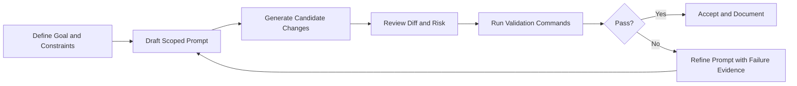
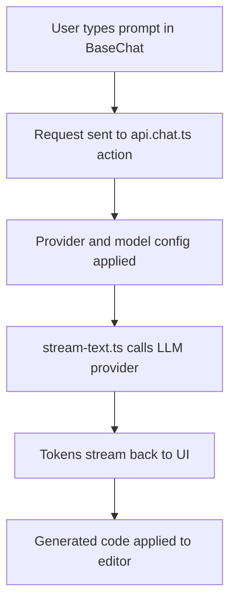

# Chapter 4: Prompt-to-App Workflow

Welcome to **Chapter 4: Prompt-to-App Workflow**. In this part of **bolt.diy Tutorial: Build and Operate an Open Source AI App Builder**, you will build an intuitive mental model first, then move into concrete implementation details and practical production tradeoffs.


This chapter explains how to transform natural-language intent into deterministic, reviewable product changes.

## The Core Principle

A high-quality bolt.diy workflow is not "prompt and pray". It is a controlled loop:

1. define target outcome
2. constrain scope
3. generate minimal patch
4. validate with commands
5. iterate using evidence

## Workflow Diagram


```mermaid
flowchart LR
    A[Define Goal and Constraints] --> B[Draft Scoped Prompt]
    B --> C[Generate Candidate Changes]
    C --> D[Review Diff and Risk]
    D --> E[Run Validation Commands]
    E --> F{Pass?}
    F -- Yes --> G[Accept and Document]
    F -- No --> H[Refine Prompt with Failure Evidence]
    H --> B
```

## Prompt Contract Template

Use this structure for most tasks:

```text
Goal:
Scope (allowed files/directories):
Non-goals (must not change):
Expected behavior:
Validation command(s):
Definition of done:
```

This simple template dramatically reduces drift.

## Good vs Bad Prompt Example

### Weak prompt

```text
Improve auth flow.
```

Problems:

- no scope
- no expected behavior
- no validation command

### Strong prompt

```text
Refactor token refresh handling in src/auth/session.ts only.
Do not modify routing or UI components.
Maintain current public API.
Run npm test -- auth-session.
Return changed files and test result summary.
```

Benefits:

- bounded file surface
- explicit constraints
- deterministic acceptance criteria

## Iteration Strategy for Large Features

For multi-step work, break into milestones:

1. scaffold interfaces only
2. implement one subsystem
3. run targeted tests
4. integrate cross-module wiring
5. run broader validation

Never request architecture redesign and production bugfix in the same first prompt.

## Evidence-Driven Correction Loop

When output is wrong, avoid vague feedback like "still broken".

Provide:

- failing command output
- exact expected behavior
- explicit file/function targets
- what should remain unchanged

This creates focused rework rather than broad retries.

## Acceptance Gates

| Gate | Question |
|:-----|:---------|
| scope gate | Did changes stay inside allowed files? |
| behavior gate | Does output satisfy stated goal? |
| safety gate | Any hidden config/auth/security impact? |
| validation gate | Did specified commands pass? |
| clarity gate | Is summary sufficient for reviewer handoff? |

## Team Prompt Standards

If multiple engineers share bolt.diy, standardize:

- one prompt template
- one summary format
- one minimal evidence format (command + result)
- one escalation path for risky changes

Consistency matters more than perfect wording.

## Common Failure Patterns

### Pattern: Over-scoped edits

Symptom: unrelated files modified.

Fix: tighten scope and explicitly forbid unrelated directories.

### Pattern: Repeated patch churn

Symptom: same issue reappears across iterations.

Fix: include exact failing evidence and force minimal patch objective.

### Pattern: Noisy summaries

Symptom: hard to review what changed.

Fix: require per-file summary plus pass/fail results.

## Chapter Summary

You now have a deterministic prompt-to-app method:

- explicit prompt contracts
- milestone-based iteration
- evidence-driven correction
- consistent acceptance gates

Next: [Chapter 5: Files, Diff, and Locking](05-files-diff-locking.md)

## Source Code Walkthrough

### `app/routes/api.chat.ts`

The `action` export in [`app/routes/api.chat.ts`](https://github.com/stackblitz-labs/bolt.diy/blob/HEAD/app/routes/api.chat.ts) is the server-side handler for chat requests. Every prompt submitted through the bolt.diy UI passes through this route. It receives the conversation messages, the selected provider/model, and any constraints from the client, then delegates to the streaming LLM layer.

Understanding this file is key to tracing how a user's prompt becomes a model request, and where you can insert logging, validation, or budget-cap logic before the model call.

### `app/lib/llm/stream-text.ts`

The streaming layer in [`app/lib/llm/stream-text.ts`](https://github.com/stackblitz-labs/bolt.diy/blob/HEAD/app/lib/llm/stream-text.ts) handles the actual LLM call and streams tokens back to the client. It wraps the AI SDK's `streamText` function and applies provider-specific configuration.

This is where the prompt-to-response pipeline executes. For the prompt-to-app workflow, this is the boundary between "what the user asked" and "what the model generates" — the right place to add timeout controls, stream error recovery, or cost accounting.

### `app/components/chat/BaseChat.tsx`

The `BaseChat` component in [`app/components/chat/BaseChat.tsx`](https://github.com/stackblitz-labs/bolt.diy/blob/HEAD/app/components/chat/BaseChat.tsx) is the primary UI container for the prompt input and conversation display. It manages the message list, the input field, and sends requests to `api.chat`.

For the prompt-to-app workflow, this component defines the user-facing contract: what the user types, how constraints are surfaced, and how the generated output is streamed back into the editor.

## How These Components Connect


```mermaid
flowchart TD
    A[User types prompt in BaseChat]
    B[Request sent to api.chat.ts action]
    C[Provider and model config applied]
    D[stream-text.ts calls LLM provider]
    E[Tokens stream back to UI]
    F[Generated code applied to editor]
    A --> B
    B --> C
    C --> D
    D --> E
    E --> F
```
