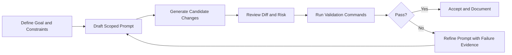
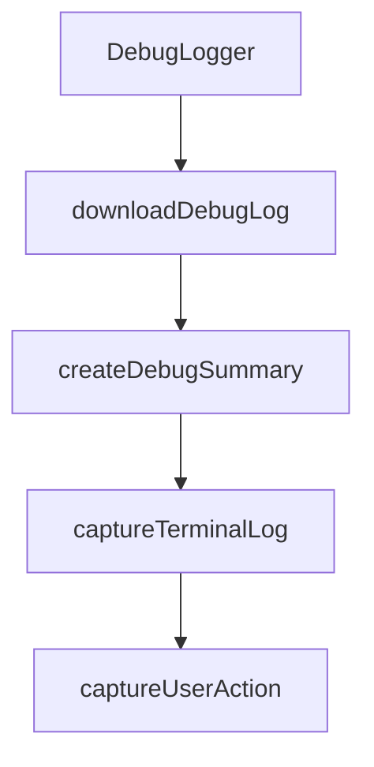

# Chapter 4: Prompt-to-App Workflow

Welcome to **Chapter 4: Prompt-to-App Workflow**. In this part of **bolt.diy Tutorial: Build and Operate an Open Source AI App Builder**, you will build an intuitive mental model first, then move into concrete implementation details and practical production tradeoffs.


This chapter explains how to transform natural-language intent into deterministic, reviewable product changes.

## The Core Principle

A high-quality bolt.diy workflow is not "prompt and pray". It is a controlled loop:

1. define target outcome
2. constrain scope
3. generate minimal patch
4. validate with commands
5. iterate using evidence

## Workflow Diagram


```mermaid
flowchart LR
    A[Define Goal and Constraints] --> B[Draft Scoped Prompt]
    B --> C[Generate Candidate Changes]
    C --> D[Review Diff and Risk]
    D --> E[Run Validation Commands]
    E --> F{Pass?}
    F -- Yes --> G[Accept and Document]
    F -- No --> H[Refine Prompt with Failure Evidence]
    H --> B
```

## Prompt Contract Template

Use this structure for most tasks:

```text
Goal:
Scope (allowed files/directories):
Non-goals (must not change):
Expected behavior:
Validation command(s):
Definition of done:
```

This simple template dramatically reduces drift.

## Good vs Bad Prompt Example

### Weak prompt

```text
Improve auth flow.
```

Problems:

- no scope
- no expected behavior
- no validation command

### Strong prompt

```text
Refactor token refresh handling in src/auth/session.ts only.
Do not modify routing or UI components.
Maintain current public API.
Run npm test -- auth-session.
Return changed files and test result summary.
```

Benefits:

- bounded file surface
- explicit constraints
- deterministic acceptance criteria

## Iteration Strategy for Large Features

For multi-step work, break into milestones:

1. scaffold interfaces only
2. implement one subsystem
3. run targeted tests
4. integrate cross-module wiring
5. run broader validation

Never request architecture redesign and production bugfix in the same first prompt.

## Evidence-Driven Correction Loop

When output is wrong, avoid vague feedback like "still broken".

Provide:

- failing command output
- exact expected behavior
- explicit file/function targets
- what should remain unchanged

This creates focused rework rather than broad retries.

## Acceptance Gates

| Gate | Question |
|:-----|:---------|
| scope gate | Did changes stay inside allowed files? |
| behavior gate | Does output satisfy stated goal? |
| safety gate | Any hidden config/auth/security impact? |
| validation gate | Did specified commands pass? |
| clarity gate | Is summary sufficient for reviewer handoff? |

## Team Prompt Standards

If multiple engineers share bolt.diy, standardize:

- one prompt template
- one summary format
- one minimal evidence format (command + result)
- one escalation path for risky changes

Consistency matters more than perfect wording.

## Common Failure Patterns

### Pattern: Over-scoped edits

Symptom: unrelated files modified.

Fix: tighten scope and explicitly forbid unrelated directories.

### Pattern: Repeated patch churn

Symptom: same issue reappears across iterations.

Fix: include exact failing evidence and force minimal patch objective.

### Pattern: Noisy summaries

Symptom: hard to review what changed.

Fix: require per-file summary plus pass/fail results.

## Chapter Summary

You now have a deterministic prompt-to-app method:

- explicit prompt contracts
- milestone-based iteration
- evidence-driven correction
- consistent acceptance gates

Next: [Chapter 5: Files, Diff, and Locking](05-files-diff-locking.md)

## Depth Expansion Playbook

## Source Code Walkthrough

### `app/utils/debugLogger.ts`

The `DebugLogger` class in [`app/utils/debugLogger.ts`](https://github.com/stackblitz-labs/bolt.diy/blob/HEAD/app/utils/debugLogger.ts) handles a key part of this chapter's functionality:

```ts

// Configuration interface for debug logger
export interface DebugLoggerConfig {
  enabled: boolean;
  maxEntries: number;
  captureConsole: boolean;
  captureNetwork: boolean;
  captureErrors: boolean;
  debounceTerminal: number; // ms
}

// Circular buffer implementation for memory efficiency
class CircularBuffer<T> {
  private _buffer: (T | undefined)[];
  private _head = 0;
  private _tail = 0;
  private _size = 0;

  constructor(private _capacity: number) {
    this._buffer = new Array(_capacity);
  }

  push(item: T): void {
    this._buffer[this._tail] = item;
    this._tail = (this._tail + 1) % this._capacity;

    if (this._size < this._capacity) {
      this._size++;
    } else {
      this._head = (this._head + 1) % this._capacity;
    }
  }
```

This class is important because it defines how bolt.diy Tutorial: Build and Operate an Open Source AI App Builder implements the patterns covered in this chapter.

### `app/utils/debugLogger.ts`

The `downloadDebugLog` function in [`app/utils/debugLogger.ts`](https://github.com/stackblitz-labs/bolt.diy/blob/HEAD/app/utils/debugLogger.ts) handles a key part of this chapter's functionality:

```ts

// Helper function to download debug log
export async function downloadDebugLog(filename?: string): Promise<void> {
  try {
    const debugData = await debugLogger.generateDebugLog();

    // Create a formatted summary
    const summary = createDebugSummary(debugData);
    const fullContent = `${summary}\n\n=== DETAILED DEBUG DATA ===\n\n${JSON.stringify(debugData, null, 2)}`;

    const blob = new Blob([fullContent], { type: 'text/plain' });
    const url = URL.createObjectURL(blob);

    const link = document.createElement('a');
    link.href = url;
    link.download = filename || `bolt-debug-${new Date().toISOString().split('T')[0]}.txt`;
    document.body.appendChild(link);
    link.click();
    document.body.removeChild(link);

    URL.revokeObjectURL(url);

    logger.info('Debug log downloaded successfully');
  } catch (error) {
    logger.error('Failed to download debug log:', error);
  }
}

// Create a human-readable summary of the debug data
function createDebugSummary(data: DebugLogData): string {
  const summary = [
    '=== BOLT DIY DEBUG LOG SUMMARY ===',
```

This function is important because it defines how bolt.diy Tutorial: Build and Operate an Open Source AI App Builder implements the patterns covered in this chapter.

### `app/utils/debugLogger.ts`

The `createDebugSummary` function in [`app/utils/debugLogger.ts`](https://github.com/stackblitz-labs/bolt.diy/blob/HEAD/app/utils/debugLogger.ts) handles a key part of this chapter's functionality:

```ts

    // Create a formatted summary
    const summary = createDebugSummary(debugData);
    const fullContent = `${summary}\n\n=== DETAILED DEBUG DATA ===\n\n${JSON.stringify(debugData, null, 2)}`;

    const blob = new Blob([fullContent], { type: 'text/plain' });
    const url = URL.createObjectURL(blob);

    const link = document.createElement('a');
    link.href = url;
    link.download = filename || `bolt-debug-${new Date().toISOString().split('T')[0]}.txt`;
    document.body.appendChild(link);
    link.click();
    document.body.removeChild(link);

    URL.revokeObjectURL(url);

    logger.info('Debug log downloaded successfully');
  } catch (error) {
    logger.error('Failed to download debug log:', error);
  }
}

// Create a human-readable summary of the debug data
function createDebugSummary(data: DebugLogData): string {
  const summary = [
    '=== BOLT DIY DEBUG LOG SUMMARY ===',
    `Generated: ${new Date(data.timestamp).toLocaleString()}`,
    `Session ID: ${data.sessionId}`,
    '',
    '=== SYSTEM INFORMATION ===',
    `Platform: ${data.systemInfo.platform}`,
```

This function is important because it defines how bolt.diy Tutorial: Build and Operate an Open Source AI App Builder implements the patterns covered in this chapter.

### `app/utils/debugLogger.ts`

The `captureTerminalLog` function in [`app/utils/debugLogger.ts`](https://github.com/stackblitz-labs/bolt.diy/blob/HEAD/app/utils/debugLogger.ts) handles a key part of this chapter's functionality:

```ts
  }

  captureTerminalLog(entry: TerminalEntry): void {
    try {
      // Debounce terminal logs to prevent spam
      if (this._config.debounceTerminal > 0) {
        this._terminalLogQueue.push(entry);

        if (this._terminalLogTimer) {
          clearTimeout(this._terminalLogTimer);
        }

        this._terminalLogTimer = setTimeout(() => {
          this._flushTerminalLogs();
        }, this._config.debounceTerminal);
      } else {
        this._terminalLogs.push(entry);
      }
    } catch (error) {
      console.error('Debug logger failed to capture terminal log:', error);
    }
  }

  private _flushTerminalLogs(): void {
    try {
      while (this._terminalLogQueue.length > 0) {
        const entry = this._terminalLogQueue.shift();

        if (entry) {
          this._terminalLogs.push(entry);
        }
      }
```

This function is important because it defines how bolt.diy Tutorial: Build and Operate an Open Source AI App Builder implements the patterns covered in this chapter.


## How These Components Connect


```mermaid
flowchart TD
    A[DebugLogger]
    B[downloadDebugLog]
    C[createDebugSummary]
    D[captureTerminalLog]
    E[captureUserAction]
    A --> B
    B --> C
    C --> D
    D --> E
```
