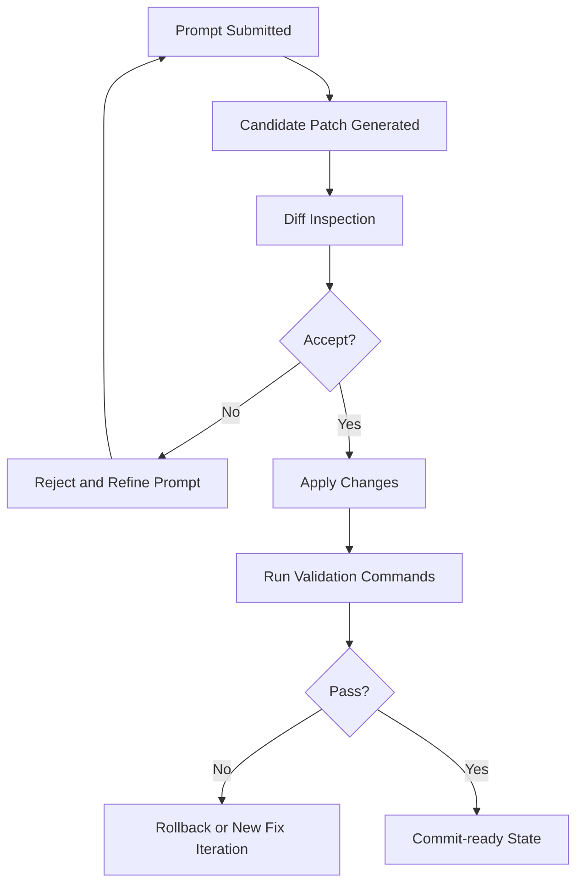

# Chapter 5: Files, Diff, and Locking

This chapter focuses on the most important safety layer in AI-assisted coding: how generated edits are reviewed, constrained, and reversible.

## Why This Layer Is Critical

Model quality can still produce:

- logically plausible but incorrect changes
- unintended edits in adjacent files
- silent config or security regressions

Diff review and file controls are your primary defenses.

## Safe Edit Lifecycle

## High-Risk File Categories

Lock or require elevated review for:

- authentication and authorization modules
- environment/config loaders
- deployment and infra descriptors
- billing/usage logic
- security-sensitive integrations

Treat these as protected zones in team workflows.

## Diff Review Rubric

| Lens | Review Question |
|:-----|:----------------|
| Scope | Are only intended files touched? |
| Intent | Does each hunk map to prompt objective? |
| Side effects | Could this alter unrelated behavior? |
| Security | Any new secret handling, unsafe defaults, or auth drift? |
| Testability | Is there clear command evidence for correctness? |

## Reject Conditions (Non-Negotiable)

Reject the patch when any of these occur:

- unrelated file modifications
- unexplained dependency or build config edits
- broad formatting churn hiding logic changes
- validation command omitted or failing
- summary does not explain risky hunks

## Snapshot and Rollback Strategy

Before large edits, capture a rollback point.

Recommended snapshot triggers:

- multi-directory changes
- migration or schema modifications
- provider/config policy edits
- security-sensitive code changes

Rollback is not failure; it is controlled experimentation.

## Suggested Team Policy

1. every accepted patch must include validation evidence
2. critical-file edits need second reviewer or stricter approval
3. no direct acceptance for multi-file high-risk changes
4. run post-accept smoke checks before merge

## Practical Diff Triage Pattern

When a patch is large:

1. group hunks by subsystem
2. review highest-risk files first
3. validate compile/tests after each accepted group
4. reject and split if risk cannot be reasoned about quickly

This keeps review human-scale.

## Auditability Minimum Standard

For each accepted task, retain:

- prompt intent summary
- changed file list
- validation commands and outcomes
- rollback reference (if used)

This helps incident response and long-term quality analysis.

## Chapter Summary

You now have a robust governance model for generated edits:

- diff-first acceptance
- protected file strategy
- rollback discipline
- audit-ready review evidence

Next: [Chapter 6: Integrations and MCP](06-integrations-and-mcp.md)
