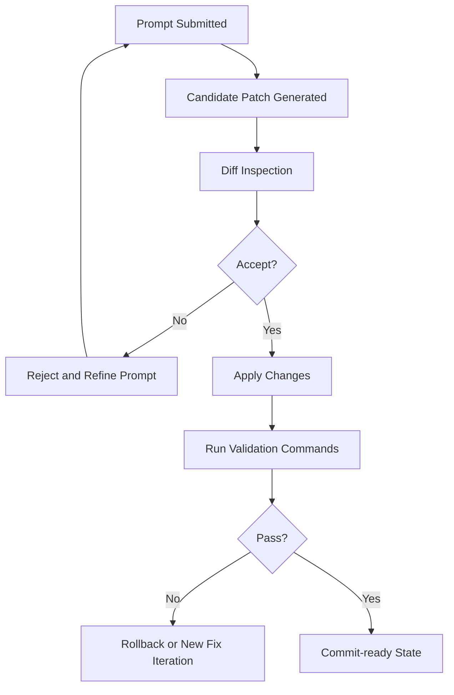
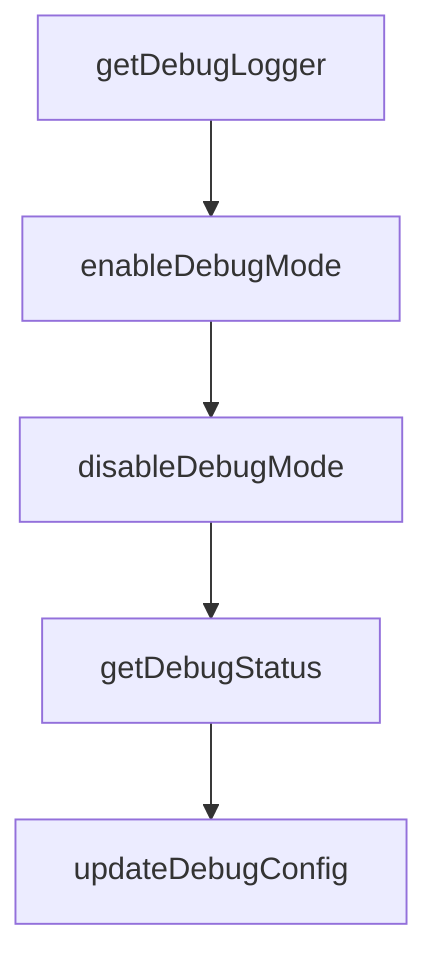

# Chapter 5: Files, Diff, and Locking

Welcome to **Chapter 5: Files, Diff, and Locking**. In this part of **bolt.diy Tutorial: Build and Operate an Open Source AI App Builder**, you will build an intuitive mental model first, then move into concrete implementation details and practical production tradeoffs.


This chapter focuses on the most important safety layer in AI-assisted coding: how generated edits are reviewed, constrained, and reversible.

## Why This Layer Is Critical

Model quality can still produce:

- logically plausible but incorrect changes
- unintended edits in adjacent files
- silent config or security regressions

Diff review and file controls are your primary defenses.

## Safe Edit Lifecycle


```mermaid
flowchart TD
    A[Prompt Submitted] --> B[Candidate Patch Generated]
    B --> C[Diff Inspection]
    C --> D{Accept?}
    D -- No --> E[Reject and Refine Prompt]
    E --> A
    D -- Yes --> F[Apply Changes]
    F --> G[Run Validation Commands]
    G --> H{Pass?}
    H -- No --> I[Rollback or New Fix Iteration]
    H -- Yes --> J[Commit-ready State]
```

## High-Risk File Categories

Lock or require elevated review for:

- authentication and authorization modules
- environment/config loaders
- deployment and infra descriptors
- billing/usage logic
- security-sensitive integrations

Treat these as protected zones in team workflows.

## Diff Review Rubric

| Lens | Review Question |
|:-----|:----------------|
| Scope | Are only intended files touched? |
| Intent | Does each hunk map to prompt objective? |
| Side effects | Could this alter unrelated behavior? |
| Security | Any new secret handling, unsafe defaults, or auth drift? |
| Testability | Is there clear command evidence for correctness? |

## Reject Conditions (Non-Negotiable)

Reject the patch when any of these occur:

- unrelated file modifications
- unexplained dependency or build config edits
- broad formatting churn hiding logic changes
- validation command omitted or failing
- summary does not explain risky hunks

## Snapshot and Rollback Strategy

Before large edits, capture a rollback point.

Recommended snapshot triggers:

- multi-directory changes
- migration or schema modifications
- provider/config policy edits
- security-sensitive code changes

Rollback is not failure; it is controlled experimentation.

## Suggested Team Policy

1. every accepted patch must include validation evidence
2. critical-file edits need second reviewer or stricter approval
3. no direct acceptance for multi-file high-risk changes
4. run post-accept smoke checks before merge

## Practical Diff Triage Pattern

When a patch is large:

1. group hunks by subsystem
2. review highest-risk files first
3. validate compile/tests after each accepted group
4. reject and split if risk cannot be reasoned about quickly

This keeps review human-scale.

## Auditability Minimum Standard

For each accepted task, retain:

- prompt intent summary
- changed file list
- validation commands and outcomes
- rollback reference (if used)

This helps incident response and long-term quality analysis.

## Chapter Summary

You now have a robust governance model for generated edits:

- diff-first acceptance
- protected file strategy
- rollback discipline
- audit-ready review evidence

Next: [Chapter 6: Integrations and MCP](06-integrations-and-mcp.md)

## Depth Expansion Playbook

## Source Code Walkthrough

### `app/utils/debugLogger.ts`

The `getDebugLogger` function in [`app/utils/debugLogger.ts`](https://github.com/stackblitz-labs/bolt.diy/blob/HEAD/app/utils/debugLogger.ts) handles a key part of this chapter's functionality:

```ts
}

export function getDebugLogger(): DebugLogger {
  return debugLogger;
}

// Utility function to enable debug mode on demand
export function enableDebugMode(): void {
  debugLogger.enableDebugMode();
}

// Utility function to disable debug mode
export function disableDebugMode(): void {
  debugLogger.disableDebugMode();
}

// Utility function to get debug logger status
export function getDebugStatus(): { initialized: boolean; capturing: boolean; enabled: boolean } {
  return debugLogger.getStatus();
}

// Utility function to update debug configuration
export function updateDebugConfig(config: Partial<DebugLoggerConfig>): void {
  debugLogger.updateConfig(config);
}

// Initialize debug logger when this module is imported
if (typeof window !== 'undefined') {
  // Defer initialization to avoid blocking
  setTimeout(() => {
    debugLogger.initialize();
  }, 0);
```

This function is important because it defines how bolt.diy Tutorial: Build and Operate an Open Source AI App Builder implements the patterns covered in this chapter.

### `app/utils/debugLogger.ts`

The `enableDebugMode` function in [`app/utils/debugLogger.ts`](https://github.com/stackblitz-labs/bolt.diy/blob/HEAD/app/utils/debugLogger.ts) handles a key part of this chapter's functionality:

```ts

  // Public method to enable debug logging on demand
  enableDebugMode(): void {
    this._config.enabled = true;

    if (!this._isInitialized) {
      this.initialize();
    } else if (!this._isCapturing) {
      this.startCapture();
    }
  }

  // Public method to disable debug logging
  disableDebugMode(): void {
    this.stopCapture();
  }

  // Get current status
  getStatus(): { initialized: boolean; capturing: boolean; enabled: boolean } {
    return {
      initialized: this._isInitialized,
      capturing: this._isCapturing,
      enabled: this._config.enabled,
    };
  }

  // Update configuration
  updateConfig(newConfig: Partial<DebugLoggerConfig>): void {
    const wasCapturing = this._isCapturing;

    if (wasCapturing) {
      this.stopCapture();
```

This function is important because it defines how bolt.diy Tutorial: Build and Operate an Open Source AI App Builder implements the patterns covered in this chapter.

### `app/utils/debugLogger.ts`

The `disableDebugMode` function in [`app/utils/debugLogger.ts`](https://github.com/stackblitz-labs/bolt.diy/blob/HEAD/app/utils/debugLogger.ts) handles a key part of this chapter's functionality:

```ts

  // Public method to disable debug logging
  disableDebugMode(): void {
    this.stopCapture();
  }

  // Get current status
  getStatus(): { initialized: boolean; capturing: boolean; enabled: boolean } {
    return {
      initialized: this._isInitialized,
      capturing: this._isCapturing,
      enabled: this._config.enabled,
    };
  }

  // Update configuration
  updateConfig(newConfig: Partial<DebugLoggerConfig>): void {
    const wasCapturing = this._isCapturing;

    if (wasCapturing) {
      this.stopCapture();
    }

    this._config = { ...this._config, ...newConfig };

    // Recreate buffers if maxEntries changed
    if (newConfig.maxEntries && newConfig.maxEntries !== this._config.maxEntries) {
      const oldLogs = this._logs.toArray();
      const oldErrors = this._errors.toArray();
      const oldNetworkRequests = this._networkRequests.toArray();
      const oldUserActions = this._userActions.toArray();
      const oldTerminalLogs = this._terminalLogs.toArray();
```

This function is important because it defines how bolt.diy Tutorial: Build and Operate an Open Source AI App Builder implements the patterns covered in this chapter.

### `app/utils/debugLogger.ts`

The `getDebugStatus` function in [`app/utils/debugLogger.ts`](https://github.com/stackblitz-labs/bolt.diy/blob/HEAD/app/utils/debugLogger.ts) handles a key part of this chapter's functionality:

```ts

// Utility function to get debug logger status
export function getDebugStatus(): { initialized: boolean; capturing: boolean; enabled: boolean } {
  return debugLogger.getStatus();
}

// Utility function to update debug configuration
export function updateDebugConfig(config: Partial<DebugLoggerConfig>): void {
  debugLogger.updateConfig(config);
}

// Initialize debug logger when this module is imported
if (typeof window !== 'undefined') {
  // Defer initialization to avoid blocking
  setTimeout(() => {
    debugLogger.initialize();
  }, 0);
}

```

This function is important because it defines how bolt.diy Tutorial: Build and Operate an Open Source AI App Builder implements the patterns covered in this chapter.


## How These Components Connect


```mermaid
flowchart TD
    A[getDebugLogger]
    B[enableDebugMode]
    C[disableDebugMode]
    D[getDebugStatus]
    E[updateDebugConfig]
    A --> B
    B --> C
    C --> D
    D --> E
```
