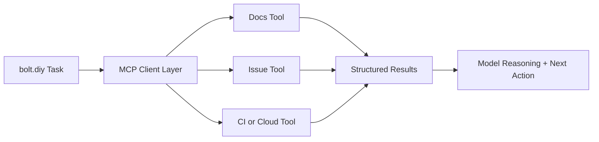

# Chapter 6: Integrations and MCP

bolt.diy becomes significantly more useful when it can interact with your surrounding systems: issue trackers, docs, deployment APIs, and data platforms.

This chapter covers how to integrate those systems safely.

## Integration Categories

| Category | Typical Examples | Risk Profile |
|:---------|:-----------------|:-------------|
| read-only knowledge | docs search, ticket lookup, runbook retrieval | low |
| operational actions | CI trigger, deploy command, cache purge | medium/high |
| data mutation | database writes, external API state changes | high |
| privileged infra controls | production scaling, credential operations | very high |

Start low-risk, then expand.

## MCP in the Workflow

Model Context Protocol (MCP) provides a standard way to expose tools with explicit interfaces.

## Tool Contract Requirements

Define every integration with strict contracts.

| Contract Element | Requirement |
|:-----------------|:------------|
| input schema | typed and validated |
| output schema | structured and deterministic |
| side effects | explicit read-only vs mutating |
| errors | machine-readable with actionable codes |
| timeout/retry | bounded and documented |

Loose contracts create brittle behavior and unsafe guesses.

## Rollout Sequence

1. onboard read-only tools first
2. test output quality in real tasks
3. add mutating actions behind explicit approvals
4. log all mutating calls with actor + timestamp
5. periodically prune low-value or noisy tools

## Supabase and Backend Integrations

bolt.diy documentation references Supabase integration as one common backend path. Regardless of backend choice, follow the same principles:

- use environment-scoped credentials
- separate read and write capabilities where possible
- avoid exposing privileged keys in client runtime
- enforce operation-level observability

## Secrets and Access Boundaries

### Minimum controls

- no plaintext secrets in prompt history
- separate credentials for dev/stage/prod
- rotate integration credentials on schedule
- emergency kill switch for unstable integrations

### Recommended controls

- least-privilege tokens per tool
- policy checks before mutating calls
- structured audit logs for compliance

## Failure Handling

When integrations fail, return deterministic errors such as:

- `AUTH_ERROR`
- `TIMEOUT`
- `RATE_LIMIT`
- `VALIDATION_ERROR`
- `UPSTREAM_UNAVAILABLE`

This prevents the model from inventing next steps.

## Anti-Patterns to Avoid

- single "mega tool" doing unrelated operations
- undocumented side effects
- permissive production mutation by default
- tool retries with no upper bound

## Integration Readiness Checklist

- schemas defined and validated
- mutating tools approval-gated
- auth scopes minimized
- error behavior documented
- incident disable path tested

## Chapter Summary

You now have a practical integration strategy for bolt.diy:

- MCP-centered tool contracts
- staged rollout from read-only to mutating actions
- secret and permission boundaries
- predictable failure handling and observability

Next: [Chapter 7: Deployment and Distribution](07-deployment-distribution.md)
