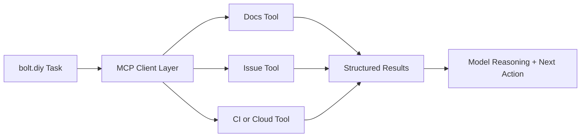
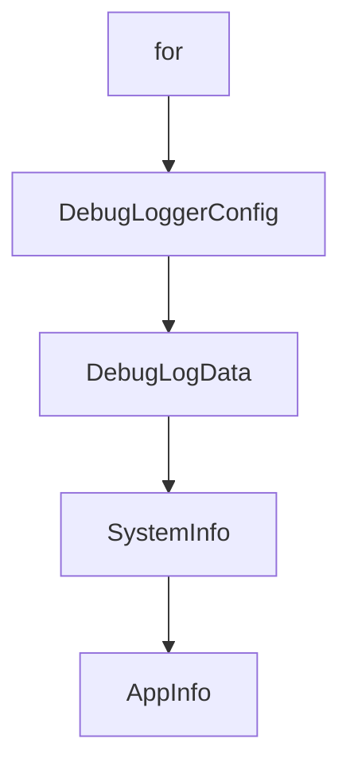

# Chapter 6: Integrations and MCP

Welcome to **Chapter 6: Integrations and MCP**. In this part of **bolt.diy Tutorial: Build and Operate an Open Source AI App Builder**, you will build an intuitive mental model first, then move into concrete implementation details and practical production tradeoffs.


bolt.diy becomes significantly more useful when it can interact with your surrounding systems: issue trackers, docs, deployment APIs, and data platforms.

This chapter covers how to integrate those systems safely.

## Integration Categories

| Category | Typical Examples | Risk Profile |
|:---------|:-----------------|:-------------|
| read-only knowledge | docs search, ticket lookup, runbook retrieval | low |
| operational actions | CI trigger, deploy command, cache purge | medium/high |
| data mutation | database writes, external API state changes | high |
| privileged infra controls | production scaling, credential operations | very high |

Start low-risk, then expand.

## MCP in the Workflow

Model Context Protocol (MCP) provides a standard way to expose tools with explicit interfaces.


```mermaid
flowchart LR
    A[bolt.diy Task] --> B[MCP Client Layer]
    B --> C1[Docs Tool]
    B --> C2[Issue Tool]
    B --> C3[CI or Cloud Tool]
    C1 --> D[Structured Results]
    C2 --> D
    C3 --> D
    D --> E[Model Reasoning + Next Action]
```

## Tool Contract Requirements

Define every integration with strict contracts.

| Contract Element | Requirement |
|:-----------------|:------------|
| input schema | typed and validated |
| output schema | structured and deterministic |
| side effects | explicit read-only vs mutating |
| errors | machine-readable with actionable codes |
| timeout/retry | bounded and documented |

Loose contracts create brittle behavior and unsafe guesses.

## Rollout Sequence

1. onboard read-only tools first
2. test output quality in real tasks
3. add mutating actions behind explicit approvals
4. log all mutating calls with actor + timestamp
5. periodically prune low-value or noisy tools

## Supabase and Backend Integrations

bolt.diy documentation references Supabase integration as one common backend path. Regardless of backend choice, follow the same principles:

- use environment-scoped credentials
- separate read and write capabilities where possible
- avoid exposing privileged keys in client runtime
- enforce operation-level observability

## Secrets and Access Boundaries

### Minimum controls

- no plaintext secrets in prompt history
- separate credentials for dev/stage/prod
- rotate integration credentials on schedule
- emergency kill switch for unstable integrations

### Recommended controls

- least-privilege tokens per tool
- policy checks before mutating calls
- structured audit logs for compliance

## Failure Handling

When integrations fail, return deterministic errors such as:

- `AUTH_ERROR`
- `TIMEOUT`
- `RATE_LIMIT`
- `VALIDATION_ERROR`
- `UPSTREAM_UNAVAILABLE`

This prevents the model from inventing next steps.

## Anti-Patterns to Avoid

- single "mega tool" doing unrelated operations
- undocumented side effects
- permissive production mutation by default
- tool retries with no upper bound

## Integration Readiness Checklist

- schemas defined and validated
- mutating tools approval-gated
- auth scopes minimized
- error behavior documented
- incident disable path tested

## Chapter Summary

You now have a practical integration strategy for bolt.diy:

- MCP-centered tool contracts
- staged rollout from read-only to mutating actions
- secret and permission boundaries
- predictable failure handling and observability

Next: [Chapter 7: Deployment and Distribution](07-deployment-distribution.md)

## Depth Expansion Playbook

## Source Code Walkthrough

### `app/utils/debugLogger.ts`

The `for` interface in [`app/utils/debugLogger.ts`](https://github.com/stackblitz-labs/bolt.diy/blob/HEAD/app/utils/debugLogger.ts) handles a key part of this chapter's functionality:

```ts
};

// Configuration interface for debug logger
export interface DebugLoggerConfig {
  enabled: boolean;
  maxEntries: number;
  captureConsole: boolean;
  captureNetwork: boolean;
  captureErrors: boolean;
  debounceTerminal: number; // ms
}

// Circular buffer implementation for memory efficiency
class CircularBuffer<T> {
  private _buffer: (T | undefined)[];
  private _head = 0;
  private _tail = 0;
  private _size = 0;

  constructor(private _capacity: number) {
    this._buffer = new Array(_capacity);
  }

  push(item: T): void {
    this._buffer[this._tail] = item;
    this._tail = (this._tail + 1) % this._capacity;

    if (this._size < this._capacity) {
      this._size++;
    } else {
      this._head = (this._head + 1) % this._capacity;
    }
```

This interface is important because it defines how bolt.diy Tutorial: Build and Operate an Open Source AI App Builder implements the patterns covered in this chapter.

### `app/utils/debugLogger.ts`

The `DebugLoggerConfig` interface in [`app/utils/debugLogger.ts`](https://github.com/stackblitz-labs/bolt.diy/blob/HEAD/app/utils/debugLogger.ts) handles a key part of this chapter's functionality:

```ts

// Configuration interface for debug logger
export interface DebugLoggerConfig {
  enabled: boolean;
  maxEntries: number;
  captureConsole: boolean;
  captureNetwork: boolean;
  captureErrors: boolean;
  debounceTerminal: number; // ms
}

// Circular buffer implementation for memory efficiency
class CircularBuffer<T> {
  private _buffer: (T | undefined)[];
  private _head = 0;
  private _tail = 0;
  private _size = 0;

  constructor(private _capacity: number) {
    this._buffer = new Array(_capacity);
  }

  push(item: T): void {
    this._buffer[this._tail] = item;
    this._tail = (this._tail + 1) % this._capacity;

    if (this._size < this._capacity) {
      this._size++;
    } else {
      this._head = (this._head + 1) % this._capacity;
    }
  }
```

This interface is important because it defines how bolt.diy Tutorial: Build and Operate an Open Source AI App Builder implements the patterns covered in this chapter.

### `app/utils/debugLogger.ts`

The `DebugLogData` interface in [`app/utils/debugLogger.ts`](https://github.com/stackblitz-labs/bolt.diy/blob/HEAD/app/utils/debugLogger.ts) handles a key part of this chapter's functionality:

```ts
}

export interface DebugLogData {
  timestamp: string;
  sessionId: string;
  systemInfo: SystemInfo;
  appInfo: AppInfo;
  logs: LogEntry[];
  errors: ErrorEntry[];
  networkRequests: NetworkEntry[];
  performance: PerformanceEntry;
  state: StateEntry;
  userActions: UserActionEntry[];
  terminalLogs: TerminalEntry[];
}

export interface SystemInfo {
  platform: string;
  userAgent: string;
  screenResolution: string;
  viewportSize: string;
  isMobile: boolean;
  timezone: string;
  language: string;
  cookiesEnabled: boolean;
  localStorageEnabled: boolean;
  sessionStorageEnabled: boolean;
}

export interface AppInfo {
  version: string;
  buildTime: string;
```

This interface is important because it defines how bolt.diy Tutorial: Build and Operate an Open Source AI App Builder implements the patterns covered in this chapter.

### `app/utils/debugLogger.ts`

The `SystemInfo` interface in [`app/utils/debugLogger.ts`](https://github.com/stackblitz-labs/bolt.diy/blob/HEAD/app/utils/debugLogger.ts) handles a key part of this chapter's functionality:

```ts
  timestamp: string;
  sessionId: string;
  systemInfo: SystemInfo;
  appInfo: AppInfo;
  logs: LogEntry[];
  errors: ErrorEntry[];
  networkRequests: NetworkEntry[];
  performance: PerformanceEntry;
  state: StateEntry;
  userActions: UserActionEntry[];
  terminalLogs: TerminalEntry[];
}

export interface SystemInfo {
  platform: string;
  userAgent: string;
  screenResolution: string;
  viewportSize: string;
  isMobile: boolean;
  timezone: string;
  language: string;
  cookiesEnabled: boolean;
  localStorageEnabled: boolean;
  sessionStorageEnabled: boolean;
}

export interface AppInfo {
  version: string;
  buildTime: string;
  currentModel: string;
  currentProvider: string;
  projectType: string;
```

This interface is important because it defines how bolt.diy Tutorial: Build and Operate an Open Source AI App Builder implements the patterns covered in this chapter.


## How These Components Connect


```mermaid
flowchart TD
    A[for]
    B[DebugLoggerConfig]
    C[DebugLogData]
    D[SystemInfo]
    E[AppInfo]
    A --> B
    B --> C
    C --> D
    D --> E
```
