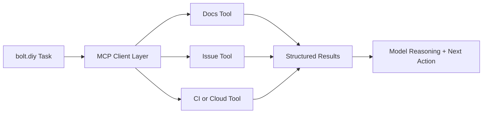
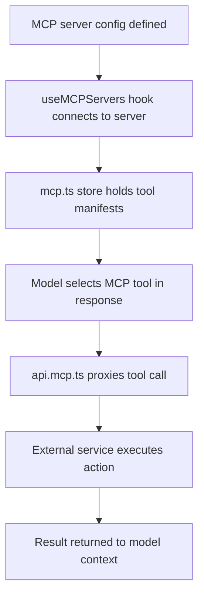

# Chapter 6: Integrations and MCP

Welcome to **Chapter 6: Integrations and MCP**. In this part of **bolt.diy Tutorial: Build and Operate an Open Source AI App Builder**, you will build an intuitive mental model first, then move into concrete implementation details and practical production tradeoffs.

bolt.diy becomes significantly more useful when it can interact with your surrounding systems: issue trackers, docs, deployment APIs, and data platforms.

This chapter covers how to integrate those systems safely.

## Integration Categories

| Category | Typical Examples | Risk Profile |
|:---------|:-----------------|:-------------|
| read-only knowledge | docs search, ticket lookup, runbook retrieval | low |
| operational actions | CI trigger, deploy command, cache purge | medium/high |
| data mutation | database writes, external API state changes | high |
| privileged infra controls | production scaling, credential operations | very high |

Start low-risk, then expand.

## MCP in the Workflow

Model Context Protocol (MCP) provides a standard way to expose tools with explicit interfaces.

```mermaid
flowchart LR
    A[bolt.diy Task] --> B[MCP Client Layer]
    B --> C1[Docs Tool]
    B --> C2[Issue Tool]
    B --> C3[CI or Cloud Tool]
    C1 --> D[Structured Results]
    C2 --> D
    C3 --> D
    D --> E[Model Reasoning + Next Action]
```

## Tool Contract Requirements

Define every integration with strict contracts.

| Contract Element | Requirement |
|:-----------------|:------------|
| input schema | typed and validated |
| output schema | structured and deterministic |
| side effects | explicit read-only vs mutating |
| errors | machine-readable with actionable codes |
| timeout/retry | bounded and documented |

Loose contracts create brittle behavior and unsafe guesses.

## Rollout Sequence

1. onboard read-only tools first
2. test output quality in real tasks
3. add mutating actions behind explicit approvals
4. log all mutating calls with actor + timestamp
5. periodically prune low-value or noisy tools

## Supabase and Backend Integrations

bolt.diy documentation references Supabase integration as one common backend path. Regardless of backend choice, follow the same principles:

- use environment-scoped credentials
- separate read and write capabilities where possible
- avoid exposing privileged keys in client runtime
- enforce operation-level observability

## Secrets and Access Boundaries

### Minimum controls

- no plaintext secrets in prompt history
- separate credentials for dev/stage/prod
- rotate integration credentials on schedule
- emergency kill switch for unstable integrations

### Recommended controls

- least-privilege tokens per tool
- policy checks before mutating calls
- structured audit logs for compliance

## Failure Handling

When integrations fail, return deterministic errors such as:

- `AUTH_ERROR`
- `TIMEOUT`
- `RATE_LIMIT`
- `VALIDATION_ERROR`
- `UPSTREAM_UNAVAILABLE`

This prevents the model from inventing next steps.

## Anti-Patterns to Avoid

- single "mega tool" doing unrelated operations
- undocumented side effects
- permissive production mutation by default
- tool retries with no upper bound

## Integration Readiness Checklist

- schemas defined and validated
- mutating tools approval-gated
- auth scopes minimized
- error behavior documented
- incident disable path tested

## Chapter Summary

You now have a practical integration strategy for bolt.diy:

- MCP-centered tool contracts
- staged rollout from read-only to mutating actions
- secret and permission boundaries
- predictable failure handling and observability

Next: [Chapter 7: Deployment and Distribution](07-deployment-distribution.md)

## Source Code Walkthrough

### `app/lib/hooks/useMCPServers.ts`

The `useMCPServers` hook in [`app/lib/hooks/useMCPServers.ts`](https://github.com/stackblitz-labs/bolt.diy/blob/HEAD/app/lib/hooks/useMCPServers.ts) manages the lifecycle of connected MCP servers: loading configured server definitions, connecting, and surfacing available tools to the chat layer.

This file is the primary entry point for understanding how bolt.diy discovers and registers external tools via MCP. When adding a new integration, you configure a server entry and this hook handles connection and tool enumeration.

### `app/routes/api.mcp.ts`

The MCP API route in [`app/routes/api.mcp.ts`](https://github.com/stackblitz-labs/bolt.diy/blob/HEAD/app/routes/api.mcp.ts) is the server-side handler for MCP operations. It proxies tool calls from the bolt.diy runtime to external MCP server processes, handling serialization and error propagation.

For integration governance, this route is the enforcement boundary: MCP tool calls pass through here, making it the right place to add logging, rate limiting, or approval gates before an external system is mutated.

### `app/lib/stores/mcp.ts`

The MCP store in [`app/lib/stores/mcp.ts`](https://github.com/stackblitz-labs/bolt.diy/blob/HEAD/app/lib/stores/mcp.ts) holds the in-memory state of MCP connections: which servers are registered, their connection status, and the tool manifests they expose.

For operational visibility — a requirement called out in this chapter's integration readiness checklist — this store is where you read current tool availability and emit connection health metrics.

## How These Components Connect

```mermaid
flowchart TD
    A[MCP server config defined]
    B[useMCPServers hook connects to server]
    C[mcp.ts store holds tool manifests]
    D[Model selects MCP tool in response]
    E[api.mcp.ts proxies tool call]
    F[External service executes action]
    G[Result returned to model context]
    A --> B
    B --> C
    C --> D
    D --> E
    E --> F
    F --> G
```
