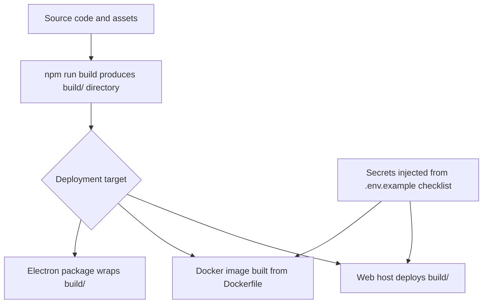

# Chapter 7: Deployment and Distribution

Welcome to **Chapter 7: Deployment and Distribution**. In this part of **bolt.diy Tutorial: Build and Operate an Open Source AI App Builder**, you will build an intuitive mental model first, then move into concrete implementation details and practical production tradeoffs.


bolt.diy supports multiple delivery targets. This chapter helps you select the right one for your audience, constraints, and operational maturity.

## Deployment Targets in Practice

Project documentation and scripts indicate support for:

- web deployment paths (for example Vercel, Netlify, GitHub Pages style workflows)
- containerized self-hosted runtime
- desktop distribution via Electron build flow

## Decision Matrix

| Target | Best For | Strengths | Tradeoffs |
|:-------|:---------|:----------|:----------|
| managed web hosting | internal demos and broad access | fastest sharing and iteration | tighter platform/runtime constraints |
| self-hosted Docker | security-conscious teams | runtime control and network policy alignment | higher ops overhead |
| desktop (Electron) | local-first users | local environment and offline-friendly workflows | update and packaging complexity |

## Pre-Deployment Hardening

Before shipping any target:

1. pin provider defaults and fallbacks
2. enforce environment-specific secret injection
3. run smoke tests for generation + diff + validation loop
4. document rollback command path

## Environment Strategy

Use explicit config partitions:

- `dev`: broad experimentation, low blast radius
- `stage`: production-like configuration for final validation
- `prod`: locked policies, guarded credentials, audit logging

Never reuse dev credentials in production.

## Container Path (Recommended Baseline for Teams)

A container baseline reduces machine drift and supports policy controls:

- versioned image build
- fixed runtime dependencies
- predictable startup scripts
- easier infra handoff to platform teams

### Container release checklist

- image pinned by digest/tag
- runtime env vars validated at startup
- health endpoint or smoke check available
- logs exported to central collector

## Web Deployment Path

Choose this when onboarding speed matters most.

Minimum controls:

- CI-gated deployment
- secret configuration in hosting platform
- environment-specific base URLs and provider settings
- rollback to prior release artifact

## Desktop Distribution Path

Electron workflows are useful for local-first operator experience.

Controls to add:

- signed artifact strategy where applicable
- update channel policy (stable/beta)
- runtime permission and secure storage review
- crash and telemetry visibility (privacy-aware)

## Release Process Template

```text
1) Cut release branch
2) Run docs + tests + smoke checks
3) Build target artifact (web/container/desktop)
4) Deploy to stage
5) Validate task loop end-to-end
6) Promote to production
7) Monitor for regressions and rollback triggers
```

## Rollback Design

For each target, define rollback before first production launch:

- web: previous deployment alias
- container: previous image tag + config set
- desktop: prior stable version and update channel fallback

## Chapter Summary

You now have a deployment framework that aligns target choice with:

- team maturity
- compliance and control needs
- operational cost and complexity

Next: [Chapter 8: Production Operations](08-production-operations.md)

## Source Code Walkthrough

### `Dockerfile`

The [`Dockerfile`](https://github.com/stackblitz-labs/bolt.diy/blob/HEAD/Dockerfile) defines the container build for self-hosted deployment. It captures the Node.js build step, copies the compiled output, and sets the runtime entrypoint. Reviewing this file reveals the assumed environment variables (provider API keys, port settings) that must be supplied via secret manager in production container deployments.

### `package.json` (build and deploy scripts)

The `scripts` section in [`package.json`](https://github.com/stackblitz-labs/bolt.diy/blob/HEAD/package.json) defines the build targets: `build`, `start`, and the Electron-related `electron:build` script. These scripts are the canonical entry point for CI/CD pipelines — knowing which script corresponds to which deployment target is essential for wiring up automated release pipelines.

The `build` output goes to a `build/` directory that is then served by the production Node server or packaged into the Electron app. For web hosting targets (Vercel, Netlify), the same `build/` directory is what the hosting provider deploys.

### `.env.example`

The [`.env.example`](https://github.com/stackblitz-labs/bolt.diy/blob/HEAD/.env.example) file enumerates every environment variable the application supports. For deployment, this is the authoritative checklist of secrets and configuration values that must be injected — API keys per provider, optional feature flags, and runtime tuning variables. Auditing this file against your secret manager before each deployment prevents missing-config outages.

## How These Components Connect


