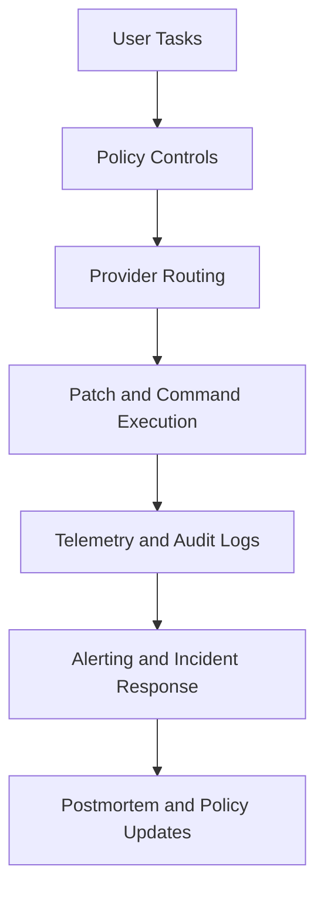

# Chapter 8: Production Operations

This chapter defines what "production-ready" means for bolt.diy and how to keep it that way under real usage.

## Production Readiness Definition

A bolt.diy deployment is production-ready when it has:

- deterministic provider routing defaults
- guarded edit and command approval policy
- observable runtime and tool behavior
- tested incident and rollback runbooks
- clear ownership for platform and policy changes

## Operational Control Plane

## Core SLO Candidates

| SLO Area | Example Metric |
|:---------|:---------------|
| task reliability | successful task completion rate |
| change quality | diff acceptance ratio without rollback |
| runtime health | median command execution latency |
| provider stability | provider error rate by model |
| cost efficiency | average spend per completed task |

Track trends, not just single-point values.

## Alerting Signals

Prioritize alerting for:

- sudden provider/auth failures
- repeated command timeouts
- spike in rejected or rolled-back patches
- abnormal spend acceleration
- deployment failures in active environments

## Incident Playbooks

### Provider outage

1. switch to tested fallback provider profile
2. reduce high-complexity task load
3. notify affected teams
4. restore primary provider after health validation

### Unsafe patch spike

1. tighten approval thresholds
2. enforce smaller scoped prompts
3. review recent prompt patterns
4. ship policy fix and communicate temporary constraints

### Cost anomaly

1. cap session/task budgets
2. review routing logs and model usage mix
3. disable high-cost profiles temporarily
4. publish remediation and threshold updates

## Security and Governance Baseline

- role-scoped access for provider and integration settings
- secret rotation schedule with audit trail
- mutating tool-call logging
- periodic review of high-risk file edits
- documented data retention and redaction policy

## Change Management

Treat policy and routing changes like code changes:

1. propose in pull request or change request
2. test in stage with representative tasks
3. measure impact on quality/cost/latency
4. release with rollback plan

## Quarterly Ops Review Template

Review these questions quarterly:

- Which task classes fail most often and why?
- Which provider routes deliver best quality/cost ratio?
- Are approval patterns too lax or too restrictive?
- Which integrations create the most operational noise?
- What policy updates are needed before scaling usage?

## End-State Operating Model

A mature bolt.diy operation has:

- shared prompt and review standards
- automated quality gates
- clear runtime ownership
- measured outcomes for reliability, speed, and cost

## Final Summary

You now have end-to-end coverage for bolt.diy:

- setup and architecture
- provider governance
- safe prompt-to-change workflows
- integrations and deployment choices
- production operations and continuous improvement

Related tracks:

- [Dyad Tutorial](../dyad-tutorial/)
- [Cline Tutorial](../cline-tutorial/)
- [Roo Code Tutorial](../roo-code-tutorial/)
- [OpenHands Tutorial](../openhands-tutorial/)
