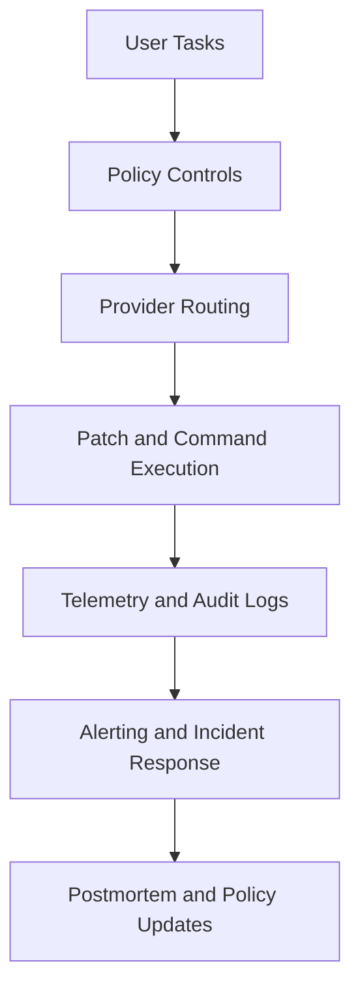
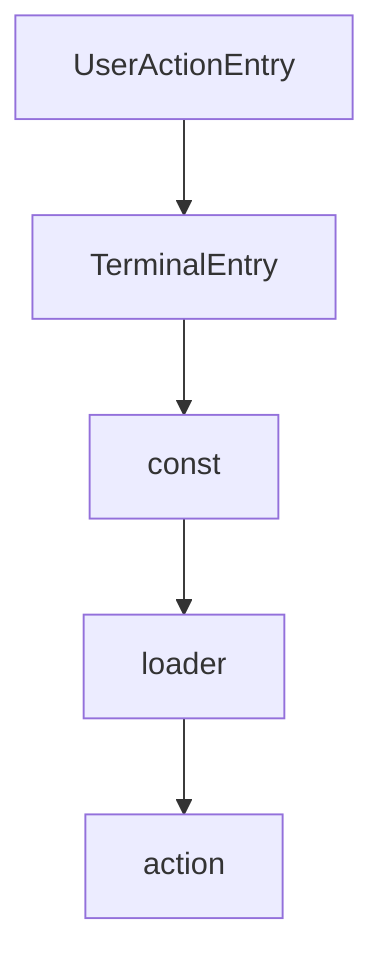

# Chapter 8: Production Operations

Welcome to **Chapter 8: Production Operations**. In this part of **bolt.diy Tutorial: Build and Operate an Open Source AI App Builder**, you will build an intuitive mental model first, then move into concrete implementation details and practical production tradeoffs.


This chapter defines what "production-ready" means for bolt.diy and how to keep it that way under real usage.

## Production Readiness Definition

A bolt.diy deployment is production-ready when it has:

- deterministic provider routing defaults
- guarded edit and command approval policy
- observable runtime and tool behavior
- tested incident and rollback runbooks
- clear ownership for platform and policy changes

## Operational Control Plane


```mermaid
flowchart TD
    A[User Tasks] --> B[Policy Controls]
    B --> C[Provider Routing]
    C --> D[Patch and Command Execution]
    D --> E[Telemetry and Audit Logs]
    E --> F[Alerting and Incident Response]
    F --> G[Postmortem and Policy Updates]
```

## Core SLO Candidates

| SLO Area | Example Metric |
|:---------|:---------------|
| task reliability | successful task completion rate |
| change quality | diff acceptance ratio without rollback |
| runtime health | median command execution latency |
| provider stability | provider error rate by model |
| cost efficiency | average spend per completed task |

Track trends, not just single-point values.

## Alerting Signals

Prioritize alerting for:

- sudden provider/auth failures
- repeated command timeouts
- spike in rejected or rolled-back patches
- abnormal spend acceleration
- deployment failures in active environments

## Incident Playbooks

### Provider outage

1. switch to tested fallback provider profile
2. reduce high-complexity task load
3. notify affected teams
4. restore primary provider after health validation

### Unsafe patch spike

1. tighten approval thresholds
2. enforce smaller scoped prompts
3. review recent prompt patterns
4. ship policy fix and communicate temporary constraints

### Cost anomaly

1. cap session/task budgets
2. review routing logs and model usage mix
3. disable high-cost profiles temporarily
4. publish remediation and threshold updates

## Security and Governance Baseline

- role-scoped access for provider and integration settings
- secret rotation schedule with audit trail
- mutating tool-call logging
- periodic review of high-risk file edits
- documented data retention and redaction policy

## Change Management

Treat policy and routing changes like code changes:

1. propose in pull request or change request
2. test in stage with representative tasks
3. measure impact on quality/cost/latency
4. release with rollback plan

## Quarterly Ops Review Template

Review these questions quarterly:

- Which task classes fail most often and why?
- Which provider routes deliver best quality/cost ratio?
- Are approval patterns too lax or too restrictive?
- Which integrations create the most operational noise?
- What policy updates are needed before scaling usage?

## End-State Operating Model

A mature bolt.diy operation has:

- shared prompt and review standards
- automated quality gates
- clear runtime ownership
- measured outcomes for reliability, speed, and cost

## Final Summary

You now have end-to-end coverage for bolt.diy:

- setup and architecture
- provider governance
- safe prompt-to-change workflows
- integrations and deployment choices
- production operations and continuous improvement

Related tracks:

- [Dyad Tutorial](../dyad-tutorial/)
- [Cline Tutorial](../cline-tutorial/)
- [Roo Code Tutorial](../roo-code-tutorial/)
- [OpenHands Tutorial](../openhands-tutorial/)

## Depth Expansion Playbook

## Source Code Walkthrough

### `app/utils/debugLogger.ts`

The `UserActionEntry` interface in [`app/utils/debugLogger.ts`](https://github.com/stackblitz-labs/bolt.diy/blob/HEAD/app/utils/debugLogger.ts) handles a key part of this chapter's functionality:

```ts
  performance: PerformanceEntry;
  state: StateEntry;
  userActions: UserActionEntry[];
  terminalLogs: TerminalEntry[];
}

export interface SystemInfo {
  platform: string;
  userAgent: string;
  screenResolution: string;
  viewportSize: string;
  isMobile: boolean;
  timezone: string;
  language: string;
  cookiesEnabled: boolean;
  localStorageEnabled: boolean;
  sessionStorageEnabled: boolean;
}

export interface AppInfo {
  version: string;
  buildTime: string;
  currentModel: string;
  currentProvider: string;
  projectType: string;
  workbenchView: string;
  hasActivePreview: boolean;
  unsavedFiles: number;
  workbenchState?: {
    currentView: string;
    showWorkbench: boolean;
    showTerminal: boolean;
```

This interface is important because it defines how bolt.diy Tutorial: Build and Operate an Open Source AI App Builder implements the patterns covered in this chapter.

### `app/utils/debugLogger.ts`

The `TerminalEntry` interface in [`app/utils/debugLogger.ts`](https://github.com/stackblitz-labs/bolt.diy/blob/HEAD/app/utils/debugLogger.ts) handles a key part of this chapter's functionality:

```ts
  state: StateEntry;
  userActions: UserActionEntry[];
  terminalLogs: TerminalEntry[];
}

export interface SystemInfo {
  platform: string;
  userAgent: string;
  screenResolution: string;
  viewportSize: string;
  isMobile: boolean;
  timezone: string;
  language: string;
  cookiesEnabled: boolean;
  localStorageEnabled: boolean;
  sessionStorageEnabled: boolean;
}

export interface AppInfo {
  version: string;
  buildTime: string;
  currentModel: string;
  currentProvider: string;
  projectType: string;
  workbenchView: string;
  hasActivePreview: boolean;
  unsavedFiles: number;
  workbenchState?: {
    currentView: string;
    showWorkbench: boolean;
    showTerminal: boolean;
    artifactsCount: number;
```

This interface is important because it defines how bolt.diy Tutorial: Build and Operate an Open Source AI App Builder implements the patterns covered in this chapter.

### `app/utils/debugLogger.ts`

The `const` interface in [`app/utils/debugLogger.ts`](https://github.com/stackblitz-labs/bolt.diy/blob/HEAD/app/utils/debugLogger.ts) handles a key part of this chapter's functionality:

```ts
import { isMac, isWindows, isLinux } from './os';
import { isMobile } from './mobile';
import { PROVIDER_LIST, DEFAULT_MODEL } from './constants';
import { logger } from './logger';

// Lazy import to avoid circular dependencies
let logStore: any = null;
const getLogStore = () => {
  if (!logStore && typeof window !== 'undefined') {
    try {
      // Import and set the logStore on first access
      import('~/lib/stores/logs')
        .then(({ logStore: store }) => {
          logStore = store;
        })
        .catch(() => {
          // Ignore import errors
        });
    } catch {
      // Ignore errors
    }
  }

  return logStore;
};

// Configuration interface for debug logger
export interface DebugLoggerConfig {
  enabled: boolean;
  maxEntries: number;
  captureConsole: boolean;
  captureNetwork: boolean;
```

This interface is important because it defines how bolt.diy Tutorial: Build and Operate an Open Source AI App Builder implements the patterns covered in this chapter.

### `app/routes/api.vercel-deploy.ts`

The `loader` function in [`app/routes/api.vercel-deploy.ts`](https://github.com/stackblitz-labs/bolt.diy/blob/HEAD/app/routes/api.vercel-deploy.ts) handles a key part of this chapter's functionality:

```ts
};

// Add loader function to handle GET requests
export async function loader({ request }: LoaderFunctionArgs) {
  const url = new URL(request.url);
  const projectId = url.searchParams.get('projectId');
  const token = url.searchParams.get('token');

  if (!projectId || !token) {
    return json({ error: 'Missing projectId or token' }, { status: 400 });
  }

  try {
    // Get project info
    const projectResponse = await fetch(`https://api.vercel.com/v9/projects/${projectId}`, {
      headers: {
        Authorization: `Bearer ${token}`,
      },
    });

    if (!projectResponse.ok) {
      return json({ error: 'Failed to fetch project' }, { status: 400 });
    }

    const projectData = (await projectResponse.json()) as any;

    // Get latest deployment
    const deploymentsResponse = await fetch(`https://api.vercel.com/v6/deployments?projectId=${projectId}&limit=1`, {
      headers: {
        Authorization: `Bearer ${token}`,
      },
    });
```

This function is important because it defines how bolt.diy Tutorial: Build and Operate an Open Source AI App Builder implements the patterns covered in this chapter.


## How These Components Connect


```mermaid
flowchart TD
    A[UserActionEntry]
    B[TerminalEntry]
    C[const]
    D[loader]
    E[action]
    A --> B
    B --> C
    C --> D
    D --> E
```
