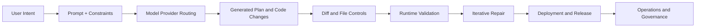

# bolt.diy Tutorial: Build and Operate an Open Source AI App Builder

> A production-focused deep dive into `stackblitz-labs/bolt.diy`: architecture, provider routing, safe edit loops, MCP integrations, deployment choices, and operational governance.

## Why This Tutorial Exists

Most bolt.diy guides stop at setup. This track is for engineers and teams that want to:

- run bolt.diy reliably across local, container, and hosted environments
- enforce safe human-in-the-loop change controls for generated code
- connect MCP tools and backend services without creating governance debt
- choose practical deployment and operations patterns for real teams

## Current Snapshot (Verified February 11, 2026)

- repository: [`stackblitz-labs/bolt.diy`](https://github.com/stackblitz-labs/bolt.diy)
- stars: about **19k**
- latest stable release: [`v1.0.0`](https://github.com/stackblitz-labs/bolt.diy/releases/tag/v1.0.0) (published May 12, 2025)
- default branch activity: active (`main`, recent pushes)
- package manager from source: `pnpm@9.14.4`

## Mental Model

## Learning Path

| Chapter | Core Question | What You Build |
|:--------|:--------------|:---------------|
| [01 - Getting Started](01-getting-started.md) | How do we get a reliable local baseline fast? | Local and Docker-first setup + first safe task |
| [02 - Architecture Overview](02-architecture-overview.md) | How is bolt.diy organized internally? | A practical map of runtime and code boundaries |
| [03 - Providers and Routing](03-providers-and-routing.md) | How should model/provider selection be governed? | Provider policy, fallback chains, and cost controls |
| [04 - Prompt-to-App Workflow](04-prompt-to-app-workflow.md) | How do prompts become reviewable product changes? | A deterministic prompt-review-validate loop |
| [05 - Files, Diff, and Locking](05-files-diff-locking.md) | How do we keep generated edits safe? | Diff review standards and high-risk file controls |
| [06 - Integrations and MCP](06-integrations-and-mcp.md) | How do we connect tools and services without chaos? | MCP + integration rollout strategy and contracts |
| [07 - Deployment and Distribution](07-deployment-distribution.md) | Which runtime target should we pick and why? | Deployment matrix for web, container, and desktop |
| [08 - Production Operations](08-production-operations.md) | What does production readiness look like? | SLOs, observability, incident playbooks, and audits |

## Skill Outcomes

By the end of this track, you should be able to:

- run bolt.diy in a reproducible dev environment with clear guardrails
- choose provider/model defaults by task class and policy constraints
- structure AI-assisted edits into auditable, low-risk delivery loops
- integrate external tools with explicit schemas and approval boundaries
- ship and operate bolt.diy with measurable reliability and rollback paths

## Suggested Prerequisites

- Comfortable with Git workflows, code review, and CI/CD basics
- Basic knowledge of Node.js, package managers, and environment variables
- Familiarity with LLM provider APIs and secret management fundamentals

## Source References

- [bolt.diy README](https://github.com/stackblitz-labs/bolt.diy/blob/main/README.md)
- [bolt.diy docs index](https://github.com/stackblitz-labs/bolt.diy/blob/main/docs/docs/index.md)
- [bolt.diy Releases](https://github.com/stackblitz-labs/bolt.diy/releases)

## Related Tutorials

- [Dyad Tutorial](../dyad-tutorial/)
- [Cline Tutorial](../cline-tutorial/)
- [Roo Code Tutorial](../roo-code-tutorial/)
- [Vercel AI SDK Tutorial](../vercel-ai-tutorial/)
- [OpenHands Tutorial](../openhands-tutorial/)

---

Start with [Chapter 1: Getting Started](01-getting-started.md).
