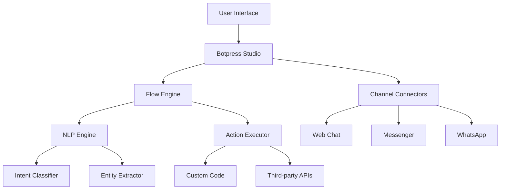

# Botpress Tutorial: Open Source Conversational AI Platform

<p align="center">
  
</p>

<p align="center">
  <strong>🤖 Open source conversational AI platform for building intelligent chatbots</strong>
</p>

---

## Why This Track Matters

Botpress is increasingly relevant for developers working with modern AI/ML infrastructure. **Important Notice (2025)**: Botpress v12 has been sunset and is no longer available for new deployments. However, existing customers with active v12 subscriptions remain fully supported, and this track helps you understand the architecture, key patterns, and production considerations.

This track focuses on:

- understanding getting started with botpress
- understanding visual flow builder
- understanding natural language understanding
- understanding custom actions & code

## What You Will Learn

This comprehensive tutorial will guide you through Botpress, a powerful open source platform for building conversational AI applications:

- **Chatbot Development**: Build sophisticated chatbots with natural language understanding
- **NLP Integration**: Leverage advanced natural language processing capabilities
- **Multi-Channel Support**: Deploy bots across web, messaging apps, and voice platforms
- **Visual Flow Builder**: Design conversation flows with an intuitive drag-and-drop interface
- **Custom Actions**: Extend bot functionality with custom code and integrations
- **Analytics & Insights**: Monitor bot performance and user interactions
- **Enterprise Features**: Scale bots for production use with advanced security

## Current Snapshot (auto-updated)

- repository: [`botpress/botpress`](https://github.com/botpress/botpress)
- stars: about **14.7k**
- latest release: [`v12.30.9`](https://github.com/botpress/botpress/releases/tag/v12.30.9) (published 2023-06-22)

## 📚 Tutorial Chapters

1. **[Getting Started with Botpress](01-getting-started.md)** - Installation, setup, and first chatbot
2. **[Visual Flow Builder](02-visual-flow-builder.md)** - Designing conversation flows
3. **[Natural Language Understanding](03-natural-language-understanding.md)** - Training intents and entities
4. **[Custom Actions & Code](04-custom-actions-code.md)** - Extending with JavaScript/TypeScript
5. **[Channel Integrations](05-channel-integrations.md)** - Connecting to messaging platforms
6. **[Advanced Features](06-advanced-features.md)** - Hooks, middleware, and plugins
7. **[Analytics & Monitoring](07-analytics-monitoring.md)** - Performance tracking and insights
8. **[Production Deployment](08-production-deployment.md)** - Scaling and production setup

## 🚀 Quick Start

```bash
# Install Botpress
npm install -g @botpress/cli

# Create new bot
bp create my-first-bot

# Start development server
cd my-first-bot
bp dev
```

## Mental Model



## 🎯 Use Cases

- **Customer Support**: Automated customer service chatbots
- **Lead Generation**: Qualify and capture leads through conversation
- **E-commerce**: Shopping assistants and product recommendations
- **HR Bots**: Employee onboarding and FAQ automation
- **Healthcare**: Appointment scheduling and health information
- **Education**: Learning assistants and course guidance
- **Internal Tools**: IT support and workflow automation

## ⚠️ Botpress v12 Status Update

> **Important Notice (2025)**: Botpress v12 has been sunset and is no longer available for new deployments. However, existing customers with active v12 subscriptions remain fully supported.

[](https://github.com/botpress/botpress)
[](https://opensource.org/licenses/MIT)
[](https://github.com/botpress/botpress)


**Migration Path:**
- **For New Users**: Use **Botpress Cloud** - the fully managed platform with continuous updates
- **For Existing v12 Users**: Full support continues, but consider migrating to Botpress Cloud for latest features
- **Self-Hosting**: Limited to existing v12 installations; new self-hosted deployments are not recommended

## What's New in Botpress Cloud (2025)

> **AI Agent Focus**: $25M Series B funding to expand infrastructure for building and deploying AI agents globally.

**🆕 Latest Features:**
- 🎨 **Enhanced Webchat**: Refreshed UI with improved animations and typing indicators
- 💬 **Message Feedback**: Users can leave feedback directly within chat
- 🤖 **Expanded AI Models**: Support for Claude 4 Sonnet, DeepSeek R1/V3, Llama 4
- 📱 **WhatsApp Improvements**: Better text formatting and choice message dropdowns
- ⏰ **Custom Inactivity Timeout**: Configurable session management
- 🛒 **BigCommerce Integration**: Product recommendations without hallucinations

**🚀 Cloud Advantages:**
- ☁️ **Fully Managed**: No installation or maintenance required
- 🔒 **Enterprise Security**: Built-in security and compliance
- 📊 **Scalability**: Handle any traffic volume automatically
- 🔄 **Continuous Updates**: Always on latest features and models
- 🌐 **Global Infrastructure**: Worldwide deployment options

## Prerequisites

- Basic knowledge of JavaScript/TypeScript
- Understanding of REST APIs
- Familiarity with Node.js and npm (for v12 self-hosting)
- Basic concepts of natural language processing
- Understanding of chatbot design principles

## 🕐 Time Investment

- **Complete Tutorial**: 4-5 hours
- **Basic Bot Creation**: 45 minutes
- **Advanced Features**: 2-3 hours

## 🎯 Learning Outcomes

By the end of this tutorial, you'll be able to:

- Set up and configure Botpress development environment
- Design complex conversation flows using the visual builder
- Train NLP models for intent recognition and entity extraction
- Write custom actions and integrate with external APIs
- Deploy bots across multiple channels and platforms
- Monitor bot performance and user interactions
- Scale Botpress for production use

## 🔗 Resources

- **Official Documentation**: [botpress.com/docs](https://botpress.com/docs)
- **GitHub Repository**: [github.com/botpress/botpress](https://github.com/botpress/botpress)
- **Community Forum**: [forum.botpress.com](https://forum.botpress.com)
- **SDK Documentation**: [botpress.com/docs/integrations/sdk](https://botpress.com/docs/for-developers/sdk/integration/getting-started)
- **Botpress Cloud**: [botpress.com](https://botpress.com)

---


## Related Tutorials

- [Claude Task Master Tutorial](../claude-task-master-tutorial/)
- [Deer Flow Tutorial](../deer-flow-tutorial/)
- [DSPy Tutorial](../dspy-tutorial/)
- [Fabric Tutorial](../fabric-tutorial/)
- [Instructor Tutorial](../instructor-tutorial/)
## Navigation & Backlinks

- [Start Here: Chapter 1: Getting Started with Botpress](01-getting-started.md)
- [Back to Main Catalog](../../README.md#-tutorial-catalog)
- [Browse A-Z Tutorial Directory](../../discoverability/tutorial-directory.md)
- [Search by Intent](../../discoverability/query-hub.md)
- [Explore Category Hubs](../../README.md#category-hubs)

*Generated by [AI Codebase Knowledge Builder](https://github.com/johnxie/awesome-code-docs)*

## Chapter Guide

1. [Chapter 1: Getting Started with Botpress](01-getting-started.md)
2. [Chapter 2: Visual Flow Builder](02-visual-flow-builder.md)
3. [Chapter 3: Natural Language Understanding](03-natural-language-understanding.md)
4. [Chapter 4: Custom Actions & Code](04-custom-actions-code.md)
5. [Chapter 5: Channel Integrations](05-channel-integrations.md)
6. [Chapter 6: Advanced Features](06-advanced-features.md)
7. [Chapter 7: Analytics & Monitoring](07-analytics-monitoring.md)
8. [Chapter 8: Production Deployment](08-production-deployment.md)

## Source References

- [github.com/botpress/botpress](https://github.com/botpress/botpress)
- [AI Codebase Knowledge Builder](https://github.com/johnxie/awesome-code-docs)
