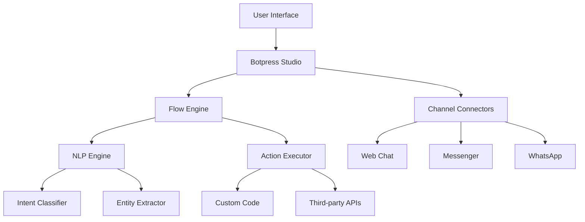

# Botpress Tutorial: Open Source Conversational AI Platform

<p align="center">
  
</p>

<p align="center">
  <strong>🤖 Open source conversational AI platform for building intelligent chatbots</strong>
</p>

---

## 🎯 What You'll Learn

This comprehensive tutorial will guide you through Botpress, a powerful open source platform for building conversational AI applications:

- **Chatbot Development**: Build sophisticated chatbots with natural language understanding
- **NLP Integration**: Leverage advanced natural language processing capabilities
- **Multi-Channel Support**: Deploy bots across web, messaging apps, and voice platforms
- **Visual Flow Builder**: Design conversation flows with an intuitive drag-and-drop interface
- **Custom Actions**: Extend bot functionality with custom code and integrations
- **Analytics & Insights**: Monitor bot performance and user interactions
- **Enterprise Features**: Scale bots for production use with advanced security

## 📚 Tutorial Chapters

1. **[Getting Started with Botpress](01-getting-started.md)** - Installation, setup, and first chatbot
2. **[Visual Flow Builder](02-visual-flow-builder.md)** - Designing conversation flows
3. **[Natural Language Understanding](03-natural-language-understanding.md)** - Training intents and entities
4. **[Custom Actions & Code](04-custom-actions-code.md)** - Extending with JavaScript/TypeScript
5. **[Channel Integrations](05-channel-integrations.md)** - Connecting to messaging platforms
6. **[Advanced Features](06-advanced-features.md)** - Hooks, middleware, and plugins
7. **[Analytics & Monitoring](07-analytics-monitoring.md)** - Performance tracking and insights
8. **[Production Deployment](08-production-deployment.md)** - Scaling and production setup

## 🚀 Quick Start

```bash
# Install Botpress
npm install -g @botpress/cli

# Create new bot
bp create my-first-bot

# Start development server
cd my-first-bot
bp dev
```

## 🏗️ Architecture Overview



## 🎯 Use Cases

- **Customer Support**: Automated customer service chatbots
- **Lead Generation**: Qualify and capture leads through conversation
- **E-commerce**: Shopping assistants and product recommendations
- **HR Bots**: Employee onboarding and FAQ automation
- **Healthcare**: Appointment scheduling and health information
- **Education**: Learning assistants and course guidance
- **Internal Tools**: IT support and workflow automation

## ⚠️ Botpress v12 Status Update

> **Important Notice (2025)**: Botpress v12 has been sunset and is no longer available for new deployments. However, existing customers with active v12 subscriptions remain fully supported.

**Migration Path:**
- **For New Users**: Use **Botpress Cloud** - the fully managed platform with continuous updates
- **For Existing v12 Users**: Full support continues, but consider migrating to Botpress Cloud for latest features
- **Self-Hosting**: Limited to existing v12 installations; new self-hosted deployments are not recommended

## What's New in Botpress Cloud (2025)

> **AI Agent Focus**: $25M Series B funding to expand infrastructure for building and deploying AI agents globally.

**🆕 Latest Features:**
- 🎨 **Enhanced Webchat**: Refreshed UI with improved animations and typing indicators
- 💬 **Message Feedback**: Users can leave feedback directly within chat
- 🤖 **Expanded AI Models**: Support for Claude 4 Sonnet, DeepSeek R1/V3, Llama 4
- 📱 **WhatsApp Improvements**: Better text formatting and choice message dropdowns
- ⏰ **Custom Inactivity Timeout**: Configurable session management
- 🛒 **BigCommerce Integration**: Product recommendations without hallucinations

**🚀 Cloud Advantages:**
- ☁️ **Fully Managed**: No installation or maintenance required
- 🔒 **Enterprise Security**: Built-in security and compliance
- 📊 **Scalability**: Handle any traffic volume automatically
- 🔄 **Continuous Updates**: Always on latest features and models
- 🌐 **Global Infrastructure**: Worldwide deployment options

## Prerequisites

- Basic knowledge of JavaScript/TypeScript
- Understanding of REST APIs
- Familiarity with Node.js and npm (for v12 self-hosting)
- Basic concepts of natural language processing
- Understanding of chatbot design principles

## 🕐 Time Investment

- **Complete Tutorial**: 4-5 hours
- **Basic Bot Creation**: 45 minutes
- **Advanced Features**: 2-3 hours

## 🎯 Learning Outcomes

By the end of this tutorial, you'll be able to:

- Set up and configure Botpress development environment
- Design complex conversation flows using the visual builder
- Train NLP models for intent recognition and entity extraction
- Write custom actions and integrate with external APIs
- Deploy bots across multiple channels and platforms
- Monitor bot performance and user interactions
- Scale Botpress for production use

## 🔗 Resources

- **Official Documentation**: [docs.botpress.com](https://docs.botpress.com)
- **GitHub Repository**: [github.com/botpress/botpress](https://github.com/botpress/botpress)
- **Community Forum**: [forum.botpress.com](https://forum.botpress.com)
- **SDK Documentation**: [docs.botpress.com/developers](https://docs.botpress.com/developers/)
- **Botpress Cloud**: [botpress.com](https://botpress.com)

---

*Generated by [AI Codebase Knowledge Builder](https://github.com/johnxie/awesome-code-docs)*