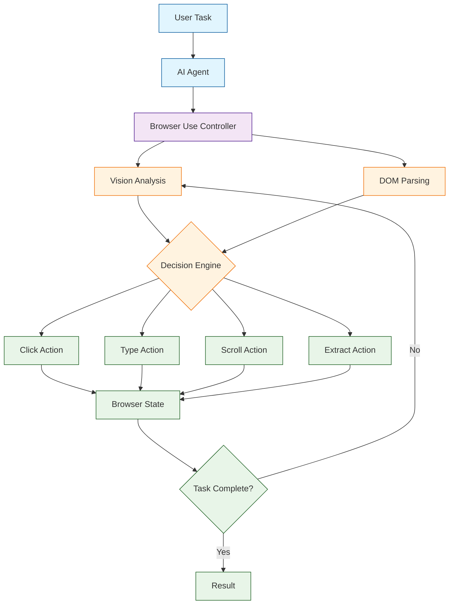

# Browser Use Tutorial: AI-Powered Web Automation

> Build autonomous AI agents that can browse and interact with any website.

<div align="center">

**🌐 Let AI Agents Navigate the Web for You**

[](https://github.com/browser-use/browser-use)

</div>

---

## 🎯 What is Browser Use?

**Browser Use**<sup>[View Repo](https://github.com/browser-use/browser-use)</sup> is an open-source library that enables AI agents to control web browsers autonomously. It provides a simple interface for LLMs to browse websites, fill forms, click buttons, extract data, and complete complex web-based tasks.

### Key Features

| Feature | Description |
|:--------|:------------|
| **Vision + HTML** | Uses both visual and DOM understanding for robust navigation |
| **Multi-Tab Support** | Manage multiple browser tabs simultaneously |
| **Form Filling** | Intelligent form detection and completion |
| **Element Interaction** | Click, type, scroll, and interact with any web element |
| **Custom Actions** | Define domain-specific browser actions |
| **Session Persistence** | Maintain login states and cookies across sessions |



## Tutorial Chapters

1. **[Chapter 1: Getting Started](01-getting-started.md)** - Installation, setup, and your first browser agent
2. **[Chapter 2: Browser Control Basics](02-browser-control.md)** - Navigation, clicking, and typing
3. **[Chapter 3: Element Selection](03-element-selection.md)** - Finding and interacting with web elements
4. **[Chapter 4: Form Automation](04-form-automation.md)** - Intelligent form filling and submission
5. **[Chapter 5: Data Extraction](05-data-extraction.md)** - Scraping and extracting structured data
6. **[Chapter 6: Multi-Tab Workflows](06-multi-tab.md)** - Managing complex multi-tab operations
7. **[Chapter 7: Custom Actions](07-custom-actions.md)** - Building domain-specific browser actions
8. **[Chapter 8: Production Deployment](08-production.md)** - Scaling, reliability, and best practices

## What You'll Learn

- **Automate Web Tasks** with AI-powered browser control
- **Navigate Complex Sites** using vision and DOM understanding
- **Extract Structured Data** from any website
- **Build Reliable Agents** with error handling and retries
- **Handle Authentication** and session management
- **Create Custom Workflows** for domain-specific tasks
- **Scale Browser Automation** for production use cases

## Prerequisites

- Python 3.10+
- OpenAI or Anthropic API key
- Chrome or Chromium browser
- Basic understanding of web technologies (HTML, CSS)

## Quick Start

```bash
# Install browser-use
pip install browser-use

# Install playwright browsers
playwright install chromium
```

```python
from browser_use import Agent
from langchain_openai import ChatOpenAI

# Initialize the agent
agent = Agent(
    task="Go to google.com and search for 'browser automation with AI'",
    llm=ChatOpenAI(model="gpt-4o"),
)

# Run the agent
result = await agent.run()
print(result)
```

## Example: Research Assistant

```python
from browser_use import Agent, Controller
from langchain_openai import ChatOpenAI

# Create a research agent
agent = Agent(
    task="""
    1. Go to arxiv.org
    2. Search for 'large language models'
    3. Find the 3 most recent papers
    4. Extract their titles, authors, and abstracts
    5. Return the information as structured data
    """,
    llm=ChatOpenAI(model="gpt-4o"),
)

# Run with extended timeout for complex tasks
result = await agent.run(max_steps=50)

# Process extracted data
for paper in result.extracted_content:
    print(f"Title: {paper['title']}")
    print(f"Authors: {paper['authors']}")
    print(f"Abstract: {paper['abstract'][:200]}...")
    print("---")
```

## Example: Form Automation

```python
from browser_use import Agent
from langchain_openai import ChatOpenAI

agent = Agent(
    task="""
    Go to the demo form at https://example.com/signup
    Fill in the form with:
    - Name: John Doe
    - Email: john@example.com
    - Company: Acme Inc
    Submit the form and confirm success
    """,
    llm=ChatOpenAI(model="gpt-4o"),
)

result = await agent.run()
print(f"Form submitted: {result.is_done()}")
```

## Supported LLM Providers

| Provider | Models | Vision Support |
|:---------|:-------|:---------------|
| **OpenAI** | GPT-4o, GPT-4-turbo | ✅ Yes |
| **Anthropic** | Claude 3.5 Sonnet, Claude 3 Opus | ✅ Yes |
| **Google** | Gemini Pro, Gemini Ultra | ✅ Yes |
| **Local** | LLaVA, Qwen-VL | ✅ Yes |

## Learning Path

### 🟢 Beginner Track
1. Chapters 1-3: Setup, navigation, and element interaction
2. Build simple web automation scripts

### 🟡 Intermediate Track
1. Chapters 4-6: Forms, data extraction, and multi-tab
2. Create complex web workflows

### 🔴 Advanced Track
1. Chapters 7-8: Custom actions and production deployment
2. Build enterprise-grade browser automation

---

**Ready to automate the web with AI? Let's begin with [Chapter 1: Getting Started](01-getting-started.md)!**

*Generated for [Awesome Code Docs](https://github.com/johnxie/awesome-code-docs)*
