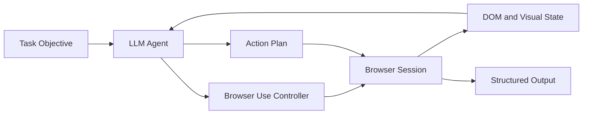

# Browser Use Tutorial: AI-Powered Web Automation Agents

> Learn how to use `browser-use/browser-use` to build agents that can navigate websites, execute workflows, and run reliable browser automation in production.

## Why This Track Matters

Browser Use is a leading open-source framework for LLM-driven browser control. Teams use it to automate real-world web workflows that static APIs cannot cover.

This track focuses on:

- building robust browser agents that can reason over page state
- handling navigation, interaction, extraction, and multi-step tasks
- integrating Browser Use into larger coding-agent and operations pipelines
- deploying reliable automations with observability and safeguards

## Current Snapshot (auto-updated)

- repository: [`browser-use/browser-use`](https://github.com/browser-use/browser-use)
- stars: about **78.2k**
- latest release: [`0.11.9`](https://github.com/browser-use/browser-use/releases/tag/0.11.9)
- development activity: active with frequent updates
- project positioning in repo: framework for autonomous browser agents with cloud and local workflows

## Mental Model

## Chapter Guide

| Chapter | Key Question | Outcome |
|:--------|:-------------|:--------|
| [01 - Getting Started](01-getting-started.md) | How do I install Browser Use and run first tasks? | Working local baseline |
| [02 - Browser Control Basics](02-browser-control.md) | How do agents click, type, and navigate reliably? | Core interaction workflows |
| [03 - Element Selection](03-element-selection.md) | How do I target elements across changing pages? | Resilient selection patterns |
| [04 - Form Automation](04-form-automation.md) | How do I handle end-to-end form flows? | Repeatable form execution patterns |
| [05 - Data Extraction](05-data-extraction.md) | How do I extract clean structured outputs from pages? | Data capture and transformation playbook |
| [06 - Multi-Tab Workflows](06-multi-tab.md) | How do I coordinate complex multi-tab tasks? | Reliable cross-tab orchestration |
| [07 - Custom Actions](07-custom-actions.md) | How do I implement domain-specific browser actions? | Extensible custom action toolkit |
| [08 - Production Deployment](08-production.md) | How do I run browser agents in production safely? | Deployment and operations baseline |

## What You Will Learn

- how to build browser automation agents with LLM-driven reasoning
- how to improve reliability with structured execution and retries
- how to extract data and perform authenticated workflows
- how to deploy Browser Use workloads with production controls

## Source References

- [Browser Use Repository](https://github.com/browser-use/browser-use)
- [Browser Use Releases](https://github.com/browser-use/browser-use/releases)
- [Browser Use Docs](https://docs.browser-use.com/)
- [Browser Use Cloud](https://cloud.browser-use.com/)

## Related Tutorials

- [OpenHands Tutorial](../openhands-tutorial/)
- [Cline Tutorial](../cline-tutorial/)
- [Roo Code Tutorial](../roo-code-tutorial/)
- [Claude Code Tutorial](../claude-code-tutorial/)

---

Start with [Chapter 1: Getting Started](01-getting-started.md).

## Navigation & Backlinks

- [Start Here: Chapter 1: Getting Started with Browser Use](01-getting-started.md)
- [Back to Main Catalog](../../README.md#-tutorial-catalog)
- [Browse A-Z Tutorial Directory](../../discoverability/tutorial-directory.md)
- [Search by Intent](../../discoverability/query-hub.md)
- [Explore Category Hubs](../../README.md#category-hubs)

## Full Chapter Map

1. [Chapter 1: Getting Started with Browser Use](01-getting-started.md)
2. [Chapter 2: Browser Control Basics](02-browser-control.md)
3. [Chapter 3: Element Selection - Finding and Interacting with Web Elements](03-element-selection.md)
4. [Chapter 4: Form Automation - Intelligent Form Filling and Submission](04-form-automation.md)
5. [Chapter 5: Data Extraction - Scraping and Extracting Structured Data](05-data-extraction.md)
6. [Chapter 6: Multi-Tab Workflows - Managing Complex Multi-Tab Operations](06-multi-tab.md)
7. [Chapter 7: Custom Actions - Building Domain-Specific Browser Actions](07-custom-actions.md)
8. [Chapter 8: Production Deployment - Scaling, Reliability, and Best Practices](08-production.md)

*Generated by [AI Codebase Knowledge Builder](https://github.com/The-Pocket/Tutorial-Codebase-Knowledge)*
