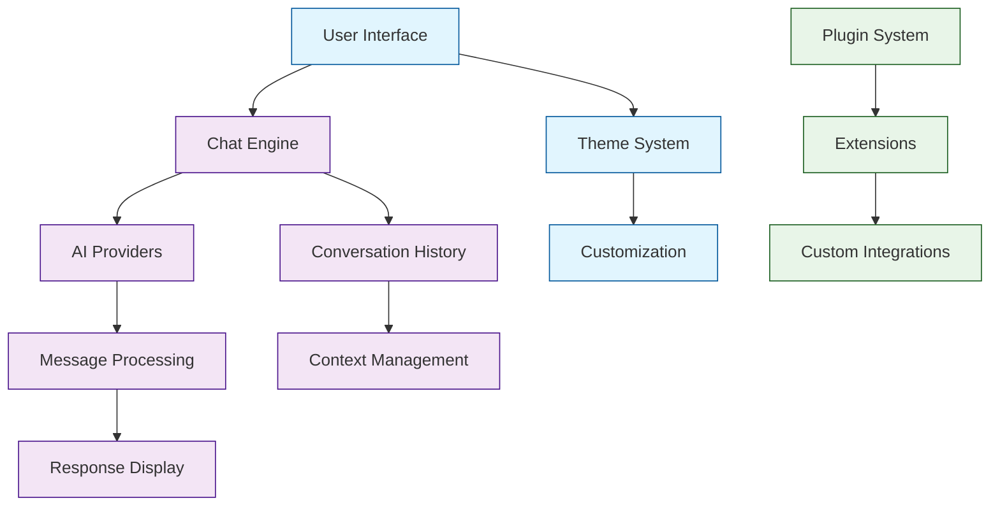

# Chatbox Tutorial: Building Modern AI Chat Interfaces

> This tutorial is AI-generated! To learn more, check out [Awesome Code Docs](https://github.com/johnxie/awesome-code-docs)

Chatbox[View Repo](https://github.com/Bin-Huang/chatbox) is a modern, cross-platform AI chat interface that supports multiple AI providers and offers a polished user experience. It demonstrates best practices for building conversational AI applications with clean interfaces, multi-provider support, and excellent user experience design.

Chatbox combines the best of modern web technologies with native desktop capabilities, showing how to build AI applications that users actually enjoy using.

## Tutorial Chapters

Welcome to your journey through modern AI chat interface development! This tutorial explores how to build polished, user-friendly conversational AI applications.

1. **[Chapter 1: Getting Started with Chatbox](01-getting-started.md)** - Installation, setup, and first conversations
2. **[Chapter 2: UI Architecture & Components](02-ui-architecture.md)** - Building modern chat interfaces
3. **[Chapter 3: AI Provider Integration](03-ai-providers.md)** - Connecting multiple AI services
4. **[Chapter 4: Conversation Management](04-conversation-management.md)** - Handling chat history and context
5. **[Chapter 5: Message Processing Pipeline](05-message-processing.md)** - Text processing and formatting
6. **[Chapter 6: Theme & Customization System](06-theme-system.md)** - Building flexible UI theming
7. **[Chapter 7: Plugin Architecture](07-plugin-system.md)** - Extending functionality
8. **[Chapter 8: Production Deployment](08-production-deployment.md)** - Building and distributing chat applications

## What You'll Learn

By the end of this tutorial, you'll be able to:

- **Build modern chat interfaces** with excellent user experience
- **Integrate multiple AI providers** seamlessly
- **Manage conversation context** and history effectively
- **Create responsive UI components** for real-time messaging
- **Implement theme systems** for customization
- **Develop plugin architectures** for extensibility
- **Deploy cross-platform applications** with native performance
- **Handle real-time messaging** with proper state management

## What's New in Chatbox (2024-2025)

> **Cross-Platform AI Chat Revolution**: Mobile excellence, latest AI models, and enterprise-grade features define Chatbox's evolution as the premier AI chat interface.

**📱 August 2025 (v1.15.4):**
- 🌐 **Enhanced Mobile Compatibility**: Cross-domain API request support for seamless mobile networks
- 🧠 **GPT-5 Series Integration**: Full support for latest OpenAI models including GPT-5 and variants
- 🖥️ **Mobile Artifact Resolution**: Fixed full-screen preview issues and mobile rendering problems
- 📝 **Input Experience Enhancement**: Improved draft clearance and message sending UX
- 📱 **iOS Native Sidebar**: Full sidebar functionality with native iOS interactions
- 🎨 **UI/UX Polish**: Enhanced mobile responsiveness and touch interactions

**🤖 January 2025 (v0.10.4):**
- 🏗️ **Anthropic Claude Integration**: Complete Claude API support with all model variants
- 🎯 **LM Studio Local Models**: Native integration with local LM Studio server
- 📋 **Dynamic Model Discovery**: Auto-updating model lists with latest provider offerings
- 🔧 **Expanded Provider Ecosystem**: Support for additional AI services and custom endpoints
- ⚡ **Performance Optimizations**: Faster response times and reduced latency
- 🛡️ **Enhanced Security**: Improved API key handling and connection security

**🎨 User Experience Enhancements:**
- 🎯 **Conversation Management**: Better chat organization and search capabilities
- 🎨 **Theme Customization**: Expanded theming options with dark/light mode improvements
- 📱 **Cross-Platform Consistency**: Unified experience across desktop, mobile, and web
- 🔄 **Real-time Updates**: Live conversation synchronization across devices
- 📊 **Usage Analytics**: Built-in conversation and usage statistics

**🔧 Developer Features:**
- 🛠️ **Plugin API**: Enhanced extensibility with new plugin hooks
- 📦 **Custom Integrations**: Simplified integration with third-party services
- 🔧 **Configuration Management**: Advanced settings and customization options
- 📊 **Debug Tools**: Enhanced debugging and development tools
- 🚀 **Performance Monitoring**: Built-in performance metrics and diagnostics

## Prerequisites

- Basic JavaScript/TypeScript knowledge
- Familiarity with React or similar UI frameworks
- Understanding of API integration patterns
- Basic knowledge of build tools and package management

## Learning Path

### 🟢 Beginner Track
Perfect for developers new to chat applications:
1. Chapters 1-2: Setup and basic UI components
2. Focus on understanding chat interface patterns

### 🟡 Intermediate Track
For developers building AI-integrated applications:
1. Chapters 3-5: AI integration and message processing
2. Learn to handle complex conversational flows

### 🔴 Advanced Track
For building production chat platforms:
1. Chapters 6-8: Advanced theming, plugins, and deployment
2. Master enterprise-grade chat application development

---

**Ready to build modern AI chat interfaces? Let's begin with [Chapter 1: Getting Started](01-getting-started.md)!**

*Generated by [AI Codebase Knowledge Builder](https://github.com/The-Pocket/Tutorial-Codebase-Knowledge)*
