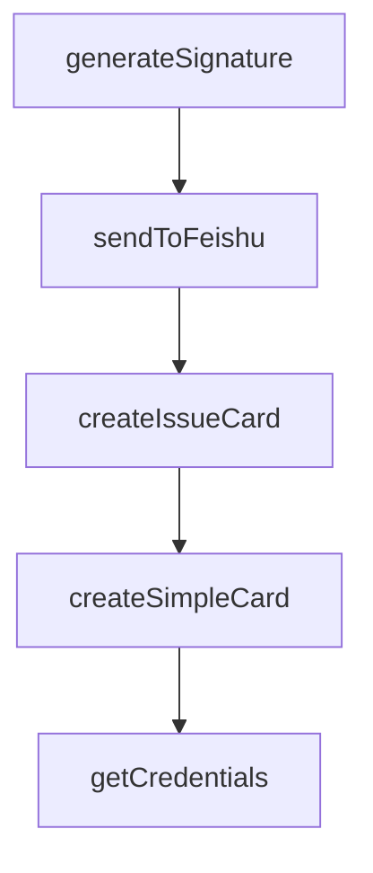

# Chapter 1: Getting Started

Welcome to **Chapter 1: Getting Started**. In this part of **Cherry Studio Tutorial: Multi-Provider AI Desktop Workspace for Teams**, you will build an intuitive mental model first, then move into concrete implementation details and practical production tradeoffs.


This chapter gets Cherry Studio running with your first model and assistant workflow.

## Learning Goals

- install Cherry Studio on desktop OS targets
- configure first provider connection
- run first multi-assistant conversation
- verify baseline local settings

## Startup Checklist

1. install latest release build
2. configure at least one provider
3. start a chat with a preconfigured assistant
4. test document input and output rendering

## Source References

- [Cherry Studio README](https://github.com/CherryHQ/cherry-studio/blob/main/README.md)
- [Cherry Studio releases](https://github.com/CherryHQ/cherry-studio/releases)

## Summary

You now have Cherry Studio installed and ready for daily AI workflows.

Next: [Chapter 2: Core Architecture and Product Model](02-core-architecture-and-product-model.md)

## Depth Expansion Playbook

## Source Code Walkthrough

### `scripts/feishu-notify.ts`

The `generateSignature` function in [`scripts/feishu-notify.ts`](https://github.com/CherryHQ/cherry-studio/blob/HEAD/scripts/feishu-notify.ts) handles a key part of this chapter's functionality:

```ts
 * @returns Base64 encoded signature
 */
function generateSignature(secret: string, timestamp: number): string {
  const stringToSign = `${timestamp}\n${secret}`
  const hmac = crypto.createHmac('sha256', stringToSign)
  return hmac.digest('base64')
}

/**
 * Send message to Feishu webhook
 * @param webhookUrl - Feishu webhook URL
 * @param secret - Feishu webhook secret
 * @param content - Feishu card message content
 * @returns Resolves when message is sent successfully
 * @throws When Feishu API returns non-2xx status code or network error occurs
 */
function sendToFeishu(webhookUrl: string, secret: string, content: FeishuCard): Promise<void> {
  return new Promise((resolve, reject) => {
    const timestamp = Math.floor(Date.now() / 1000)
    const sign = generateSignature(secret, timestamp)

    const payload: FeishuPayload = {
      timestamp: timestamp.toString(),
      sign,
      msg_type: 'interactive',
      card: content
    }

    const payloadStr = JSON.stringify(payload)
    const url = new URL(webhookUrl)

    const options: https.RequestOptions = {
```

This function is important because it defines how Cherry Studio Tutorial: Multi-Provider AI Desktop Workspace for Teams implements the patterns covered in this chapter.

### `scripts/feishu-notify.ts`

The `sendToFeishu` function in [`scripts/feishu-notify.ts`](https://github.com/CherryHQ/cherry-studio/blob/HEAD/scripts/feishu-notify.ts) handles a key part of this chapter's functionality:

```ts
 * @throws When Feishu API returns non-2xx status code or network error occurs
 */
function sendToFeishu(webhookUrl: string, secret: string, content: FeishuCard): Promise<void> {
  return new Promise((resolve, reject) => {
    const timestamp = Math.floor(Date.now() / 1000)
    const sign = generateSignature(secret, timestamp)

    const payload: FeishuPayload = {
      timestamp: timestamp.toString(),
      sign,
      msg_type: 'interactive',
      card: content
    }

    const payloadStr = JSON.stringify(payload)
    const url = new URL(webhookUrl)

    const options: https.RequestOptions = {
      hostname: url.hostname,
      path: url.pathname + url.search,
      method: 'POST',
      headers: {
        'Content-Type': 'application/json',
        'Content-Length': Buffer.byteLength(payloadStr)
      }
    }

    const req = https.request(options, (res) => {
      let data = ''
      res.on('data', (chunk: Buffer) => {
        data += chunk.toString()
      })
```

This function is important because it defines how Cherry Studio Tutorial: Multi-Provider AI Desktop Workspace for Teams implements the patterns covered in this chapter.

### `scripts/feishu-notify.ts`

The `createIssueCard` function in [`scripts/feishu-notify.ts`](https://github.com/CherryHQ/cherry-studio/blob/HEAD/scripts/feishu-notify.ts) handles a key part of this chapter's functionality:

```ts
 * @returns Feishu card content
 */
function createIssueCard(issueData: IssueData): FeishuCard {
  const { issueUrl, issueNumber, issueTitle, issueSummary, issueAuthor, labels } = issueData

  const elements: FeishuCardElement[] = [
    {
      tag: 'div',
      text: {
        tag: 'lark_md',
        content: `**Author:** ${issueAuthor}`
      }
    }
  ]

  if (labels.length > 0) {
    elements.push({
      tag: 'div',
      text: {
        tag: 'lark_md',
        content: `**Labels:** ${labels.join(', ')}`
      }
    })
  }

  elements.push(
    { tag: 'hr' },
    {
      tag: 'div',
      text: {
        tag: 'lark_md',
        content: `**Summary:**\n${issueSummary}`
```

This function is important because it defines how Cherry Studio Tutorial: Multi-Provider AI Desktop Workspace for Teams implements the patterns covered in this chapter.

### `scripts/feishu-notify.ts`

The `createSimpleCard` function in [`scripts/feishu-notify.ts`](https://github.com/CherryHQ/cherry-studio/blob/HEAD/scripts/feishu-notify.ts) handles a key part of this chapter's functionality:

```ts
 * @returns Feishu card content
 */
function createSimpleCard(title: string, description: string, color: FeishuHeaderTemplate = 'turquoise'): FeishuCard {
  return {
    elements: [
      {
        tag: 'div',
        text: {
          tag: 'lark_md',
          content: description
        }
      }
    ],
    header: {
      template: color,
      title: {
        tag: 'plain_text',
        content: title
      }
    }
  }
}

/**
 * Get Feishu credentials from environment variables
 */
function getCredentials(): { webhookUrl: string; secret: string } {
  const webhookUrl = process.env.FEISHU_WEBHOOK_URL
  const secret = process.env.FEISHU_WEBHOOK_SECRET

  if (!webhookUrl) {
    console.error('Error: FEISHU_WEBHOOK_URL environment variable is required')
```

This function is important because it defines how Cherry Studio Tutorial: Multi-Provider AI Desktop Workspace for Teams implements the patterns covered in this chapter.


## How These Components Connect


