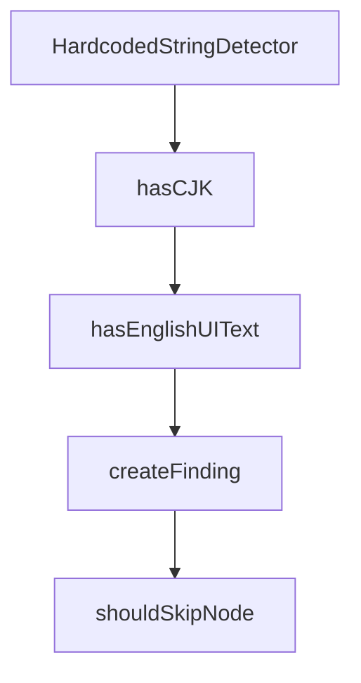

# Chapter 1: Getting Started

Welcome to **Chapter 1: Getting Started**. In this part of **Cherry Studio Tutorial: Multi-Provider AI Desktop Workspace for Teams**, you will build an intuitive mental model first, then move into concrete implementation details and practical production tradeoffs.


This chapter gets Cherry Studio running with your first model and assistant workflow.

## Learning Goals

- install Cherry Studio on desktop OS targets
- configure first provider connection
- run first multi-assistant conversation
- verify baseline local settings

## Startup Checklist

1. install latest release build
2. configure at least one provider
3. start a chat with a preconfigured assistant
4. test document input and output rendering

## Source References

- [Cherry Studio README](https://github.com/CherryHQ/cherry-studio/blob/main/README.md)
- [Cherry Studio releases](https://github.com/CherryHQ/cherry-studio/releases)

## Summary

You now have Cherry Studio installed and ready for daily AI workflows.

Next: [Chapter 2: Core Architecture and Product Model](02-core-architecture-and-product-model.md)

## Source Code Walkthrough

### `scripts/check-hardcoded-strings.ts`

The `HardcodedStringDetector` class in [`scripts/check-hardcoded-strings.ts`](https://github.com/CherryHQ/cherry-studio/blob/HEAD/scripts/check-hardcoded-strings.ts) handles a key part of this chapter's functionality:

```ts
}

class HardcodedStringDetector {
  private project: Project

  constructor() {
    this.project = new Project({
      skipAddingFilesFromTsConfig: true,
      skipFileDependencyResolution: true
    })
  }

  scanFile(filePath: string, source: 'renderer' | 'main'): Finding[] {
    const findings: Finding[] = []

    try {
      const sourceFile = this.project.addSourceFileAtPath(filePath)
      sourceFile.forEachDescendant((node) => {
        this.checkNode(node, sourceFile, source, findings)
      })
      this.project.removeSourceFile(sourceFile)
    } catch (error) {
      console.error(`Error parsing ${filePath}:`, error)
    }

    return findings
  }

  private checkNode(node: Node, sourceFile: SourceFile, source: 'renderer' | 'main', findings: Finding[]): void {
    if (shouldSkipNode(node)) return

    if (Node.isJsxText(node)) {
```

This class is important because it defines how Cherry Studio Tutorial: Multi-Provider AI Desktop Workspace for Teams implements the patterns covered in this chapter.

### `scripts/check-hardcoded-strings.ts`

The `hasCJK` function in [`scripts/check-hardcoded-strings.ts`](https://github.com/CherryHQ/cherry-studio/blob/HEAD/scripts/check-hardcoded-strings.ts) handles a key part of this chapter's functionality:

```ts
].join('')

function hasCJK(text: string): boolean {
  return new RegExp(`[${CJK_RANGES}]`).test(text)
}

function hasEnglishUIText(text: string): boolean {
  const words = text.trim().split(/\s+/)
  if (words.length < 2 || words.length > 6) return false
  return /^[A-Z][a-z]+(\s+[A-Za-z]+){1,5}$/.test(text.trim())
}

function createFinding(
  node: Node,
  sourceFile: SourceFile,
  type: 'chinese' | 'english',
  source: 'renderer' | 'main',
  nodeType: string
): Finding {
  return {
    file: sourceFile.getFilePath(),
    line: sourceFile.getLineAndColumnAtPos(node.getStart()).line,
    content: node.getText().slice(0, 100),
    type,
    source,
    nodeType
  }
}

function shouldSkipNode(node: Node): boolean {
  let current: Node | undefined = node

```

This function is important because it defines how Cherry Studio Tutorial: Multi-Provider AI Desktop Workspace for Teams implements the patterns covered in this chapter.

### `scripts/check-hardcoded-strings.ts`

The `hasEnglishUIText` function in [`scripts/check-hardcoded-strings.ts`](https://github.com/CherryHQ/cherry-studio/blob/HEAD/scripts/check-hardcoded-strings.ts) handles a key part of this chapter's functionality:

```ts
}

function hasEnglishUIText(text: string): boolean {
  const words = text.trim().split(/\s+/)
  if (words.length < 2 || words.length > 6) return false
  return /^[A-Z][a-z]+(\s+[A-Za-z]+){1,5}$/.test(text.trim())
}

function createFinding(
  node: Node,
  sourceFile: SourceFile,
  type: 'chinese' | 'english',
  source: 'renderer' | 'main',
  nodeType: string
): Finding {
  return {
    file: sourceFile.getFilePath(),
    line: sourceFile.getLineAndColumnAtPos(node.getStart()).line,
    content: node.getText().slice(0, 100),
    type,
    source,
    nodeType
  }
}

function shouldSkipNode(node: Node): boolean {
  let current: Node | undefined = node

  while (current) {
    const parent = current.getParent()
    if (!parent) break

```

This function is important because it defines how Cherry Studio Tutorial: Multi-Provider AI Desktop Workspace for Teams implements the patterns covered in this chapter.

### `scripts/check-hardcoded-strings.ts`

The `createFinding` function in [`scripts/check-hardcoded-strings.ts`](https://github.com/CherryHQ/cherry-studio/blob/HEAD/scripts/check-hardcoded-strings.ts) handles a key part of this chapter's functionality:

```ts
}

function createFinding(
  node: Node,
  sourceFile: SourceFile,
  type: 'chinese' | 'english',
  source: 'renderer' | 'main',
  nodeType: string
): Finding {
  return {
    file: sourceFile.getFilePath(),
    line: sourceFile.getLineAndColumnAtPos(node.getStart()).line,
    content: node.getText().slice(0, 100),
    type,
    source,
    nodeType
  }
}

function shouldSkipNode(node: Node): boolean {
  let current: Node | undefined = node

  while (current) {
    const parent = current.getParent()
    if (!parent) break

    if (Node.isImportDeclaration(parent) || Node.isExportDeclaration(parent)) {
      return true
    }

    if (Node.isCallExpression(parent)) {
      const callText = parent.getExpression().getText()
```

This function is important because it defines how Cherry Studio Tutorial: Multi-Provider AI Desktop Workspace for Teams implements the patterns covered in this chapter.


## How These Components Connect


