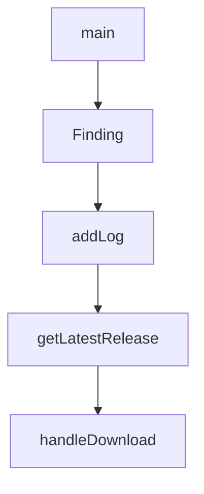

# Chapter 2: Core Architecture and Product Model

Welcome to **Chapter 2: Core Architecture and Product Model**. In this part of **Cherry Studio Tutorial: Multi-Provider AI Desktop Workspace for Teams**, you will build an intuitive mental model first, then move into concrete implementation details and practical production tradeoffs.


This chapter explains how Cherry Studio combines provider flexibility, assistant tooling, and desktop UX.

## Learning Goals

- map major functional areas of Cherry Studio
- understand cross-platform desktop operating model
- identify where MCP and assistant workflows fit
- align architecture with operational decisions

## Product Capabilities (High Level)

| Area | Capability |
|:-----|:-----------|
| provider layer | cloud + local model integrations |
| assistant layer | preconfigured and custom assistants |
| data layer | document ingestion and topic organization |
| tool layer | MCP servers and mini-program ecosystem |
| UX layer | markdown/code rendering + theme support |

## Source References

- [Cherry Studio README: key features](https://github.com/CherryHQ/cherry-studio/blob/main/README.md#-key-features)
- [Cherry Studio docs portal](https://docs.cherry-ai.com/docs/en-us)

## Summary

You now have a system-level model for how Cherry Studio organizes AI productivity workflows.

Next: [Chapter 3: Provider Configuration and Routing](03-provider-configuration-and-routing.md)

## Source Code Walkthrough

### `scripts/check-hardcoded-strings.ts`

The `main` function in [`scripts/check-hardcoded-strings.ts`](https://github.com/CherryHQ/cherry-studio/blob/HEAD/scripts/check-hardcoded-strings.ts) handles a key part of this chapter's functionality:

```ts

const RENDERER_DIR = path.join(__dirname, '../src/renderer/src')
const MAIN_DIR = path.join(__dirname, '../src/main')
const EXTENSIONS = ['.tsx', '.ts']
const IGNORED_DIRS = ['__tests__', 'node_modules', 'i18n', 'locales', 'types', 'assets']
const IGNORED_FILES = ['*.test.ts', '*.test.tsx', '*.d.ts', '*prompts*.ts']

// 'content' is handled specially - only checked for specific components
const UI_ATTRIBUTES = [
  'placeholder',
  'title',
  'label',
  'message',
  'description',
  'tooltip',
  'buttonLabel',
  'name',
  'detail',
  'body'
]

const CONTEXT_SENSITIVE_ATTRIBUTES: Record<string, string[]> = {
  content: ['Tooltip', 'Popover', 'Modal', 'Popconfirm', 'Alert', 'Notification', 'Message']
}

const UI_PROPERTIES = ['message', 'text', 'title', 'label', 'placeholder', 'description', 'detail']

interface Finding {
  file: string
  line: number
  content: string
  type: 'chinese' | 'english'
```

This function is important because it defines how Cherry Studio Tutorial: Multi-Provider AI Desktop Workspace for Teams implements the patterns covered in this chapter.

### `scripts/check-hardcoded-strings.ts`

The `Finding` interface in [`scripts/check-hardcoded-strings.ts`](https://github.com/CherryHQ/cherry-studio/blob/HEAD/scripts/check-hardcoded-strings.ts) handles a key part of this chapter's functionality:

```ts
const UI_PROPERTIES = ['message', 'text', 'title', 'label', 'placeholder', 'description', 'detail']

interface Finding {
  file: string
  line: number
  content: string
  type: 'chinese' | 'english'
  source: 'renderer' | 'main'
  nodeType: string
}

const CJK_RANGES = [
  '\u3000-\u303f', // CJK Symbols and Punctuation
  '\u3040-\u309f', // Hiragana
  '\u30a0-\u30ff', // Katakana
  '\u3100-\u312f', // Bopomofo
  '\u3400-\u4dbf', // CJK Unified Ideographs Extension A
  '\u4e00-\u9fff', // CJK Unified Ideographs
  '\uac00-\ud7af', // Hangul Syllables
  '\uf900-\ufaff' // CJK Compatibility Ideographs
].join('')

function hasCJK(text: string): boolean {
  return new RegExp(`[${CJK_RANGES}]`).test(text)
}

function hasEnglishUIText(text: string): boolean {
  const words = text.trim().split(/\s+/)
  if (words.length < 2 || words.length > 6) return false
  return /^[A-Z][a-z]+(\s+[A-Za-z]+){1,5}$/.test(text.trim())
}

```

This interface is important because it defines how Cherry Studio Tutorial: Multi-Provider AI Desktop Workspace for Teams implements the patterns covered in this chapter.

### `scripts/cloudflare-worker.js`

The `addLog` function in [`scripts/cloudflare-worker.js`](https://github.com/CherryHQ/cherry-studio/blob/HEAD/scripts/cloudflare-worker.js) handles a key part of this chapter's functionality:

```js
 * 添加日志记录函数
 */
async function addLog(env, type, event, details = null) {
  try {
    const logFile = await env.R2_BUCKET.get(config.LOG_FILE)
    let logs = { logs: [] }

    if (logFile) {
      logs = JSON.parse(await logFile.text())
    }

    logs.logs.unshift({
      timestamp: new Date().toISOString(),
      type,
      event,
      details
    })

    // 保持日志数量在限制内
    if (logs.logs.length > config.MAX_LOGS) {
      logs.logs = logs.logs.slice(0, config.MAX_LOGS)
    }

    await env.R2_BUCKET.put(config.LOG_FILE, JSON.stringify(logs, null, 2))
  } catch (error) {
    console.error('写入日志失败:', error)
  }
}

/**
 * 获取最新版本信息
 */
```

This function is important because it defines how Cherry Studio Tutorial: Multi-Provider AI Desktop Workspace for Teams implements the patterns covered in this chapter.

### `scripts/cloudflare-worker.js`

The `getLatestRelease` function in [`scripts/cloudflare-worker.js`](https://github.com/CherryHQ/cherry-studio/blob/HEAD/scripts/cloudflare-worker.js) handles a key part of this chapter's functionality:

```js
 * 获取最新版本信息
 */
async function getLatestRelease(env) {
  try {
    const cached = await env.R2_BUCKET.get(config.CACHE_KEY)
    if (!cached) {
      // 如果缓存不存在，先检查版本数据库
      const versionDB = await env.R2_BUCKET.get(config.VERSION_DB)
      if (versionDB) {
        const versions = JSON.parse(await versionDB.text())
        if (versions.latestVersion) {
          // 从版本数据库重建缓存
          const latestVersion = versions.versions[versions.latestVersion]
          const cacheData = {
            version: latestVersion.version,
            publishedAt: latestVersion.publishedAt,
            changelog: latestVersion.changelog,
            downloads: latestVersion.files
              .filter((file) => file.uploaded)
              .map((file) => ({
                name: file.name,
                url: `https://${config.R2_CUSTOM_DOMAIN}/${file.name}`,
                size: formatFileSize(file.size)
              }))
          }
          // 更新缓存
          await env.R2_BUCKET.put(config.CACHE_KEY, JSON.stringify(cacheData))
          return new Response(JSON.stringify(cacheData), {
            headers: {
              'Content-Type': 'application/json',
              'Access-Control-Allow-Origin': '*'
            }
```

This function is important because it defines how Cherry Studio Tutorial: Multi-Provider AI Desktop Workspace for Teams implements the patterns covered in this chapter.


## How These Components Connect


