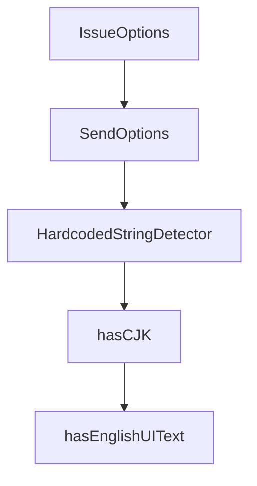

# Chapter 2: Core Architecture and Product Model

Welcome to **Chapter 2: Core Architecture and Product Model**. In this part of **Cherry Studio Tutorial: Multi-Provider AI Desktop Workspace for Teams**, you will build an intuitive mental model first, then move into concrete implementation details and practical production tradeoffs.


This chapter explains how Cherry Studio combines provider flexibility, assistant tooling, and desktop UX.

## Learning Goals

- map major functional areas of Cherry Studio
- understand cross-platform desktop operating model
- identify where MCP and assistant workflows fit
- align architecture with operational decisions

## Product Capabilities (High Level)

| Area | Capability |
|:-----|:-----------|
| provider layer | cloud + local model integrations |
| assistant layer | preconfigured and custom assistants |
| data layer | document ingestion and topic organization |
| tool layer | MCP servers and mini-program ecosystem |
| UX layer | markdown/code rendering + theme support |

## Source References

- [Cherry Studio README: key features](https://github.com/CherryHQ/cherry-studio/blob/main/README.md#-key-features)
- [Cherry Studio docs portal](https://docs.cherry-ai.com/docs/en-us)

## Summary

You now have a system-level model for how Cherry Studio organizes AI productivity workflows.

Next: [Chapter 3: Provider Configuration and Routing](03-provider-configuration-and-routing.md)

## Depth Expansion Playbook

## Source Code Walkthrough

### `scripts/feishu-notify.ts`

The `IssueOptions` interface in [`scripts/feishu-notify.ts`](https://github.com/CherryHQ/cherry-studio/blob/HEAD/scripts/feishu-notify.ts) handles a key part of this chapter's functionality:

```ts

/** Issue subcommand options */
interface IssueOptions {
  url: string
  number: string
  title: string
  summary: string
  author?: string
  labels?: string
}

/** Send subcommand options */
interface SendOptions {
  title: string
  description: string
  color?: string
}

/**
 * Generate Feishu webhook signature using HMAC-SHA256
 * @param secret - Feishu webhook secret
 * @param timestamp - Unix timestamp in seconds
 * @returns Base64 encoded signature
 */
function generateSignature(secret: string, timestamp: number): string {
  const stringToSign = `${timestamp}\n${secret}`
  const hmac = crypto.createHmac('sha256', stringToSign)
  return hmac.digest('base64')
}

/**
 * Send message to Feishu webhook
```

This interface is important because it defines how Cherry Studio Tutorial: Multi-Provider AI Desktop Workspace for Teams implements the patterns covered in this chapter.

### `scripts/feishu-notify.ts`

The `SendOptions` interface in [`scripts/feishu-notify.ts`](https://github.com/CherryHQ/cherry-studio/blob/HEAD/scripts/feishu-notify.ts) handles a key part of this chapter's functionality:

```ts

/** Send subcommand options */
interface SendOptions {
  title: string
  description: string
  color?: string
}

/**
 * Generate Feishu webhook signature using HMAC-SHA256
 * @param secret - Feishu webhook secret
 * @param timestamp - Unix timestamp in seconds
 * @returns Base64 encoded signature
 */
function generateSignature(secret: string, timestamp: number): string {
  const stringToSign = `${timestamp}\n${secret}`
  const hmac = crypto.createHmac('sha256', stringToSign)
  return hmac.digest('base64')
}

/**
 * Send message to Feishu webhook
 * @param webhookUrl - Feishu webhook URL
 * @param secret - Feishu webhook secret
 * @param content - Feishu card message content
 * @returns Resolves when message is sent successfully
 * @throws When Feishu API returns non-2xx status code or network error occurs
 */
function sendToFeishu(webhookUrl: string, secret: string, content: FeishuCard): Promise<void> {
  return new Promise((resolve, reject) => {
    const timestamp = Math.floor(Date.now() / 1000)
    const sign = generateSignature(secret, timestamp)
```

This interface is important because it defines how Cherry Studio Tutorial: Multi-Provider AI Desktop Workspace for Teams implements the patterns covered in this chapter.

### `scripts/check-hardcoded-strings.ts`

The `HardcodedStringDetector` class in [`scripts/check-hardcoded-strings.ts`](https://github.com/CherryHQ/cherry-studio/blob/HEAD/scripts/check-hardcoded-strings.ts) handles a key part of this chapter's functionality:

```ts
}

class HardcodedStringDetector {
  private project: Project

  constructor() {
    this.project = new Project({
      skipAddingFilesFromTsConfig: true,
      skipFileDependencyResolution: true
    })
  }

  scanFile(filePath: string, source: 'renderer' | 'main'): Finding[] {
    const findings: Finding[] = []

    try {
      const sourceFile = this.project.addSourceFileAtPath(filePath)
      sourceFile.forEachDescendant((node) => {
        this.checkNode(node, sourceFile, source, findings)
      })
      this.project.removeSourceFile(sourceFile)
    } catch (error) {
      console.error(`Error parsing ${filePath}:`, error)
    }

    return findings
  }

  private checkNode(node: Node, sourceFile: SourceFile, source: 'renderer' | 'main', findings: Finding[]): void {
    if (shouldSkipNode(node)) return

    if (Node.isJsxText(node)) {
```

This class is important because it defines how Cherry Studio Tutorial: Multi-Provider AI Desktop Workspace for Teams implements the patterns covered in this chapter.

### `scripts/check-hardcoded-strings.ts`

The `hasCJK` function in [`scripts/check-hardcoded-strings.ts`](https://github.com/CherryHQ/cherry-studio/blob/HEAD/scripts/check-hardcoded-strings.ts) handles a key part of this chapter's functionality:

```ts
].join('')

function hasCJK(text: string): boolean {
  return new RegExp(`[${CJK_RANGES}]`).test(text)
}

function hasEnglishUIText(text: string): boolean {
  const words = text.trim().split(/\s+/)
  if (words.length < 2 || words.length > 6) return false
  return /^[A-Z][a-z]+(\s+[A-Za-z]+){1,5}$/.test(text.trim())
}

function createFinding(
  node: Node,
  sourceFile: SourceFile,
  type: 'chinese' | 'english',
  source: 'renderer' | 'main',
  nodeType: string
): Finding {
  return {
    file: sourceFile.getFilePath(),
    line: sourceFile.getLineAndColumnAtPos(node.getStart()).line,
    content: node.getText().slice(0, 100),
    type,
    source,
    nodeType
  }
}

function shouldSkipNode(node: Node): boolean {
  let current: Node | undefined = node

```

This function is important because it defines how Cherry Studio Tutorial: Multi-Provider AI Desktop Workspace for Teams implements the patterns covered in this chapter.


## How These Components Connect


