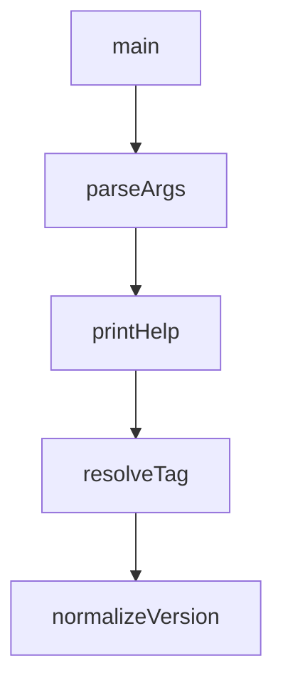

# Chapter 3: Provider Configuration and Routing

Welcome to **Chapter 3: Provider Configuration and Routing**. In this part of **Cherry Studio Tutorial: Multi-Provider AI Desktop Workspace for Teams**, you will build an intuitive mental model first, then move into concrete implementation details and practical production tradeoffs.


This chapter covers safe configuration across multiple cloud and local model providers.

## Learning Goals

- configure provider credentials and model options
- combine cloud and local model paths
- design fallback and cost-aware routing patterns
- reduce provider drift across team usage

## Provider Categories

| Category | Examples |
|:---------|:---------|
| cloud model APIs | OpenAI, Gemini, Anthropic and others |
| web service integrations | Claude, Perplexity, Poe |
| local model runtimes | Ollama, LM Studio |

## Control Practices

- keep credentials centralized and rotated
- define approved model list per task class
- separate exploratory and production model presets

## Source References

- [Cherry Studio README: provider support](https://github.com/CherryHQ/cherry-studio/blob/main/README.md#-key-features)
- [Cherry Studio docs](https://docs.cherry-ai.com/docs/en-us)

## Summary

You now can configure provider routing in Cherry Studio with better reliability and governance.

Next: [Chapter 4: Assistants, Topics, and Workflow Design](04-assistants-topics-and-workflow-design.md)

## Source Code Walkthrough

### `scripts/update-app-upgrade-config.ts`

The `main` function in [`scripts/update-app-upgrade-config.ts`](https://github.com/CherryHQ/cherry-studio/blob/HEAD/scripts/update-app-upgrade-config.ts) handles a key part of this chapter's functionality:

```ts
const DEFAULT_SEGMENTS_PATH = path.join(ROOT_DIR, 'config/app-upgrade-segments.json')

async function main() {
  const options = parseArgs()
  const releaseTag = resolveTag(options)
  const normalizedVersion = normalizeVersion(releaseTag)
  const releaseChannel = detectChannel(normalizedVersion)
  if (!releaseChannel) {
    console.warn(`[update-app-upgrade-config] Tag ${normalizedVersion} does not map to beta/rc/latest. Skipping.`)
    return
  }

  // Validate version format matches prerelease status
  if (options.isPrerelease !== undefined) {
    const hasPrereleaseSuffix = releaseChannel === 'beta' || releaseChannel === 'rc'

    if (options.isPrerelease && !hasPrereleaseSuffix) {
      console.warn(
        `[update-app-upgrade-config] ⚠️  Release marked as prerelease but version ${normalizedVersion} has no beta/rc suffix. Skipping.`
      )
      return
    }

    if (!options.isPrerelease && hasPrereleaseSuffix) {
      console.warn(
        `[update-app-upgrade-config] ⚠️  Release marked as latest but version ${normalizedVersion} has prerelease suffix (${releaseChannel}). Skipping.`
      )
      return
    }
  }

  const [config, segmentFile] = await Promise.all([
```

This function is important because it defines how Cherry Studio Tutorial: Multi-Provider AI Desktop Workspace for Teams implements the patterns covered in this chapter.

### `scripts/update-app-upgrade-config.ts`

The `parseArgs` function in [`scripts/update-app-upgrade-config.ts`](https://github.com/CherryHQ/cherry-studio/blob/HEAD/scripts/update-app-upgrade-config.ts) handles a key part of this chapter's functionality:

```ts

async function main() {
  const options = parseArgs()
  const releaseTag = resolveTag(options)
  const normalizedVersion = normalizeVersion(releaseTag)
  const releaseChannel = detectChannel(normalizedVersion)
  if (!releaseChannel) {
    console.warn(`[update-app-upgrade-config] Tag ${normalizedVersion} does not map to beta/rc/latest. Skipping.`)
    return
  }

  // Validate version format matches prerelease status
  if (options.isPrerelease !== undefined) {
    const hasPrereleaseSuffix = releaseChannel === 'beta' || releaseChannel === 'rc'

    if (options.isPrerelease && !hasPrereleaseSuffix) {
      console.warn(
        `[update-app-upgrade-config] ⚠️  Release marked as prerelease but version ${normalizedVersion} has no beta/rc suffix. Skipping.`
      )
      return
    }

    if (!options.isPrerelease && hasPrereleaseSuffix) {
      console.warn(
        `[update-app-upgrade-config] ⚠️  Release marked as latest but version ${normalizedVersion} has prerelease suffix (${releaseChannel}). Skipping.`
      )
      return
    }
  }

  const [config, segmentFile] = await Promise.all([
    readJson<UpgradeConfigFile>(options.configPath ?? DEFAULT_CONFIG_PATH),
```

This function is important because it defines how Cherry Studio Tutorial: Multi-Provider AI Desktop Workspace for Teams implements the patterns covered in this chapter.

### `scripts/update-app-upgrade-config.ts`

The `printHelp` function in [`scripts/update-app-upgrade-config.ts`](https://github.com/CherryHQ/cherry-studio/blob/HEAD/scripts/update-app-upgrade-config.ts) handles a key part of this chapter's functionality:

```ts
      i += 1
    } else if (arg === '--help') {
      printHelp()
      process.exit(0)
    } else {
      console.warn(`Ignoring unknown argument "${arg}"`)
    }
  }

  if (options.skipReleaseChecks && !options.dryRun) {
    throw new Error('--skip-release-checks can only be used together with --dry-run')
  }

  return options
}

function printHelp() {
  console.log(`Usage: tsx scripts/update-app-upgrade-config.ts [options]

Options:
  --tag <tag>         Release tag (e.g. v2.1.6). Falls back to GITHUB_REF_NAME/RELEASE_TAG.
  --config <path>     Path to app-upgrade-config.json.
  --segments <path>   Path to app-upgrade-segments.json.
  --is-prerelease <true|false>  Whether this is a prerelease (validates version format).
  --dry-run           Print the result without writing to disk.
  --skip-release-checks  Skip release page availability checks (only valid with --dry-run).
  --help              Show this help message.`)
}

function resolveTag(options: CliOptions): string {
  const envTag = process.env.RELEASE_TAG ?? process.env.GITHUB_REF_NAME ?? process.env.TAG_NAME
  const tag = options.tag ?? envTag
```

This function is important because it defines how Cherry Studio Tutorial: Multi-Provider AI Desktop Workspace for Teams implements the patterns covered in this chapter.

### `scripts/update-app-upgrade-config.ts`

The `resolveTag` function in [`scripts/update-app-upgrade-config.ts`](https://github.com/CherryHQ/cherry-studio/blob/HEAD/scripts/update-app-upgrade-config.ts) handles a key part of this chapter's functionality:

```ts
async function main() {
  const options = parseArgs()
  const releaseTag = resolveTag(options)
  const normalizedVersion = normalizeVersion(releaseTag)
  const releaseChannel = detectChannel(normalizedVersion)
  if (!releaseChannel) {
    console.warn(`[update-app-upgrade-config] Tag ${normalizedVersion} does not map to beta/rc/latest. Skipping.`)
    return
  }

  // Validate version format matches prerelease status
  if (options.isPrerelease !== undefined) {
    const hasPrereleaseSuffix = releaseChannel === 'beta' || releaseChannel === 'rc'

    if (options.isPrerelease && !hasPrereleaseSuffix) {
      console.warn(
        `[update-app-upgrade-config] ⚠️  Release marked as prerelease but version ${normalizedVersion} has no beta/rc suffix. Skipping.`
      )
      return
    }

    if (!options.isPrerelease && hasPrereleaseSuffix) {
      console.warn(
        `[update-app-upgrade-config] ⚠️  Release marked as latest but version ${normalizedVersion} has prerelease suffix (${releaseChannel}). Skipping.`
      )
      return
    }
  }

  const [config, segmentFile] = await Promise.all([
    readJson<UpgradeConfigFile>(options.configPath ?? DEFAULT_CONFIG_PATH),
    readJson<SegmentMetadataFile>(options.segmentsPath ?? DEFAULT_SEGMENTS_PATH)
```

This function is important because it defines how Cherry Studio Tutorial: Multi-Provider AI Desktop Workspace for Teams implements the patterns covered in this chapter.


## How These Components Connect


