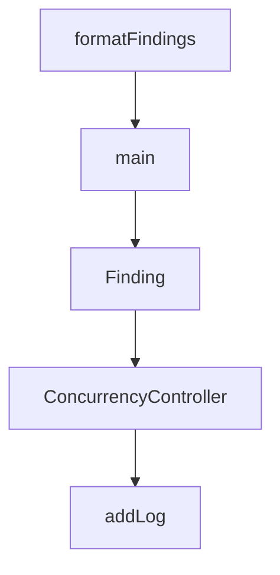

# Chapter 3: Provider Configuration and Routing

Welcome to **Chapter 3: Provider Configuration and Routing**. In this part of **Cherry Studio Tutorial: Multi-Provider AI Desktop Workspace for Teams**, you will build an intuitive mental model first, then move into concrete implementation details and practical production tradeoffs.


This chapter covers safe configuration across multiple cloud and local model providers.

## Learning Goals

- configure provider credentials and model options
- combine cloud and local model paths
- design fallback and cost-aware routing patterns
- reduce provider drift across team usage

## Provider Categories

| Category | Examples |
|:---------|:---------|
| cloud model APIs | OpenAI, Gemini, Anthropic and others |
| web service integrations | Claude, Perplexity, Poe |
| local model runtimes | Ollama, LM Studio |

## Control Practices

- keep credentials centralized and rotated
- define approved model list per task class
- separate exploratory and production model presets

## Source References

- [Cherry Studio README: provider support](https://github.com/CherryHQ/cherry-studio/blob/main/README.md#-key-features)
- [Cherry Studio docs](https://docs.cherry-ai.com/docs/en-us)

## Summary

You now can configure provider routing in Cherry Studio with better reliability and governance.

Next: [Chapter 4: Assistants, Topics, and Workflow Design](04-assistants-topics-and-workflow-design.md)

## Depth Expansion Playbook

## Source Code Walkthrough

### `scripts/check-hardcoded-strings.ts`

The `formatFindings` function in [`scripts/check-hardcoded-strings.ts`](https://github.com/CherryHQ/cherry-studio/blob/HEAD/scripts/check-hardcoded-strings.ts) handles a key part of this chapter's functionality:

```ts
}

function formatFindings(findings: Finding[]): string {
  if (findings.length === 0) {
    return '✅ No hardcoded strings found!'
  }

  const rendererFindings = findings.filter((f) => f.source === 'renderer')
  const mainFindings = findings.filter((f) => f.source === 'main')
  const chineseFindings = findings.filter((f) => f.type === 'chinese')
  const englishFindings = findings.filter((f) => f.type === 'english')

  let output = ''

  if (rendererFindings.length > 0) {
    output += '\n📦 Renderer Process:\n'
    output += '-'.repeat(50) + '\n'

    const rendererChinese = rendererFindings.filter((f) => f.type === 'chinese')
    const rendererEnglish = rendererFindings.filter((f) => f.type === 'english')

    if (rendererChinese.length > 0) {
      output += '\n⚠️ Hardcoded Chinese strings:\n'
      rendererChinese.forEach((f) => {
        const relativePath = path.relative(RENDERER_DIR, f.file)
        output += `\n📍 ${relativePath}:${f.line} [${f.nodeType}]\n`
        output += `   ${f.content}\n`
      })
    }

    if (rendererEnglish.length > 0) {
      output += '\n⚠️ Potential hardcoded English strings:\n'
```

This function is important because it defines how Cherry Studio Tutorial: Multi-Provider AI Desktop Workspace for Teams implements the patterns covered in this chapter.

### `scripts/check-hardcoded-strings.ts`

The `main` function in [`scripts/check-hardcoded-strings.ts`](https://github.com/CherryHQ/cherry-studio/blob/HEAD/scripts/check-hardcoded-strings.ts) handles a key part of this chapter's functionality:

```ts

const RENDERER_DIR = path.join(__dirname, '../src/renderer/src')
const MAIN_DIR = path.join(__dirname, '../src/main')
const EXTENSIONS = ['.tsx', '.ts']
const IGNORED_DIRS = ['__tests__', 'node_modules', 'i18n', 'locales', 'types', 'assets']
const IGNORED_FILES = ['*.test.ts', '*.test.tsx', '*.d.ts', '*prompts*.ts']

// 'content' is handled specially - only checked for specific components
const UI_ATTRIBUTES = [
  'placeholder',
  'title',
  'label',
  'message',
  'description',
  'tooltip',
  'buttonLabel',
  'name',
  'detail',
  'body'
]

const CONTEXT_SENSITIVE_ATTRIBUTES: Record<string, string[]> = {
  content: ['Tooltip', 'Popover', 'Modal', 'Popconfirm', 'Alert', 'Notification', 'Message']
}

const UI_PROPERTIES = ['message', 'text', 'title', 'label', 'placeholder', 'description', 'detail']

interface Finding {
  file: string
  line: number
  content: string
  type: 'chinese' | 'english'
```

This function is important because it defines how Cherry Studio Tutorial: Multi-Provider AI Desktop Workspace for Teams implements the patterns covered in this chapter.

### `scripts/check-hardcoded-strings.ts`

The `Finding` interface in [`scripts/check-hardcoded-strings.ts`](https://github.com/CherryHQ/cherry-studio/blob/HEAD/scripts/check-hardcoded-strings.ts) handles a key part of this chapter's functionality:

```ts
const UI_PROPERTIES = ['message', 'text', 'title', 'label', 'placeholder', 'description', 'detail']

interface Finding {
  file: string
  line: number
  content: string
  type: 'chinese' | 'english'
  source: 'renderer' | 'main'
  nodeType: string
}

const CJK_RANGES = [
  '\u3000-\u303f', // CJK Symbols and Punctuation
  '\u3040-\u309f', // Hiragana
  '\u30a0-\u30ff', // Katakana
  '\u3100-\u312f', // Bopomofo
  '\u3400-\u4dbf', // CJK Unified Ideographs Extension A
  '\u4e00-\u9fff', // CJK Unified Ideographs
  '\uac00-\ud7af', // Hangul Syllables
  '\uf900-\ufaff' // CJK Compatibility Ideographs
].join('')

function hasCJK(text: string): boolean {
  return new RegExp(`[${CJK_RANGES}]`).test(text)
}

function hasEnglishUIText(text: string): boolean {
  const words = text.trim().split(/\s+/)
  if (words.length < 2 || words.length > 6) return false
  return /^[A-Z][a-z]+(\s+[A-Za-z]+){1,5}$/.test(text.trim())
}

```

This interface is important because it defines how Cherry Studio Tutorial: Multi-Provider AI Desktop Workspace for Teams implements the patterns covered in this chapter.

### `scripts/auto-translate-i18n.ts`

The `ConcurrencyController` class in [`scripts/auto-translate-i18n.ts`](https://github.com/CherryHQ/cherry-studio/blob/HEAD/scripts/auto-translate-i18n.ts) handles a key part of this chapter's functionality:

```ts

// Concurrency Control with ES6+ features
class ConcurrencyController {
  private running = 0
  private queue: Array<() => Promise<any>> = []

  constructor(private maxConcurrent: number) {}

  async add<T>(task: () => Promise<T>): Promise<T> {
    return new Promise((resolve, reject) => {
      const execute = async () => {
        this.running++
        try {
          const result = await task()
          resolve(result)
        } catch (error) {
          reject(error)
        } finally {
          this.running--
          this.processQueue()
        }
      }

      if (this.running < this.maxConcurrent) {
        execute()
      } else {
        this.queue.push(execute)
      }
    })
  }

  private processQueue() {
```

This class is important because it defines how Cherry Studio Tutorial: Multi-Provider AI Desktop Workspace for Teams implements the patterns covered in this chapter.


## How These Components Connect


