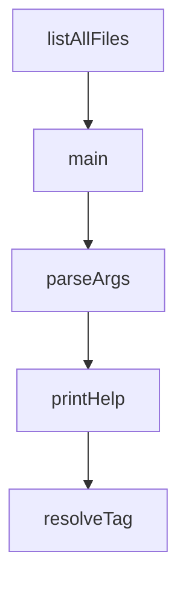

# Chapter 4: Assistants, Topics, and Workflow Design

Welcome to **Chapter 4: Assistants, Topics, and Workflow Design**. In this part of **Cherry Studio Tutorial: Multi-Provider AI Desktop Workspace for Teams**, you will build an intuitive mental model first, then move into concrete implementation details and practical production tradeoffs.


This chapter focuses on structuring assistants and conversations for high throughput.

## Learning Goals

- use preconfigured assistants effectively
- create focused custom assistants for specific task types
- organize topics for retrieval and long-running work
- support multi-model conversation strategies

## Workflow Pattern

1. choose assistant role aligned to task
2. bind preferred model/provider profile
3. organize conversation in topic hierarchy
4. iterate and refine prompts with reusable templates

## Source References

- [Cherry Studio README: assistants and conversations](https://github.com/CherryHQ/cherry-studio/blob/main/README.md#-key-features)
- [Cherry Studio discussions](https://github.com/CherryHQ/cherry-studio/discussions)

## Summary

You now have a practical structure for assistant- and topic-driven workflows in Cherry Studio.

Next: [Chapter 5: Documents, MCP, and Tool Integrations](05-documents-mcp-and-tool-integrations.md)

## Depth Expansion Playbook

## Source Code Walkthrough

### `scripts/cloudflare-worker.js`

The `listAllFiles` function in [`scripts/cloudflare-worker.js`](https://github.com/CherryHQ/cherry-studio/blob/HEAD/scripts/cloudflare-worker.js) handles a key part of this chapter's functionality:

```js

        // 先获取 R2 桶中的所有文件列表
        const allFiles = await listAllFiles(env)

        // 获取需要保留的文件名列表
        const keepFiles = new Set()
        for (const keepVersion of keepVersions) {
          const versionFiles = versions.versions[keepVersion].files
          versionFiles.forEach((file) => keepFiles.add(file.name))
        }

        // 删除所有旧版本文件
        for (const oldVersion of oldVersions) {
          const oldFiles = versions.versions[oldVersion].files
          for (const file of oldFiles) {
            try {
              if (file.uploaded) {
                await env.R2_BUCKET.delete(file.name)
                await addLog(env, 'INFO', `删除旧文件: ${file.name}`)
              }
            } catch (error) {
              await addLog(env, 'ERROR', `删除旧文件失败: ${file.name}`, error.message)
            }
          }
          delete versions.versions[oldVersion]
        }

        // 清理可能遗留的旧文件
        for (const file of allFiles) {
          if (!keepFiles.has(file.name)) {
            try {
              await env.R2_BUCKET.delete(file.name)
```

This function is important because it defines how Cherry Studio Tutorial: Multi-Provider AI Desktop Workspace for Teams implements the patterns covered in this chapter.

### `scripts/update-app-upgrade-config.ts`

The `main` function in [`scripts/update-app-upgrade-config.ts`](https://github.com/CherryHQ/cherry-studio/blob/HEAD/scripts/update-app-upgrade-config.ts) handles a key part of this chapter's functionality:

```ts
const DEFAULT_SEGMENTS_PATH = path.join(ROOT_DIR, 'config/app-upgrade-segments.json')

async function main() {
  const options = parseArgs()
  const releaseTag = resolveTag(options)
  const normalizedVersion = normalizeVersion(releaseTag)
  const releaseChannel = detectChannel(normalizedVersion)
  if (!releaseChannel) {
    console.warn(`[update-app-upgrade-config] Tag ${normalizedVersion} does not map to beta/rc/latest. Skipping.`)
    return
  }

  // Validate version format matches prerelease status
  if (options.isPrerelease !== undefined) {
    const hasPrereleaseSuffix = releaseChannel === 'beta' || releaseChannel === 'rc'

    if (options.isPrerelease && !hasPrereleaseSuffix) {
      console.warn(
        `[update-app-upgrade-config] ⚠️  Release marked as prerelease but version ${normalizedVersion} has no beta/rc suffix. Skipping.`
      )
      return
    }

    if (!options.isPrerelease && hasPrereleaseSuffix) {
      console.warn(
        `[update-app-upgrade-config] ⚠️  Release marked as latest but version ${normalizedVersion} has prerelease suffix (${releaseChannel}). Skipping.`
      )
      return
    }
  }

  const [config, segmentFile] = await Promise.all([
```

This function is important because it defines how Cherry Studio Tutorial: Multi-Provider AI Desktop Workspace for Teams implements the patterns covered in this chapter.

### `scripts/update-app-upgrade-config.ts`

The `parseArgs` function in [`scripts/update-app-upgrade-config.ts`](https://github.com/CherryHQ/cherry-studio/blob/HEAD/scripts/update-app-upgrade-config.ts) handles a key part of this chapter's functionality:

```ts

async function main() {
  const options = parseArgs()
  const releaseTag = resolveTag(options)
  const normalizedVersion = normalizeVersion(releaseTag)
  const releaseChannel = detectChannel(normalizedVersion)
  if (!releaseChannel) {
    console.warn(`[update-app-upgrade-config] Tag ${normalizedVersion} does not map to beta/rc/latest. Skipping.`)
    return
  }

  // Validate version format matches prerelease status
  if (options.isPrerelease !== undefined) {
    const hasPrereleaseSuffix = releaseChannel === 'beta' || releaseChannel === 'rc'

    if (options.isPrerelease && !hasPrereleaseSuffix) {
      console.warn(
        `[update-app-upgrade-config] ⚠️  Release marked as prerelease but version ${normalizedVersion} has no beta/rc suffix. Skipping.`
      )
      return
    }

    if (!options.isPrerelease && hasPrereleaseSuffix) {
      console.warn(
        `[update-app-upgrade-config] ⚠️  Release marked as latest but version ${normalizedVersion} has prerelease suffix (${releaseChannel}). Skipping.`
      )
      return
    }
  }

  const [config, segmentFile] = await Promise.all([
    readJson<UpgradeConfigFile>(options.configPath ?? DEFAULT_CONFIG_PATH),
```

This function is important because it defines how Cherry Studio Tutorial: Multi-Provider AI Desktop Workspace for Teams implements the patterns covered in this chapter.

### `scripts/update-app-upgrade-config.ts`

The `printHelp` function in [`scripts/update-app-upgrade-config.ts`](https://github.com/CherryHQ/cherry-studio/blob/HEAD/scripts/update-app-upgrade-config.ts) handles a key part of this chapter's functionality:

```ts
      i += 1
    } else if (arg === '--help') {
      printHelp()
      process.exit(0)
    } else {
      console.warn(`Ignoring unknown argument "${arg}"`)
    }
  }

  if (options.skipReleaseChecks && !options.dryRun) {
    throw new Error('--skip-release-checks can only be used together with --dry-run')
  }

  return options
}

function printHelp() {
  console.log(`Usage: tsx scripts/update-app-upgrade-config.ts [options]

Options:
  --tag <tag>         Release tag (e.g. v2.1.6). Falls back to GITHUB_REF_NAME/RELEASE_TAG.
  --config <path>     Path to app-upgrade-config.json.
  --segments <path>   Path to app-upgrade-segments.json.
  --is-prerelease <true|false>  Whether this is a prerelease (validates version format).
  --dry-run           Print the result without writing to disk.
  --skip-release-checks  Skip release page availability checks (only valid with --dry-run).
  --help              Show this help message.`)
}

function resolveTag(options: CliOptions): string {
  const envTag = process.env.RELEASE_TAG ?? process.env.GITHUB_REF_NAME ?? process.env.TAG_NAME
  const tag = options.tag ?? envTag
```

This function is important because it defines how Cherry Studio Tutorial: Multi-Provider AI Desktop Workspace for Teams implements the patterns covered in this chapter.


## How These Components Connect


