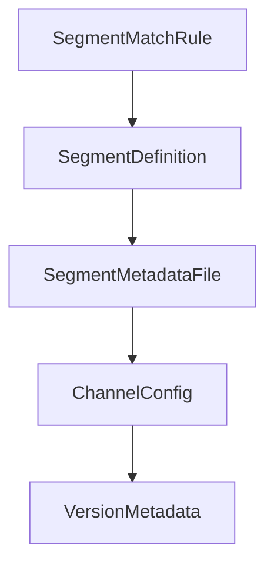

# Chapter 5: Documents, MCP, and Tool Integrations

Welcome to **Chapter 5: Documents, MCP, and Tool Integrations**. In this part of **Cherry Studio Tutorial: Multi-Provider AI Desktop Workspace for Teams**, you will build an intuitive mental model first, then move into concrete implementation details and practical production tradeoffs.


This chapter covers practical integration workflows combining content, tools, and context protocols.

## Learning Goals

- use mixed document formats as model input
- configure and operate MCP server integrations
- leverage mini programs and utility tools safely
- keep shared context quality high

## Integration Areas

| Area | Examples |
|:-----|:---------|
| document processing | text/image/office/PDF handling |
| tooling | MCP server integrations, mini-programs |
| knowledge sync | WebDAV backup and file management |

## Source References

- [Cherry Studio README: document and tool integrations](https://github.com/CherryHQ/cherry-studio/blob/main/README.md#-key-features)
- [Cherry Studio docs](https://docs.cherry-ai.com/docs/en-us)

## Summary

You now know how to combine documents and MCP tooling in Cherry Studio workflows.

Next: [Chapter 6: Team Adoption and Enterprise Capabilities](06-team-adoption-and-enterprise-capabilities.md)

## Source Code Walkthrough

### `scripts/update-app-upgrade-config.ts`

The `SegmentMatchRule` interface in [`scripts/update-app-upgrade-config.ts`](https://github.com/CherryHQ/cherry-studio/blob/HEAD/scripts/update-app-upgrade-config.ts) handles a key part of this chapter's functionality:

```ts
}

interface SegmentMatchRule {
  range?: string
  exact?: string[]
  excludeExact?: string[]
}

interface SegmentDefinition {
  id: string
  type: 'legacy' | 'breaking' | 'latest'
  match: SegmentMatchRule
  lockedVersion?: string
  minCompatibleVersion: string
  description: string
  channelTemplates?: Partial<Record<UpgradeChannel, ChannelTemplateConfig>>
}

interface SegmentMetadataFile {
  segments: SegmentDefinition[]
}

interface ChannelConfig {
  version: string
  feedUrls: Record<UpdateMirror, string>
}

interface VersionMetadata {
  segmentId: string
  segmentType?: string
}

```

This interface is important because it defines how Cherry Studio Tutorial: Multi-Provider AI Desktop Workspace for Teams implements the patterns covered in this chapter.

### `scripts/update-app-upgrade-config.ts`

The `SegmentDefinition` interface in [`scripts/update-app-upgrade-config.ts`](https://github.com/CherryHQ/cherry-studio/blob/HEAD/scripts/update-app-upgrade-config.ts) handles a key part of this chapter's functionality:

```ts
}

interface SegmentDefinition {
  id: string
  type: 'legacy' | 'breaking' | 'latest'
  match: SegmentMatchRule
  lockedVersion?: string
  minCompatibleVersion: string
  description: string
  channelTemplates?: Partial<Record<UpgradeChannel, ChannelTemplateConfig>>
}

interface SegmentMetadataFile {
  segments: SegmentDefinition[]
}

interface ChannelConfig {
  version: string
  feedUrls: Record<UpdateMirror, string>
}

interface VersionMetadata {
  segmentId: string
  segmentType?: string
}

interface VersionEntry {
  metadata?: VersionMetadata
  minCompatibleVersion: string
  description: string
  channels: Record<UpgradeChannel, ChannelConfig | null>
}
```

This interface is important because it defines how Cherry Studio Tutorial: Multi-Provider AI Desktop Workspace for Teams implements the patterns covered in this chapter.

### `scripts/update-app-upgrade-config.ts`

The `SegmentMetadataFile` interface in [`scripts/update-app-upgrade-config.ts`](https://github.com/CherryHQ/cherry-studio/blob/HEAD/scripts/update-app-upgrade-config.ts) handles a key part of this chapter's functionality:

```ts
}

interface SegmentMetadataFile {
  segments: SegmentDefinition[]
}

interface ChannelConfig {
  version: string
  feedUrls: Record<UpdateMirror, string>
}

interface VersionMetadata {
  segmentId: string
  segmentType?: string
}

interface VersionEntry {
  metadata?: VersionMetadata
  minCompatibleVersion: string
  description: string
  channels: Record<UpgradeChannel, ChannelConfig | null>
}

interface UpgradeConfigFile {
  lastUpdated: string
  versions: Record<string, VersionEntry>
}

interface ReleaseInfo {
  tag: string
  version: string
  channel: UpgradeChannel
```

This interface is important because it defines how Cherry Studio Tutorial: Multi-Provider AI Desktop Workspace for Teams implements the patterns covered in this chapter.

### `scripts/update-app-upgrade-config.ts`

The `ChannelConfig` interface in [`scripts/update-app-upgrade-config.ts`](https://github.com/CherryHQ/cherry-studio/blob/HEAD/scripts/update-app-upgrade-config.ts) handles a key part of this chapter's functionality:

```ts
}

interface ChannelConfig {
  version: string
  feedUrls: Record<UpdateMirror, string>
}

interface VersionMetadata {
  segmentId: string
  segmentType?: string
}

interface VersionEntry {
  metadata?: VersionMetadata
  minCompatibleVersion: string
  description: string
  channels: Record<UpgradeChannel, ChannelConfig | null>
}

interface UpgradeConfigFile {
  lastUpdated: string
  versions: Record<string, VersionEntry>
}

interface ReleaseInfo {
  tag: string
  version: string
  channel: UpgradeChannel
}

interface UpdateVersionsResult {
  versions: Record<string, VersionEntry>
```

This interface is important because it defines how Cherry Studio Tutorial: Multi-Provider AI Desktop Workspace for Teams implements the patterns covered in this chapter.


## How These Components Connect


