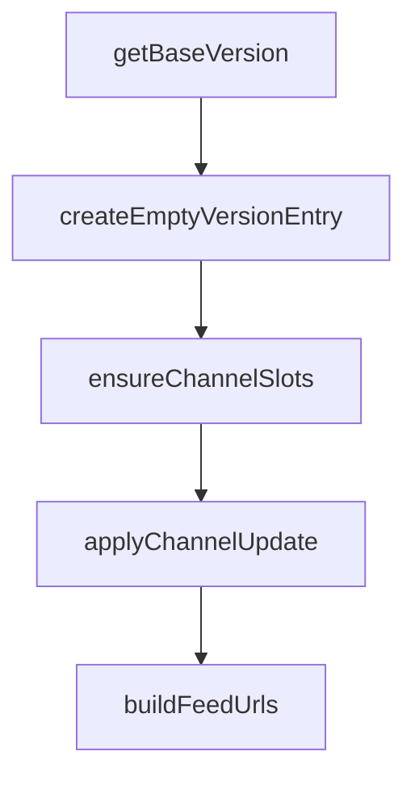

# Chapter 5: Documents, MCP, and Tool Integrations

Welcome to **Chapter 5: Documents, MCP, and Tool Integrations**. In this part of **Cherry Studio Tutorial: Multi-Provider AI Desktop Workspace for Teams**, you will build an intuitive mental model first, then move into concrete implementation details and practical production tradeoffs.


This chapter covers practical integration workflows combining content, tools, and context protocols.

## Learning Goals

- use mixed document formats as model input
- configure and operate MCP server integrations
- leverage mini programs and utility tools safely
- keep shared context quality high

## Integration Areas

| Area | Examples |
|:-----|:---------|
| document processing | text/image/office/PDF handling |
| tooling | MCP server integrations, mini-programs |
| knowledge sync | WebDAV backup and file management |

## Source References

- [Cherry Studio README: document and tool integrations](https://github.com/CherryHQ/cherry-studio/blob/main/README.md#-key-features)
- [Cherry Studio docs](https://docs.cherry-ai.com/docs/en-us)

## Summary

You now know how to combine documents and MCP tooling in Cherry Studio workflows.

Next: [Chapter 6: Team Adoption and Enterprise Capabilities](06-team-adoption-and-enterprise-capabilities.md)

## Depth Expansion Playbook

## Source Code Walkthrough

### `scripts/update-app-upgrade-config.ts`

The `getBaseVersion` function in [`scripts/update-app-upgrade-config.ts`](https://github.com/CherryHQ/cherry-studio/blob/HEAD/scripts/update-app-upgrade-config.ts) handles a key part of this chapter's functionality:

```ts
  }

  const baseVersion = getBaseVersion(releaseInfo.version)
  return baseVersion ?? releaseInfo.version
}

function getBaseVersion(version: string): string | null {
  const parsed = semver.parse(version, { loose: true })
  if (!parsed) {
    return null
  }
  return `${parsed.major}.${parsed.minor}.${parsed.patch}`
}

function createEmptyVersionEntry(): VersionEntry {
  return {
    minCompatibleVersion: '',
    description: '',
    channels: {
      latest: null,
      rc: null,
      beta: null
    }
  }
}

function ensureChannelSlots(
  channels: Record<UpgradeChannel, ChannelConfig | null>
): Record<UpgradeChannel, ChannelConfig | null> {
  return CHANNELS.reduce(
    (acc, channel) => {
      acc[channel] = channels[channel] ?? null
```

This function is important because it defines how Cherry Studio Tutorial: Multi-Provider AI Desktop Workspace for Teams implements the patterns covered in this chapter.

### `scripts/update-app-upgrade-config.ts`

The `createEmptyVersionEntry` function in [`scripts/update-app-upgrade-config.ts`](https://github.com/CherryHQ/cherry-studio/blob/HEAD/scripts/update-app-upgrade-config.ts) handles a key part of this chapter's functionality:

```ts
    entry = { ...versionsCopy[existingKey], channels: { ...versionsCopy[existingKey].channels } }
  } else {
    entry = createEmptyVersionEntry()
  }

  entry.channels = ensureChannelSlots(entry.channels)

  const channelUpdated = await applyChannelUpdate(entry, segment, releaseInfo, skipReleaseValidation)
  if (!channelUpdated) {
    return { versions, updated: false }
  }

  if (shouldRename && existingKey) {
    delete versionsCopy[existingKey]
  }

  entry.metadata = {
    segmentId: segment.id,
    segmentType: segment.type
  }
  entry.minCompatibleVersion = segment.minCompatibleVersion
  entry.description = segment.description

  versionsCopy[targetKey] = entry
  return {
    versions: sortVersionMap(versionsCopy),
    updated: true
  }
}

function findVersionKeyBySegment(versions: Record<string, VersionEntry>, segmentId: string): string | null {
  for (const [key, value] of Object.entries(versions)) {
```

This function is important because it defines how Cherry Studio Tutorial: Multi-Provider AI Desktop Workspace for Teams implements the patterns covered in this chapter.

### `scripts/update-app-upgrade-config.ts`

The `ensureChannelSlots` function in [`scripts/update-app-upgrade-config.ts`](https://github.com/CherryHQ/cherry-studio/blob/HEAD/scripts/update-app-upgrade-config.ts) handles a key part of this chapter's functionality:

```ts
  }

  entry.channels = ensureChannelSlots(entry.channels)

  const channelUpdated = await applyChannelUpdate(entry, segment, releaseInfo, skipReleaseValidation)
  if (!channelUpdated) {
    return { versions, updated: false }
  }

  if (shouldRename && existingKey) {
    delete versionsCopy[existingKey]
  }

  entry.metadata = {
    segmentId: segment.id,
    segmentType: segment.type
  }
  entry.minCompatibleVersion = segment.minCompatibleVersion
  entry.description = segment.description

  versionsCopy[targetKey] = entry
  return {
    versions: sortVersionMap(versionsCopy),
    updated: true
  }
}

function findVersionKeyBySegment(versions: Record<string, VersionEntry>, segmentId: string): string | null {
  for (const [key, value] of Object.entries(versions)) {
    if (value.metadata?.segmentId === segmentId) {
      return key
    }
```

This function is important because it defines how Cherry Studio Tutorial: Multi-Provider AI Desktop Workspace for Teams implements the patterns covered in this chapter.

### `scripts/update-app-upgrade-config.ts`

The `applyChannelUpdate` function in [`scripts/update-app-upgrade-config.ts`](https://github.com/CherryHQ/cherry-studio/blob/HEAD/scripts/update-app-upgrade-config.ts) handles a key part of this chapter's functionality:

```ts
  entry.channels = ensureChannelSlots(entry.channels)

  const channelUpdated = await applyChannelUpdate(entry, segment, releaseInfo, skipReleaseValidation)
  if (!channelUpdated) {
    return { versions, updated: false }
  }

  if (shouldRename && existingKey) {
    delete versionsCopy[existingKey]
  }

  entry.metadata = {
    segmentId: segment.id,
    segmentType: segment.type
  }
  entry.minCompatibleVersion = segment.minCompatibleVersion
  entry.description = segment.description

  versionsCopy[targetKey] = entry
  return {
    versions: sortVersionMap(versionsCopy),
    updated: true
  }
}

function findVersionKeyBySegment(versions: Record<string, VersionEntry>, segmentId: string): string | null {
  for (const [key, value] of Object.entries(versions)) {
    if (value.metadata?.segmentId === segmentId) {
      return key
    }
  }
  return null
```

This function is important because it defines how Cherry Studio Tutorial: Multi-Provider AI Desktop Workspace for Teams implements the patterns covered in this chapter.


## How These Components Connect


