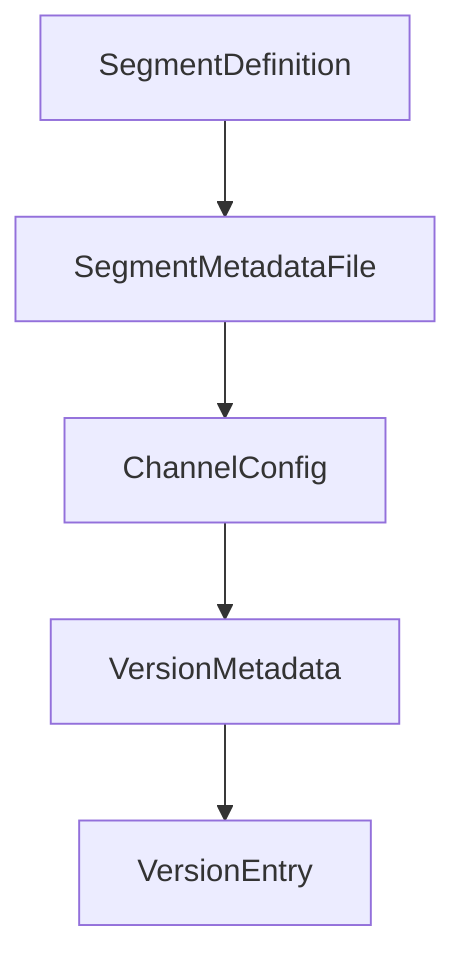

# Chapter 6: Team Adoption and Enterprise Capabilities

Welcome to **Chapter 6: Team Adoption and Enterprise Capabilities**. In this part of **Cherry Studio Tutorial: Multi-Provider AI Desktop Workspace for Teams**, you will build an intuitive mental model first, then move into concrete implementation details and practical production tradeoffs.


This chapter covers organizational rollout patterns and the enterprise feature model.

## Learning Goals

- understand community vs enterprise usage models
- centralize model and knowledge management for teams
- apply role-based access patterns
- align private deployment with compliance needs

## Enterprise-Oriented Capabilities

From README positioning, enterprise focus includes:

- unified model management
- team knowledge base controls
- fine-grained access management
- private deployment pathways

## Source References

- [Cherry Studio README: Enterprise Edition](https://github.com/CherryHQ/cherry-studio/blob/main/README.md#-enterprise-edition)
- [Cherry Studio enterprise demo link](https://enterprise.cherry-ai.com)

## Summary

You now have a rollout model for scaling Cherry Studio from individual use to team workflows.

Next: [Chapter 7: Development and Contribution Workflow](07-development-and-contribution-workflow.md)

## Depth Expansion Playbook

## Source Code Walkthrough

### `scripts/update-app-upgrade-config.ts`

The `SegmentDefinition` interface in [`scripts/update-app-upgrade-config.ts`](https://github.com/CherryHQ/cherry-studio/blob/HEAD/scripts/update-app-upgrade-config.ts) handles a key part of this chapter's functionality:

```ts
}

interface SegmentDefinition {
  id: string
  type: 'legacy' | 'breaking' | 'latest'
  match: SegmentMatchRule
  lockedVersion?: string
  minCompatibleVersion: string
  description: string
  channelTemplates?: Partial<Record<UpgradeChannel, ChannelTemplateConfig>>
}

interface SegmentMetadataFile {
  segments: SegmentDefinition[]
}

interface ChannelConfig {
  version: string
  feedUrls: Record<UpdateMirror, string>
}

interface VersionMetadata {
  segmentId: string
  segmentType?: string
}

interface VersionEntry {
  metadata?: VersionMetadata
  minCompatibleVersion: string
  description: string
  channels: Record<UpgradeChannel, ChannelConfig | null>
}
```

This interface is important because it defines how Cherry Studio Tutorial: Multi-Provider AI Desktop Workspace for Teams implements the patterns covered in this chapter.

### `scripts/update-app-upgrade-config.ts`

The `SegmentMetadataFile` interface in [`scripts/update-app-upgrade-config.ts`](https://github.com/CherryHQ/cherry-studio/blob/HEAD/scripts/update-app-upgrade-config.ts) handles a key part of this chapter's functionality:

```ts
}

interface SegmentMetadataFile {
  segments: SegmentDefinition[]
}

interface ChannelConfig {
  version: string
  feedUrls: Record<UpdateMirror, string>
}

interface VersionMetadata {
  segmentId: string
  segmentType?: string
}

interface VersionEntry {
  metadata?: VersionMetadata
  minCompatibleVersion: string
  description: string
  channels: Record<UpgradeChannel, ChannelConfig | null>
}

interface UpgradeConfigFile {
  lastUpdated: string
  versions: Record<string, VersionEntry>
}

interface ReleaseInfo {
  tag: string
  version: string
  channel: UpgradeChannel
```

This interface is important because it defines how Cherry Studio Tutorial: Multi-Provider AI Desktop Workspace for Teams implements the patterns covered in this chapter.

### `scripts/update-app-upgrade-config.ts`

The `ChannelConfig` interface in [`scripts/update-app-upgrade-config.ts`](https://github.com/CherryHQ/cherry-studio/blob/HEAD/scripts/update-app-upgrade-config.ts) handles a key part of this chapter's functionality:

```ts
}

interface ChannelConfig {
  version: string
  feedUrls: Record<UpdateMirror, string>
}

interface VersionMetadata {
  segmentId: string
  segmentType?: string
}

interface VersionEntry {
  metadata?: VersionMetadata
  minCompatibleVersion: string
  description: string
  channels: Record<UpgradeChannel, ChannelConfig | null>
}

interface UpgradeConfigFile {
  lastUpdated: string
  versions: Record<string, VersionEntry>
}

interface ReleaseInfo {
  tag: string
  version: string
  channel: UpgradeChannel
}

interface UpdateVersionsResult {
  versions: Record<string, VersionEntry>
```

This interface is important because it defines how Cherry Studio Tutorial: Multi-Provider AI Desktop Workspace for Teams implements the patterns covered in this chapter.

### `scripts/update-app-upgrade-config.ts`

The `VersionMetadata` interface in [`scripts/update-app-upgrade-config.ts`](https://github.com/CherryHQ/cherry-studio/blob/HEAD/scripts/update-app-upgrade-config.ts) handles a key part of this chapter's functionality:

```ts
}

interface VersionMetadata {
  segmentId: string
  segmentType?: string
}

interface VersionEntry {
  metadata?: VersionMetadata
  minCompatibleVersion: string
  description: string
  channels: Record<UpgradeChannel, ChannelConfig | null>
}

interface UpgradeConfigFile {
  lastUpdated: string
  versions: Record<string, VersionEntry>
}

interface ReleaseInfo {
  tag: string
  version: string
  channel: UpgradeChannel
}

interface UpdateVersionsResult {
  versions: Record<string, VersionEntry>
  updated: boolean
}

const ROOT_DIR = path.resolve(__dirname, '..')
const DEFAULT_CONFIG_PATH = path.join(ROOT_DIR, 'app-upgrade-config.json')
```

This interface is important because it defines how Cherry Studio Tutorial: Multi-Provider AI Desktop Workspace for Teams implements the patterns covered in this chapter.


## How These Components Connect


