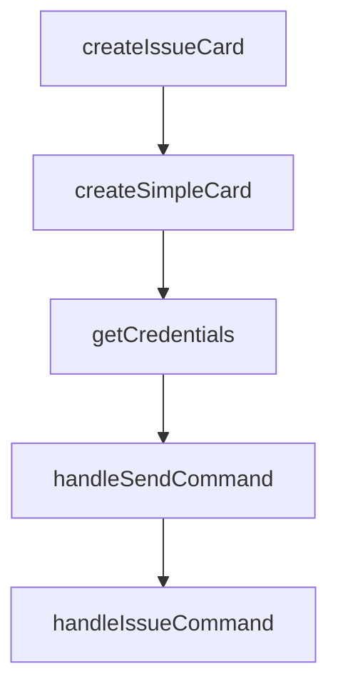

# Chapter 6: Team Adoption and Enterprise Capabilities

Welcome to **Chapter 6: Team Adoption and Enterprise Capabilities**. In this part of **Cherry Studio Tutorial: Multi-Provider AI Desktop Workspace for Teams**, you will build an intuitive mental model first, then move into concrete implementation details and practical production tradeoffs.


This chapter covers organizational rollout patterns and the enterprise feature model.

## Learning Goals

- understand community vs enterprise usage models
- centralize model and knowledge management for teams
- apply role-based access patterns
- align private deployment with compliance needs

## Enterprise-Oriented Capabilities

From README positioning, enterprise focus includes:

- unified model management
- team knowledge base controls
- fine-grained access management
- private deployment pathways

## Source References

- [Cherry Studio README: Enterprise Edition](https://github.com/CherryHQ/cherry-studio/blob/main/README.md#-enterprise-edition)
- [Cherry Studio enterprise demo link](https://enterprise.cherry-ai.com)

## Summary

You now have a rollout model for scaling Cherry Studio from individual use to team workflows.

Next: [Chapter 7: Development and Contribution Workflow](07-development-and-contribution-workflow.md)

## Source Code Walkthrough

### `scripts/feishu-notify.ts`

The `createIssueCard` function in [`scripts/feishu-notify.ts`](https://github.com/CherryHQ/cherry-studio/blob/HEAD/scripts/feishu-notify.ts) handles a key part of this chapter's functionality:

```ts
 * @returns Feishu card content
 */
function createIssueCard(issueData: IssueData): FeishuCard {
  const { issueUrl, issueNumber, issueTitle, issueSummary, issueAuthor, labels } = issueData

  const elements: FeishuCardElement[] = [
    {
      tag: 'div',
      text: {
        tag: 'lark_md',
        content: `**Author:** ${issueAuthor}`
      }
    }
  ]

  if (labels.length > 0) {
    elements.push({
      tag: 'div',
      text: {
        tag: 'lark_md',
        content: `**Labels:** ${labels.join(', ')}`
      }
    })
  }

  elements.push(
    { tag: 'hr' },
    {
      tag: 'div',
      text: {
        tag: 'lark_md',
        content: `**Summary:**\n${issueSummary}`
```

This function is important because it defines how Cherry Studio Tutorial: Multi-Provider AI Desktop Workspace for Teams implements the patterns covered in this chapter.

### `scripts/feishu-notify.ts`

The `createSimpleCard` function in [`scripts/feishu-notify.ts`](https://github.com/CherryHQ/cherry-studio/blob/HEAD/scripts/feishu-notify.ts) handles a key part of this chapter's functionality:

```ts
 * @returns Feishu card content
 */
function createSimpleCard(title: string, description: string, color: FeishuHeaderTemplate = 'turquoise'): FeishuCard {
  return {
    elements: [
      {
        tag: 'div',
        text: {
          tag: 'lark_md',
          content: description
        }
      }
    ],
    header: {
      template: color,
      title: {
        tag: 'plain_text',
        content: title
      }
    }
  }
}

/**
 * Get Feishu credentials from environment variables
 */
function getCredentials(): { webhookUrl: string; secret: string } {
  const webhookUrl = process.env.FEISHU_WEBHOOK_URL
  const secret = process.env.FEISHU_WEBHOOK_SECRET

  if (!webhookUrl) {
    console.error('Error: FEISHU_WEBHOOK_URL environment variable is required')
```

This function is important because it defines how Cherry Studio Tutorial: Multi-Provider AI Desktop Workspace for Teams implements the patterns covered in this chapter.

### `scripts/feishu-notify.ts`

The `getCredentials` function in [`scripts/feishu-notify.ts`](https://github.com/CherryHQ/cherry-studio/blob/HEAD/scripts/feishu-notify.ts) handles a key part of this chapter's functionality:

```ts
 * Get Feishu credentials from environment variables
 */
function getCredentials(): { webhookUrl: string; secret: string } {
  const webhookUrl = process.env.FEISHU_WEBHOOK_URL
  const secret = process.env.FEISHU_WEBHOOK_SECRET

  if (!webhookUrl) {
    console.error('Error: FEISHU_WEBHOOK_URL environment variable is required')
    process.exit(1)
  }
  if (!secret) {
    console.error('Error: FEISHU_WEBHOOK_SECRET environment variable is required')
    process.exit(1)
  }

  return { webhookUrl, secret }
}

/**
 * Handle send subcommand
 */
async function handleSendCommand(options: SendOptions): Promise<void> {
  const { webhookUrl, secret } = getCredentials()

  const { title, description, color = 'turquoise' } = options

  // Validate color parameter
  const colorValidation = FeishuHeaderTemplateSchema.safeParse(color)
  if (!colorValidation.success) {
    console.error(`Error: Invalid color "${color}". Valid colors: ${FeishuHeaderTemplateSchema.options.join(', ')}`)
    process.exit(1)
  }
```

This function is important because it defines how Cherry Studio Tutorial: Multi-Provider AI Desktop Workspace for Teams implements the patterns covered in this chapter.

### `scripts/feishu-notify.ts`

The `handleSendCommand` function in [`scripts/feishu-notify.ts`](https://github.com/CherryHQ/cherry-studio/blob/HEAD/scripts/feishu-notify.ts) handles a key part of this chapter's functionality:

```ts
 * Handle send subcommand
 */
async function handleSendCommand(options: SendOptions): Promise<void> {
  const { webhookUrl, secret } = getCredentials()

  const { title, description, color = 'turquoise' } = options

  // Validate color parameter
  const colorValidation = FeishuHeaderTemplateSchema.safeParse(color)
  if (!colorValidation.success) {
    console.error(`Error: Invalid color "${color}". Valid colors: ${FeishuHeaderTemplateSchema.options.join(', ')}`)
    process.exit(1)
  }

  const card = createSimpleCard(title, description, colorValidation.data)

  console.log('Sending notification to Feishu...')
  console.log(`Title: ${title}`)

  await sendToFeishu(webhookUrl, secret, card)

  console.log('Notification sent successfully!')
}

/**
 * Handle issue subcommand
 */
async function handleIssueCommand(options: IssueOptions): Promise<void> {
  const { webhookUrl, secret } = getCredentials()

  const { url, number, title, summary, author = 'Unknown', labels: labelsStr = '' } = options

```

This function is important because it defines how Cherry Studio Tutorial: Multi-Provider AI Desktop Workspace for Teams implements the patterns covered in this chapter.


## How These Components Connect


