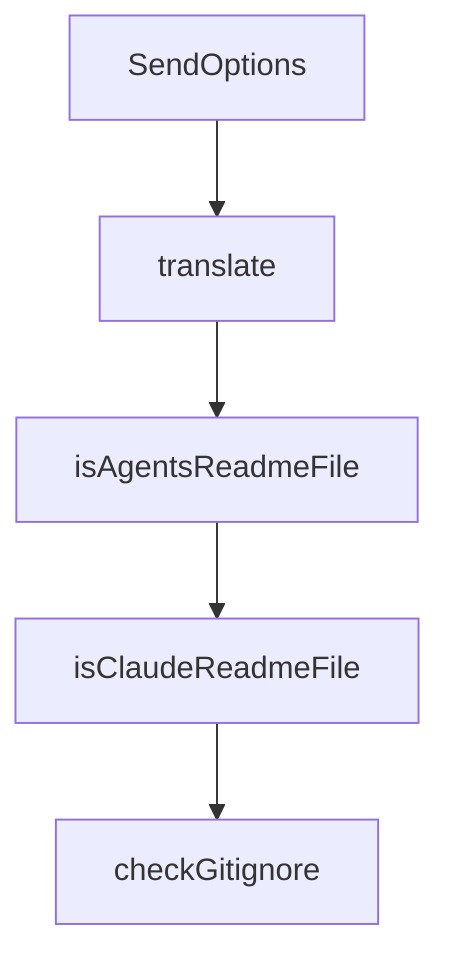

# Chapter 7: Development and Contribution Workflow

Welcome to **Chapter 7: Development and Contribution Workflow**. In this part of **Cherry Studio Tutorial: Multi-Provider AI Desktop Workspace for Teams**, you will build an intuitive mental model first, then move into concrete implementation details and practical production tradeoffs.


This chapter targets maintainers and contributors shipping changes to Cherry Studio itself.

## Learning Goals

- set up development environment correctly
- run local dev/test/build workflows
- follow branching and PR expectations
- align contributions with current project constraints

## Dev Commands

```bash
pnpm install
pnpm dev
pnpm test
pnpm build:win
pnpm build:mac
pnpm build:linux
```

## Contribution Controls

- follow defined branch naming and PR process
- ensure tests and quality checks are complete
- respect temporary restrictions documented for data-model/schema changes

## Source References

- [Development guide](https://github.com/CherryHQ/cherry-studio/blob/main/docs/en/guides/development.md)
- [Branching strategy](https://github.com/CherryHQ/cherry-studio/blob/main/docs/en/guides/branching-strategy.md)
- [Contributing guide](https://github.com/CherryHQ/cherry-studio/blob/main/CONTRIBUTING.md)

## Summary

You now have a contributor-ready workflow for building and submitting Cherry Studio changes.

Next: [Chapter 8: Production Operations and Governance](08-production-operations-and-governance.md)

## Source Code Walkthrough

### `scripts/feishu-notify.ts`

The `SendOptions` interface in [`scripts/feishu-notify.ts`](https://github.com/CherryHQ/cherry-studio/blob/HEAD/scripts/feishu-notify.ts) handles a key part of this chapter's functionality:

```ts

/** Send subcommand options */
interface SendOptions {
  title: string
  description: string
  color?: string
}

/**
 * Generate Feishu webhook signature using HMAC-SHA256
 * @param secret - Feishu webhook secret
 * @param timestamp - Unix timestamp in seconds
 * @returns Base64 encoded signature
 */
function generateSignature(secret: string, timestamp: number): string {
  const stringToSign = `${timestamp}\n${secret}`
  const hmac = crypto.createHmac('sha256', stringToSign)
  return hmac.digest('base64')
}

/**
 * Send message to Feishu webhook
 * @param webhookUrl - Feishu webhook URL
 * @param secret - Feishu webhook secret
 * @param content - Feishu card message content
 * @returns Resolves when message is sent successfully
 * @throws When Feishu API returns non-2xx status code or network error occurs
 */
function sendToFeishu(webhookUrl: string, secret: string, content: FeishuCard): Promise<void> {
  return new Promise((resolve, reject) => {
    const timestamp = Math.floor(Date.now() / 1000)
    const sign = generateSignature(secret, timestamp)
```

This interface is important because it defines how Cherry Studio Tutorial: Multi-Provider AI Desktop Workspace for Teams implements the patterns covered in this chapter.

### `scripts/update-i18n.ts`

The `translate` function in [`scripts/update-i18n.ts`](https://github.com/CherryHQ/cherry-studio/blob/HEAD/scripts/update-i18n.ts) handles a key part of this chapter's functionality:

```ts
/**
 * 使用 OpenAI 兼容的模型生成 i18n 文本，并更新到 translate 目录
 *
 * API_KEY=sk-xxxx BASE_URL=xxxx MODEL=xxxx ts-node scripts/update-i18n.ts
 */

import OpenAI from '@cherrystudio/openai'
import cliProgress from 'cli-progress'
import fs from 'fs'

type I18NValue = string | { [key: string]: I18NValue }
type I18N = { [key: string]: I18NValue }

const API_KEY = process.env.API_KEY
const BASE_URL = process.env.BASE_URL || 'https://dashscope.aliyuncs.com/compatible-mode/v1/'
const MODEL = process.env.MODEL || 'qwen-plus-latest'

const INDEX = [
  // 语言的名称代码用来翻译的模型
  { name: 'France', code: 'fr-fr', model: MODEL },
  { name: 'Spanish', code: 'es-es', model: MODEL },
  { name: 'Portuguese', code: 'pt-pt', model: MODEL },
  { name: 'Greek', code: 'el-gr', model: MODEL }
]

const zh = JSON.parse(fs.readFileSync('src/renderer/src/i18n/locales/zh-cn.json', 'utf8')) as I18N

const openai = new OpenAI({
  apiKey: API_KEY,
  baseURL: BASE_URL
})
```

This function is important because it defines how Cherry Studio Tutorial: Multi-Provider AI Desktop Workspace for Teams implements the patterns covered in this chapter.

### `scripts/skills-check.ts`

The `isAgentsReadmeFile` function in [`scripts/skills-check.ts`](https://github.com/CherryHQ/cherry-studio/blob/HEAD/scripts/skills-check.ts) handles a key part of this chapter's functionality:

```ts
} from './skills-common'

function isAgentsReadmeFile(file: string): boolean {
  return /^\.agents\/skills\/README(?:\.[a-z0-9-]+)?\.md$/i.test(file)
}

function isClaudeReadmeFile(file: string): boolean {
  return /^\.claude\/skills\/README(?:\.[a-z0-9-]+)?\.md$/i.test(file)
}

function checkGitignore(filePath: string, expected: string, displayPath: string, errors: string[]) {
  const actual = readFileSafe(filePath)
  if (actual === null) {
    errors.push(`${displayPath} is missing`)
    return
  }
  if (actual !== expected) {
    errors.push(`${displayPath} is out of date (run pnpm skills:sync)`)
  }
}

/**
 * Verifies `.claude/skills/<skillName>` is a symlink pointing to
 * `../../.agents/skills/<skillName>`.
 */
function checkClaudeSkillSymlink(skillName: string, errors: string[]) {
  const claudeSkillDir = path.join(CLAUDE_SKILLS_DIR, skillName)
  const expectedTarget = path.join('..', '..', '.agents', 'skills', skillName)

  let stat: fs.Stats
  try {
    stat = fs.lstatSync(claudeSkillDir)
```

This function is important because it defines how Cherry Studio Tutorial: Multi-Provider AI Desktop Workspace for Teams implements the patterns covered in this chapter.

### `scripts/skills-check.ts`

The `isClaudeReadmeFile` function in [`scripts/skills-check.ts`](https://github.com/CherryHQ/cherry-studio/blob/HEAD/scripts/skills-check.ts) handles a key part of this chapter's functionality:

```ts
}

function isClaudeReadmeFile(file: string): boolean {
  return /^\.claude\/skills\/README(?:\.[a-z0-9-]+)?\.md$/i.test(file)
}

function checkGitignore(filePath: string, expected: string, displayPath: string, errors: string[]) {
  const actual = readFileSafe(filePath)
  if (actual === null) {
    errors.push(`${displayPath} is missing`)
    return
  }
  if (actual !== expected) {
    errors.push(`${displayPath} is out of date (run pnpm skills:sync)`)
  }
}

/**
 * Verifies `.claude/skills/<skillName>` is a symlink pointing to
 * `../../.agents/skills/<skillName>`.
 */
function checkClaudeSkillSymlink(skillName: string, errors: string[]) {
  const claudeSkillDir = path.join(CLAUDE_SKILLS_DIR, skillName)
  const expectedTarget = path.join('..', '..', '.agents', 'skills', skillName)

  let stat: fs.Stats
  try {
    stat = fs.lstatSync(claudeSkillDir)
  } catch {
    errors.push(`.claude/skills/${skillName} is missing (run pnpm skills:sync)`)
    return
  }
```

This function is important because it defines how Cherry Studio Tutorial: Multi-Provider AI Desktop Workspace for Teams implements the patterns covered in this chapter.


## How These Components Connect


