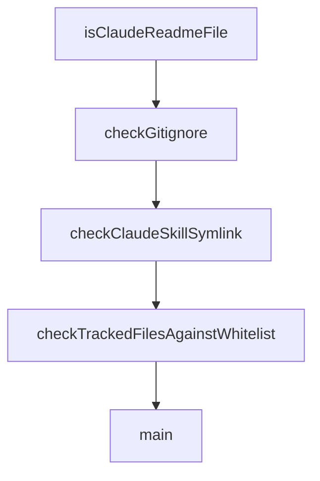

# Chapter 7: Development and Contribution Workflow

Welcome to **Chapter 7: Development and Contribution Workflow**. In this part of **Cherry Studio Tutorial: Multi-Provider AI Desktop Workspace for Teams**, you will build an intuitive mental model first, then move into concrete implementation details and practical production tradeoffs.


This chapter targets maintainers and contributors shipping changes to Cherry Studio itself.

## Learning Goals

- set up development environment correctly
- run local dev/test/build workflows
- follow branching and PR expectations
- align contributions with current project constraints

## Dev Commands

```bash
pnpm install
pnpm dev
pnpm test
pnpm build:win
pnpm build:mac
pnpm build:linux
```

## Contribution Controls

- follow defined branch naming and PR process
- ensure tests and quality checks are complete
- respect temporary restrictions documented for data-model/schema changes

## Source References

- [Development guide](https://github.com/CherryHQ/cherry-studio/blob/main/docs/en/guides/development.md)
- [Branching strategy](https://github.com/CherryHQ/cherry-studio/blob/main/docs/en/guides/branching-strategy.md)
- [Contributing guide](https://github.com/CherryHQ/cherry-studio/blob/main/CONTRIBUTING.md)

## Summary

You now have a contributor-ready workflow for building and submitting Cherry Studio changes.

Next: [Chapter 8: Production Operations and Governance](08-production-operations-and-governance.md)

## Depth Expansion Playbook

## Source Code Walkthrough

### `scripts/skills-check.ts`

The `isClaudeReadmeFile` function in [`scripts/skills-check.ts`](https://github.com/CherryHQ/cherry-studio/blob/HEAD/scripts/skills-check.ts) handles a key part of this chapter's functionality:

```ts
}

function isClaudeReadmeFile(file: string): boolean {
  return /^\.claude\/skills\/README(?:\.[a-z0-9-]+)?\.md$/i.test(file)
}

function checkGitignore(filePath: string, expected: string, displayPath: string, errors: string[]) {
  const actual = readFileSafe(filePath)
  if (actual === null) {
    errors.push(`${displayPath} is missing`)
    return
  }
  if (actual !== expected) {
    errors.push(`${displayPath} is out of date (run pnpm skills:sync)`)
  }
}

/**
 * Verifies `.claude/skills/<skillName>` is a symlink pointing to
 * `../../.agents/skills/<skillName>`.
 */
function checkClaudeSkillSymlink(skillName: string, errors: string[]) {
  const claudeSkillDir = path.join(CLAUDE_SKILLS_DIR, skillName)
  const expectedTarget = path.join('..', '..', '.agents', 'skills', skillName)

  let stat: fs.Stats
  try {
    stat = fs.lstatSync(claudeSkillDir)
  } catch {
    errors.push(`.claude/skills/${skillName} is missing (run pnpm skills:sync)`)
    return
  }
```

This function is important because it defines how Cherry Studio Tutorial: Multi-Provider AI Desktop Workspace for Teams implements the patterns covered in this chapter.

### `scripts/skills-check.ts`

The `checkGitignore` function in [`scripts/skills-check.ts`](https://github.com/CherryHQ/cherry-studio/blob/HEAD/scripts/skills-check.ts) handles a key part of this chapter's functionality:

```ts
}

function checkGitignore(filePath: string, expected: string, displayPath: string, errors: string[]) {
  const actual = readFileSafe(filePath)
  if (actual === null) {
    errors.push(`${displayPath} is missing`)
    return
  }
  if (actual !== expected) {
    errors.push(`${displayPath} is out of date (run pnpm skills:sync)`)
  }
}

/**
 * Verifies `.claude/skills/<skillName>` is a symlink pointing to
 * `../../.agents/skills/<skillName>`.
 */
function checkClaudeSkillSymlink(skillName: string, errors: string[]) {
  const claudeSkillDir = path.join(CLAUDE_SKILLS_DIR, skillName)
  const expectedTarget = path.join('..', '..', '.agents', 'skills', skillName)

  let stat: fs.Stats
  try {
    stat = fs.lstatSync(claudeSkillDir)
  } catch {
    errors.push(`.claude/skills/${skillName} is missing (run pnpm skills:sync)`)
    return
  }

  if (!stat.isSymbolicLink()) {
    errors.push(
      `.claude/skills/${skillName} must be a symlink, not a ${stat.isDirectory() ? 'directory' : 'file'} (run pnpm skills:sync)`
```

This function is important because it defines how Cherry Studio Tutorial: Multi-Provider AI Desktop Workspace for Teams implements the patterns covered in this chapter.

### `scripts/skills-check.ts`

The `checkClaudeSkillSymlink` function in [`scripts/skills-check.ts`](https://github.com/CherryHQ/cherry-studio/blob/HEAD/scripts/skills-check.ts) handles a key part of this chapter's functionality:

```ts
 * `../../.agents/skills/<skillName>`.
 */
function checkClaudeSkillSymlink(skillName: string, errors: string[]) {
  const claudeSkillDir = path.join(CLAUDE_SKILLS_DIR, skillName)
  const expectedTarget = path.join('..', '..', '.agents', 'skills', skillName)

  let stat: fs.Stats
  try {
    stat = fs.lstatSync(claudeSkillDir)
  } catch {
    errors.push(`.claude/skills/${skillName} is missing (run pnpm skills:sync)`)
    return
  }

  if (!stat.isSymbolicLink()) {
    errors.push(
      `.claude/skills/${skillName} must be a symlink, not a ${stat.isDirectory() ? 'directory' : 'file'} (run pnpm skills:sync)`
    )
    return
  }

  const actualTarget = fs.readlinkSync(claudeSkillDir)
  if (actualTarget !== expectedTarget) {
    errors.push(`.claude/skills/${skillName} symlink points to '${actualTarget}', expected '${expectedTarget}'`)
  }
}

function checkTrackedFilesAgainstWhitelist(skillNames: string[], errors: string[]) {
  const sharedAgentsFiles = new Set(['.agents/skills/.gitignore', '.agents/skills/public-skills.txt'])
  const sharedClaudeFiles = new Set(['.claude/skills/.gitignore'])
  const allowedAgentsPrefixes = skillNames.map((skillName) => `.agents/skills/${skillName}/`)
  const allowedClaudeSymlinks = new Set(skillNames.map((skillName) => `.claude/skills/${skillName}`))
```

This function is important because it defines how Cherry Studio Tutorial: Multi-Provider AI Desktop Workspace for Teams implements the patterns covered in this chapter.

### `scripts/skills-check.ts`

The `checkTrackedFilesAgainstWhitelist` function in [`scripts/skills-check.ts`](https://github.com/CherryHQ/cherry-studio/blob/HEAD/scripts/skills-check.ts) handles a key part of this chapter's functionality:

```ts
}

function checkTrackedFilesAgainstWhitelist(skillNames: string[], errors: string[]) {
  const sharedAgentsFiles = new Set(['.agents/skills/.gitignore', '.agents/skills/public-skills.txt'])
  const sharedClaudeFiles = new Set(['.claude/skills/.gitignore'])
  const allowedAgentsPrefixes = skillNames.map((skillName) => `.agents/skills/${skillName}/`)
  const allowedClaudeSymlinks = new Set(skillNames.map((skillName) => `.claude/skills/${skillName}`))
  const allowedClaudePrefixes = skillNames.map((skillName) => `.claude/skills/${skillName}/`)

  let trackedFiles: string[]
  try {
    const output = execSync('git ls-files -- .agents/skills .claude/skills', {
      cwd: ROOT_DIR,
      encoding: 'utf-8'
    })
    trackedFiles = output
      .split('\n')
      .map((line) => line.trim())
      .filter((line) => line.length > 0)
  } catch (error) {
    const message = error instanceof Error ? error.message : String(error)
    errors.push(`failed to read tracked skill files via git ls-files: ${message}`)
    return
  }

  for (const file of trackedFiles) {
    if (file.startsWith('.agents/skills/')) {
      if (sharedAgentsFiles.has(file) || isAgentsReadmeFile(file)) {
        continue
      }
      if (allowedAgentsPrefixes.some((prefix) => file.startsWith(prefix))) {
        continue
```

This function is important because it defines how Cherry Studio Tutorial: Multi-Provider AI Desktop Workspace for Teams implements the patterns covered in this chapter.


## How These Components Connect


