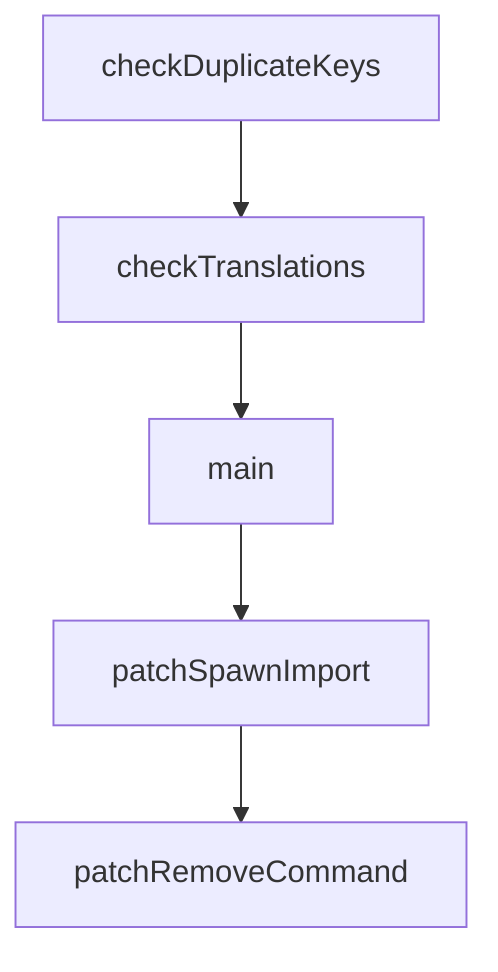

# Chapter 8: Production Operations and Governance

Welcome to **Chapter 8: Production Operations and Governance**. In this part of **Cherry Studio Tutorial: Multi-Provider AI Desktop Workspace for Teams**, you will build an intuitive mental model first, then move into concrete implementation details and practical production tradeoffs.


This chapter defines governance practices for stable long-term Cherry Studio operation.

## Learning Goals

- define provider, assistant, and tool governance policies
- manage release/update channels safely
- maintain quality and incident response routines
- plan roadmap and adoption cycles with clear ownership

## Governance Baseline

| Area | Recommended Baseline |
|:-----|:---------------------|
| model governance | approved provider/model matrix by use case |
| assistant governance | reviewed prompt templates and role catalog |
| release governance | staged updates + rollback plan |
| operations | logging/monitoring and backup practices |

## Source References

- [Cherry Studio README](https://github.com/CherryHQ/cherry-studio/blob/main/README.md)
- [Update configuration reference](https://github.com/CherryHQ/cherry-studio/blob/main/docs/en/references/app-upgrade.md)
- [Test plan guide](https://github.com/CherryHQ/cherry-studio/blob/main/docs/en/guides/test-plan.md)

## Summary

You now have a full production governance model for using Cherry Studio in serious team environments.

Continue with the [Context7 Tutorial](../context7-tutorial/).

## Depth Expansion Playbook

## Source Code Walkthrough

### `scripts/check-i18n.ts`

The `checkDuplicateKeys` function in [`scripts/check-i18n.ts`](https://github.com/CherryHQ/cherry-studio/blob/HEAD/scripts/check-i18n.ts) handles a key part of this chapter's functionality:

```ts
 * @returns 返回重复键的数组（若无重复则返回空数组）
 */
function checkDuplicateKeys(obj: I18N): string[] {
  const keys = new Set<string>()
  const duplicateKeys: string[] = []

  const checkObject = (obj: I18N, path: string = '') => {
    for (const key in obj) {
      const fullPath = path ? `${path}.${key}` : key

      if (keys.has(fullPath)) {
        // 发现重复键时，添加到数组中（避免重复添加）
        if (!duplicateKeys.includes(fullPath)) {
          duplicateKeys.push(fullPath)
        }
      } else {
        keys.add(fullPath)
      }

      // 递归检查子对象
      if (typeof obj[key] === 'object' && obj[key] !== null) {
        checkObject(obj[key], fullPath)
      }
    }
  }

  checkObject(obj)
  return duplicateKeys
}

function checkTranslations() {
  if (!fs.existsSync(baseFilePath)) {
```

This function is important because it defines how Cherry Studio Tutorial: Multi-Provider AI Desktop Workspace for Teams implements the patterns covered in this chapter.

### `scripts/check-i18n.ts`

The `checkTranslations` function in [`scripts/check-i18n.ts`](https://github.com/CherryHQ/cherry-studio/blob/HEAD/scripts/check-i18n.ts) handles a key part of this chapter's functionality:

```ts
}

function checkTranslations() {
  if (!fs.existsSync(baseFilePath)) {
    throw new Error(`主模板文件 ${baseFileName} 不存在，请检查路径或文件名`)
  }

  const baseContent = fs.readFileSync(baseFilePath, 'utf-8')
  let baseJson: I18N = {}
  try {
    baseJson = JSON.parse(baseContent)
  } catch (error) {
    throw new Error(`解析 ${baseFileName} 出错。${error}`)
  }

  // 检查主模板是否存在重复键
  const duplicateKeys = checkDuplicateKeys(baseJson)
  if (duplicateKeys.length > 0) {
    throw new Error(`主模板文件 ${baseFileName} 存在以下重复键：\n${duplicateKeys.join('\n')}`)
  }

  // 检查主模板是否有序
  if (!isSortedI18N(baseJson)) {
    throw new Error(`主模板文件 ${baseFileName} 的键值未按字典序排序。`)
  }

  const files = fs.readdirSync(translationsDir).filter((file) => file.endsWith('.json') && file !== baseFileName)

  // 同步键
  for (const file of files) {
    const filePath = path.join(translationsDir, file)
    let targetJson: I18N = {}
```

This function is important because it defines how Cherry Studio Tutorial: Multi-Provider AI Desktop Workspace for Teams implements the patterns covered in this chapter.

### `scripts/check-i18n.ts`

The `main` function in [`scripts/check-i18n.ts`](https://github.com/CherryHQ/cherry-studio/blob/HEAD/scripts/check-i18n.ts) handles a key part of this chapter's functionality:

```ts
}

export function main() {
  try {
    checkTranslations()
    console.log('i18n 检查已通过')
  } catch (e) {
    console.error(e)
    throw new Error(`检查未通过。尝试运行 pnpm i18n:sync 以解决问题。`)
  }
}

main()

```

This function is important because it defines how Cherry Studio Tutorial: Multi-Provider AI Desktop Workspace for Teams implements the patterns covered in this chapter.

### `scripts/patch-claude-agent-sdk.ts`

The `patchSpawnImport` function in [`scripts/patch-claude-agent-sdk.ts`](https://github.com/CherryHQ/cherry-studio/blob/HEAD/scripts/patch-claude-agent-sdk.ts) handles a key part of this chapter's functionality:

```ts

// 1. Replace `import{spawn as X}from"child_process"` with `import{fork as X}from"child_process"`
export function patchSpawnImport(content: string): PatchResult {
  let matched = false
  const result = content.replace(/import\{spawn as ([\w$]+)\}from"child_process"/, (_, alias) => {
    matched = true
    return `import{fork as ${alias}}from"child_process"`
  })
  return { result, matched }
}

// 2. Remove `command:X,` from spawnLocalProcess destructuring
//    Before: spawnLocalProcess(Q){let{command:X,args:Y,cwd:$,env:W,signal:J}=Q
//    After:  spawnLocalProcess(Q){let{args:Y,cwd:$,env:W,signal:J}=Q
export function patchRemoveCommand(content: string): PatchResult {
  let matched = false
  const result = content.replace(
    /spawnLocalProcess\(([\w$]+)\)\{let\{command:([\w$]+),args:([\w$]+)/,
    (_, fnArg, _cmd, args) => {
      matched = true
      return `spawnLocalProcess(${fnArg}){let{args:${args}`
    }
  )
  return { result, matched }
}

// 3. Rewrite the spawn/fork call:
//    Before: =Sq(X,Y,{cwd:$,stdio:["pipe","pipe",G],signal:J,env:W,windowsHide:!0})
//    After:  =Sq(Y[0],Y.slice(1),{cwd:$,stdio:G==="pipe"?["pipe","pipe","pipe","ipc"]:["pipe","pipe","ignore","ipc"],signal:J,env:W})
export function patchSpawnCall(content: string): PatchResult {
  let matched = false
  const result = content.replace(
```

This function is important because it defines how Cherry Studio Tutorial: Multi-Provider AI Desktop Workspace for Teams implements the patterns covered in this chapter.


## How These Components Connect


