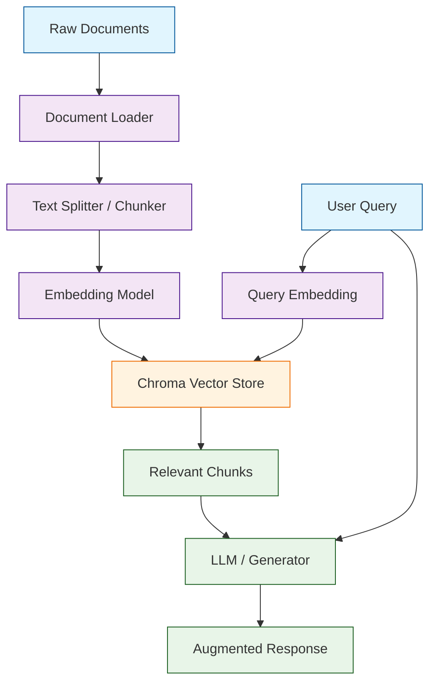
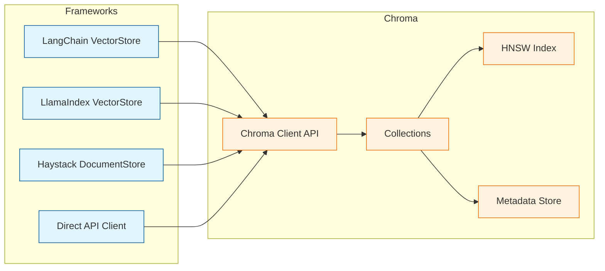
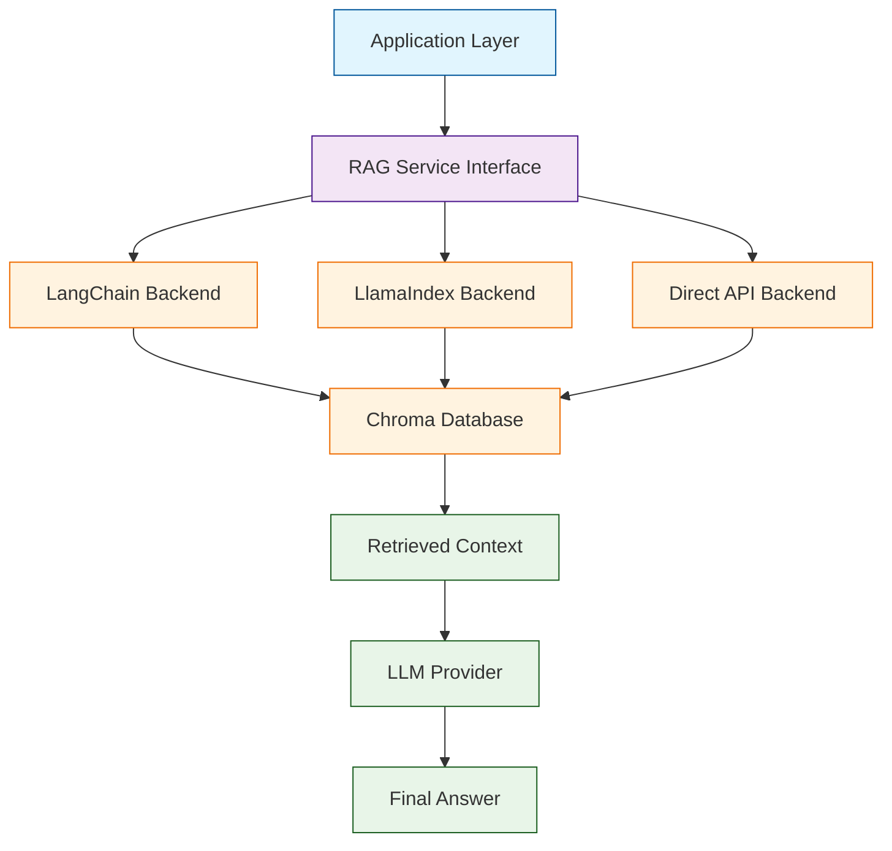
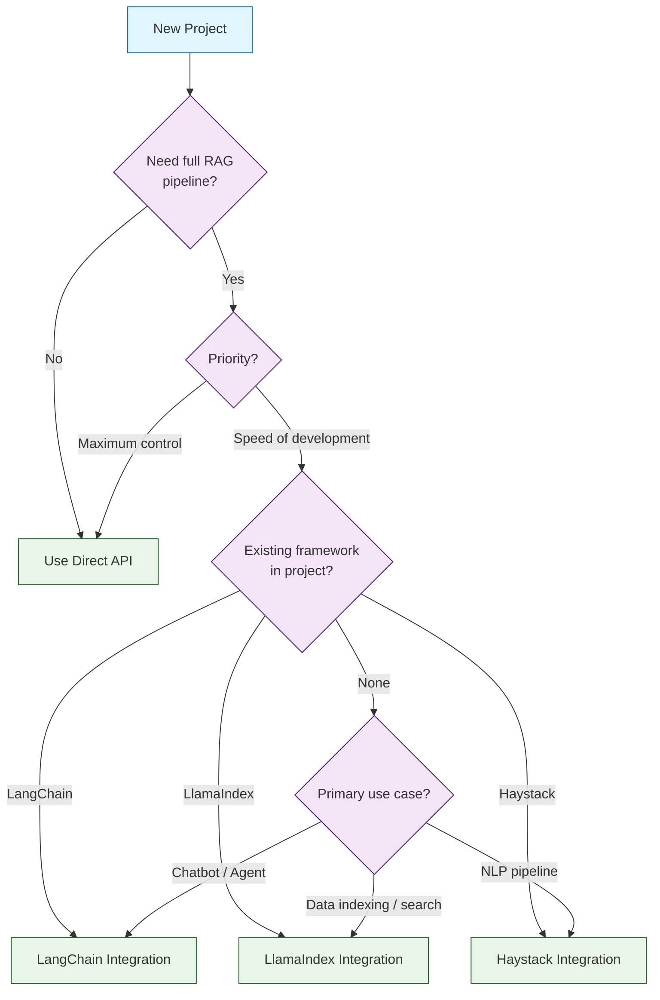

# Chapter 6: Integration Patterns

Welcome to **Chapter 6: Integration Patterns**. In this part of **ChromaDB Tutorial: Building AI-Native Vector Databases**, you will build an intuitive mental model first, then move into concrete implementation details and practical production tradeoffs.


Learn how to integrate Chroma with popular AI frameworks and applications! This chapter covers deep integration patterns with LangChain, LlamaIndex, Haystack, and direct API usage -- giving you the flexibility to embed Chroma into any AI pipeline.

## Integration Architecture Overview

Before diving into specific frameworks, it helps to understand how Chroma sits within a typical AI application stack. Regardless of which framework you choose, the data flow follows a consistent pattern: documents enter the pipeline, get chunked and embedded, are stored in Chroma, and are retrieved at query time to augment LLM responses.



### Framework Adapter Model

Each framework wraps Chroma through its own adapter layer. Understanding this abstraction helps you debug issues and switch between frameworks when needed.



## LangChain Integration

LangChain is one of the most popular frameworks for building LLM-powered applications. Chroma is a first-class vector store in LangChain, with deep support for retrieval chains, agents, and conversational memory.

### Basic VectorStore Setup

```python
from langchain_community.vectorstores import Chroma
from langchain_openai import OpenAIEmbeddings
from langchain.text_splitter import RecursiveCharacterTextSplitter
from langchain_community.document_loaders import TextLoader, DirectoryLoader

# Step 1: Load documents from a directory
loader = DirectoryLoader(
    "./knowledge_base",
    glob="**/*.txt",
    loader_cls=TextLoader
)
raw_documents = loader.load()

# Step 2: Split documents into manageable chunks
text_splitter = RecursiveCharacterTextSplitter(
    chunk_size=1000,
    chunk_overlap=200,
    separators=["\n\n", "\n", ". ", " ", ""]
)
documents = text_splitter.split_documents(raw_documents)

# Step 3: Create embedding function
embeddings = OpenAIEmbeddings(model="text-embedding-3-small")

# Step 4: Build the Chroma vector store with persistence
vectorstore = Chroma.from_documents(
    documents=documents,
    embedding=embeddings,
    collection_name="langchain_knowledge_base",
    persist_directory="./chroma_langchain_db"
)

print(f"Indexed {len(documents)} chunks into Chroma")
```

### Retrieval-Augmented Generation (RAG) Chain

The real power of the LangChain integration emerges when you combine Chroma retrieval with an LLM to answer questions grounded in your own data.

```python
from langchain_openai import ChatOpenAI
from langchain.chains import RetrievalQA
from langchain.prompts import PromptTemplate

# Configure the retriever with search parameters
retriever = vectorstore.as_retriever(
    search_type="mmr",               # Maximal Marginal Relevance
    search_kwargs={
        "k": 5,                       # Return top 5 results
        "fetch_k": 20,                # Fetch 20 candidates for MMR
        "lambda_mult": 0.7            # Diversity vs relevance tradeoff
    }
)

# Custom prompt template for grounded answers
prompt_template = PromptTemplate(
    input_variables=["context", "question"],
    template="""Use the following context to answer the question. If the
answer is not contained in the context, say "I don't have enough
information to answer that."

Context:
{context}

Question: {question}

Answer:"""
)

# Build the RAG chain
qa_chain = RetrievalQA.from_chain_type(
    llm=ChatOpenAI(model="gpt-4o", temperature=0),
    chain_type="stuff",
    retriever=retriever,
    return_source_documents=True,
    chain_type_kwargs={"prompt": prompt_template}
)

# Ask a question
result = qa_chain.invoke({"query": "How does Chroma handle persistence?"})
print("Answer:", result["result"])
print(f"\nSources ({len(result['source_documents'])} documents):")
for doc in result["source_documents"]:
    print(f"  - {doc.metadata.get('source', 'unknown')}: {doc.page_content[:80]}...")
```

### Conversational Memory with Chroma

LangChain also allows you to store conversation history in Chroma, enabling long-term memory across sessions.

```python
from langchain.memory import VectorStoreRetrieverMemory

# Use Chroma as conversational memory backend
memory_vectorstore = Chroma(
    collection_name="conversation_memory",
    embedding_function=embeddings,
    persist_directory="./chroma_memory_db"
)

memory = VectorStoreRetrieverMemory(
    retriever=memory_vectorstore.as_retriever(search_kwargs={"k": 5}),
    memory_key="history",
    input_key="input"
)

# Save conversation context
memory.save_context(
    inputs={"input": "What embedding models does Chroma support?"},
    outputs={"output": "Chroma supports OpenAI, Sentence Transformers, "
             "Cohere, Hugging Face, and custom embedding functions."}
)

# Later, retrieve relevant past conversations
relevant_history = memory.load_memory_variables(
    {"input": "Tell me about embedding options"}
)
print("Relevant past conversations:", relevant_history["history"])
```

## LlamaIndex Integration

LlamaIndex (formerly GPT Index) provides a data framework that connects LLMs with external data. Chroma serves as a highly performant vector store backend within the LlamaIndex ecosystem.

### Full Indexing Pipeline

```python
import chromadb
from llama_index.core import (
    VectorStoreIndex,
    SimpleDirectoryReader,
    StorageContext,
    Settings
)
from llama_index.vector_stores.chroma import ChromaVectorStore
from llama_index.embeddings.openai import OpenAIEmbedding
from llama_index.llms.openai import OpenAI

# Step 1: Configure global settings
Settings.embed_model = OpenAIEmbedding(model="text-embedding-3-small")
Settings.llm = OpenAI(model="gpt-4o", temperature=0)
Settings.chunk_size = 1024
Settings.chunk_overlap = 128

# Step 2: Load documents
documents = SimpleDirectoryReader(
    input_dir="./knowledge_base",
    recursive=True,
    required_exts=[".txt", ".md", ".pdf"]
).load_data()

print(f"Loaded {len(documents)} documents")

# Step 3: Initialize Chroma as the vector store
chroma_client = chromadb.PersistentClient(path="./chroma_llamaindex_db")
chroma_collection = chroma_client.get_or_create_collection(
    name="llamaindex_docs",
    metadata={"hnsw:space": "cosine"}
)
vector_store = ChromaVectorStore(chroma_collection=chroma_collection)
storage_context = StorageContext.from_defaults(vector_store=vector_store)

# Step 4: Build the index
index = VectorStoreIndex.from_documents(
    documents=documents,
    storage_context=storage_context,
    show_progress=True
)

print(f"Index built with {len(documents)} documents in Chroma")
```

### Advanced Query Engine

LlamaIndex query engines allow you to configure retrieval behaviour, apply post-processing, and synthesize answers from multiple retrieved nodes.

```python
from llama_index.core.postprocessor import (
    SimilarityPostprocessor,
    KeywordNodePostprocessor
)

# Build a query engine with post-processing
query_engine = index.as_query_engine(
    similarity_top_k=10,
    node_postprocessors=[
        # Filter out low-relevance results
        SimilarityPostprocessor(similarity_cutoff=0.7),
        # Require specific keywords in results
        KeywordNodePostprocessor(
            required_keywords=["chroma", "vector"],
            exclude_keywords=["deprecated"]
        )
    ],
    response_mode="tree_summarize"     # Hierarchical summarization
)

# Query with the refined engine
response = query_engine.query(
    "What are the best practices for scaling Chroma in production?"
)

print("Answer:", response.response)
print(f"\nSource nodes ({len(response.source_nodes)}):")
for node in response.source_nodes:
    print(f"  Score: {node.score:.3f} | {node.text[:80]}...")
```

### Chat Engine with Chroma Memory

LlamaIndex also supports conversational interactions backed by Chroma retrieval.

```python
from llama_index.core.memory import ChatMemoryBuffer

# Create a chat engine with memory
chat_engine = index.as_chat_engine(
    chat_mode="condense_plus_context",
    memory=ChatMemoryBuffer.from_defaults(token_limit=3000),
    system_prompt=(
        "You are a helpful assistant with expertise in vector databases. "
        "Use the provided context to answer questions accurately."
    ),
    similarity_top_k=5
)

# Multi-turn conversation
response1 = chat_engine.chat("What is Chroma used for?")
print("Turn 1:", response1.response)

response2 = chat_engine.chat("How does it compare to other vector databases?")
print("Turn 2:", response2.response)

# Reset conversation when needed
chat_engine.reset()
```

## Haystack Integration

Haystack by deepset is an end-to-end NLP framework for building search and question-answering systems. Chroma integrates as a document store within Haystack pipelines.

### Document Store Setup

```python
from haystack_integrations.document_stores.chroma import ChromaDocumentStore
from haystack import Document

# Initialize the Chroma document store
document_store = ChromaDocumentStore(
    collection_name="haystack_docs",
    persist_path="./chroma_haystack_db"
)

# Prepare documents with rich metadata
documents = [
    Document(
        content="Chroma is an AI-native open-source embedding database.",
        meta={
            "source": "documentation",
            "category": "overview",
            "version": "0.5"
        }
    ),
    Document(
        content="Vector databases store high-dimensional embeddings for "
                "fast similarity search across large datasets.",
        meta={
            "source": "tutorial",
            "category": "concepts",
            "version": "0.5"
        }
    ),
    Document(
        content="HNSW (Hierarchical Navigable Small World) graphs provide "
                "efficient approximate nearest neighbor search.",
        meta={
            "source": "research",
            "category": "algorithms",
            "version": "0.5"
        }
    )
]

# Write documents to the store
document_store.write_documents(documents)
print(f"Stored {document_store.count_documents()} documents")
```

### Retrieval Pipeline

Haystack uses a pipeline abstraction that lets you compose retrieval, ranking, and generation stages declaratively.

```python
from haystack import Pipeline
from haystack.components.generators import OpenAIGenerator
from haystack.components.builders import PromptBuilder
from haystack_integrations.components.retrievers.chroma import (
    ChromaQueryTextRetriever
)

# Build a RAG pipeline
rag_pipeline = Pipeline()

# Add a retriever connected to our Chroma store
rag_pipeline.add_component(
    "retriever",
    ChromaQueryTextRetriever(
        document_store=document_store,
        top_k=5
    )
)

# Add a prompt builder to format retrieved documents
rag_pipeline.add_component(
    "prompt_builder",
    PromptBuilder(template="""
        Given the following documents, answer the question.

        Documents:
        
          - {{ doc.content }}
        

        Question: {{ question }}
        Answer:
    """)
)

# Add the LLM generator
rag_pipeline.add_component(
    "llm",
    OpenAIGenerator(model="gpt-4o")
)

# Connect the pipeline components
rag_pipeline.connect("retriever.documents", "prompt_builder.documents")
rag_pipeline.connect("prompt_builder", "llm")

# Run the pipeline
result = rag_pipeline.run({
    "retriever": {"query": "What is HNSW?"},
    "prompt_builder": {"question": "What is HNSW and how does it work?"}
})

print("Answer:", result["llm"]["replies"][0])
```

## Direct Chroma API Usage

Sometimes you need fine-grained control that framework abstractions do not provide. The Chroma Python client gives you direct access to every feature of the database.

### Client Initialization Patterns

```python
import chromadb
from chromadb.config import Settings

# --- Ephemeral client (in-memory, for testing) ---
ephemeral_client = chromadb.EphemeralClient()

# --- Persistent client (local disk) ---
persistent_client = chromadb.PersistentClient(path="./chroma_data")

# --- HTTP client (connect to a running Chroma server) ---
http_client = chromadb.HttpClient(
    host="localhost",
    port=8000,
    headers={"Authorization": "Bearer my-secret-token"}
)

# --- HTTP client with SSL and custom settings ---
secure_client = chromadb.HttpClient(
    host="chroma.example.com",
    port=443,
    ssl=True,
    headers={"Authorization": "Bearer my-secret-token"},
    settings=Settings(
        anonymized_telemetry=False,
        chroma_client_auth_provider="chromadb.auth.token_authn.TokenAuthClientProvider",
        chroma_client_auth_credentials="my-secret-token"
    )
)
```

### Complete CRUD Operations

```python
import chromadb
from chromadb.utils import embedding_functions

# Initialize client and embedding function
client = chromadb.PersistentClient(path="./chroma_direct_db")
embedding_fn = embedding_functions.SentenceTransformerEmbeddingFunction(
    model_name="all-MiniLM-L6-v2"
)

# CREATE: Build a collection with custom distance metric
collection = client.get_or_create_collection(
    name="knowledge_base",
    embedding_function=embedding_fn,
    metadata={
        "hnsw:space": "cosine",        # Distance metric
        "hnsw:M": 32,                  # HNSW max connections per node
        "hnsw:construction_ef": 200    # HNSW construction quality
    }
)

# ADD: Insert documents in batches
documents = [
    "Chroma stores embeddings for fast similarity search.",
    "HNSW graphs enable approximate nearest neighbor retrieval.",
    "Metadata filtering narrows search results to relevant subsets.",
    "Persistent storage ensures data survives application restarts.",
    "The cosine distance metric measures angular similarity between vectors."
]
metadatas = [
    {"topic": "storage", "difficulty": "beginner"},
    {"topic": "algorithms", "difficulty": "advanced"},
    {"topic": "filtering", "difficulty": "intermediate"},
    {"topic": "storage", "difficulty": "beginner"},
    {"topic": "algorithms", "difficulty": "intermediate"}
]
ids = [f"doc_{i}" for i in range(len(documents))]

collection.add(documents=documents, metadatas=metadatas, ids=ids)
print(f"Collection now contains {collection.count()} documents")

# READ: Query with combined semantic search and metadata filtering
results = collection.query(
    query_texts=["How does vector search work?"],
    n_results=3,
    where={"difficulty": {"$ne": "beginner"}},
    include=["documents", "metadatas", "distances"]
)

for doc, meta, dist in zip(
    results["documents"][0],
    results["metadatas"][0],
    results["distances"][0]
):
    print(f"  [{dist:.4f}] ({meta['topic']}) {doc}")

# UPDATE: Modify document content or metadata
collection.update(
    ids=["doc_0"],
    documents=["Chroma stores embeddings with HNSW indexing for fast search."],
    metadatas=[{"topic": "storage", "difficulty": "intermediate"}]
)

# DELETE: Remove documents by ID or filter
collection.delete(ids=["doc_4"])
collection.delete(where={"difficulty": "advanced"})
print(f"After deletions: {collection.count()} documents remain")
```

### Batch Processing Pipeline

For large-scale ingestion, batch processing with progress tracking is essential.

```python
import chromadb
from chromadb.utils import embedding_functions
import time

def batch_ingest(collection, documents, metadatas, ids, batch_size=100):
    """Ingest documents in batches with progress tracking."""
    total = len(documents)
    start_time = time.time()

    for i in range(0, total, batch_size):
        batch_end = min(i + batch_size, total)
        collection.add(
            documents=documents[i:batch_end],
            metadatas=metadatas[i:batch_end],
            ids=ids[i:batch_end]
        )
        elapsed = time.time() - start_time
        progress = batch_end / total * 100
        rate = batch_end / elapsed if elapsed > 0 else 0
        print(f"  Progress: {batch_end}/{total} ({progress:.1f}%) "
              f"| {rate:.0f} docs/sec")

    total_time = time.time() - start_time
    print(f"Ingestion complete: {total} docs in {total_time:.1f}s "
          f"({total / total_time:.0f} docs/sec)")

# Usage
client = chromadb.PersistentClient(path="./chroma_batch_db")
ef = embedding_functions.SentenceTransformerEmbeddingFunction(
    model_name="all-MiniLM-L6-v2"
)
collection = client.get_or_create_collection("large_dataset", embedding_function=ef)

# Simulate a large dataset
large_docs = [f"Document number {i} with content about topic {i % 10}" for i in range(5000)]
large_metas = [{"topic": f"topic_{i % 10}", "index": i} for i in range(5000)]
large_ids = [f"batch_doc_{i}" for i in range(5000)]

batch_ingest(collection, large_docs, large_metas, large_ids, batch_size=250)
```

## Building a Unified RAG Service

In production systems, you often want to abstract the framework choice behind a clean interface. This pattern lets you swap between LangChain, LlamaIndex, or direct API calls without changing your application code.



```python
from abc import ABC, abstractmethod
from dataclasses import dataclass
from typing import List, Optional

@dataclass
class RetrievalResult:
    """Standardized result format across all backends."""
    content: str
    score: float
    metadata: dict
    source: str

class RAGBackend(ABC):
    """Abstract interface for RAG backends."""

    @abstractmethod
    def ingest(self, documents: List[str], metadatas: List[dict]) -> int:
        """Ingest documents and return the count of ingested items."""
        ...

    @abstractmethod
    def query(self, question: str, top_k: int = 5) -> List[RetrievalResult]:
        """Retrieve relevant documents for a question."""
        ...


class DirectChromaBackend(RAGBackend):
    """Backend using the Chroma client directly."""

    def __init__(self, collection_name: str, persist_dir: str):
        import chromadb
        from chromadb.utils import embedding_functions
        self.client = chromadb.PersistentClient(path=persist_dir)
        self.ef = embedding_functions.SentenceTransformerEmbeddingFunction(
            model_name="all-MiniLM-L6-v2"
        )
        self.collection = self.client.get_or_create_collection(
            name=collection_name,
            embedding_function=self.ef
        )

    def ingest(self, documents, metadatas):
        ids = [f"doc_{self.collection.count() + i}" for i in range(len(documents))]
        self.collection.add(documents=documents, metadatas=metadatas, ids=ids)
        return len(documents)

    def query(self, question, top_k=5):
        results = self.collection.query(
            query_texts=[question],
            n_results=top_k,
            include=["documents", "metadatas", "distances"]
        )
        return [
            RetrievalResult(
                content=doc, score=1 - dist,
                metadata=meta, source="direct_chroma"
            )
            for doc, meta, dist in zip(
                results["documents"][0],
                results["metadatas"][0],
                results["distances"][0]
            )
        ]


class LangChainBackend(RAGBackend):
    """Backend using LangChain's Chroma integration."""

    def __init__(self, collection_name: str, persist_dir: str):
        from langchain_community.vectorstores import Chroma
        from langchain_openai import OpenAIEmbeddings
        self.embeddings = OpenAIEmbeddings(model="text-embedding-3-small")
        self.vectorstore = Chroma(
            collection_name=collection_name,
            embedding_function=self.embeddings,
            persist_directory=persist_dir
        )

    def ingest(self, documents, metadatas):
        self.vectorstore.add_texts(texts=documents, metadatas=metadatas)
        return len(documents)

    def query(self, question, top_k=5):
        docs_and_scores = self.vectorstore.similarity_search_with_score(
            query=question, k=top_k
        )
        return [
            RetrievalResult(
                content=doc.page_content, score=1 - score,
                metadata=doc.metadata, source="langchain"
            )
            for doc, score in docs_and_scores
        ]


class RAGService:
    """Unified RAG service that delegates to a pluggable backend."""

    def __init__(self, backend: RAGBackend):
        self.backend = backend

    def add_documents(self, documents: List[str], metadatas: List[dict]) -> int:
        return self.backend.ingest(documents, metadatas)

    def ask(self, question: str, top_k: int = 5) -> List[RetrievalResult]:
        return self.backend.query(question, top_k)


# Usage -- swap backends by changing one line
backend = DirectChromaBackend("unified_rag", "./chroma_unified_db")
# backend = LangChainBackend("unified_rag", "./chroma_unified_db")

service = RAGService(backend)
service.add_documents(
    documents=["Chroma is an AI-native vector database."],
    metadatas=[{"source": "docs"}]
)
results = service.ask("What is Chroma?")
for r in results:
    print(f"  [{r.score:.3f}] {r.content}")
```

## Comparing Integration Approaches

Choosing the right integration approach depends on your project requirements. The following tables summarize the trade-offs.

### Feature Comparison

| Feature | LangChain | LlamaIndex | Haystack | Direct API |
|---|---|---|---|---|
| **Setup complexity** | Low | Low | Medium | Lowest |
| **Abstraction level** | High | High | High | None |
| **RAG chain support** | Built-in | Built-in | Built-in | Manual |
| **Conversational memory** | Built-in | Built-in | Plugin | Manual |
| **Document loaders** | 160+ loaders | 100+ loaders | 50+ loaders | Manual |
| **Custom embedding support** | Yes | Yes | Yes | Yes |
| **Metadata filtering** | Via Chroma | Via Chroma | Via Chroma | Full control |
| **Streaming responses** | Yes | Yes | Yes | N/A |
| **Async support** | Yes | Yes | Yes | Yes |

### When to Use Each Approach

| Scenario | Recommended Approach | Rationale |
|---|---|---|
| Rapid prototyping | **LangChain** | Largest ecosystem, most examples and tutorials available |
| Complex data pipelines | **LlamaIndex** | Superior data connectors and indexing strategies |
| Production NLP systems | **Haystack** | Strong pipeline abstraction and evaluation tools |
| Maximum performance | **Direct API** | No framework overhead, full control over every parameter |
| Multi-framework project | **Direct API + wrapper** | Use the unified service pattern shown above |
| Enterprise RAG | **LangChain or LlamaIndex** | Mature ecosystems with broad LLM provider support |

### Performance Characteristics

| Metric | LangChain | LlamaIndex | Haystack | Direct API |
|---|---|---|---|---|
| **Ingestion overhead** | ~5-10% | ~5-10% | ~8-12% | Baseline |
| **Query latency overhead** | ~2-5 ms | ~2-5 ms | ~3-7 ms | Baseline |
| **Memory footprint** | Medium | Medium | Medium-High | Low |
| **Dependency count** | High | Medium | Medium | Minimal |
| **Cold start time** | ~2-3 s | ~1-2 s | ~2-4 s | < 0.5 s |

> **Note**: Overhead percentages are approximate and vary with workload, hardware, and configuration. In most applications, the framework overhead is negligible compared to embedding computation and network latency.

## Common Integration Patterns

### Pattern 1: Multi-Collection Routing

Route queries to different Chroma collections based on the question domain.

```python
import chromadb
from chromadb.utils import embedding_functions

client = chromadb.PersistentClient(path="./chroma_router_db")
ef = embedding_functions.SentenceTransformerEmbeddingFunction(
    model_name="all-MiniLM-L6-v2"
)

# Create domain-specific collections
collections = {
    "engineering": client.get_or_create_collection("engineering", embedding_function=ef),
    "marketing": client.get_or_create_collection("marketing", embedding_function=ef),
    "support": client.get_or_create_collection("support", embedding_function=ef),
}

def classify_query(query: str) -> str:
    """Simple keyword-based routing (replace with an LLM classifier
    in production)."""
    query_lower = query.lower()
    if any(kw in query_lower for kw in ["code", "api", "bug", "deploy"]):
        return "engineering"
    elif any(kw in query_lower for kw in ["campaign", "brand", "seo"]):
        return "marketing"
    return "support"

def routed_query(query: str, top_k: int = 5):
    """Route a query to the appropriate collection."""
    domain = classify_query(query)
    collection = collections[domain]
    results = collection.query(
        query_texts=[query],
        n_results=top_k,
        include=["documents", "metadatas", "distances"]
    )
    return {"domain": domain, "results": results}

# Example
response = routed_query("How do I fix the authentication API bug?")
print(f"Routed to: {response['domain']}")
```

### Pattern 2: Hybrid Search with Re-Ranking

Combine Chroma's vector search with keyword matching for higher precision.

```python
import chromadb
from chromadb.utils import embedding_functions

client = chromadb.PersistentClient(path="./chroma_hybrid_db")
ef = embedding_functions.SentenceTransformerEmbeddingFunction(
    model_name="all-MiniLM-L6-v2"
)
collection = client.get_or_create_collection("hybrid_search", embedding_function=ef)

def hybrid_search(query: str, top_k: int = 5, keyword_boost: float = 0.3):
    """Combine vector similarity with keyword overlap scoring."""
    # Step 1: Vector search (fetch extra candidates for re-ranking)
    vector_results = collection.query(
        query_texts=[query],
        n_results=top_k * 3,
        include=["documents", "metadatas", "distances"]
    )

    # Step 2: Compute keyword overlap scores
    query_terms = set(query.lower().split())
    scored_results = []
    for doc, meta, dist in zip(
        vector_results["documents"][0],
        vector_results["metadatas"][0],
        vector_results["distances"][0]
    ):
        doc_terms = set(doc.lower().split())
        keyword_overlap = len(query_terms & doc_terms) / max(len(query_terms), 1)
        # Lower distance is better; higher keyword overlap is better
        combined_score = (1 - dist) + keyword_boost * keyword_overlap
        scored_results.append((doc, meta, combined_score))

    # Step 3: Sort by combined score and return top_k
    scored_results.sort(key=lambda x: x[2], reverse=True)
    return scored_results[:top_k]

# Example usage
results = hybrid_search("vector database performance optimization")
for doc, meta, score in results:
    print(f"  [{score:.3f}] {doc[:80]}...")
```

### Pattern 3: Embedding Model A/B Testing

Test different embedding models side by side using parallel Chroma collections.

```python
import chromadb
from chromadb.utils import embedding_functions

client = chromadb.PersistentClient(path="./chroma_ab_test_db")

# Define embedding model variants
models = {
    "minilm": embedding_functions.SentenceTransformerEmbeddingFunction(
        model_name="all-MiniLM-L6-v2"
    ),
    "mpnet": embedding_functions.SentenceTransformerEmbeddingFunction(
        model_name="all-mpnet-base-v2"
    ),
}

# Create one collection per model
collections = {}
for name, ef in models.items():
    collections[name] = client.get_or_create_collection(
        name=f"ab_test_{name}", embedding_function=ef
    )

# Ingest the same documents into every collection
documents = [
    "Machine learning models require large amounts of training data.",
    "Neural networks are inspired by biological neural networks.",
    "Transfer learning reduces the need for task-specific data.",
]
metadatas = [{"topic": "ml"} for _ in documents]
ids = [f"doc_{i}" for i in range(len(documents))]

for name, coll in collections.items():
    coll.add(documents=documents, metadatas=metadatas, ids=ids)

# Run the same query against all models
query = "How can I train a model with limited data?"
print(f"Query: {query}\n")

for name, coll in collections.items():
    results = coll.query(
        query_texts=[query], n_results=2,
        include=["documents", "distances"]
    )
    print(f"Model: {name}")
    for doc, dist in zip(results["documents"][0], results["distances"][0]):
        print(f"  [{dist:.4f}] {doc}")
    print()
```

## Integration Architecture Decision Tree

Use the following decision tree to choose the right integration approach for your project.



## Summary

This chapter explored how to integrate Chroma with the major AI frameworks -- LangChain, LlamaIndex, Haystack -- and how to use the direct Python API for maximum control. Each approach has its strengths:

- **LangChain** excels at building conversational agents and RAG chains with a large library of document loaders and pre-built components.
- **LlamaIndex** shines when your primary concern is data ingestion, indexing strategies, and structured querying.
- **Haystack** provides a clean pipeline abstraction well-suited for production NLP systems with built-in evaluation.
- **The Direct API** gives you zero-overhead access to Chroma's full feature set, ideal for performance-critical paths or custom architectures.

The unified RAG service pattern demonstrated in this chapter lets you abstract the framework choice behind a clean interface, making it easy to swap or compare backends as your requirements evolve.

## Key Takeaways

1. **Chroma is framework-agnostic** -- it works equally well as a standalone database or as a backend for LangChain, LlamaIndex, and Haystack.
2. **Framework overhead is small** -- the abstraction cost is typically 2-10% on ingestion and a few milliseconds on queries, negligible for most applications.
3. **Use the unified service pattern** to decouple your application logic from any specific framework, allowing easy migration and A/B testing.
4. **Multi-collection routing** and **hybrid search** are practical patterns that improve retrieval quality in production systems.
5. **Direct API access** remains the best choice when you need full control over HNSW parameters, batch processing, or custom scoring logic.

## Next Steps

Ready for production? In [Chapter 7: Production Deployment](07-production-deployment.md), we will cover scaling Chroma for production workloads, including Docker and Kubernetes deployment, authentication, monitoring, and backup strategies.

---

**Practice what you've learned:**
1. Build a RAG pipeline with LangChain and Chroma using your own documents
2. Index a document corpus with LlamaIndex and experiment with different query engines
3. Implement the unified RAG service pattern and compare retrieval quality across backends
4. Set up an embedding model A/B test with parallel Chroma collections

*Built with insights from the [Chroma](https://github.com/chroma-core/chroma) project.*

## What Problem Does This Solve?

Most teams struggle here because the hard part is not writing more code, but deciding clear boundaries for `documents`, `Chroma`, `query` so behavior stays predictable as complexity grows.

In practical terms, this chapter helps you avoid three common failures:

- coupling core logic too tightly to one implementation path
- missing the handoff boundaries between setup, execution, and validation
- shipping changes without clear rollback or observability strategy

After working through this chapter, you should be able to reason about `Chapter 6: Integration Patterns` as an operating subsystem inside **ChromaDB Tutorial: Building AI-Native Vector Databases**, with explicit contracts for inputs, state transitions, and outputs.

Use the implementation notes around `chromadb`, `metadatas`, `self` as your checklist when adapting these patterns to your own repository.

## How it Works Under the Hood

Under the hood, `Chapter 6: Integration Patterns` usually follows a repeatable control path:

1. **Context bootstrap**: initialize runtime config and prerequisites for `documents`.
2. **Input normalization**: shape incoming data so `Chroma` receives stable contracts.
3. **Core execution**: run the main logic branch and propagate intermediate state through `query`.
4. **Policy and safety checks**: enforce limits, auth scopes, and failure boundaries.
5. **Output composition**: return canonical result payloads for downstream consumers.
6. **Operational telemetry**: emit logs/metrics needed for debugging and performance tuning.

When debugging, walk this sequence in order and confirm each stage has explicit success/failure conditions.

## Source Walkthrough

Use the following upstream sources to verify implementation details while reading this chapter:

- [View Repo](https://github.com/chroma-core/chroma)
  Why it matters: authoritative reference on `View Repo` (github.com).

Suggested trace strategy:
- search upstream code for `documents` and `Chroma` to map concrete implementation paths
- compare docs claims against actual runtime/config code before reusing patterns in production

## Chapter Connections

- [Tutorial Index](index.md)
- [Previous Chapter: Chapter 5: Metadata & Filtering](05-metadata-filtering.md)
- [Next Chapter: Chapter 7: Production Deployment](07-production-deployment.md)
- [Main Catalog](../../README.md#-tutorial-catalog)
- [A-Z Tutorial Directory](../../discoverability/tutorial-directory.md)
