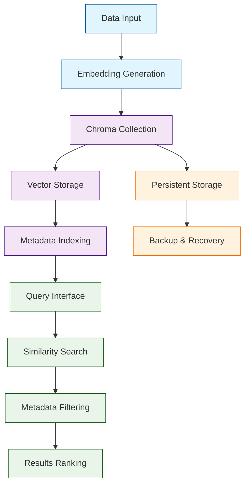

# ChromaDB Tutorial: Building AI-Native Vector Databases

> A deep technical walkthrough of ChromaDB covering Building AI-Native Vector Databases.

Chroma[View Repo](https://github.com/chroma-core/chroma) is the AI-native open-source embedding database designed specifically for AI applications. It provides a simple, fast, and scalable solution for storing and retrieving embeddings with advanced features like metadata filtering, multimodal support, and seamless integration with popular AI frameworks.

Chroma enables developers to build sophisticated AI applications with persistent memory, fast retrieval, and powerful querying capabilities without the complexity of traditional databases.

## Tutorial Chapters

Welcome to your journey through AI-native vector databases! This tutorial explores how to build powerful AI applications with Chroma's embedding database.

1. **[Chapter 1: Getting Started with Chroma](01-getting-started.md)** - Installation, setup, and your first vector database
2. **[Chapter 2: Collections & Documents](02-collections-documents.md)** - Managing data collections and document operations
3. **[Chapter 3: Embeddings & Indexing](03-embeddings-indexing.md)** - Working with embeddings and vector indexing
4. **[Chapter 4: Querying & Retrieval](04-querying-retrieval.md)** - Advanced querying patterns and similarity search
5. **[Chapter 5: Metadata & Filtering](05-metadata-filtering.md)** - Using metadata for advanced filtering and search
6. **[Chapter 6: Integration Patterns](06-integration-patterns.md)** - Integrating Chroma with AI frameworks and applications
7. **[Chapter 7: Production Deployment](07-production-deployment.md)** - Scaling Chroma for production workloads
8. **[Chapter 8: Performance Optimization](08-performance-optimization.md)** - Tuning and optimizing Chroma performance

## What You'll Learn

By the end of this tutorial, you'll be able to:

- **Master Hybrid Search**: Combine BM25 keyword search with semantic vector search for superior retrieval
- **Build Enterprise-Ready AI Apps**: Persistent vector memory with advanced metadata filtering and high availability
- **Implement Advanced Retrieval**: Multi-modal similarity search with complex filtering and ranking
- **Integrate Modern AI Stacks**: Native support for LangChain, LlamaIndex, Hugging Face, and Vercel AI
- **Scale Production Deployments**: Clustering, monitoring, and automated backup/recovery
- **Optimize Performance**: NumPy optimizations, memory efficiency, and horizontal scaling
- **Handle Complex Data Types**: Text, images, audio, and structured data with unified APIs
- **Deploy at Enterprise Scale**: Authentication, security, observability, and compliance features

## Prerequisites

- Python 3.8+
- Basic understanding of vectors and embeddings
- Familiarity with database concepts
- Knowledge of AI/ML frameworks (helpful but not required)

## What's New in ChromaDB v0.5+ (2024-2025)

> **AI-Native Revolution**: ChromaDB v0.5 brings hybrid search, massive performance gains, and enterprise-ready features that redefine vector databases.

**🔍 Hybrid Search Revolution (v0.5):**
- 🏗️ **BM25 Integration**: Native BM25 + vector search for superior retrieval accuracy
- 🎯 **Dual Ranking**: Combined keyword and semantic relevance scoring
- ⚡ **Query Fusion**: Intelligent result merging from multiple search strategies
- 📊 **Enhanced Filtering**: Advanced metadata filtering with hybrid queries

**🐼 PandaAI & Analytics Integration:**
- 📈 **pandasai-chromadb**: Vector storage for AI-powered data analysis
- 🤖 **ML Workflow Integration**: Seamless connection with machine learning pipelines
- 🔄 **Data Science Bridge**: Unified workflow from data exploration to vector search

**🚀 Performance & Reliability (v0.5):**
- ⚡ **NumPy Optimizations**: 3-5x faster vector operations with array processing
- 🦀 **Rust Core Updates**: Version 1.81.0 with enhanced blockstore performance
- 🔧 **Memory Efficiency**: Reduced memory footprint for large-scale deployments
- 🐛 **v1.3.3 Stability**: Critical bug fixes and improved error handling
- 📝 **Enhanced Documentation**: Comprehensive guides and API references

**🌐 Enterprise Features:**
- 🔐 **Authentication & Security**: Enterprise-grade access control
- 📊 **Monitoring & Observability**: Built-in metrics and performance tracking
- 🔄 **High Availability**: Clustering support for production deployments
- 📈 **Scalability**: Horizontal scaling for massive datasets
- 🔧 **Backup & Recovery**: Automated data protection and restoration

**🔗 Expanded AI Ecosystem:**
- 🤗 **Hugging Face Integration**: Native transformers support
- 🦙 **LlamaIndex Connectors**: Seamless integration with LlamaIndex
- 🎯 **LangChain Components**: Official LangChain vector store implementation
- 📚 **Vercel AI Compatibility**: Edge deployment support
- 🔄 **Multi-Framework Support**: PyTorch, TensorFlow, JAX compatibility

## Learning Path

### 🟢 Beginner Track
Perfect for developers new to vector databases:
1. Chapters 1-2: Setup and basic collection management
2. Focus on understanding Chroma fundamentals

### 🟡 Intermediate Track
For developers building AI applications:
1. Chapters 3-5: Embeddings, querying, and metadata
2. Learn to build sophisticated retrieval systems

### 🔴 Advanced Track
For production AI system development:
1. Chapters 6-8: Integration, deployment, and optimization
2. Master enterprise-grade vector database solutions

---

**Ready to build AI applications with Chroma? Let's begin with [Chapter 1: Getting Started](01-getting-started.md)!**

*Generated by [AI Codebase Knowledge Builder](https://github.com/The-Pocket/Tutorial-Codebase-Knowledge)*
