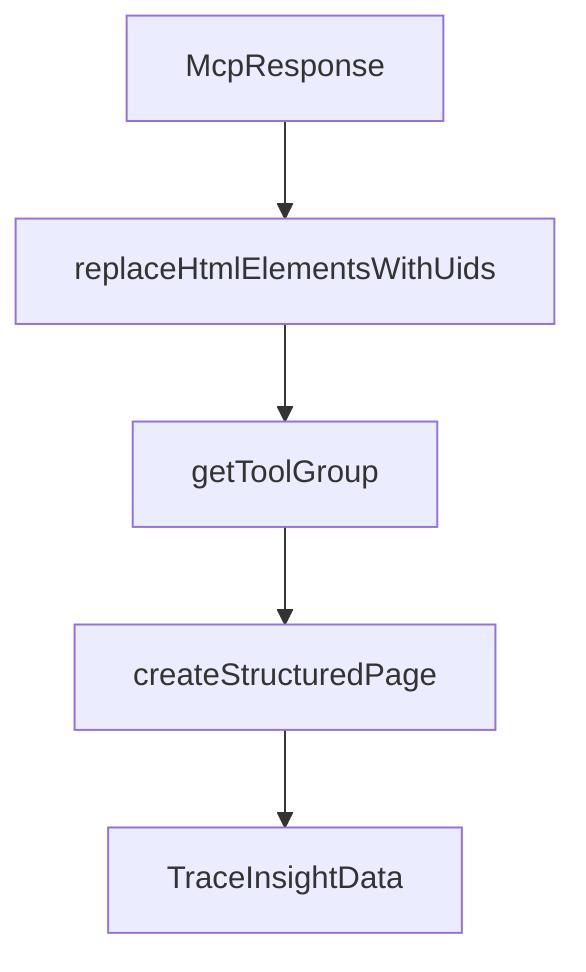

# Chapter 1: Getting Started

Welcome to **Chapter 1: Getting Started**. In this part of **Chrome DevTools MCP Tutorial: Browser Automation and Debugging for Coding Agents**, you will build an intuitive mental model first, then move into concrete implementation details and practical production tradeoffs.


This chapter gets Chrome DevTools MCP connected to your coding client.

## Learning Goals

- install and run the MCP server quickly
- configure client-side MCP server entries
- verify browser connection and first tool call
- avoid common first-install mistakes

## Fast Setup Pattern

```json
{
  "mcpServers": {
    "chrome-devtools": {
      "command": "npx",
      "args": ["-y", "chrome-devtools-mcp@latest"]
    }
  }
}
```

## Source References

- [Chrome DevTools MCP README](https://github.com/ChromeDevTools/chrome-devtools-mcp/blob/main/README.md)
- [Chrome DevTools MCP Releases](https://github.com/ChromeDevTools/chrome-devtools-mcp/releases)

## Summary

You now have a working Chrome DevTools MCP baseline in your coding client.

Next: [Chapter 2: Architecture and Design Principles](02-architecture-and-design-principles.md)

## Source Code Walkthrough

### `src/McpResponse.ts`

The `McpResponse` class in [`src/McpResponse.ts`](https://github.com/ChromeDevTools/chrome-devtools-mcp/blob/HEAD/src/McpResponse.ts) handles a key part of this chapter's functionality:

```ts
}

export class McpResponse implements Response {
  #includePages = false;
  #includeExtensionServiceWorkers = false;
  #includeExtensionPages = false;
  #snapshotParams?: SnapshotParams;
  #attachedNetworkRequestId?: number;
  #attachedNetworkRequestOptions?: {
    requestFilePath?: string;
    responseFilePath?: string;
  };
  #attachedConsoleMessageId?: number;
  #attachedTraceSummary?: TraceResult;
  #attachedTraceInsight?: TraceInsightData;
  #attachedLighthouseResult?: LighthouseData;
  #textResponseLines: string[] = [];
  #images: ImageContentData[] = [];
  #networkRequestsOptions?: {
    include: boolean;
    pagination?: PaginationOptions;
    resourceTypes?: ResourceType[];
    includePreservedRequests?: boolean;
    networkRequestIdInDevToolsUI?: number;
  };
  #consoleDataOptions?: {
    include: boolean;
    pagination?: PaginationOptions;
    types?: string[];
    includePreservedMessages?: boolean;
  };
  #listExtensions?: boolean;
```

This class is important because it defines how Chrome DevTools MCP Tutorial: Browser Automation and Debugging for Coding Agents implements the patterns covered in this chapter.

### `src/McpResponse.ts`

The `replaceHtmlElementsWithUids` function in [`src/McpResponse.ts`](https://github.com/ChromeDevTools/chrome-devtools-mcp/blob/HEAD/src/McpResponse.ts) handles a key part of this chapter's functionality:

```ts
}

export function replaceHtmlElementsWithUids(schema: JSONSchema7Definition) {
  if (typeof schema === 'boolean') {
    return;
  }

  let isHtmlElement = false;
  for (const [key, value] of Object.entries(schema)) {
    if (key === 'x-mcp-type' && value === 'HTMLElement') {
      isHtmlElement = true;
      break;
    }
  }

  if (isHtmlElement) {
    schema.properties = {uid: {type: 'string'}};
    schema.required = ['uid'];
  }

  if (schema.properties) {
    for (const key of Object.keys(schema.properties)) {
      replaceHtmlElementsWithUids(schema.properties[key]);
    }
  }

  if (schema.items) {
    if (Array.isArray(schema.items)) {
      for (const item of schema.items) {
        replaceHtmlElementsWithUids(item);
      }
    } else {
```

This function is important because it defines how Chrome DevTools MCP Tutorial: Browser Automation and Debugging for Coding Agents implements the patterns covered in this chapter.

### `src/McpResponse.ts`

The `getToolGroup` function in [`src/McpResponse.ts`](https://github.com/ChromeDevTools/chrome-devtools-mcp/blob/HEAD/src/McpResponse.ts) handles a key part of this chapter's functionality:

```ts
}

async function getToolGroup(
  page: McpPage,
): Promise<ToolGroup<ToolDefinition> | undefined> {
  // Check if there is a `devtoolstooldiscovery` event listener
  const windowHandle = await page.pptrPage.evaluateHandle(() => window);
  // @ts-expect-error internal API
  const client = page.pptrPage._client();
  const {listeners}: {listeners: Protocol.DOMDebugger.EventListener[]} =
    await client.send('DOMDebugger.getEventListeners', {
      objectId: windowHandle.remoteObject().objectId,
    });
  if (listeners.find(l => l.type === 'devtoolstooldiscovery') === undefined) {
    return;
  }

  const toolGroup = await page.pptrPage.evaluate(() => {
    return new Promise<ToolGroup<ToolDefinition> | undefined>(resolve => {
      const event = new CustomEvent('devtoolstooldiscovery');
      // @ts-expect-error Adding custom property
      event.respondWith = (toolGroup: ToolGroup) => {
        if (!window.__dtmcp) {
          window.__dtmcp = {};
        }
        window.__dtmcp.toolGroup = toolGroup;

        // When receiving a toolGroup for the first time, expose a simple execution helper
        if (!window.__dtmcp.executeTool) {
          window.__dtmcp.executeTool = async (toolName, args) => {
            if (!window.__dtmcp?.toolGroup) {
              throw new Error('No tools found on the page');
```

This function is important because it defines how Chrome DevTools MCP Tutorial: Browser Automation and Debugging for Coding Agents implements the patterns covered in this chapter.

### `src/McpResponse.ts`

The `createStructuredPage` function in [`src/McpResponse.ts`](https://github.com/ChromeDevTools/chrome-devtools-mcp/blob/HEAD/src/McpResponse.ts) handles a key part of this chapter's functionality:

```ts
            `${context.getPageId(page)}: ${page.url()}${context.isPageSelected(page) ? ' [selected]' : ''}${contextLabel}`,
          );
          structuredPages.push(createStructuredPage(page, context));
        }
        response.push(...parts);
        structuredContent.pages = structuredPages;
      }

      if (this.#includeExtensionPages) {
        if (extensionPages.length) {
          response.push(`## Extension Pages`);
          const structuredExtensionPages = [];
          for (const page of extensionPages) {
            const isolatedContextName = context.getIsolatedContextName(page);
            const contextLabel = isolatedContextName
              ? ` isolatedContext=${isolatedContextName}`
              : '';
            response.push(
              `${context.getPageId(page)}: ${page.url()}${context.isPageSelected(page) ? ' [selected]' : ''}${contextLabel}`,
            );
            structuredExtensionPages.push(createStructuredPage(page, context));
          }
          structuredContent.extensionPages = structuredExtensionPages;
        }
      }
    }

    if (this.#includeExtensionServiceWorkers) {
      if (context.getExtensionServiceWorkers().length) {
        response.push(`## Extension Service Workers`);
      }

```

This function is important because it defines how Chrome DevTools MCP Tutorial: Browser Automation and Debugging for Coding Agents implements the patterns covered in this chapter.


## How These Components Connect


