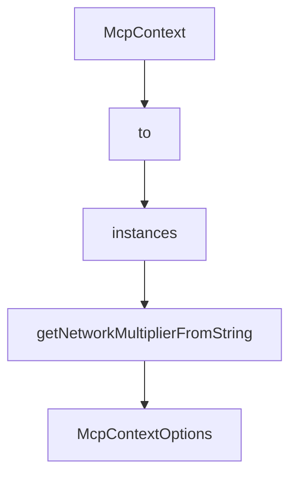

# Chapter 1: Getting Started

Welcome to **Chapter 1: Getting Started**. In this part of **Chrome DevTools MCP Tutorial: Browser Automation and Debugging for Coding Agents**, you will build an intuitive mental model first, then move into concrete implementation details and practical production tradeoffs.


This chapter gets Chrome DevTools MCP connected to your coding client.

## Learning Goals

- install and run the MCP server quickly
- configure client-side MCP server entries
- verify browser connection and first tool call
- avoid common first-install mistakes

## Fast Setup Pattern

```json
{
  "mcpServers": {
    "chrome-devtools": {
      "command": "npx",
      "args": ["-y", "chrome-devtools-mcp@latest"]
    }
  }
}
```

## Source References

- [Chrome DevTools MCP README](https://github.com/ChromeDevTools/chrome-devtools-mcp/blob/main/README.md)
- [Chrome DevTools MCP Releases](https://github.com/ChromeDevTools/chrome-devtools-mcp/releases)

## Summary

You now have a working Chrome DevTools MCP baseline in your coding client.

Next: [Chapter 2: Architecture and Design Principles](02-architecture-and-design-principles.md)

## Depth Expansion Playbook

## Source Code Walkthrough

### `src/McpContext.ts`

The `McpContext` class in [`src/McpContext.ts`](https://github.com/ChromeDevTools/chrome-devtools-mcp/blob/HEAD/src/McpContext.ts) handles a key part of this chapter's functionality:

```ts
import {WaitForHelper} from './WaitForHelper.js';

interface McpContextOptions {
  // Whether the DevTools windows are exposed as pages for debugging of DevTools.
  experimentalDevToolsDebugging: boolean;
  // Whether all page-like targets are exposed as pages.
  experimentalIncludeAllPages?: boolean;
  // Whether CrUX data should be fetched.
  performanceCrux: boolean;
}

const DEFAULT_TIMEOUT = 5_000;
const NAVIGATION_TIMEOUT = 10_000;

function getNetworkMultiplierFromString(condition: string | null): number {
  const puppeteerCondition =
    condition as keyof typeof PredefinedNetworkConditions;

  switch (puppeteerCondition) {
    case 'Fast 4G':
      return 1;
    case 'Slow 4G':
      return 2.5;
    case 'Fast 3G':
      return 5;
    case 'Slow 3G':
      return 10;
  }
  return 1;
}

export class McpContext implements Context {
```

This class is important because it defines how Chrome DevTools MCP Tutorial: Browser Automation and Debugging for Coding Agents implements the patterns covered in this chapter.

### `src/McpContext.ts`

The `to` class in [`src/McpContext.ts`](https://github.com/ChromeDevTools/chrome-devtools-mcp/blob/HEAD/src/McpContext.ts) handles a key part of this chapter's functionality:

```ts
import path from 'node:path';

import type {TargetUniverse} from './DevtoolsUtils.js';
import {UniverseManager} from './DevtoolsUtils.js';
import {McpPage} from './McpPage.js';
import {
  NetworkCollector,
  ConsoleCollector,
  type ListenerMap,
  type UncaughtError,
} from './PageCollector.js';
import type {DevTools} from './third_party/index.js';
import type {
  Browser,
  BrowserContext,
  ConsoleMessage,
  Debugger,
  HTTPRequest,
  Page,
  ScreenRecorder,
  SerializedAXNode,
  Viewport,
  Target,
} from './third_party/index.js';
import {Locator} from './third_party/index.js';
import {PredefinedNetworkConditions} from './third_party/index.js';
import {listPages} from './tools/pages.js';
import {CLOSE_PAGE_ERROR} from './tools/ToolDefinition.js';
import type {Context, DevToolsData} from './tools/ToolDefinition.js';
import type {TraceResult} from './trace-processing/parse.js';
import type {
  EmulationSettings,
```

This class is important because it defines how Chrome DevTools MCP Tutorial: Browser Automation and Debugging for Coding Agents implements the patterns covered in this chapter.

### `src/McpContext.ts`

The `instances` class in [`src/McpContext.ts`](https://github.com/ChromeDevTools/chrome-devtools-mcp/blob/HEAD/src/McpContext.ts) handles a key part of this chapter's functionality:

```ts
    logger: Debugger,
    opts: McpContextOptions,
    /* Let tests use unbundled Locator class to avoid overly strict checks within puppeteer that fail when mixing bundled and unbundled class instances */
    locatorClass: typeof Locator = Locator,
  ) {
    const context = new McpContext(browser, logger, opts, locatorClass);
    await context.#init();
    return context;
  }

  resolveCdpRequestId(page: McpPage, cdpRequestId: string): number | undefined {
    if (!cdpRequestId) {
      this.logger('no network request');
      return;
    }
    const request = this.#networkCollector.find(page.pptrPage, request => {
      // @ts-expect-error id is internal.
      return request.id === cdpRequestId;
    });
    if (!request) {
      this.logger('no network request for ' + cdpRequestId);
      return;
    }
    return this.#networkCollector.getIdForResource(request);
  }

  resolveCdpElementId(
    page: McpPage,
    cdpBackendNodeId: number,
  ): string | undefined {
    if (!cdpBackendNodeId) {
      this.logger('no cdpBackendNodeId');
```

This class is important because it defines how Chrome DevTools MCP Tutorial: Browser Automation and Debugging for Coding Agents implements the patterns covered in this chapter.

### `src/McpContext.ts`

The `getNetworkMultiplierFromString` function in [`src/McpContext.ts`](https://github.com/ChromeDevTools/chrome-devtools-mcp/blob/HEAD/src/McpContext.ts) handles a key part of this chapter's functionality:

```ts
const NAVIGATION_TIMEOUT = 10_000;

function getNetworkMultiplierFromString(condition: string | null): number {
  const puppeteerCondition =
    condition as keyof typeof PredefinedNetworkConditions;

  switch (puppeteerCondition) {
    case 'Fast 4G':
      return 1;
    case 'Slow 4G':
      return 2.5;
    case 'Fast 3G':
      return 5;
    case 'Slow 3G':
      return 10;
  }
  return 1;
}

export class McpContext implements Context {
  browser: Browser;
  logger: Debugger;

  // Maps LLM-provided isolatedContext name → Puppeteer BrowserContext.
  #isolatedContexts = new Map<string, BrowserContext>();
  // Auto-generated name counter for when no name is provided.
  #nextIsolatedContextId = 1;

  #pages: Page[] = [];
  #extensionServiceWorkers: ExtensionServiceWorker[] = [];

  #mcpPages = new Map<Page, McpPage>();
```

This function is important because it defines how Chrome DevTools MCP Tutorial: Browser Automation and Debugging for Coding Agents implements the patterns covered in this chapter.


## How These Components Connect


