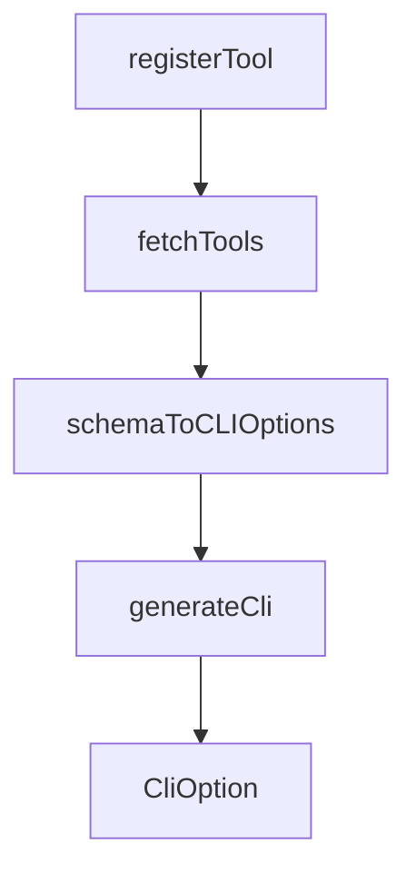

# Chapter 2: Architecture and Design Principles

Welcome to **Chapter 2: Architecture and Design Principles**. In this part of **Chrome DevTools MCP Tutorial: Browser Automation and Debugging for Coding Agents**, you will build an intuitive mental model first, then move into concrete implementation details and practical production tradeoffs.


This chapter explains the design philosophy behind tool behavior and outputs.

## Learning Goals

- understand agent-agnostic MCP design choices
- use token-efficient response patterns effectively
- rely on composable deterministic tool primitives
- interpret error messages for self-healing workflows

## Design Pillars

- standards-first interoperability
- semantic summaries over oversized raw output
- deterministic small tools instead of opaque magic actions
- actionable error messaging for rapid recovery

## Source References

- [Chrome DevTools MCP Design Principles](https://github.com/ChromeDevTools/chrome-devtools-mcp/blob/main/docs/design-principles.md)
- [Chrome DevTools MCP README](https://github.com/ChromeDevTools/chrome-devtools-mcp/blob/main/README.md)

## Summary

You now understand how design principles translate into reliable tool interactions.

Next: [Chapter 3: Client Integrations and Setup Patterns](03-client-integrations-and-setup-patterns.md)

## Depth Expansion Playbook

## Source Code Walkthrough

### `src/index.ts`

The `registerTool` function in [`src/index.ts`](https://github.com/ChromeDevTools/chrome-devtools-mcp/blob/HEAD/src/index.ts) handles a key part of this chapter's functionality:

```ts
  const toolMutex = new Mutex();

  function registerTool(tool: ToolDefinition | DefinedPageTool): void {
    if (
      tool.annotations.category === ToolCategory.EMULATION &&
      serverArgs.categoryEmulation === false
    ) {
      return;
    }
    if (
      tool.annotations.category === ToolCategory.PERFORMANCE &&
      serverArgs.categoryPerformance === false
    ) {
      return;
    }
    if (
      tool.annotations.category === ToolCategory.NETWORK &&
      serverArgs.categoryNetwork === false
    ) {
      return;
    }
    if (
      tool.annotations.category === ToolCategory.EXTENSIONS &&
      !serverArgs.categoryExtensions
    ) {
      return;
    }
    if (
      tool.annotations.conditions?.includes('computerVision') &&
      !serverArgs.experimentalVision
    ) {
      return;
```

This function is important because it defines how Chrome DevTools MCP Tutorial: Browser Automation and Debugging for Coding Agents implements the patterns covered in this chapter.

### `scripts/generate-cli.ts`

The `fetchTools` function in [`scripts/generate-cli.ts`](https://github.com/ChromeDevTools/chrome-devtools-mcp/blob/HEAD/scripts/generate-cli.ts) handles a key part of this chapter's functionality:

```ts
);

async function fetchTools() {
  console.log('Connecting to chrome-devtools-mcp to fetch tools...');
  // Use the local build of the server
  const serverPath = path.join(
    import.meta.dirname,
    '../build/src/bin/chrome-devtools-mcp.js',
  );

  const transport = new StdioClientTransport({
    command: 'node',
    args: [serverPath],
    env: {...process.env, CHROME_DEVTOOLS_MCP_NO_USAGE_STATISTICS: 'true'},
  });

  const client = new Client(
    {
      name: 'chrome-devtools-cli-generator',
      version: '0.1.0',
    },
    {
      capabilities: {},
    },
  );

  await client.connect(transport);
  try {
    const toolsResponse = await client.listTools();
    if (!toolsResponse.tools?.length) {
      throw new Error(`No tools were fetched`);
    }
```

This function is important because it defines how Chrome DevTools MCP Tutorial: Browser Automation and Debugging for Coding Agents implements the patterns covered in this chapter.

### `scripts/generate-cli.ts`

The `schemaToCLIOptions` function in [`scripts/generate-cli.ts`](https://github.com/ChromeDevTools/chrome-devtools-mcp/blob/HEAD/scripts/generate-cli.ts) handles a key part of this chapter's functionality:

```ts
}

function schemaToCLIOptions(schema: JsonSchema): CliOption[] {
  if (!schema || !schema.properties) {
    return [];
  }
  const required = schema.required || [];
  const properties = schema.properties;
  return Object.entries(properties).map(([name, prop]) => {
    const isRequired = required.includes(name);
    const description = prop.description || '';
    if (typeof prop.type !== 'string') {
      throw new Error(
        `Property ${name} has a complex type not supported by CLI.`,
      );
    }
    return {
      name,
      type: prop.type,
      description,
      required: isRequired,
      default: prop.default,
      enum: prop.enum,
    };
  });
}

async function generateCli() {
  const tools = await fetchTools();

  // Sort tools by name
  const sortedTools = tools
```

This function is important because it defines how Chrome DevTools MCP Tutorial: Browser Automation and Debugging for Coding Agents implements the patterns covered in this chapter.

### `scripts/generate-cli.ts`

The `generateCli` function in [`scripts/generate-cli.ts`](https://github.com/ChromeDevTools/chrome-devtools-mcp/blob/HEAD/scripts/generate-cli.ts) handles a key part of this chapter's functionality:

```ts
}

async function generateCli() {
  const tools = await fetchTools();

  // Sort tools by name
  const sortedTools = tools
    .sort((a, b) => a.name.localeCompare(b.name))
    .filter(tool => {
      // Skipping fill_form because it is not relevant in shell scripts
      // and CLI does not handle array/JSON args well.
      if (tool.name === 'fill_form') {
        return false;
      }
      // Skipping wait_for because CLI does not handle array/JSON args well
      // and shell scripts have many mechanisms for waiting.
      if (tool.name === 'wait_for') {
        return false;
      }
      return true;
    });

  const staticTools = createTools(parseArguments());
  const toolNameToCategory = new Map<string, string>();
  for (const tool of staticTools) {
    toolNameToCategory.set(
      tool.name,
      labels[tool.annotations.category as keyof typeof labels],
    );
  }

  const commands: Record<
```

This function is important because it defines how Chrome DevTools MCP Tutorial: Browser Automation and Debugging for Coding Agents implements the patterns covered in this chapter.


## How These Components Connect


