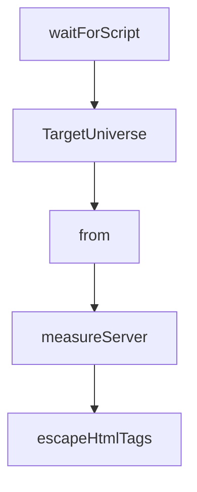

# Chapter 2: Architecture and Design Principles

Welcome to **Chapter 2: Architecture and Design Principles**. In this part of **Chrome DevTools MCP Tutorial: Browser Automation and Debugging for Coding Agents**, you will build an intuitive mental model first, then move into concrete implementation details and practical production tradeoffs.


This chapter explains the design philosophy behind tool behavior and outputs.

## Learning Goals

- understand agent-agnostic MCP design choices
- use token-efficient response patterns effectively
- rely on composable deterministic tool primitives
- interpret error messages for self-healing workflows

## Design Pillars

- standards-first interoperability
- semantic summaries over oversized raw output
- deterministic small tools instead of opaque magic actions
- actionable error messaging for rapid recovery

## Source References

- [Chrome DevTools MCP Design Principles](https://github.com/ChromeDevTools/chrome-devtools-mcp/blob/main/docs/design-principles.md)
- [Chrome DevTools MCP README](https://github.com/ChromeDevTools/chrome-devtools-mcp/blob/main/README.md)

## Summary

You now understand how design principles translate into reliable tool interactions.

Next: [Chapter 3: Client Integrations and Setup Patterns](03-client-integrations-and-setup-patterns.md)

## Source Code Walkthrough

### `src/DevtoolsUtils.ts`

The `waitForScript` function in [`src/DevtoolsUtils.ts`](https://github.com/ChromeDevTools/chrome-devtools-mcp/blob/HEAD/src/DevtoolsUtils.ts) handles a key part of this chapter's functionality:

```ts
  await Promise.all(
    [...scriptIds].map(id =>
      waitForScript(model, id, signal)
        .then(script =>
          model.sourceMapManager().sourceMapForClientPromise(script),
        )
        .catch(),
    ),
  );

  const binding = devTools.universe.context.get(
    DevTools.DebuggerWorkspaceBinding,
  );
  // DevTools uses branded types for ScriptId and others. Casting the puppeteer protocol type to the DevTools protocol type is safe.
  return binding.createStackTraceFromProtocolRuntime(
    rawStackTrace as Parameters<
      DevTools.DebuggerWorkspaceBinding['createStackTraceFromProtocolRuntime']
    >[0],
    target,
  );
}

// Waits indefinitely for the script so pair it with Promise.race.
async function waitForScript(
  model: DevTools.DebuggerModel,
  scriptId: Protocol.Runtime.ScriptId,
  signal: AbortSignal,
) {
  while (true) {
    if (signal.aborted) {
      throw signal.reason;
    }
```

This function is important because it defines how Chrome DevTools MCP Tutorial: Browser Automation and Debugging for Coding Agents implements the patterns covered in this chapter.

### `src/DevtoolsUtils.ts`

The `TargetUniverse` interface in [`src/DevtoolsUtils.ts`](https://github.com/ChromeDevTools/chrome-devtools-mcp/blob/HEAD/src/DevtoolsUtils.ts) handles a key part of this chapter's functionality:

```ts
});

export interface TargetUniverse {
  /** The DevTools target corresponding to the puppeteer Page */
  target: DevTools.Target;
  universe: DevTools.Foundation.Universe.Universe;
}
export type TargetUniverseFactoryFn = (page: Page) => Promise<TargetUniverse>;

export class UniverseManager {
  readonly #browser: Browser;
  readonly #createUniverseFor: TargetUniverseFactoryFn;
  readonly #universes = new WeakMap<Page, TargetUniverse>();

  /** Guard access to #universes so we don't create unnecessary universes */
  readonly #mutex = new Mutex();

  constructor(
    browser: Browser,
    factory: TargetUniverseFactoryFn = DEFAULT_FACTORY,
  ) {
    this.#browser = browser;
    this.#createUniverseFor = factory;
  }

  async init(pages: Page[]) {
    try {
      await this.#mutex.acquire();
      const promises = [];
      for (const page of pages) {
        promises.push(
          this.#createUniverseFor(page).then(targetUniverse =>
```

This interface is important because it defines how Chrome DevTools MCP Tutorial: Browser Automation and Debugging for Coding Agents implements the patterns covered in this chapter.

### `src/DevtoolsUtils.ts`

The `from` interface in [`src/DevtoolsUtils.ts`](https://github.com/ChromeDevTools/chrome-devtools-mcp/blob/HEAD/src/DevtoolsUtils.ts) handles a key part of this chapter's functionality:

```ts
 */

import {PuppeteerDevToolsConnection} from './DevToolsConnectionAdapter.js';
import {Mutex} from './Mutex.js';
import {DevTools} from './third_party/index.js';
import type {
  Browser,
  ConsoleMessage,
  Page,
  Protocol,
  Target as PuppeteerTarget,
} from './third_party/index.js';

/**
 * A mock implementation of an issues manager that only implements the methods
 * that are actually used by the IssuesAggregator
 */
export class FakeIssuesManager extends DevTools.Common.ObjectWrapper
  .ObjectWrapper<DevTools.IssuesManagerEventTypes> {
  issues(): DevTools.Issue[] {
    return [];
  }
}

// DevTools CDP errors can get noisy.
DevTools.ProtocolClient.InspectorBackend.test.suppressRequestErrors = true;

DevTools.I18n.DevToolsLocale.DevToolsLocale.instance({
  create: true,
  data: {
    navigatorLanguage: 'en-US',
    settingLanguage: 'en-US',
```

This interface is important because it defines how Chrome DevTools MCP Tutorial: Browser Automation and Debugging for Coding Agents implements the patterns covered in this chapter.

### `scripts/generate-docs.ts`

The `measureServer` function in [`scripts/generate-docs.ts`](https://github.com/ChromeDevTools/chrome-devtools-mcp/blob/HEAD/scripts/generate-docs.ts) handles a key part of this chapter's functionality:

```ts
const README_PATH = './README.md';

async function measureServer(args: string[]) {
  // 1. Connect to your actual MCP server
  const transport = new StdioClientTransport({
    command: 'node',
    args: ['./build/src/bin/chrome-devtools-mcp.js', ...args], // Point to your built MCP server
  });

  const client = new Client(
    {name: 'measurer', version: '1.0.0'},
    {capabilities: {}},
  );
  await client.connect(transport);

  // 2. Fetch all tools
  const toolsList = await client.listTools();

  // 3. Serialize exactly how an LLM would see it (JSON)
  const jsonString = JSON.stringify(toolsList.tools, null, 2);

  // 4. Count tokens (using cl100k_base which is standard for GPT-4/Claude-3.5 approximation)
  const enc = get_encoding('cl100k_base');
  const tokenCount = enc.encode(jsonString).length;

  console.log(`--- Measurement Results ---`);
  console.log(`Total Tools: ${toolsList.tools.length}`);
  console.log(`JSON Character Count: ${jsonString.length}`);
  console.log(`Estimated Token Count: ~${tokenCount}`);

  // Clean up
  enc.free();
```

This function is important because it defines how Chrome DevTools MCP Tutorial: Browser Automation and Debugging for Coding Agents implements the patterns covered in this chapter.


## How These Components Connect


